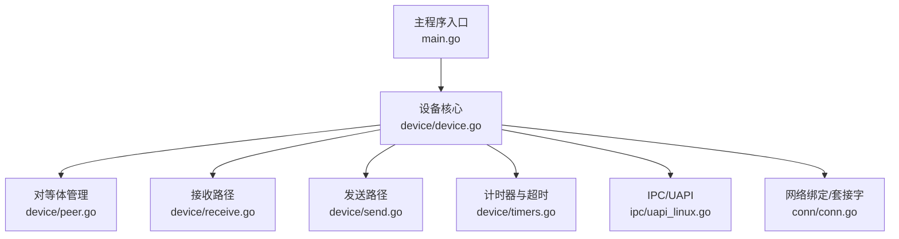
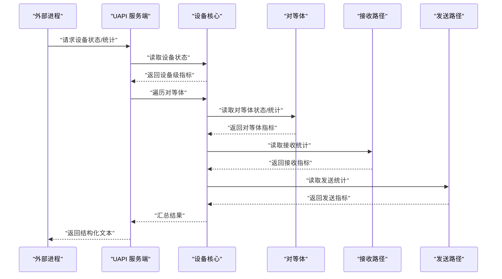
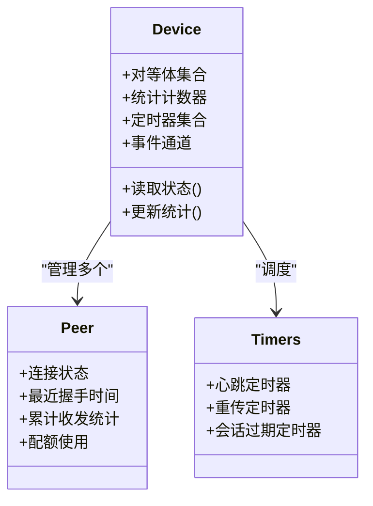
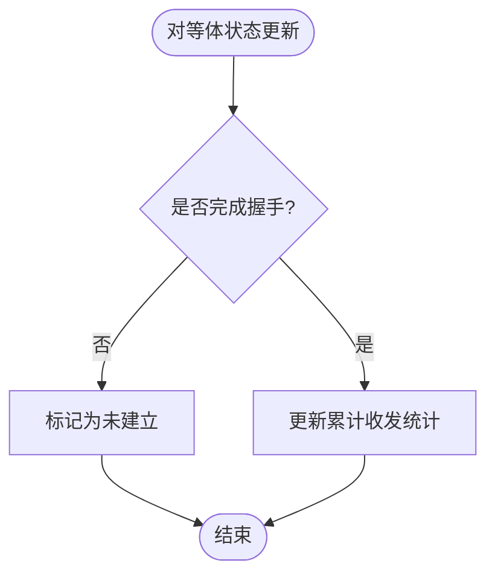
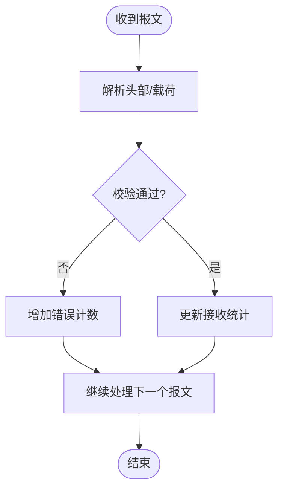
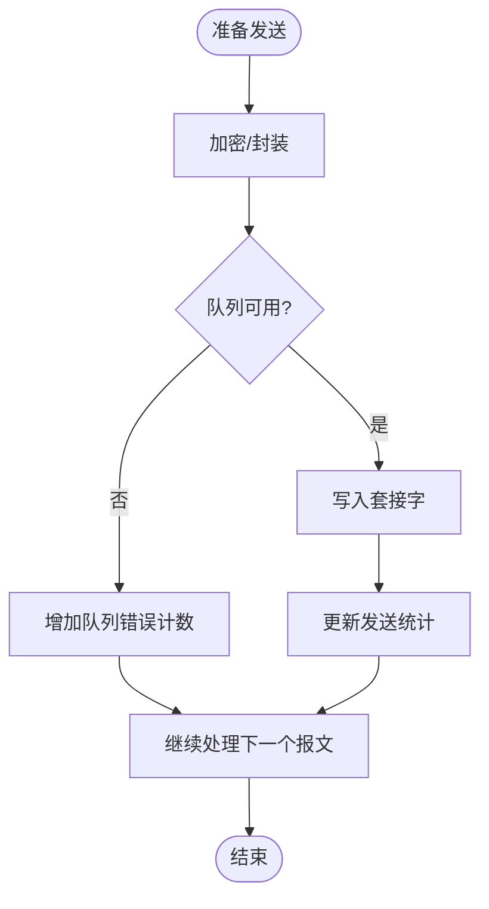
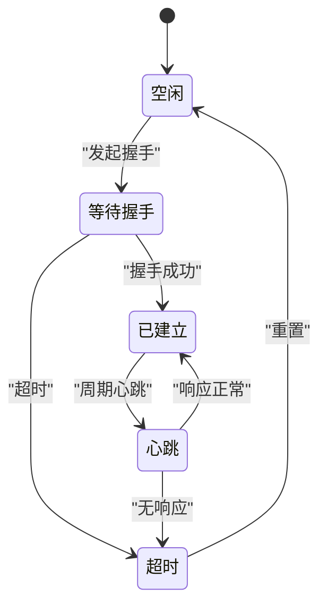
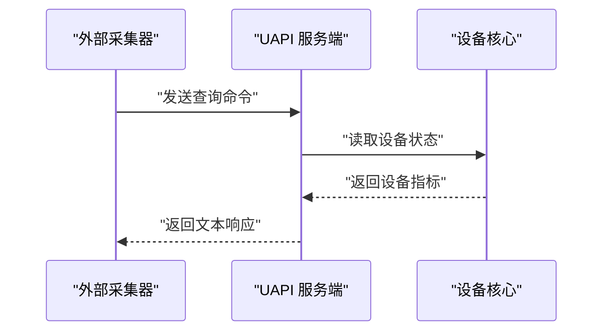
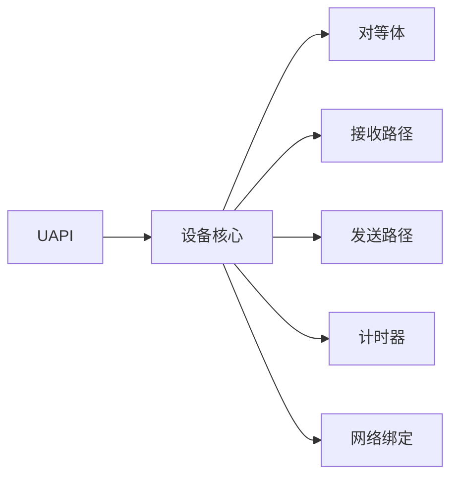

# 监控统计

<cite>
**本文引用的文件**
- [main.go](file://main.go)
- [device/device.go](file://device/device.go)
- [device/peer.go](file://device/peer.go)
- [device/receive.go](file://device/receive.go)
- [device/send.go](file://device/send.go)
- [device/timers.go](file://device/timers.go)
- [ipc/uapi_linux.go](file://ipc/uapi_linux.go)
- [conn/conn.go](file://conn/conn.go)
</cite>

## 目录
1. [简介](#简介)
2. [项目结构](#项目结构)
3. [核心组件](#核心组件)
4. [架构总览](#架构总览)
5. [详细组件分析](#详细组件分析)
6. [依赖关系分析](#依赖关系分析)
7. [性能考虑](#性能考虑)
8. [故障排查指南](#故障排查指南)
9. [结论](#结论)
10. [附录](#附录)

## 简介
本章节面向 wireguard-go 的“监控统计”能力，说明系统运行状态的观测点、指标含义、数据收集机制与获取方式。重点覆盖：
- 连接状态（对等体建立/断开、会话生命周期）
- 流量统计（发送/接收字节数、数据包计数）
- 错误计数（协议错误、队列溢出、超时等）
- 实时监控数据的订阅与推送（通过 UAPI 接口查询）
- 可视化与分析示例（基于 UAPI 输出的结构化数据）
- 告警机制与阈值配置建议（结合外部监控系统）
- 集成数据采集指南与性能优化建议

## 项目结构
wireguard-go 将网络栈、设备状态、I/O 绑定与用户态通信分层组织。监控统计相关的关键位置包括：
- 设备层：维护对等体集合、密钥对、计时器与统计计数器
- I/O 层：收发路径中的包计数与错误计数
- IPC/UAPI：提供进程间通信接口，供外部工具或守护进程查询设备状态与统计数据
- 主程序入口：初始化设备并启动监听服务

图表来源
- [main.go:1-200](file://main.go#L1-L200)
- [device/device.go:1-300](file://device/device.go#L1-L300)
- [device/peer.go:1-200](file://device/peer.go#L1-L200)
- [device/receive.go:1-200](file://device/receive.go#L1-L200)
- [device/send.go:1-200](file://device/send.go#L1-L200)
- [device/timers.go:1-200](file://device/timers.go#L1-L200)
- [ipc/uapi_linux.go:1-200](file://ipc/uapi_linux.go#L1-L200)
- [conn/conn.go:1-200](file://conn/conn.go#L1-L200)

章节来源
- [main.go:1-200](file://main.go#L1-L200)
- [device/device.go:1-300](file://device/device.go#L1-L300)
- [ipc/uapi_linux.go:1-200](file://ipc/uapi_linux.go#L1-L200)

## 核心组件
- 设备核心（Device）：集中管理对等体、密钥对、定时器、统计计数器与事件流；是监控指标的聚合中心。
- 对等体（Peer）：维护单个远端节点的连接状态、最近握手时间、已用/可用配额、累计收发统计。
- 接收路径（Receive）：解析入站报文、更新接收统计、处理认证失败与重放攻击等错误计数。
- 发送路径（Send）：封装出站报文、更新发送统计、处理队列与拥塞相关的错误计数。
- 计时器（Timers）：维护心跳、重传、会话过期等定时任务，影响连接状态与错误计数。
- IPC/UAPI：暴露只读查询接口，用于拉取设备状态、对等体列表、统计信息。
- 网络绑定（Conn）：底层套接字抽象，承载实际的数据收发，提供错误上报与性能特征。

章节来源
- [device/device.go:1-300](file://device/device.go#L1-L300)
- [device/peer.go:1-200](file://device/peer.go#L1-L200)
- [device/receive.go:1-200](file://device/receive.go#L1-L200)
- [device/send.go:1-200](file://device/send.go#L1-L200)
- [device/timers.go:1-200](file://device/timers.go#L1-L200)
- [ipc/uapi_linux.go:1-200](file://ipc/uapi_linux.go#L1-L200)
- [conn/conn.go:1-200](file://conn/conn.go#L1-L200)

## 架构总览
监控统计在 wireguard-go 中采用“内聚式计数 + 外置查询”的模式：
- 设备内部在各关键路径（握手、收发、计时器）更新计数器与状态字段
- 外部通过 UAPI 以文本键值对形式拉取当前快照（无长连接推送）
- 可结合外部采集器周期性轮询 UAPI，形成时序指标，用于可视化与告警

图表来源
- [ipc/uapi_linux.go:1-200](file://ipc/uapi_linux.go#L1-L200)
- [device/device.go:1-300](file://device/device.go#L1-L300)
- [device/peer.go:1-200](file://device/peer.go#L1-L200)
- [device/receive.go:1-200](file://device/receive.go#L1-L200)
- [device/send.go:1-200](file://device/send.go#L1-L200)

## 详细组件分析

### 设备核心（Device）
- 职责：维护全局统计、对等体集合、定时器调度、事件通道；对外提供 UAPI 查询所需的状态聚合。
- 监控要点：
  - 设备级指标：活跃对等体数量、最近一次握手成功时间、总体收发速率估算（由对等体汇总）
  - 错误计数：协议校验失败、解密失败、重放检测触发等
  - 资源使用：队列长度、内存池占用（可通过日志或外部探针观察）

图表来源
- [device/device.go:1-300](file://device/device.go#L1-L300)
- [device/peer.go:1-200](file://device/peer.go#L1-L200)
- [device/timers.go:1-200](file://device/timers.go#L1-L200)

章节来源
- [device/device.go:1-300](file://device/device.go#L1-L300)

### 对等体（Peer）
- 职责：表示一个远端节点，维护其连接状态、密钥对、配额与累计统计。
- 监控要点：
  - 连接状态：已建立/未建立、最近握手时间戳
  - 流量统计：累计发送/接收字节数、数据包计数
  - 错误计数：认证失败、重放攻击、配额耗尽等
  - 健康度：连续握手失败次数、超时次数

图表来源
- [device/peer.go:1-200](file://device/peer.go#L1-L200)

章节来源
- [device/peer.go:1-200](file://device/peer.go#L1-L200)

### 接收路径（Receive）
- 职责：解析入站报文、验证签名、更新接收统计、处理错误（如重放、认证失败）。
- 监控要点：
  - 接收字节数与包数
  - 错误计数：解密失败、MAC 校验失败、重放检测触发、无效源地址
  - 性能特征：平均包大小、抖动（可由外部计算）

图表来源
- [device/receive.go:1-200](file://device/receive.go#L1-L200)

章节来源
- [device/receive.go:1-200](file://device/receive.go#L1-L200)

### 发送路径（Send）
- 职责：封装出站报文、加密、写入底层套接字、更新发送统计。
- 监控要点：
  - 发送字节数与包数
  - 错误计数：队列满、编码失败、写失败
  - 拥塞信号：重传次数、延迟上升（需结合计时器）

图表来源
- [device/send.go:1-200](file://device/send.go#L1-L200)

章节来源
- [device/send.go:1-200](file://device/send.go#L1-L200)

### 计时器（Timers）
- 职责：维护心跳、重传、会话过期等定时任务，驱动连接状态变化与错误计数。
- 监控要点：
  - 心跳超时次数
  - 重传次数
  - 会话过期导致的断连次数

图表来源
- [device/timers.go:1-200](file://device/timers.go#L1-L200)

章节来源
- [device/timers.go:1-200](file://device/timers.go#L1-L200)

### IPC/UAPI（查询接口）
- 职责：提供进程间通信接口，允许外部进程查询设备状态、对等体列表与统计信息。
- 监控要点：
  - 查询方法：通过标准输入输出或命名管道发送命令，获取结构化文本响应
  - 数据格式：键值对形式，包含设备级与对等体级指标
  - 实时性：按需拉取，非推送；适合周期性采集

图表来源
- [ipc/uapi_linux.go:1-200](file://ipc/uapi_linux.go#L1-L200)
- [device/device.go:1-300](file://device/device.go#L1-L300)

章节来源
- [ipc/uapi_linux.go:1-200](file://ipc/uapi_linux.go#L1-L200)

### 网络绑定（Conn）
- 职责：抽象底层套接字操作，负责实际数据收发与错误上报。
- 监控要点：
  - 读写错误计数
  - 带宽利用率（结合应用层统计）
  - 平台特性（如 GSO、标记位）对性能的影响

章节来源
- [conn/conn.go:1-200](file://conn/conn.go#L1-L200)

## 依赖关系分析
- 设备核心依赖对等体、计时器、收发路径与网络绑定，形成紧密耦合的内核模块
- UAPI 仅依赖设备核心的只读接口，保持低耦合
- 外部采集器通过 UAPI 解耦于实现细节，便于替换与扩展

图表来源
- [ipc/uapi_linux.go:1-200](file://ipc/uapi_linux.go#L1-L200)
- [device/device.go:1-300](file://device/device.go#L1-L300)
- [device/peer.go:1-200](file://device/peer.go#L1-L200)
- [device/receive.go:1-200](file://device/receive.go#L1-L200)
- [device/send.go:1-200](file://device/send.go#L1-L200)
- [device/timers.go:1-200](file://device/timers.go#L1-L200)
- [conn/conn.go:1-200](file://conn/conn.go#L1-L200)

章节来源
- [device/device.go:1-300](file://device/device.go#L1-L300)
- [ipc/uapi_linux.go:1-200](file://ipc/uapi_linux.go#L1-L200)

## 性能考虑
- 采样频率：UAPI 为拉取模式，建议合理设置采集间隔，避免频繁上下文切换
- 批处理：批量查询多个对等体指标，减少多次往返
- 零拷贝：尽量复用缓冲区，减少分配与复制开销
- 并发安全：设备内部计数器应为原子或受锁保护，确保高并发下的正确性
- 平台优化：利用 GSO、内核卸载等特性降低 CPU 占用
- 背压与限流：在高负载时限制采集频率，防止雪崩

[本节为通用指导，不直接分析具体文件]

## 故障排查指南
- 连接异常：检查对等体握手失败次数、超时次数与重传次数
- 流量异常：对比发送与接收统计，定位丢包方向
- 错误激增：关注解密失败、MAC 校验失败、重放检测触发等错误计数
- 资源瓶颈：观察队列长度、内存池占用与 CPU 使用率
- 外部问题：确认 UAPI 可达性与权限，检查采集器逻辑

章节来源
- [device/receive.go:1-200](file://device/receive.go#L1-L200)
- [device/send.go:1-200](file://device/send.go#L1-L200)
- [device/timers.go:1-200](file://device/timers.go#L1-L200)
- [ipc/uapi_linux.go:1-200](file://ipc/uapi_linux.go#L1-L200)

## 结论
wireguard-go 的监控统计以设备为核心，通过对等体、收发路径与计时器的协同工作，提供丰富的运行时指标。通过 UAPI 接口，外部系统可以稳定地拉取结构化数据，构建可视化面板与告警规则。结合合理的采集策略与性能优化，可实现高效可靠的运维监控体系。

[本节为总结，不直接分析具体文件]

## 附录

### 监控指标清单与含义
- 连接状态：对等体是否建立、最近握手时间、会话有效期
- 流量统计：累计发送/接收字节数、数据包计数、平均包大小
- 错误计数：解密失败、MAC 校验失败、重放检测、队列满、写失败
- 性能指标：重传次数、超时次数、队列深度、CPU 与内存使用（外部观测）

[本节为概念性说明，不直接分析具体文件]

### 查询接口与数据格式
- 查询方式：通过 UAPI 发送命令，获取键值对形式的文本响应
- 典型字段：设备标识、对等体 IP/端口、状态、累计收发、错误计数、时间戳
- 实时性：按需拉取，适合周期性采集；不支持服务器主动推送

章节来源
- [ipc/uapi_linux.go:1-200](file://ipc/uapi_linux.go#L1-L200)

### 可视化与分析示例
- 面板建议：连接数趋势、流量曲线、错误率、重传率
- 分析方法：对比发送与接收差异定位丢包；关联握手失败与错误计数定位认证问题
- 工具建议：使用 Prometheus + Grafana 或同类方案进行采集与展示

[本节为概念性说明，不直接分析具体文件]

### 告警机制与阈值配置
- 阈值建议：握手失败率、重传率、错误率、队列深度、超时次数
- 告警策略：多指标联合判断，避免误报；设置冷却期与升级策略
- 外部集成：将 UAPI 采集数据接入告警系统，实现自动通知与自愈

[本节为概念性说明，不直接分析具体文件]

### 数据采集指南与性能优化建议
- 采集步骤：启动 UAPI 服务 -> 编写采集脚本 -> 定期拉取并解析 -> 存储到时序数据库
- 优化建议：批量查询、缓存热点数据、降低采样频率、利用平台特性
- 注意事项：权限控制、错误重试、数据一致性校验

[本节为概念性说明，不直接分析具体文件]