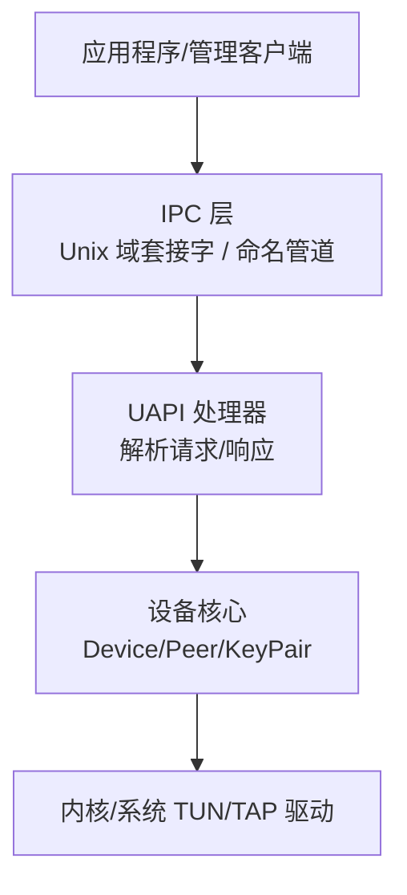
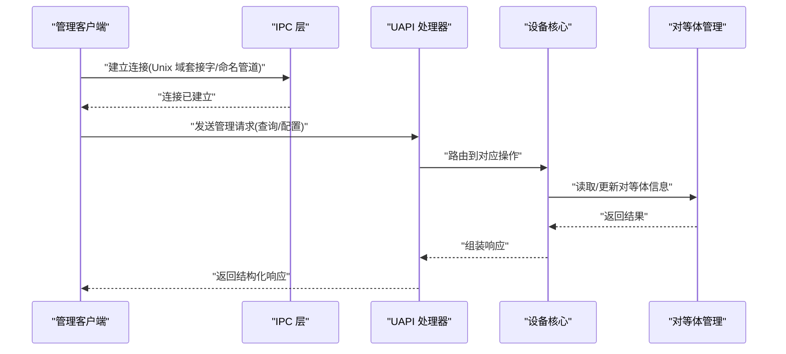
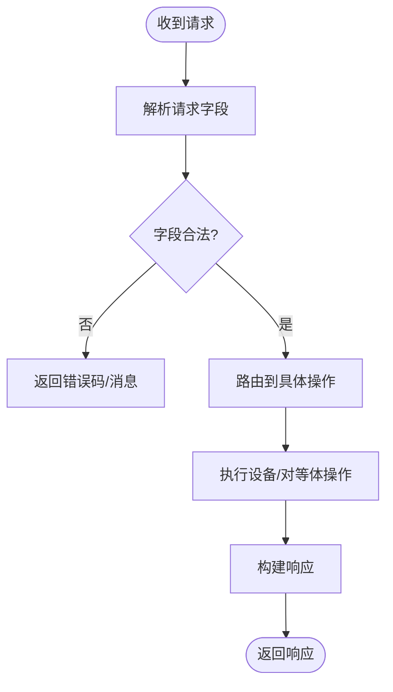
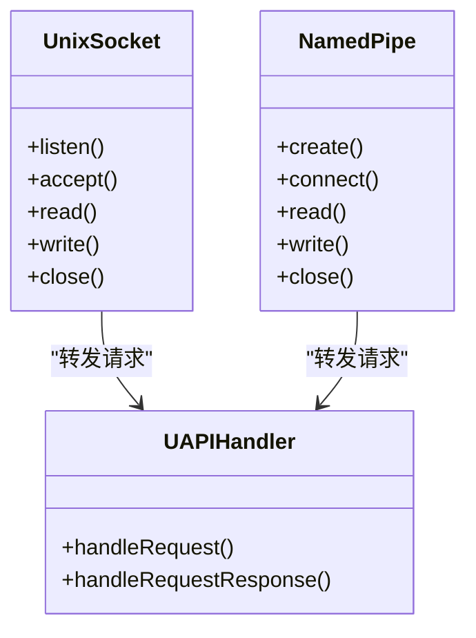
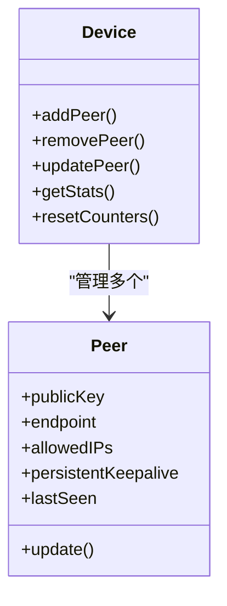
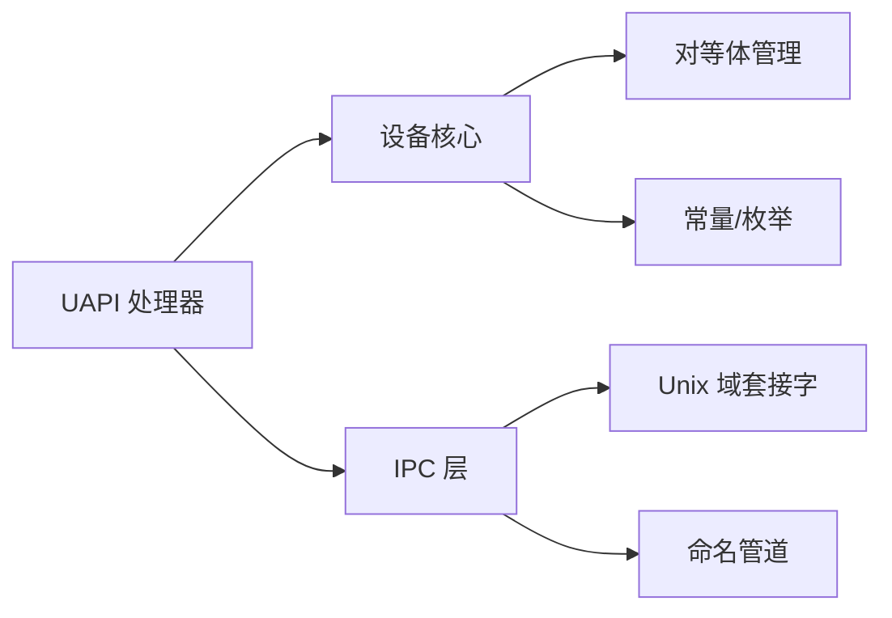
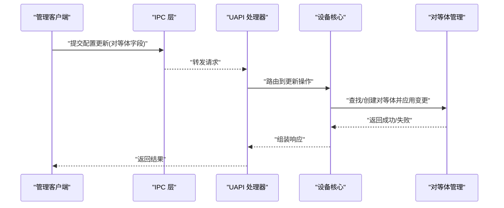
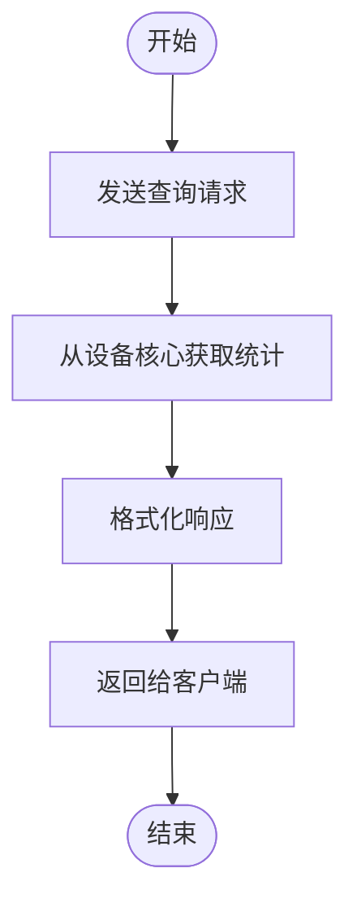

# 管理接口

<cite>
**本文引用的文件**
- [main.go](file://main.go)
- [device/uapi.go](file://device/uapi.go)
- [ipc/uapi_unix.go](file://ipc/uapi_unix.go)
- [ipc/uapi_windows.go](file://ipc/uapi_windows.go)
- [ipc/namedpipe/namedpipe.go](file://ipc/namedpipe/namedpipe.go)
- [device/device.go](file://device/device.go)
- [device/peer.go](file://device/peer.go)
- [device/constants.go](file://device/constants.go)
- [README.md](file://README.md)
</cite>

## 目录
1. [简介](#简介)
2. [项目结构](#项目结构)
3. [核心组件](#核心组件)
4. [架构总览](#架构总览)
5. [详细组件分析](#详细组件分析)
6. [依赖分析](#依赖分析)
7. [性能考虑](#性能考虑)
8. [故障排查指南](#故障排查指南)
9. [结论](#结论)
10. [附录](#附录)

## 简介
本文件面向需要与 wireguard-go 进程进行交互的开发者，聚焦“管理接口”的设计与实现。该接口提供用户空间 API（UAPI），用于动态配置和管理 WireGuard 设备、对等体（Peer）以及隧道状态。管理接口通过 Unix 域套接字（Unix domain socket）或命名管道（Windows Named Pipe）暴露，支持只读查询与受控的配置更新。本文档涵盖：
- UAPI 协议与命令集
- 传输层：Unix 域套接字与命名管道的使用方式
- 认证与授权机制
- 动态配置更新的流程与限制
- 监控与统计信息的获取方法
- 错误处理与异常场景
- 第三方工具集成指南与示例

## 项目结构
本项目采用分层组织：
- device：核心设备逻辑、对等体管理、密钥协商、收发队列、计时器等
- ipc：平台相关的 IPC 实现，包括 Unix 域套接字与 Windows 命名管道
- conn/tun/ratelimiter/replay 等：网络栈与系统调用封装
- main：程序入口，负责启动设备与监听管理接口

**图示来源**
- [ipc/uapi_unix.go:1-200](file://ipc/uapi_unix.go#L1-L200)
- [ipc/uapi_windows.go:1-200](file://ipc/uapi_windows.go#L1-L200)
- [device/uapi.go:1-200](file://device/uapi.go#L1-L200)
- [device/device.go:1-200](file://device/device.go#L1-L200)

**章节来源**
- [main.go:1-200](file://main.go#L1-L200)
- [README.md:1-200](file://README.md#L1-L200)

## 核心组件
- UAPI 处理器：负责解析管理请求、执行操作并返回结构化响应。支持只读查询与受限的配置写入。
- IPC 传输：
  - Unix 域套接字：在类 Unix 系统上提供进程间通信通道
  - 命名管道：在 Windows 上提供等效的进程间通信通道
- 设备核心：维护设备状态、对等体列表、密钥对、定时器、发送/接收队列等
- 对等体管理：添加、删除、更新对等体属性（公钥、端点、允许 IP、持久密钥等）

**章节来源**
- [device/uapi.go:1-200](file://device/uapi.go#L1-L200)
- [ipc/uapi_unix.go:1-200](file://ipc/uapi_unix.go#L1-L200)
- [ipc/uapi_windows.go:1-200](file://ipc/uapi_windows.go#L1-L200)
- [device/device.go:1-200](file://device/device.go#L1-L200)

## 架构总览
下图展示了从客户端到设备核心的完整调用链：

**图示来源**
- [ipc/uapi_unix.go:1-200](file://ipc/uapi_unix.go#L1-L200)
- [ipc/uapi_windows.go:1-200](file://ipc/uapi_windows.go#L1-L200)
- [device/uapi.go:1-200](file://device/uapi.go#L1-L200)
- [device/device.go:1-200](file://device/device.go#L1-L200)
- [device/peer.go:1-200](file://device/peer.go#L1-L200)

## 详细组件分析

### UAPI 处理器与命令集
- 职责：解析管理请求、校验参数、路由到设备操作、生成响应
- 支持的命令类型（概念性说明）：
  - 查询类：列出设备信息、对等体列表、统计信息
  - 配置类：添加/删除/更新对等体、设置接口地址、端口、监听参数等
  - 控制类：重置计数器、刷新状态、触发日志级别调整（若暴露）
- 数据格式：以键值对形式组织，便于解析与扩展
- 安全边界：仅允许具备相应权限的管理客户端执行写操作

**图示来源**
- [device/uapi.go:1-200](file://device/uapi.go#L1-L200)

**章节来源**
- [device/uapi.go:1-200](file://device/uapi.go#L1-L200)

### IPC 传输层：Unix 域套接字与命名管道
- Unix 域套接字：
  - 适用平台：Linux、BSD、macOS 等
  - 特点：本地进程间通信，低开销，支持流式读写
- 命名管道：
  - 适用平台：Windows
  - 特点：跨进程通信，支持同步/异步 I/O
- 连接生命周期：
  - 客户端发起连接
  - 服务端接受连接并分配会话上下文
  - 请求/响应按行或记录边界处理
  - 连接关闭时清理资源

**图示来源**
- [ipc/uapi_unix.go:1-200](file://ipc/uapi_unix.go#L1-L200)
- [ipc/uapi_windows.go:1-200](file://ipc/uapi_windows.go#L1-L200)
- [ipc/namedpipe/namedpipe.go:1-200](file://ipc/namedpipe/namedpipe.go#L1-L200)

**章节来源**
- [ipc/uapi_unix.go:1-200](file://ipc/uapi_unix.go#L1-L200)
- [ipc/uapi_windows.go:1-200](file://ipc/uapi_windows.go#L1-L200)
- [ipc/namedpipe/namedpipe.go:1-200](file://ipc/namedpipe/namedpipe.go#L1-L200)

### 设备核心与对等体管理
- 设备核心：
  - 维护全局状态（监听地址、端口、TUN 接口、加密上下文）
  - 管理定时器、队列、Cookie 验证等
- 对等体管理：
  - 支持添加、删除、更新对等体
  - 属性包括：公钥、预共享密钥、端点、允许 IP、持久密钥、超时等
  - 内部索引表优化查找与更新

**图示来源**
- [device/device.go:1-200](file://device/device.go#L1-L200)
- [device/peer.go:1-200](file://device/peer.go#L1-L200)

**章节来源**
- [device/device.go:1-200](file://device/device.go#L1-L200)
- [device/peer.go:1-200](file://device/peer.go#L1-L200)

### 认证与授权机制
- 进程级隔离：
  - 默认情况下，管理接口通常绑定到本地回环或 Unix 域套接字，仅本机进程可访问
- 文件系统权限（Unix）：
  - 通过 Unix 域套接字文件的权限位控制访问者
- 命名管道 ACL（Windows）：
  - 通过安全描述符限制哪些用户/组可连接
- 建议：
  - 将管理接口限制为最小必要权限
  - 结合系统级防火墙或容器策略进一步收敛攻击面

**章节来源**
- [ipc/uapi_unix.go:1-200](file://ipc/uapi_unix.go#L1-L200)
- [ipc/uapi_windows.go:1-200](file://ipc/uapi_windows.go#L1-L200)

### 动态配置更新方法与限制
- 更新方式：
  - 通过 UAPI 发送配置请求，包含对等体属性与接口参数
  - 支持增量更新：仅提交变更字段
- 限制与约束：
  - 某些字段可能不可变（如设备标识）
  - 并发更新需保证一致性（内部锁/事务化）
  - 无效配置将被拒绝并返回错误
- 最佳实践：
  - 先查询当前状态，再提交差异化的更新
  - 对关键配置变更进行幂等设计

**章节来源**
- [device/uapi.go:1-200](file://device/uapi.go#L1-L200)
- [device/device.go:1-200](file://device/device.go#L1-L200)

### 监控与统计信息获取
- 可获取的信息（概念性）：
  - 设备状态：监听地址、端口、TUN 接口名
  - 对等体统计：最近握手时间、发送/接收字节数、数据包计数
  - 系统指标：队列长度、定时器状态、内存占用（若暴露）
- 获取方式：
  - 通过 UAPI 查询命令拉取
  - 周期性轮询或事件驱动（若支持）

**章节来源**
- [device/device.go:1-200](file://device/device.go#L1-L200)
- [device/constants.go:1-200](file://device/constants.go#L1-L200)

### 错误处理与异常情况
- 常见错误：
  - 连接失败（权限不足、路径不存在）
  - 请求格式错误（字段缺失、类型不匹配）
  - 配置冲突（重复对等体、非法 IP/端口）
  - 资源耗尽（队列满、内存不足）
- 处理方式：
  - 返回明确的错误码与消息
  - 保持连接可用以便重试
  - 记录诊断日志（受日志级别控制）

**章节来源**
- [device/uapi.go:1-200](file://device/uapi.go#L1-L200)
- [ipc/uapi_unix.go:1-200](file://ipc/uapi_unix.go#L1-L200)
- [ipc/uapi_windows.go:1-200](file://ipc/uapi_windows.go#L1-L200)

## 依赖分析
UAPI 与 IPC 层紧密耦合，同时依赖设备核心提供的能力。下图展示模块间的依赖关系：

**图示来源**
- [device/uapi.go:1-200](file://device/uapi.go#L1-L200)
- [ipc/uapi_unix.go:1-200](file://ipc/uapi_unix.go#L1-L200)
- [ipc/uapi_windows.go:1-200](file://ipc/uapi_windows.go#L1-L200)
- [device/device.go:1-200](file://device/device.go#L1-L200)
- [device/peer.go:1-200](file://device/peer.go#L1-L200)
- [device/constants.go:1-200](file://device/constants.go#L1-L200)

**章节来源**
- [device/uapi.go:1-200](file://device/uapi.go#L1-L200)
- [device/device.go:1-200](file://device/device.go#L1-L200)

## 性能考虑
- 连接复用：尽量复用 IPC 连接以减少握手开销
- 批量更新：合并多次小更新为一次批量请求
- 异步 I/O：在高并发场景下使用异步读写避免阻塞
- 限流与背压：防止突发流量导致队列溢出
- 缓存热点数据：减少频繁查询带来的 CPU 压力

[本节为通用指导，无需特定文件来源]

## 故障排查指南
- 连接问题：
  - 检查 Unix 域套接字文件或命名管道是否存在且权限正确
  - 确认进程 UID/GID 或 Windows 用户/组是否具备访问权限
- 配置失败：
  - 核对字段名称与类型是否符合协议约定
  - 检查 IP/端口范围与路由规则是否合法
- 统计异常：
  - 确认设备处于运行态
  - 检查是否有对等体活跃握手
- 日志与调试：
  - 提升日志级别以获取更多上下文
  - 捕获 IPC 请求/响应以定位问题

**章节来源**
- [ipc/uapi_unix.go:1-200](file://ipc/uapi_unix.go#L1-L200)
- [ipc/uapi_windows.go:1-200](file://ipc/uapi_windows.go#L1-L200)
- [device/uapi.go:1-200](file://device/uapi.go#L1-L200)

## 结论
wireguard-go 的管理接口通过 UAPI 与 IPC 层提供了稳定、可扩展的设备管理能力。借助 Unix 域套接字与命名管道，可在不同平台上实现一致的交互体验。通过合理的认证与授权、严格的配置校验与完善的错误处理，第三方工具可以安全地集成并自动化管理 WireGuard 设备。建议在集成过程中遵循幂等更新、批量操作与异步 I/O 的最佳实践，以获得更好的性能与可靠性。

[本节为总结性内容，无需特定文件来源]

## 附录

### 管理命令与配置接口（概览）
- 查询类：
  - 设备信息：接口地址、端口、TUN 名称
  - 对等体列表：公钥、端点、允许 IP、最后活动
  - 统计信息：发送/接收字节、数据包计数、最近握手时间
- 配置类：
  - 添加对等体：公钥、可选预共享密钥、端点、允许 IP、持久保活
  - 更新对等体：增量修改上述字段
  - 删除对等体：指定公钥或标识
- 控制类：
  - 重置计数器
  - 刷新状态/日志级别（若暴露）

[本节为概念性说明，无需特定文件来源]

### 认证与授权（实践建议）
- Unix：
  - 使用 Unix 域套接字文件权限控制访问
  - 结合 systemd socket 激活与用户组白名单
- Windows：
  - 使用命名管道安全描述符限制访问
  - 结合服务账户与最小权限原则

**章节来源**
- [ipc/uapi_unix.go:1-200](file://ipc/uapi_unix.go#L1-L200)
- [ipc/uapi_windows.go:1-200](file://ipc/uapi_windows.go#L1-L200)

### 动态配置更新流程（序列图）

**图示来源**
- [device/uapi.go:1-200](file://device/uapi.go#L1-L200)
- [device/device.go:1-200](file://device/device.go#L1-L200)
- [device/peer.go:1-200](file://device/peer.go#L1-L200)

### 监控与统计（流程图）

**图示来源**
- [device/device.go:1-200](file://device/device.go#L1-L200)
- [device/constants.go:1-200](file://device/constants.go#L1-L200)

### 集成指南与代码示例（步骤）
- 选择 IPC 类型：
  - Unix：连接到本地 Unix 域套接字
  - Windows：连接到命名管道
- 建立连接后：
  - 发送查询请求以获取当前配置
  - 构造配置更新请求并提交
  - 处理响应与错误
- 注意事项：
  - 确保权限正确
  - 实现重试与超时
  - 对关键操作进行幂等设计

[本节为通用集成指导，无需特定文件来源]