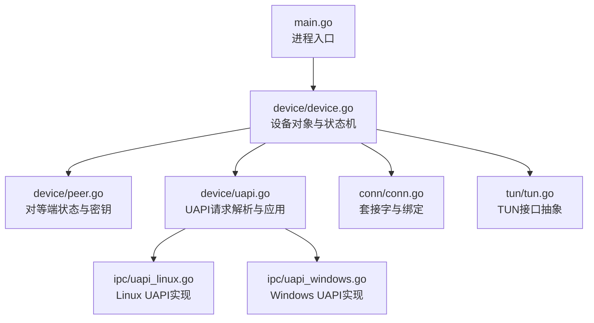
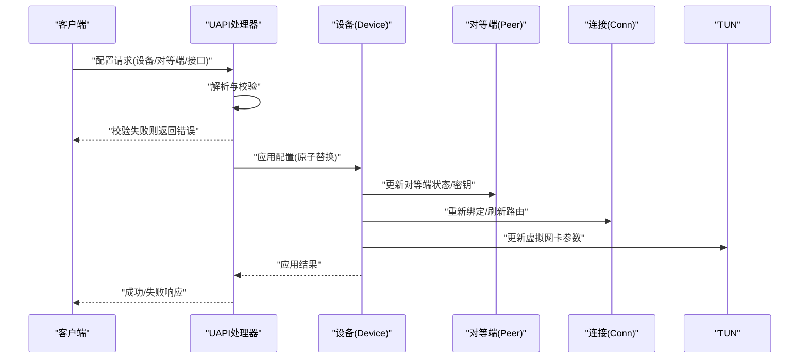
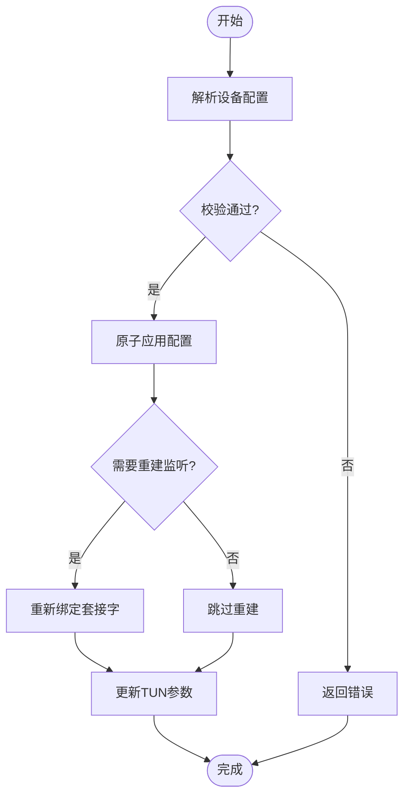
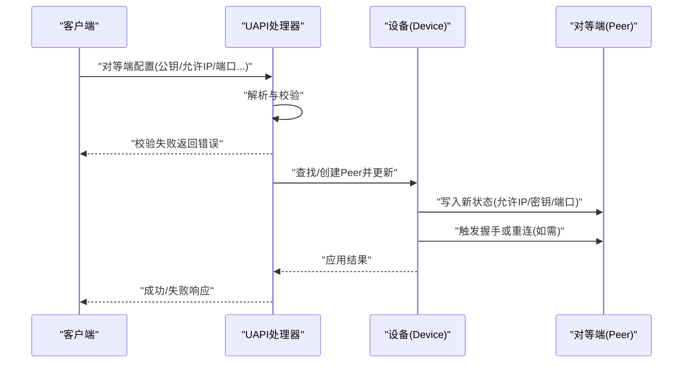
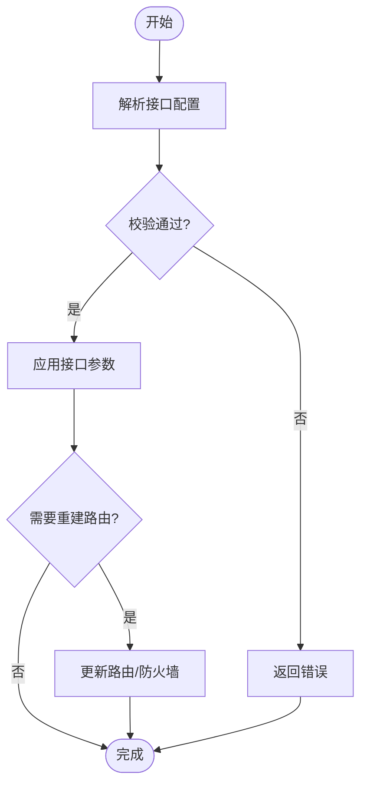
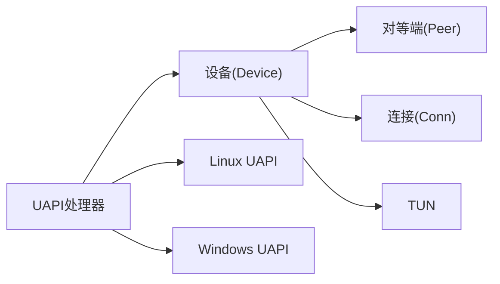

# 配置管理

<cite>
**本文引用的文件**
- [main.go](file://main.go)
- [device/device.go](file://device/device.go)
- [device/uapi.go](file://device/uapi.go)
- [ipc/uapi_linux.go](file://ipc/uapi_linux.go)
- [ipc/uapi_windows.go](file://ipc/uapi_windows.go)
- [tun/tun.go](file://tun/tun.go)
- [conn/conn.go](file://conn/conn.go)
- [device/peer.go](file://device/peer.go)
- [device/constants.go](file://device/constants.go)
</cite>

## 目录
1. [简介](#简介)
2. [项目结构](#项目结构)
3. [核心组件](#核心组件)
4. [架构总览](#架构总览)
5. [详细组件分析](#详细组件分析)
6. [依赖关系分析](#依赖关系分析)
7. [性能考虑](#性能考虑)
8. [故障排查指南](#故障排查指南)
9. [结论](#结论)
10. [附录](#附录)

## 简介
本文件面向WireGuard Go实现中的“配置管理”能力，聚焦以下目标：
- 说明动态配置更新的完整流程（设备、对等端、接口）
- 文档化配置验证规则与约束条件
- 解释配置热重载的实现机制与限制
- 提供配置备份、恢复与迁移方法
- 给出配置模板与最佳实践建议
- 说明配置变更的审计日志与回滚机制
- 为自动化配置管理提供API使用示例

本仓库采用UAPI（用户态API）作为外部配置入口，内核或TUN驱动承载实际网络栈。配置更新通过UAPI进行解析、校验并下发到设备层，最终应用到TUN/接口和对等端状态。

## 项目结构
与配置管理直接相关的代码主要分布在如下模块：
- 设备与对等端：device/*（设备生命周期、对等端状态、密钥轮换、定时器、队列等）
- UAPI接口：ipc/*（平台相关UAPI实现）、device/uapi.go（UAPI协议处理）
- 网络I/O：conn/*（套接字绑定、特性、标记等）
- TUN抽象：tun/*（跨平台TUN接口）
- 入口：main.go（进程启动、初始化、事件循环）

图表来源
- [main.go:1-200](file://main.go#L1-L200)
- [device/device.go:1-200](file://device/device.go#L1-L200)
- [device/uapi.go:1-200](file://device/uapi.go#L1-L200)
- [ipc/uapi_linux.go:1-200](file://ipc/uapi_linux.go#L1-L200)
- [ipc/uapi_windows.go:1-200](file://ipc/uapi_windows.go#L1-L200)
- [conn/conn.go:1-200](file://conn/conn.go#L1-L200)
- [tun/tun.go:1-200](file://tun/tun.go#L1-L200)

章节来源
- [main.go:1-200](file://main.go#L1-L200)
- [device/device.go:1-200](file://device/device.go#L1-L200)
- [device/uapi.go:1-200](file://device/uapi.go#L1-L200)
- [ipc/uapi_linux.go:1-200](file://ipc/uapi_linux.go#L1-L200)
- [ipc/uapi_windows.go:1-200](file://ipc/uapi_windows.go#L1-L200)
- [conn/conn.go:1-200](file://conn/conn.go#L1-L200)
- [tun/tun.go:1-200](file://tun/tun.go#L1-L200)

## 核心组件
- 设备对象（Device）：维护全局配置、对等端集合、定时器、队列、监听套接字、TUN句柄等，是配置应用的核心载体。
- 对等端（Peer）：保存公钥、预共享密钥、允许的IP、端口、持久私有密钥、最近一次握手时间戳等。
- UAPI处理器：解析来自用户态的配置请求，执行校验、原子替换、应用变更，并返回结果。
- 平台UAPI实现：在Linux/Windows等平台暴露UAPI套接字或命名管道，供外部工具调用。
- 连接与TUN：负责底层网络I/O与虚拟网卡读写。

章节来源
- [device/device.go:1-200](file://device/device.go#L1-L200)
- [device/peer.go:1-200](file://device/peer.go#L1-L200)
- [device/uapi.go:1-200](file://device/uapi.go#L1-L200)
- [ipc/uapi_linux.go:1-200](file://ipc/uapi_linux.go#L1-L200)
- [ipc/uapi_windows.go:1-200](file://ipc/uapi_windows.go#L1-L200)
- [conn/conn.go:1-200](file://conn/conn.go#L1-L200)
- [tun/tun.go:1-200](file://tun/tun.go#L1-L200)

## 架构总览
配置管理的整体流程如下：
- 外部客户端通过UAPI向设备发送配置请求（添加/删除/更新对等端、设置接口参数等）。
- UAPI处理器解析请求，执行字段级校验与业务约束检查。
- 校验通过后，设备层以原子方式替换内部状态，触发必要的重连、密钥轮换、路由更新等操作。
- 平台UAPI实现负责将请求转发给设备，并将响应写回客户端。
- TUN/连接层根据新配置建立或调整数据面通道。

图表来源
- [device/uapi.go:1-200](file://device/uapi.go#L1-L200)
- [device/device.go:1-200](file://device/device.go#L1-L200)
- [device/peer.go:1-200](file://device/peer.go#L1-L200)
- [ipc/uapi_linux.go:1-200](file://ipc/uapi_linux.go#L1-L200)
- [ipc/uapi_windows.go:1-200](file://ipc/uapi_windows.go#L1-L200)
- [conn/conn.go:1-200](file://conn/conn.go#L1-L200)
- [tun/tun.go:1-200](file://tun/tun.go#L1-L200)

## 详细组件分析

### 设备配置（接口参数）
- 关键能力
  - 设置监听端口、私钥、允许的网络接口、防火墙标记、MTU等
  - 支持热重载：在不重启进程的情况下应用新配置
- 典型流程
  - 客户端通过UAPI提交设备级参数
  - UAPI解析并校验字段合法性（如端口范围、地址格式、标志位）
  - 设备层原子替换当前配置，必要时重建监听套接字、更新TUN参数
- 约束与验证
  - 私钥长度与格式校验
  - 端口取值范围与可用性
  - 地址前缀合法性和冲突检测
  - 标志位组合有效性（如是否允许IPv6、是否启用NAT等）

图表来源
- [device/uapi.go:1-200](file://device/uapi.go#L1-L200)
- [device/device.go:1-200](file://device/device.go#L1-L200)
- [conn/conn.go:1-200](file://conn/conn.go#L1-L200)
- [tun/tun.go:1-200](file://tun/tun.go#L1-L200)

章节来源
- [device/device.go:1-200](file://device/device.go#L1-L200)
- [device/uapi.go:1-200](file://device/uapi.go#L1-L200)
- [conn/conn.go:1-200](file://conn/conn.go#L1-L200)
- [tun/tun.go:1-200](file://tun/tun.go#L1-L200)

### 对等端配置（Peer）
- 关键能力
  - 添加/删除/更新对等端：公钥、预共享密钥、允许的IP列表、端口、持久私有密钥、Keepalive间隔等
  - 支持增量更新：仅修改指定字段，未指定字段保持不变
- 典型流程
  - 客户端通过UAPI提交对等端配置片段
  - UAPI解析并校验字段（如公钥格式、IP列表合法性）
  - 设备层定位对应Peer，原子更新其状态，触发必要的握手或重连
- 约束与验证
  - 公钥长度与格式校验
  - 允许的IP列表必须为有效CIDR且无冲突
  - Keepalive间隔合理范围
  - 预共享密钥可选但需满足长度要求

图表来源
- [device/uapi.go:1-200](file://device/uapi.go#L1-L200)
- [device/device.go:1-200](file://device/device.go#L1-L200)
- [device/peer.go:1-200](file://device/peer.go#L1-L200)

章节来源
- [device/peer.go:1-200](file://device/peer.go#L1-L200)
- [device/device.go:1-200](file://device/device.go#L1-L200)
- [device/uapi.go:1-200](file://device/uapi.go#L1-L200)

### 接口配置（TUN/系统接口）
- 关键能力
  - 设置TUN名称、MTU、路由策略、防火墙标记、NAT行为等
  - 支持热重载：在不重启进程的情况下切换或刷新接口参数
- 典型流程
  - 客户端通过UAPI提交接口参数
  - UAPI校验后通知设备层更新TUN句柄或系统接口属性
  - 设备层按需重建路由表或刷新防火墙规则
- 约束与验证
  - MTU范围与兼容性
  - 接口名称唯一性
  - 路由前缀不冲突
  - 防火墙标记有效范围

图表来源
- [device/uapi.go:1-200](file://device/uapi.go#L1-L200)
- [device/device.go:1-200](file://device/device.go#L1-L200)
- [tun/tun.go:1-200](file://tun/tun.go#L1-L200)

章节来源
- [device/device.go:1-200](file://device/device.go#L1-L200)
- [device/uapi.go:1-200](file://device/uapi.go#L1-L200)
- [tun/tun.go:1-200](file://tun/tun.go#L1-L200)

### 配置验证规则与约束条件
- 通用规则
  - 所有字段必须存在且类型正确
  - 值必须在合法范围内（如端口、超时、MTU）
  - 复合字段（如允许IP列表）必须无重复、无冲突
- 设备级
  - 私钥长度与格式校验
  - 监听端口可用性与范围
  - 标志位组合有效性
- 对等端级
  - 公钥长度与格式
  - 允许的IP/CIDR合法性
  - Keepalive间隔合理性
  - 预共享密钥长度（若提供）
- 接口级
  - TUN名称唯一性
  - MTU兼容性与范围
  - 路由前缀无冲突
  - 防火墙标记有效范围

章节来源
- [device/uapi.go:1-200](file://device/uapi.go#L1-L200)
- [device/device.go:1-200](file://device/device.go#L1-L200)
- [device/peer.go:1-200](file://device/peer.go#L1-L200)
- [device/constants.go:1-200](file://device/constants.go#L1-L200)

### 配置热重载机制与限制
- 机制
  - UAPI处理器接收配置后，先进行全量校验；校验通过后，设备层以原子方式替换内部状态
  - 对于需要重建的资源（如监听套接字、TUN句柄），按最小影响原则重建
  - 对等端状态更新可能触发握手或重连，保证数据面快速收敛
- 限制
  - 某些平台或内核版本可能对TUN/路由操作有额外限制
  - 频繁热重载可能导致短暂抖动，应批量合并配置变更
  - 部分配置项可能需要管理员权限或特定内核模块支持

章节来源
- [device/uapi.go:1-200](file://device/uapi.go#L1-L200)
- [device/device.go:1-200](file://device/device.go#L1-L200)
- [ipc/uapi_linux.go:1-200](file://ipc/uapi_linux.go#L1-L200)
- [ipc/uapi_windows.go:1-200](file://ipc/uapi_windows.go#L1-L200)

### 配置备份、恢复与迁移
- 备份
  - 通过UAPI查询当前设备、对等端与接口配置，导出为结构化文本或JSON
  - 建议在每次变更前自动备份当前配置快照
- 恢复
  - 将备份的配置通过UAPI重新下发，设备层会按相同校验与应用流程生效
  - 恢复时应注意依赖顺序（先设备级，再接口级，最后对等端）
- 迁移
  - 当配置格式或字段含义发生变化时，应在应用层进行版本适配与转换
  - 建议在迁移前后分别备份，并提供回滚路径

章节来源
- [device/uapi.go:1-200](file://device/uapi.go#L1-L200)
- [device/device.go:1-200](file://device/device.go#L1-L200)

### 配置模板与最佳实践
- 模板建议
  - 设备级：包含私钥、监听端口、标志位、MTU等基础字段
  - 对等端级：包含公钥、允许的IP、端口、Keepalive、持久私有密钥等
  - 接口级：包含TUN名称、MTU、路由策略、防火墙标记等
- 最佳实践
  - 使用最小权限原则，仅开放必要端口与路由
  - 对敏感字段（私钥、预共享密钥）进行加密存储与传输
  - 批量合并配置变更，减少热重载次数
  - 变更前进行预校验与模拟，降低风险
  - 定期轮换密钥与审查对等端列表

[本节为概念性内容，不直接分析具体文件]

### 配置变更的审计日志与回滚机制
- 审计日志
  - 记录每次UAPI请求的入参、校验结果、应用结果与耗时
  - 对关键操作（如私钥变更、对等端增删）进行高亮记录
- 回滚机制
  - 在应用新配置前保留旧配置快照
  - 若新配置导致异常（如无法建立连接、路由冲突），可自动回滚至上一快照
  - 提供手动回滚接口，便于运维干预

章节来源
- [device/uapi.go:1-200](file://device/uapi.go#L1-L200)
- [device/device.go:1-200](file://device/device.go#L1-L200)

### 自动化配置管理API使用示例
- 典型步骤
  - 连接UAPI端点（Linux/Windows平台不同）
  - 发送设备级配置（私钥、端口、标志位）
  - 发送接口级配置（TUN名称、MTU、路由）
  - 发送对等端配置（公钥、允许的IP、端口、Keepalive）
  - 查询当前配置以确认生效
- 注意事项
  - 遵循字段校验规则与约束
  - 批量合并变更，避免频繁热重载
  - 处理平台差异（如权限、命名空间）

章节来源
- [ipc/uapi_linux.go:1-200](file://ipc/uapi_linux.go#L1-L200)
- [ipc/uapi_windows.go:1-200](file://ipc/uapi_windows.go#L1-L200)
- [device/uapi.go:1-200](file://device/uapi.go#L1-L200)

## 依赖关系分析
配置管理涉及的主要依赖关系如下：
- UAPI处理器依赖设备对象以对等端与接口状态进行原子更新
- 设备对象依赖连接层进行套接字绑定与通信
- 设备对象依赖TUN抽象进行虚拟网卡操作
- 平台UAPI实现负责与操作系统交互

图表来源
- [device/uapi.go:1-200](file://device/uapi.go#L1-L200)
- [device/device.go:1-200](file://device/device.go#L1-L200)
- [device/peer.go:1-200](file://device/peer.go#L1-L200)
- [conn/conn.go:1-200](file://conn/conn.go#L1-L200)
- [tun/tun.go:1-200](file://tun/tun.go#L1-L200)
- [ipc/uapi_linux.go:1-200](file://ipc/uapi_linux.go#L1-L200)
- [ipc/uapi_windows.go:1-200](file://ipc/uapi_windows.go#L1-L200)

章节来源
- [device/uapi.go:1-200](file://device/uapi.go#L1-L200)
- [device/device.go:1-200](file://device/device.go#L1-L200)
- [device/peer.go:1-200](file://device/peer.go#L1-L200)
- [conn/conn.go:1-200](file://conn/conn.go#L1-L200)
- [tun/tun.go:1-200](file://tun/tun.go#L1-L200)
- [ipc/uapi_linux.go:1-200](file://ipc/uapi_linux.go#L1-L200)
- [ipc/uapi_windows.go:1-200](file://ipc/uapi_windows.go#L1-L200)

## 性能考虑
- 批量合并配置变更，减少热重载次数
- 对频繁更新的字段（如允许的IP列表）进行增量更新
- 避免在高峰时段进行大规模配置变更
- 监控UAPI请求延迟与错误率，及时告警

[本节为通用指导，不直接分析具体文件]

## 故障排查指南
- 常见问题
  - 配置校验失败：检查字段格式、范围与组合合法性
  - 热重载无效：确认平台权限与内核支持
  - 对等端无法建立连接：检查公钥、端口、路由与防火墙规则
- 诊断步骤
  - 查看UAPI请求与响应日志
  - 检查设备状态与对等端状态
  - 验证TUN与路由配置
  - 逐步缩小问题范围（设备级→接口级→对等端级）

章节来源
- [device/uapi.go:1-200](file://device/uapi.go#L1-L200)
- [device/device.go:1-200](file://device/device.go#L1-L200)

## 结论
WireGuard Go的配置管理通过UAPI实现了灵活、安全的动态更新能力。借助原子替换与严格的校验机制，能够在不中断服务的前提下完成设备、对等端与接口配置的变更。结合备份、恢复、迁移与审计回滚机制，可满足生产环境的稳定性与可运维性要求。建议在实际部署中遵循最佳实践，确保配置变更的可控与可追溯。

[本节为总结性内容，不直接分析具体文件]

## 附录
- 术语
  - UAPI：用户态API，用于与设备进程交互
  - 对等端：VPN另一端节点
  - TUN：虚拟网卡接口
- 参考
  - 平台UAPI实现（Linux/Windows）
  - 设备与对等端状态模型
  - 连接与TUN抽象

[本节为补充信息，不直接分析具体文件]