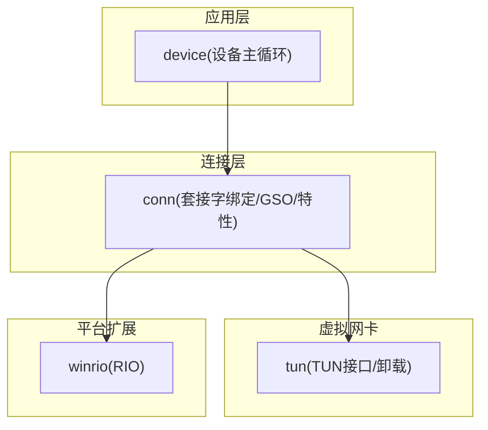
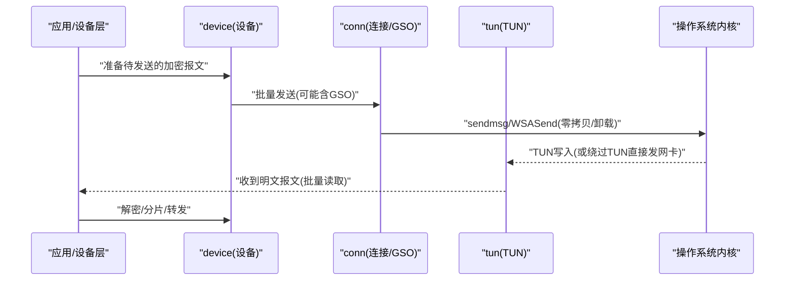
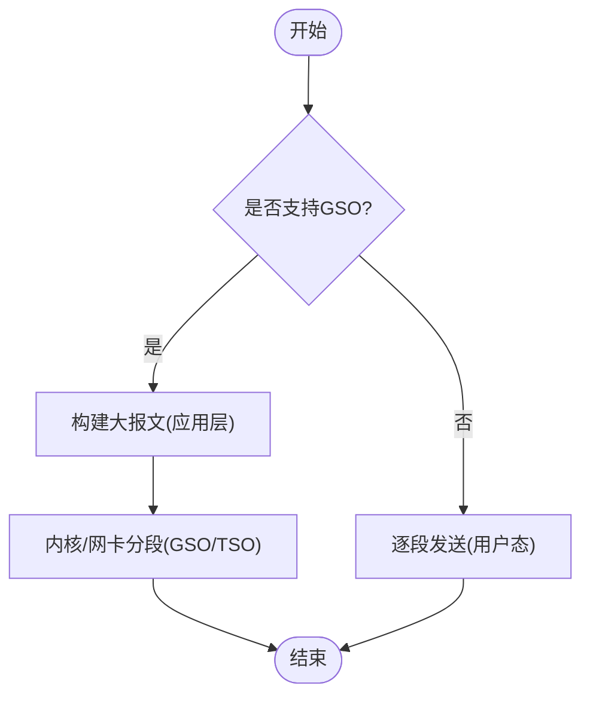
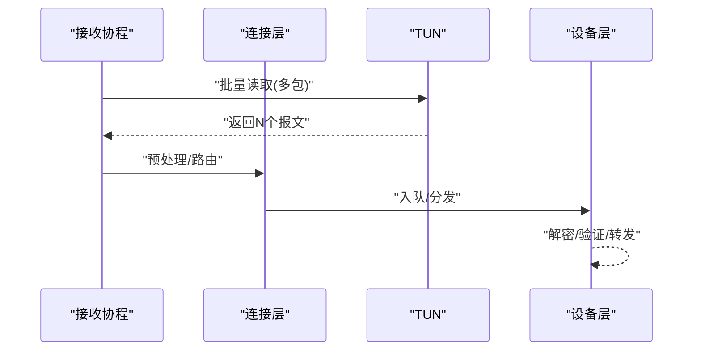
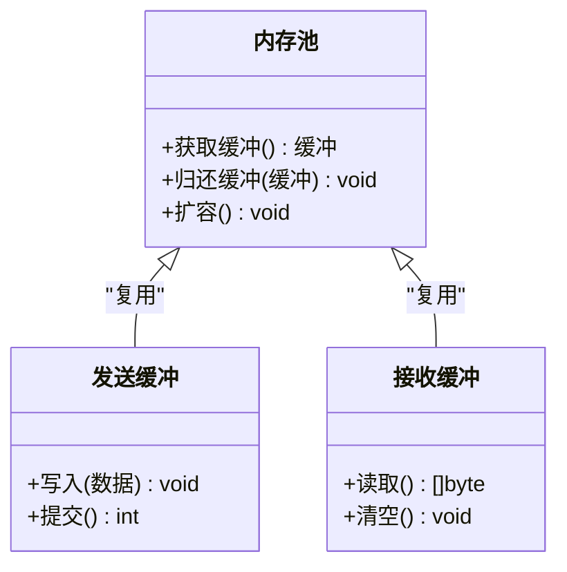
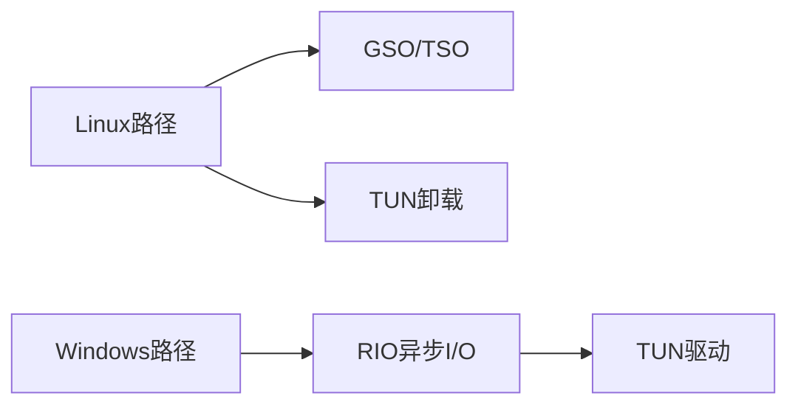
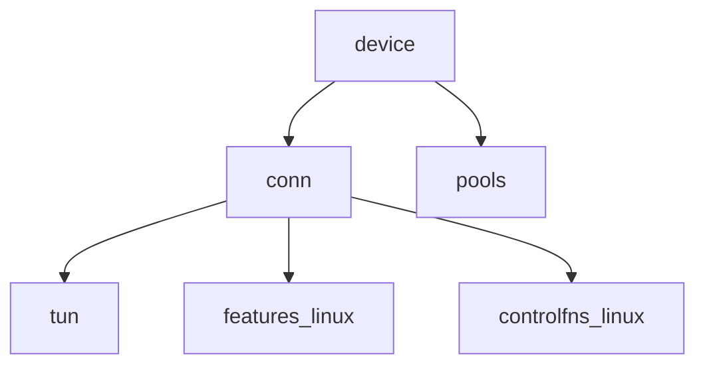

# I/O优化

<cite>
**本文引用的文件**
- [conn/conn.go](file://conn/conn.go)
- [conn/bind_std.go](file://conn/bind_std.go)
- [conn/bind_windows.go](file://conn/bind_windows.go)
- [conn/gso_linux.go](file://conn/gso_linux.go)
- [conn/gso_default.go](file://conn/gso_default.go)
- [conn/features_linux.go](file://conn/features_linux.go)
- [conn/controlfns_linux.go](file://conn/controlfns_linux.go)
- [conn/winrio/rio_windows.go](file://conn/winrio/rio_windows.go)
- [device/device.go](file://device/device.go)
- [device/receive.go](file://device/receive.go)
- [device/send.go](file://device/send.go)
- [device/pools.go](file://device/pools.go)
- [tun/tun_linux.go](file://tun/tun_linux.go)
- [tun/offload_linux.go](file://tun/offload_linux.go)
- [tun/tun_windows.go](file://tun/tun_windows.go)
</cite>

## 目录
1. [简介](#简介)
2. [项目结构](#项目结构)
3. [核心组件](#核心组件)
4. [架构总览](#架构总览)
5. [详细组件分析](#详细组件分析)
6. [依赖关系分析](#依赖关系分析)
7. [性能考量](#性能考量)
8. [故障排查指南](#故障排查指南)
9. [结论](#结论)
10. [附录](#附录)

## 简介
本文件聚焦于wireguard-go的I/O优化实践，围绕零拷贝、批量I/O、内存池与平台特定加速展开。重点覆盖：
- 零拷贝技术：GSO（通用分段卸载）与TSO（TCP分段卸载）在数据路径中的使用方式与适用场景
- 批量I/O处理：数据包聚合与并发策略，降低系统调用与上下文切换开销
- 内存池：减少分配与GC压力，提升吞吐与延迟稳定性
- 平台优化：Windows RIO与Linux内核旁路/卸载特性
- 性能基准与调优方法：如何测量、定位瓶颈并给出可操作的优化建议
- 诊断工具与分析技巧：快速定位I/O热点与异常

## 项目结构
本项目按功能分层组织，I/O相关能力主要分布在以下模块：
- conn：网络套接字绑定与特性探测，包含GSO支持、控制函数与平台差异实现
- device：设备主循环、收发队列、状态机与内存池管理
- tun：TUN/TAP设备抽象，封装不同平台的读写与卸载能力
- winrio：Windows异步I/O（RIO）桥接

图表来源
- [device/device.go:1-200](file://device/device.go#L1-L200)
- [conn/conn.go:1-200](file://conn/conn.go#L1-L200)
- [tun/tun_linux.go:1-200](file://tun/tun_linux.go#L1-L200)
- [conn/winrio/rio_windows.go:1-200](file://conn/winrio/rio_windows.go#L1-200)

章节来源
- [device/device.go:1-200](file://device/device.go#L1-L200)
- [conn/conn.go:1-200](file://conn/conn.go#L1-L200)
- [tun/tun_linux.go:1-200](file://tun/tun_linux.go#L1-L200)
- [conn/winrio/rio_windows.go:1-200](file://conn/winrio/rio_windows.go#L1-200)

## 核心组件
- 连接抽象与特性探测：统一UDP套接字操作，暴露发送/接收接口；检测并启用GSO等卸载能力
- 设备主循环：协调收/发队列、定时器、对端状态；将加密后的报文通过连接层发出，或将收到的明文交给上层
- TUN抽象：跨平台读写TUN设备，封装Linux卸载能力（如GRO/GSO）
- 内存池：为收发缓冲、封包/解包临时对象提供复用，降低分配与GC压力
- 平台优化：
  - Linux：利用内核GSO/TSO、TUN卸载、控制函数设置套接字选项
  - Windows：RIO异步I/O与TUN驱动交互

章节来源
- [conn/conn.go:1-200](file://conn/conn.go#L1-L200)
- [device/device.go:1-200](file://device/device.go#L1-L200)
- [device/pools.go:1-200](file://device/pools.go#L1-200)
- [tun/tun_linux.go:1-200](file://tun/tun_linux.go#L1-200)
- [conn/winrio/rio_windows.go:1-200](file://conn/winrio/rio_windows.go#L1-200)

## 架构总览
下图展示从应用到内核的数据路径，突出零拷贝与批量I/O的关键点：

图表来源
- [device/send.go:1-200](file://device/send.go#L1-200)
- [device/receive.go:1-200](file://device/receive.go#L1-200)
- [conn/gso_linux.go:1-200](file://conn/gso_linux.go#L1-200)
- [tun/tun_linux.go:1-200](file://tun/tun_linux.go#L1-200)

## 详细组件分析

### 零拷贝与卸载：GSO/TSO
- 目标：避免用户态多次拷贝与CPU分段计算，将分段/校验和计算卸载至内核或网卡
- 关键机制：
  - GSO：应用一次性提交大报文，内核按MTU切分并交由网卡发送
  - TSO：TCP层面的分段卸载（在UDP over IP场景中通常体现为GSO/UDPGRO）
  - 在Linux上通过套接字选项与TUN属性启用；在默认平台回退到普通发送路径
- 数据流要点：
  - 发送侧：设备层组装大报文 -> 连接层判断是否可用GSO -> 调用底层发送
  - 接收侧：若开启GRO/聚合，内核合并小包后再返回，减少用户态处理次数

图表来源
- [conn/gso_linux.go:1-200](file://conn/gso_linux.go#L1-200)
- [conn/gso_default.go:1-200](file://conn/gso_default.go#L1-200)
- [tun/offload_linux.go:1-200](file://tun/offload_linux.go#L1-200)

章节来源
- [conn/gso_linux.go:1-200](file://conn/gso_linux.go#L1-200)
- [conn/gso_default.go:1-200](file://conn/gso_default.go#L1-200)
- [tun/offload_linux.go:1-200](file://tun/offload_linux.go#L1-200)

### 批量I/O与并发策略
- 发送批量：
  - 将多个小报文聚合成一个更大的逻辑单元，配合GSO减少系统调用次数
  - 通过队列与批处理器提高吞吐，降低锁竞争
- 接收批量：
  - 一次系统调用读取多包，减少上下文切换
  - 结合GRO/聚合，在内核侧合并相邻报文
- 并发策略：
  - 读/写分离：接收与发送在不同协程/线程中并行执行
  - 无锁/低锁队列：减少争用，提高可扩展性

图表来源
- [device/receive.go:1-200](file://device/receive.go#L1-200)
- [conn/conn.go:1-200](file://conn/conn.go#L1-200)
- [tun/tun_linux.go:1-200](file://tun/tun_linux.go#L1-200)

章节来源
- [device/receive.go:1-200](file://device/receive.go#L1-200)
- [device/send.go:1-200](file://device/send.go#L1-200)
- [conn/conn.go:1-200](file://conn/conn.go#L1-200)

### 内存池与对象复用
- 目的：减少频繁分配带来的GC停顿与碎片化
- 策略：
  - 预分配固定大小的缓冲区用于封包/解包
  - 复用临时对象（如哈希表、切片），避免重复创建
  - 根据负载动态调整池大小，平衡内存占用与性能
- 影响：
  - 降低P99延迟抖动
  - 在高吞吐下显著减少GC暂停时间

图表来源
- [device/pools.go:1-200](file://device/pools.go#L1-200)

章节来源
- [device/pools.go:1-200](file://device/pools.go#L1-200)

### 平台特定优化
- Linux：
  - 通过控制函数设置套接字选项，启用GSO/TSO、关闭不必要的拷贝
  - TUN设备支持卸载，减少内核到用户态的数据搬运
- Windows：
  - 使用RIO进行异步I/O，减少同步阻塞与拷贝
  - 与TUN驱动协作，尽量让数据直达应用缓冲

图表来源
- [conn/controlfns_linux.go:1-200](file://conn/controlfns_linux.go#L1-200)
- [conn/features_linux.go:1-200](file://conn/features_linux.go#L1-200)
- [conn/winrio/rio_windows.go:1-200](file://conn/winrio/rio_windows.go#L1-200)
- [tun/tun_windows.go:1-200](file://tun/tun_windows.go#L1-200)

章节来源
- [conn/controlfns_linux.go:1-200](file://conn/controlfns_linux.go#L1-200)
- [conn/features_linux.go:1-200](file://conn/features_linux.go#L1-200)
- [conn/winrio/rio_windows.go:1-200](file://conn/winrio/rio_windows.go#L1-200)
- [tun/tun_windows.go:1-200](file://tun/tun_windows.go#L1-200)

## 依赖关系分析
- 设备层依赖连接层提供的发送/接收抽象，连接层再依赖TUN与平台特性
- 内存池被设备层广泛使用，贯穿收发路径
- 平台差异通过条件编译与特性探测隔离，保证跨平台一致性

图表来源
- [device/device.go:1-200](file://device/device.go#L1-200)
- [conn/conn.go:1-200](file://conn/conn.go#L1-200)
- [conn/features_linux.go:1-200](file://conn/features_linux.go#L1-200)
- [conn/controlfns_linux.go:1-200](file://conn/controlfns_linux.go#L1-200)
- [device/pools.go:1-200](file://device/pools.go#L1-200)

章节来源
- [device/device.go:1-200](file://device/device.go#L1-L200)
- [conn/conn.go:1-200](file://conn/conn.go#L1-L200)
- [device/pools.go:1-200](file://device/pools.go#L1-L200)

## 性能考量
- 零拷贝与卸载：
  - 优先启用GSO/TSO，减少CPU分段与拷贝
  - 在Linux上确认TUN卸载已生效
- 批量I/O：
  - 增大单次系统调用处理的报文数量，降低syscall开销
  - 合理设置队列长度，避免背压导致丢包
- 内存池：
  - 根据峰值流量调整池容量，避免频繁扩容
  - 监控GC频率与STW时长，确保稳定延迟
- 平台差异：
  - Windows使用RIO时注意缓冲区对齐与重叠I/O参数
  - Linux关注内核版本与网卡驱动对卸载的支持情况

[本节为通用指导，不直接分析具体文件]

## 故障排查指南
- 症状与定位：
  - 高CPU：检查是否未启用GSO/TSO；确认批量大小与队列深度
  - 高延迟抖动：观察GC行为与内存池命中率；必要时增大池或减少分配
  - 丢包：检查队列溢出、内核拥塞控制与网卡卸载状态
- 诊断步骤：
  - 使用性能计数器/探针统计发送/接收速率、系统调用次数、GC指标
  - 对比启用/禁用GSO的性能差异，确认卸载生效
  - 在Linux上使用内核工具查看TUN卸载标志与队列状态
- 常见修复：
  - 调整批量大小与并发度
  - 升级内核/驱动以获得更好的卸载支持
  - 优化内存池配置，减少分配热点

章节来源
- [device/receive.go:1-200](file://device/receive.go#L1-L200)
- [device/send.go:1-200](file://device/send.go#L1-L200)
- [conn/gso_linux.go:1-200](file://conn/gso_linux.go#L1-L200)
- [conn/features_linux.go:1-200](file://conn/features_linux.go#L1-L200)

## 结论
通过零拷贝（GSO/TSO）、批量I/O与内存池的组合优化，wireguard-go能够在多平台上获得更高的吞吐与更稳定的延迟。结合平台特定的RIO与内核卸载能力，可以进一步逼近硬件极限。建议在部署前进行基准测试与调优，持续监控关键指标以保障生产环境稳定性。

[本节为总结，不直接分析具体文件]

## 附录
- 基准测试建议：
  - 单流/多流吞吐测试，记录P50/P95/P99延迟
  - 不同报文大小下的性能曲线，识别最佳批量大小
  - 开启/关闭GSO/TSO对比，量化收益
- 调优清单：
  - 确认内核与驱动支持卸载
  - 调整队列长度与并发度
  - 优化内存池容量与回收策略
  - 监控GC与系统调用开销

[本节为补充信息，不直接分析具体文件]