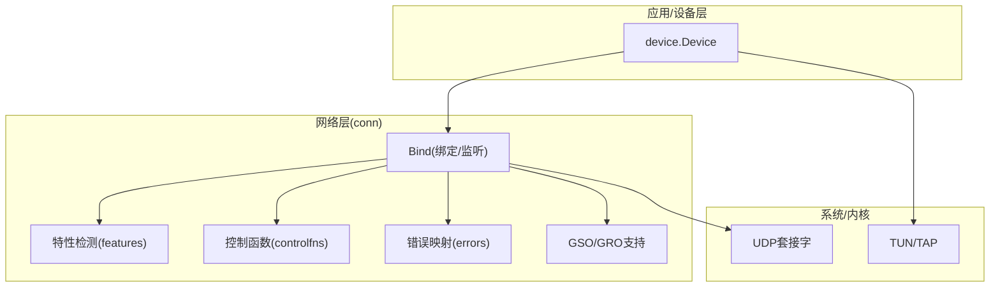
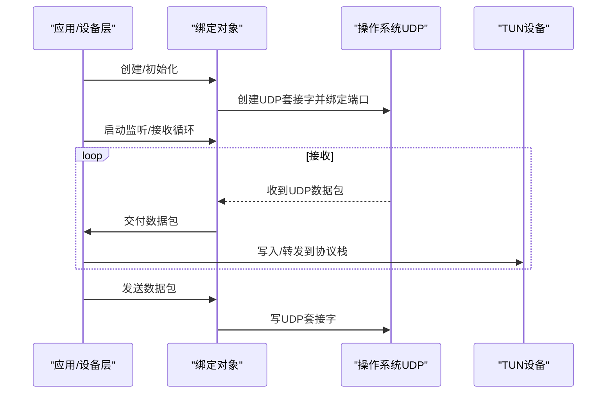
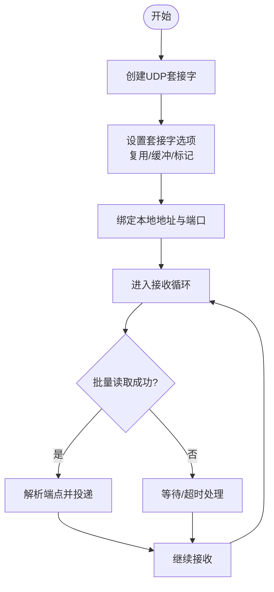
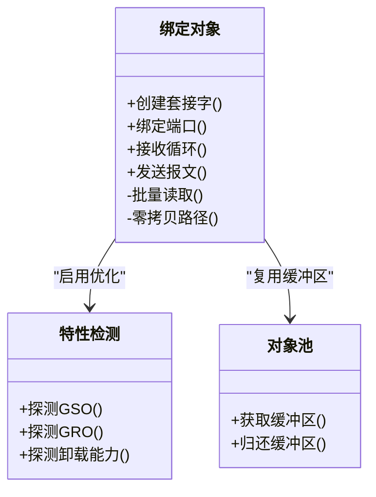
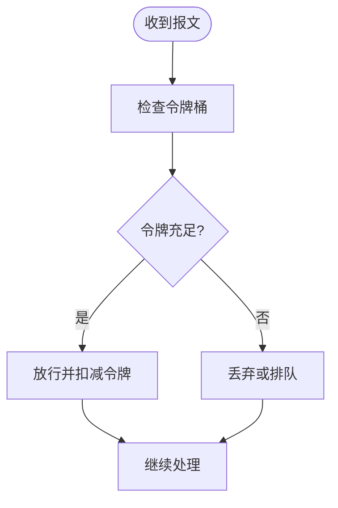
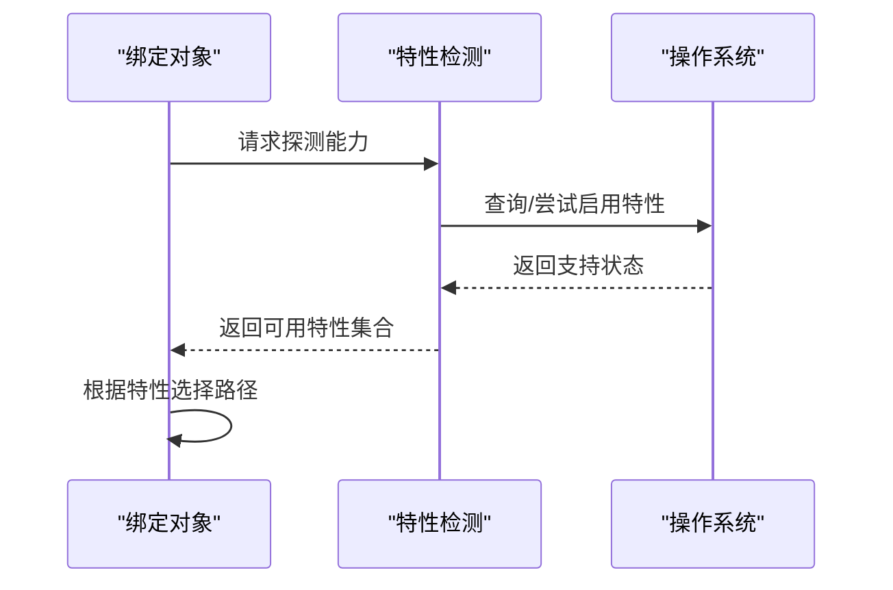
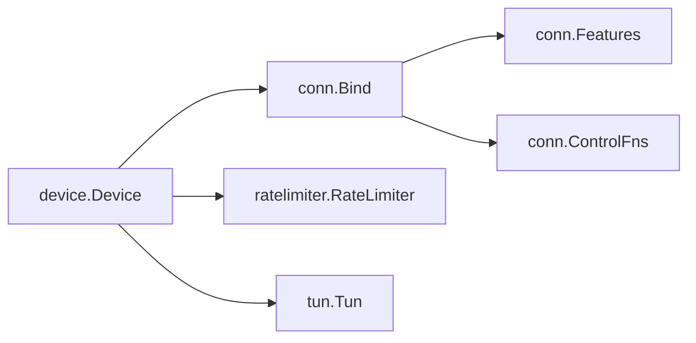

# 网络层实现

<cite>
**本文引用的文件**
- [conn/conn.go](file://conn/conn.go)
- [conn/bind_std.go](file://conn/bind_std.go)
- [conn/bind_windows.go](file://conn/bind_windows.go)
- [conn/features_default.go](file://conn/features_default.go)
- [conn/features_linux.go](file://conn/features_linux.go)
- [conn/gso_default.go](file://conn/gso_default.go)
- [conn/gso_linux.go](file://conn/gso_linux.go)
- [conn/controlfns_unix.go](file://conn/controlfns_unix.go)
- [conn/controlfns_linux.go](file://conn/controlfns_linux.go)
- [conn/controlfns_windows.go](file://conn/controlfns_windows.go)
- [conn/errors_default.go](file://conn/errors_default.go)
- [conn/errors_linux.go](file://conn/errors_linux.go)
- [ratelimiter/ratelimiter.go](file://ratelimiter/ratelimiter.go)
- [device/device.go](file://device/device.go)
- [device/receive.go](file://device/receive.go)
- [device/send.go](file://device/send.go)
- [device/pools.go](file://device/pools.go)
- [tun/tun.go](file://tun/tun.go)
</cite>

## 目录
1. [简介](#简介)
2. [项目结构](#项目结构)
3. [核心组件](#核心组件)
4. [架构总览](#架构总览)
5. [详细组件分析](#详细组件分析)
6. [依赖关系分析](#依赖关系分析)
7. [性能考虑](#性能考虑)
8. [故障排查指南](#故障排查指南)
9. [结论](#结论)
10. [附录](#附录)

## 简介
本文件聚焦于网络层的实现，围绕UDP连接的建立与管理、网络I/O优化（零拷贝与批量处理）、速率限制器、特性自动检测与适配、性能调优配置与最佳实践、监控与诊断工具、错误处理与重试机制，以及扩展与自定义指导进行系统化说明。目标是帮助读者快速理解并高效使用或扩展该网络层。

## 项目结构
网络层主要位于 conn 目录，负责UDP套接字绑定、监听、收发、特性探测与平台相关控制；设备层 device 通过统一接口与网络层交互，完成数据包的发送与接收；ratelimiter 提供令牌桶等限速能力；tun 提供虚拟网卡抽象，供上层协议栈或内核TUN驱动使用。

图表来源
- [conn/conn.go:1-200](file://conn/conn.go#L1-L200)
- [conn/features_default.go:1-120](file://conn/features_default.go#L1-L120)
- [conn/features_linux.go:1-120](file://conn/features_linux.go#L1-L120)
- [conn/controlfns_unix.go:1-120](file://conn/controlfns_unix.go#L1-L120)
- [conn/controlfns_linux.go:1-120](file://conn/controlfns_linux.go#L1-L120)
- [conn/controlfns_windows.go:1-120](file://conn/controlfns_windows.go#L1-L120)
- [conn/gso_default.go:1-120](file://conn/gso_default.go#L1-L120)
- [conn/gso_linux.go:1-120](file://conn/gso_linux.go#L1-L120)
- [device/device.go:1-200](file://device/device.go#L1-L200)
- [tun/tun.go:1-120](file://tun/tun.go#L1-L120)

章节来源
- [conn/conn.go:1-200](file://conn/conn.go#L1-L200)
- [device/device.go:1-200](file://device/device.go#L1-L200)
- [tun/tun.go:1-120](file://tun/tun.go#L1-L120)

## 核心组件
- 绑定与监听：封装UDP套接字的创建、绑定端口、设置选项、并发读写与关闭流程，提供跨平台一致接口。
- 连接管理：维护对端端点、会话状态、收发队列与定时器，配合设备层完成加密/解密与序列号管理。
- I/O优化：利用零拷贝路径（如GSO/GRO、IOCP/rio等）和批量收发减少系统调用与内存拷贝。
- 特性检测：运行时探测内核/驱动能力（如GSO/GRO、TSO、Checksum卸载），动态启用相应优化。
- 速率限制：基于令牌桶算法限制包速率，抵御滥用与DDoS。
- 错误处理与重试：统一错误分类、可恢复错误重试、不可恢复错误上报与清理。
- 监控与诊断：暴露统计指标、日志与调试钩子，便于定位问题。

章节来源
- [conn/conn.go:1-200](file://conn/conn.go#L1-L200)
- [device/device.go:1-200](file://device/device.go#L1-L200)
- [device/receive.go:1-200](file://device/receive.go#L1-L200)
- [device/send.go:1-200](file://device/send.go#L1-L200)
- [ratelimiter/ratelimiter.go:1-200](file://ratelimiter/ratelimiter.go#L1-L200)

## 架构总览
网络层以“绑定对象”为中心，向上暴露统一的收发接口，向下对接操作系统UDP套接字与TUN设备。设备层通过绑定对象进行数据面收发，并通过特性检测模块按需启用优化路径。

图表来源
- [conn/conn.go:1-200](file://conn/conn.go#L1-L200)
- [device/device.go:1-200](file://device/device.go#L1-L200)
- [tun/tun.go:1-120](file://tun/tun.go#L1-L120)

## 详细组件分析

### 绑定与监听（UDP连接建立与管理）
- 绑定流程：创建UDP套接字、设置地址族与复用选项、绑定本地地址与端口、可选设置标记/路由策略、开启非阻塞与缓冲区大小调整。
- 监听与接收：启动接收协程，循环从UDP套接字读取报文，解析源端点并投递到设备层；支持批量读取以降低系统调用开销。
- 发送路径：将待发包交给绑定对象，根据目标端点选择对应套接字进行发送；在支持的平台启用零拷贝或批量发送。
- 连接池管理：为活跃对端维护轻量级句柄/缓存，避免频繁分配与查找；结合空闲回收与容量上限防止资源泄漏。

图表来源
- [conn/bind_std.go:1-200](file://conn/bind_std.go#L1-L200)
- [conn/bind_windows.go:1-200](file://conn/bind_windows.go#L1-L200)
- [conn/conn.go:1-200](file://conn/conn.go#L1-L200)

章节来源
- [conn/bind_std.go:1-200](file://conn/bind_std.go#L1-L200)
- [conn/bind_windows.go:1-200](file://conn/bind_windows.go#L1-L200)
- [conn/conn.go:1-200](file://conn/conn.go#L1-L200)

### 网络I/O优化（零拷贝与批量处理）
- 零拷贝技术：在Linux等平台启用GSO/GRO与校验卸载，减少CPU参与与内存拷贝；在Windows上可利用RIO/IOCP提升吞吐。
- 批量处理：一次系统调用读取多个报文，合并处理后再投递，降低上下文切换与锁竞争。
- 缓冲区与队列：合理设置接收/发送缓冲区大小，避免丢包与抖动；使用对象池复用缓冲区，减少GC压力。

图表来源
- [conn/features_default.go:1-120](file://conn/features_default.go#L1-L120)
- [conn/features_linux.go:1-120](file://conn/features_linux.go#L1-L120)
- [conn/gso_default.go:1-120](file://conn/gso_default.go#L1-L120)
- [conn/gso_linux.go:1-120](file://conn/gso_linux.go#L1-L120)
- [device/pools.go:1-200](file://device/pools.go#L1-L200)

章节来源
- [conn/features_default.go:1-120](file://conn/features_default.go#L1-L120)
- [conn/features_linux.go:1-120](file://conn/features_linux.go#L1-L120)
- [conn/gso_default.go:1-120](file://conn/gso_default.go#L1-L120)
- [conn/gso_linux.go:1-120](file://conn/gso_linux.go#L1-L120)
- [device/pools.go:1-200](file://device/pools.go#L1-L200)

### 速率限制器（防滥用与DDoS）
- 算法：采用令牌桶或漏桶模型，按时间窗口平滑限制入站/出站包速率，突发允许一定配额。
- 粒度：可按全局、对端或功能维度（如握手、心跳、数据）分别限速，避免单一通道拥塞影响整体。
- 自适应：根据负载与丢包情况动态调整阈值，平衡延迟与吞吐。

图表来源
- [ratelimiter/ratelimiter.go:1-200](file://ratelimiter/ratelimiter.go#L1-L200)

章节来源
- [ratelimiter/ratelimiter.go:1-200](file://ratelimiter/ratelimiter.go#L1-L200)

### 特性自动检测与适配
- 能力探测：运行时检测内核/驱动是否支持GSO/GRO、TSO、Checksum卸载、特定控制命令等。
- 动态开关：根据检测结果启用或降级路径，保证兼容性与稳定性。
- 回退策略：当优化不可用时，自动切换到通用路径，确保基本功能可用。

图表来源
- [conn/features_default.go:1-120](file://conn/features_default.go#L1-L120)
- [conn/features_linux.go:1-120](file://conn/features_linux.go#L1-L120)

章节来源
- [conn/features_default.go:1-120](file://conn/features_default.go#L1-L120)
- [conn/features_linux.go:1-120](file://conn/features_linux.go#L1-L120)

### 控制函数与平台差异
- Unix/Linux：通过控制函数设置套接字标记、路由策略、亲和性、收包队列等，提升性能与隔离性。
- Windows：使用平台特定的API进行绑定、I/O多路复用与性能调优。
- 默认实现：提供跨平台兼容的默认行为，确保在不具备高级特性的环境中稳定运行。

章节来源
- [conn/controlfns_unix.go:1-120](file://conn/controlfns_unix.go#L1-L120)
- [conn/controlfns_linux.go:1-120](file://conn/controlfns_linux.go#L1-L120)
- [conn/controlfns_windows.go:1-120](file://conn/controlfns_windows.go#L1-L120)
- [conn/errors_default.go:1-120](file://conn/errors_default.go#L1-L120)
- [conn/errors_linux.go:1-120](file://conn/errors_linux.go#L1-L120)

### 设备层集成（收发与队列）
- 接收路径：从绑定对象读取报文，解封装后交由设备层处理，必要时触发重传或状态更新。
- 发送路径：设备层组装报文后交给绑定对象发送，结合对象池与批量发送提升吞吐。
- 队列与定时器：管理重传、保活与超时，保障可靠性与时序一致性。

章节来源
- [device/receive.go:1-200](file://device/receive.go#L1-L200)
- [device/send.go:1-200](file://device/send.go#L1-L200)
- [device/device.go:1-200](file://device/device.go#L1-L200)

## 依赖关系分析
- 设备层依赖绑定对象进行网络收发，绑定对象依赖特性检测与控制函数进行能力适配与参数设置。
- 速率限制器作为独立模块被设备层或绑定层调用，用于保护入口流量。
- TUN设备作为虚拟网卡，与设备层协作完成协议栈的数据面转发。

图表来源
- [device/device.go:1-200](file://device/device.go#L1-L200)
- [conn/conn.go:1-200](file://conn/conn.go#L1-L200)
- [ratelimiter/ratelimiter.go:1-200](file://ratelimiter/ratelimiter.go#L1-L200)
- [tun/tun.go:1-120](file://tun/tun.go#L1-L120)

章节来源
- [device/device.go:1-200](file://device/device.go#L1-L200)
- [conn/conn.go:1-200](file://conn/conn.go#L1-L200)
- [ratelimiter/ratelimiter.go:1-200](file://ratelimiter/ratelimiter.go#L1-L200)
- [tun/tun.go:1-120](file://tun/tun.go#L1-L120)

## 性能考虑
- 缓冲区与队列：增大接收/发送缓冲区以减少丢包；合理设置队列长度以避免溢出。
- 零拷贝与卸载：优先启用GSO/GRO与校验卸载；在Windows上评估RIO/IOCP收益。
- 批量I/O：尽量批量读取与发送，降低系统调用次数与锁竞争。
- CPU亲和与核隔离：将关键线程绑定到专用核，减少上下文切换。
- 对象池：复用缓冲区与结构体，降低GC压力。
- 速率限制：按对端与功能维度精细化限速，避免恶意流量影响正常业务。

[本节为通用性能建议，不直接分析具体文件]

## 故障排查指南
- 常见问题
  - 绑定失败：检查端口占用、权限与地址族匹配。
  - 高丢包：检查缓冲区大小、队列长度与速率限制阈值。
  - 低吞吐：确认是否启用零拷贝/卸载，是否批量I/O生效。
  - 平台差异：核对控制函数与特性检测在不同系统的行为。
- 诊断方法
  - 启用详细日志与统计指标，观察收发速率、丢包率与延迟分布。
  - 使用系统工具（如perf、ethtool、netstat）验证内核卸载与队列状态。
  - 逐步禁用优化路径，定位问题来源。
- 错误分类与重试
  - 可恢复错误（如临时拥塞）：指数退避重试，限制最大重试次数。
  - 不可恢复错误（如权限不足）：立即上报并清理资源。

章节来源
- [conn/errors_default.go:1-120](file://conn/errors_default.go#L1-L120)
- [conn/errors_linux.go:1-120](file://conn/errors_linux.go#L1-L120)
- [device/device.go:1-200](file://device/device.go#L1-L200)

## 结论
该网络层以绑定对象为核心，结合特性检测与控制函数实现跨平台的高性能UDP收发；通过零拷贝、批量I/O与对象池显著提升吞吐与降低延迟；速率限制器提供基础防护能力；设备层与之紧密协作，形成完整的数据面通路。建议在部署时依据平台能力启用优化，并结合监控与诊断工具持续调优。

[本节为总结性内容，不直接分析具体文件]

## 附录
- 配置选项建议
  - 接收/发送缓冲区：根据带宽与延迟需求调整，避免过小导致丢包或过大造成内存浪费。
  - 批量大小：根据CPU与内核调度特性调优，通常数百至数千量级。
  - 速率限制：按对端与功能维度设定阈值，结合监控动态调整。
  - 特性开关：在不确定环境先禁用高级特性，逐步启用并验证稳定性。
- 监控与诊断
  - 指标：收发速率、丢包率、延迟分布、队列长度、错误计数。
  - 工具：系统性能工具与内部日志结合，定位瓶颈与异常。
- 扩展与自定义
  - 新增特性：在特性检测中增加探测逻辑，并在绑定层提供开关。
  - 自定义控制：实现平台特定的控制函数，注入新的套接字选项。
  - 插件化速率限制：支持不同算法与策略，按场景切换。

[本节为通用指导，不直接分析具体文件]