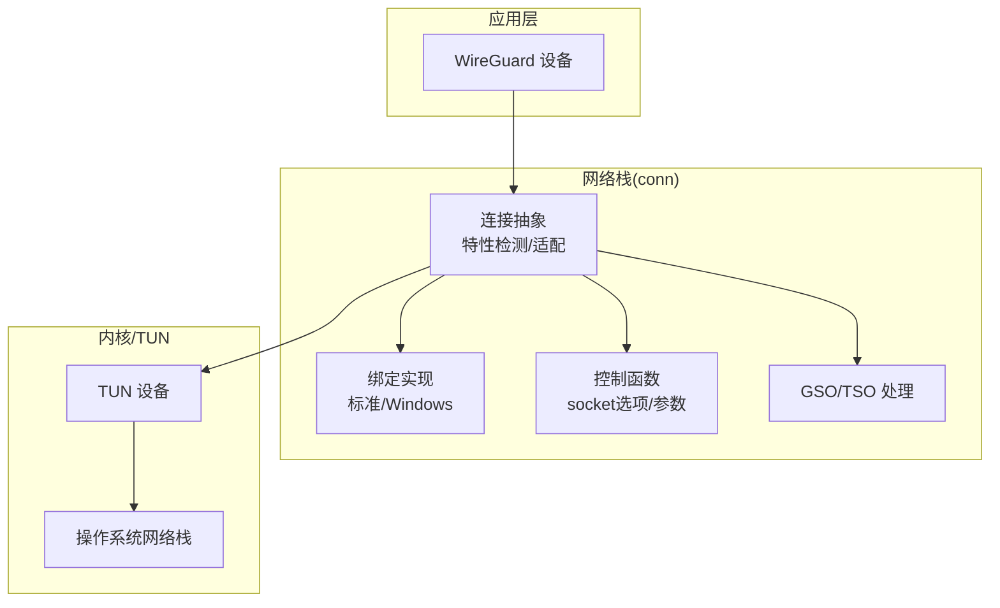
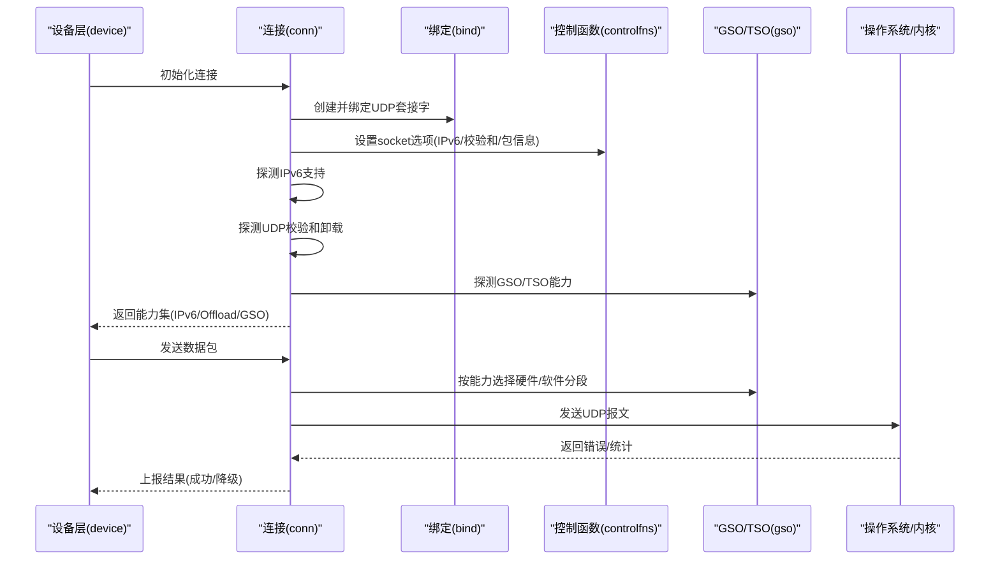
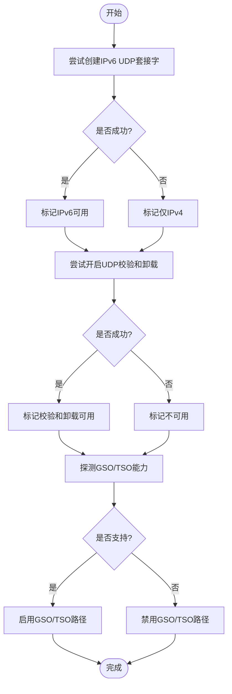
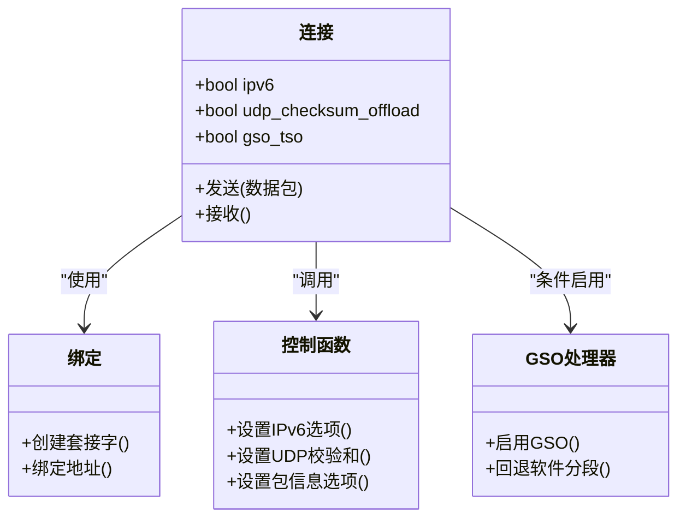
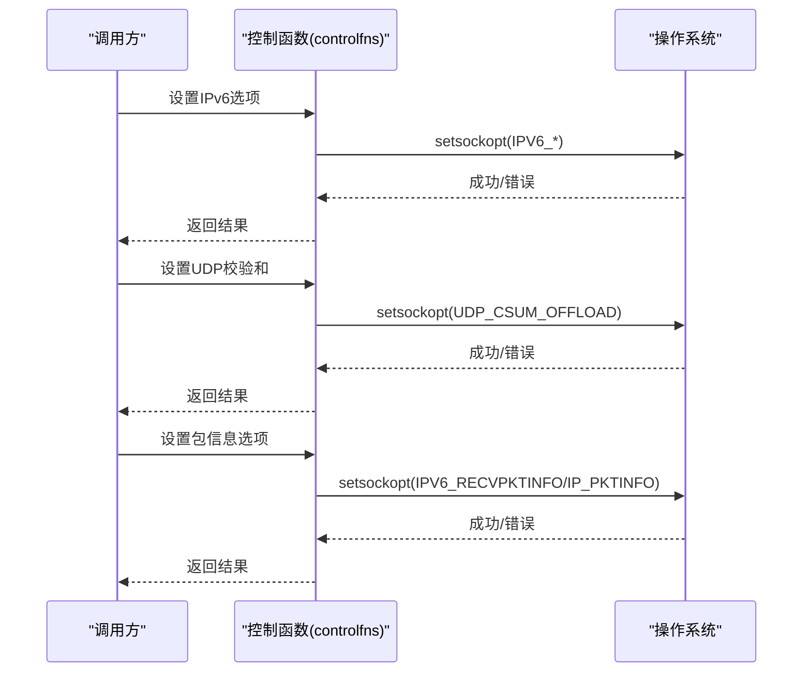
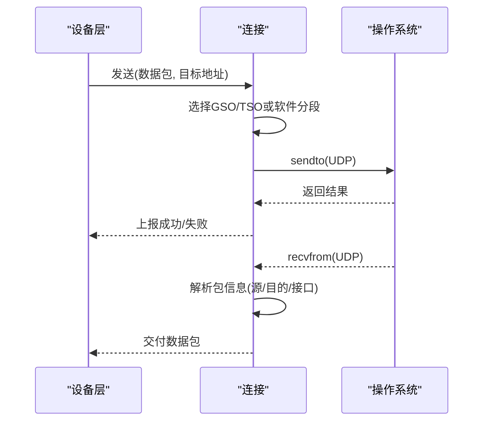
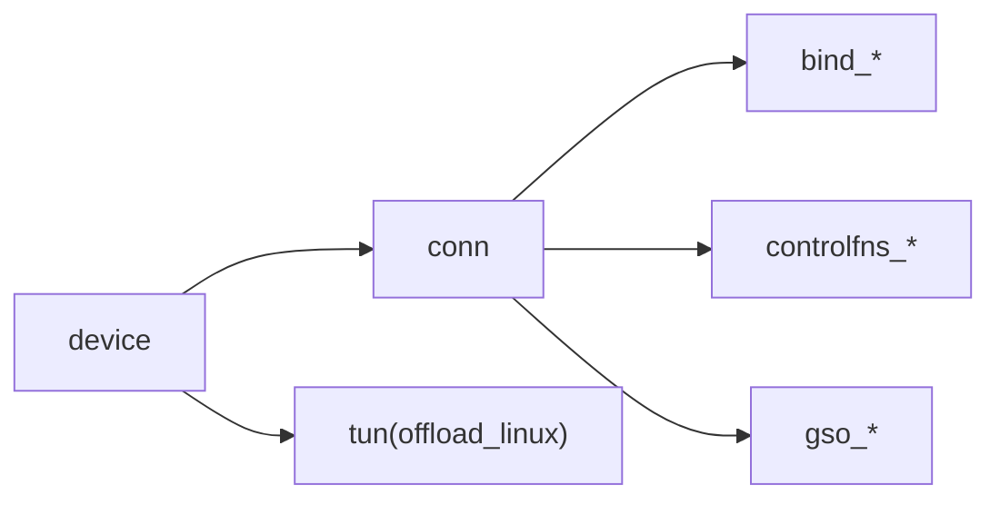

# 网络特性检测

<cite>
**本文引用的文件**
- [conn/conn.go](file://conn/conn.go)
- [conn/features_default.go](file://conn/features_default.go)
- [conn/features_linux.go](file://conn/features_linux.go)
- [conn/gso_default.go](file://conn/gso_default.go)
- [conn/gso_linux.go](file://conn/gso_linux.go)
- [conn/controlfns.go](file://conn/controlfns.go)
- [conn/controlfns_unix.go](file://conn/controlfns_unix.go)
- [conn/controlfns_linux.go](file://conn/controlfns_linux.go)
- [conn/controlfns_windows.go](file://conn/controlfns_windows.go)
- [conn/bind_std.go](file://conn/bind_std.go)
- [conn/bind_windows.go](file://conn/bind_windows.go)
- [device/device.go](file://device/device.go)
- [device/send.go](file://device/send.go)
- [device/receive.go](file://device/receive.go)
- [tun/offload_linux.go](file://tun/offload_linux.go)
</cite>

## 目录
1. [简介](#简介)
2. [项目结构](#项目结构)
3. [核心组件](#核心组件)
4. [架构总览](#架构总览)
5. [详细组件分析](#详细组件分析)
6. [依赖关系分析](#依赖关系分析)
7. [性能考量](#性能考量)
8. [故障排查指南](#故障排查指南)
9. [结论](#结论)
10. [附录：配置与扩展](#附录：配置与扩展)

## 简介
本文件系统性说明 wireguard-go 在网络栈层面的“特性检测与适配”机制，重点覆盖：
- 自动网络能力检测：IPv6 支持、UDP 校验和卸载（Checksum Offload）、GSO/TSO 等高级特性的发现过程。
- 特性适配策略：根据检测结果动态调整发送/接收路径与参数，以在可用性与性能之间取得平衡。
- 控制函数实现：用于设置 socket 选项和网络参数的统一接口，屏蔽平台差异。
- 跨平台兼容性：在不同操作系统上提供一致的行为语义。
- 诊断工具与方法：帮助定位网络环境限制与问题。
- 自定义扩展：如何在不破坏兼容性的前提下扩展新的特性检测与适配逻辑。

## 项目结构
本项目将网络特性检测与适配集中在 conn 层，并通过 device 层驱动实际收发；TUN 层在 Linux 下提供内核侧卸载能力的探测入口。关键组织方式如下：
- conn：封装 Socket 创建、绑定、特性检测、GSO/TSO 处理与控制函数。
- device：调用 conn 进行数据收发，并根据设备状态选择路径。
- tun：在 Linux 下暴露 TUN 卸载能力探测接口。

图表来源
- [conn/conn.go:1-200](file://conn/conn.go#L1-L200)
- [conn/bind_std.go:1-200](file://conn/bind_std.go#L1-L200)
- [conn/bind_windows.go:1-200](file://conn/bind_windows.go#L1-L200)
- [conn/controlfns.go:1-200](file://conn/controlfns.go#L1-L200)
- [conn/gso_default.go:1-200](file://conn/gso_default.go#L1-L200)
- [conn/gso_linux.go:1-200](file://conn/gso_linux.go#L1-L200)
- [tun/offload_linux.go:1-200](file://tun/offload_linux.go#L1-L200)

章节来源
- [conn/conn.go:1-200](file://conn/conn.go#L1-L200)
- [conn/bind_std.go:1-200](file://conn/bind_std.go#L1-L200)
- [conn/bind_windows.go:1-200](file://conn/bind_windows.go#L1-L200)
- [conn/controlfns.go:1-200](file://conn/controlfns.go#L1-L200)
- [conn/gso_default.go:1-200](file://conn/gso_default.go#L1-L200)
- [conn/gso_linux.go:1-200](file://conn/gso_linux.go#L1-L200)
- [tun/offload_linux.go:1-200](file://tun/offload_linux.go#L1-L200)

## 核心组件
- 连接抽象与特性检测（conn）：负责创建 UDP Socket、探测 IPv6、UDP 校验和卸载、GSO/TSO 能力，并缓存结果供后续使用。
- 绑定实现（bind_std / bind_windows）：针对不同平台的绑定细节，确保端口复用、地址族选择等行为一致。
- 控制函数（controlfns_*）：统一的 socket 选项设置接口，屏蔽平台差异，如关闭 Nagle、设置 IP_TOS/IPV6_TOS、IP_PKTINFO/IPV6_RECVPKTINFO、UDP 校验和开关等。
- GSO/TSO 处理（gso_*）：在 Linux 上启用或回退到软件分段；在其他平台保持默认行为。
- 设备层（device）：根据连接能力选择发送/接收路径，必要时触发重协商或降级。

章节来源
- [conn/conn.go:1-200](file://conn/conn.go#L1-L200)
- [conn/bind_std.go:1-200](file://conn/bind_std.go#L1-L200)
- [conn/bind_windows.go:1-200](file://conn/bind_windows.go#L1-L200)
- [conn/controlfns.go:1-200](file://conn/controlfns.go#L1-L200)
- [conn/controlfns_unix.go:1-200](file://conn/controlfns_unix.go#L1-L200)
- [conn/controlfns_linux.go:1-200](file://conn/controlfns_linux.go#L1-L200)
- [conn/controlfns_windows.go:1-200](file://conn/controlfns_windows.go#L1-L200)
- [conn/gso_default.go:1-200](file://conn/gso_default.go#L1-L200)
- [conn/gso_linux.go:1-200](file://conn/gso_linux.go#L1-L200)
- [device/device.go:1-200](file://device/device.go#L1-L200)

## 架构总览
下图展示了从设备层到网络栈的完整流程，包括特性检测、适配与数据路径选择。

图表来源
- [conn/conn.go:1-200](file://conn/conn.go#L1-L200)
- [conn/controlfns.go:1-200](file://conn/controlfns.go#L1-L200)
- [conn/gso_linux.go:1-200](file://conn/gso_linux.go#L1-L200)
- [device/device.go:1-200](file://device/device.go#L1-L200)

## 详细组件分析

### 自动网络能力检测
- IPv6 支持检测：通过尝试创建 IPv6 UDP 套接字并绑定，结合系统错误码判断是否可用；若失败则回退至 IPv4。
- UDP 校验和卸载检测：尝试开启 UDP 校验和卸载选项，捕获不支持的错误后记录为不可用；在后续发送中避免使用该路径。
- GSO/TSO 检测：在 Linux 上检查内核是否支持 GSO/TSO，并在发送路径中按需切换；其他平台默认不启用。

图表来源
- [conn/features_default.go:1-200](file://conn/features_default.go#L1-L200)
- [conn/features_linux.go:1-200](file://conn/features_linux.go#L1-L200)
- [conn/gso_default.go:1-200](file://conn/gso_default.go#L1-L200)
- [conn/gso_linux.go:1-200](file://conn/gso_linux.go#L1-L200)

章节来源
- [conn/features_default.go:1-200](file://conn/features_default.go#L1-L200)
- [conn/features_linux.go:1-200](file://conn/features_linux.go#L1-L200)
- [conn/gso_default.go:1-200](file://conn/gso_default.go#L1-L200)
- [conn/gso_linux.go:1-200](file://conn/gso_linux.go#L1-L200)

### 特性适配策略
- 基于检测结果动态选择发送路径：
  - 若 UDP 校验和卸载可用，则走硬件卸载路径；否则回退到软件计算校验和。
  - 若 GSO/TSO 可用，则在 Linux 上使用内核分段以减少拷贝；否则使用软件分段或直接发送。
  - 若 IPv6 不可用，则强制使用 IPv4 地址族。
- 运行时降级：当某次发送失败且指示能力不可用时，更新缓存的能力标志，后续不再尝试该路径。

图表来源
- [conn/conn.go:1-200](file://conn/conn.go#L1-L200)
- [conn/bind_std.go:1-200](file://conn/bind_std.go#L1-L200)
- [conn/controlfns.go:1-200](file://conn/controlfns.go#L1-L200)
- [conn/gso_linux.go:1-200](file://conn/gso_linux.go#L1-L200)

章节来源
- [conn/conn.go:1-200](file://conn/conn.go#L1-L200)
- [conn/bind_std.go:1-200](file://conn/bind_std.go#L1-L200)
- [conn/controlfns.go:1-200](file://conn/controlfns.go#L1-L200)
- [conn/gso_linux.go:1-200](file://conn/gso_linux.go#L1-L200)

### 控制函数的实现（socket 选项与网络参数）
- 统一接口：controlfns 提供跨平台一致的 socket 选项设置方法，内部根据目标平台调用相应实现。
- 常见选项：
  - IPv6：设置 IPV6_V6ONLY、IPV6_TOS 等。
  - UDP 校验和：根据能力开关 UDP_CSUM_OFFLOAD。
  - 包信息：设置 IPV6_RECVPKTINFO/IP_PKTINFO 以便获取入站接口信息。
  - 其他：如 IP_TOS、TCP_NODELAY（若涉及 TCP 场景）。
- 错误处理：对不支持的选项进行捕获并忽略，保证健壮性。

图表来源
- [conn/controlfns.go:1-200](file://conn/controlfns.go#L1-L200)
- [conn/controlfns_unix.go:1-200](file://conn/controlfns_unix.go#L1-L200)
- [conn/controlfns_linux.go:1-200](file://conn/controlfns_linux.go#L1-L200)
- [conn/controlfns_windows.go:1-200](file://conn/controlfns_windows.go#L1-L200)

章节来源
- [conn/controlfns.go:1-200](file://conn/controlfns.go#L1-L200)
- [conn/controlfns_unix.go:1-200](file://conn/controlfns_unix.go#L1-L200)
- [conn/controlfns_linux:1-200](file://conn/controlfns_linux.go#L1-L200)
- [conn/controlfns_windows.go:1-200](file://conn/controlfns_windows.go#L1-L200)

### 跨平台兼容性处理
- 绑定实现：
  - 标准平台：bind_std 提供通用绑定逻辑。
  - Windows：bind_windows 处理特定于 Windows 的绑定行为。
- 控制函数：
  - controlfns_unix.go：Unix-like 系统的实现。
  - controlfns_linux.go：Linux 特有选项（如 IPV6_RECVPKTINFO）。
  - controlfns_windows.go：Windows 特有选项。
- GSO/TSO：
  - gso_linux.go：仅在 Linux 启用内核 GSO/TSO。
  - gso_default.go：其他平台默认禁用或采用软件回退。

章节来源
- [conn/bind_std.go:1-200](file://conn/bind_std.go#L1-L200)
- [conn/bind_windows.go:1-200](file://conn/bind_windows.go#L1-L200)
- [conn/controlfns_unix.go:1-200](file://conn/controlfns_unix.go#L1-L200)
- [conn/controlfns_linux.go:1-200](file://conn/controlfns_linux.go#L1-L200)
- [conn/controlfns_windows.go:1-200](file://conn/controlfns_windows.go#L1-L200)
- [conn/gso_default.go:1-200](file://conn/gso_default.go#L1-L200)
- [conn/gso_linux.go:1-200](file://conn/gso_linux.go#L1-L200)

### 数据路径与设备交互
- 发送路径：
  - device 层调用 conn 发送，conn 根据能力选择 GSO/TSO 或软件分段，再写入底层 Socket。
- 接收路径：
  - 读取入站包时，利用包信息选项解析源/目的地址与接口信息，便于路由与策略匹配。

图表来源
- [device/send.go:1-200](file://device/send.go#L1-L200)
- [device/receive.go:1-200](file://device/receive.go#L1-L200)
- [conn/conn.go:1-200](file://conn/conn.go#L1-L200)

章节来源
- [device/send.go:1-200](file://device/send.go#L1-L200)
- [device/receive.go:1-200](file://device/receive.go#L1-L200)
- [conn/conn.go:1-200](file://conn/conn.go#L1-L200)

## 依赖关系分析
- conn 依赖：
  - 绑定实现（bind_std / bind_windows）
  - 控制函数（controlfns_*）
  - GSO/TSO 处理（gso_*）
- device 依赖：
  - conn 提供的连接抽象
  - tun 提供的卸载能力探测（Linux）

图表来源
- [device/device.go:1-200](file://device/device.go#L1-L200)
- [conn/conn.go:1-200](file://conn/conn.go#L1-L200)
- [tun/offload_linux.go:1-200](file://tun/offload_linux.go#L1-L200)

章节来源
- [device/device.go:1-200](file://device/device.go#L1-L200)
- [conn/conn.go:1-200](file://conn/conn.go#L1-L200)
- [tun/offload_linux.go:1-200](file://tun/offload_linux.go#L1-L200)

## 性能考量
- 优先启用硬件卸载：在支持 UDP 校验和卸载与 GSO/TSO 的环境下，显著降低 CPU 占用与内存拷贝。
- 及时降级：当检测到能力不可用或出现错误时，立即切换到软件路径，避免阻塞或重试风暴。
- 减少系统调用：通过批量发送与合理的缓冲区大小，降低系统调用开销。
- 监控与度量：建议收集发送/接收路径的选择比例与错误率，用于调优与问题定位。

[本节为通用指导，无需具体文件引用]

## 故障排查指南
- 常见问题：
  - IPv6 不可用：检查系统是否启用 IPv6 及内核模块加载情况。
  - UDP 校验和卸载失败：某些虚拟网卡或旧内核可能不支持，需回退到软件路径。
  - GSO/TSO 不可用：确认内核版本与网卡驱动支持；必要时禁用 GSO 以避免异常。
- 诊断步骤：
  - 查看连接初始化日志，确认能力检测结果。
  - 临时关闭相关特性（如 GSO），验证是否为特性导致的问题。
  - 使用抓包工具验证报文结构与字段是否符合预期。
- 参考实现：
  - 控制函数中对不支持选项的错误捕获与忽略，有助于快速定位平台差异。

章节来源
- [conn/controlfns.go:1-200](file://conn/controlfns.go#L1-L200)
- [conn/features_default.go:1-200](file://conn/features_default.go#L1-L200)
- [conn/features_linux.go:1-200](file://conn/features_linux.go#L1-L200)

## 结论
wireguard-go 的网络特性检测与适配机制通过统一的控制函数与平台特定的实现，实现了在多种操作系统上的稳定与高性能表现。自动检测 IPv6、UDP 校验和卸载与 GSO/TSO，并结合运行时降级策略，确保在不同网络环境下都能获得一致的行为。通过合理配置与扩展，可进一步提升传输效率与可靠性。

[本节为总结，无需具体文件引用]

## 附录：配置与扩展
- 自定义扩展点：
  - 新增特性检测：在 features_* 中添加探测逻辑，并在连接初始化时调用。
  - 新增 socket 选项：在 controlfns_* 中增加对应设置方法，并在连接初始化中按需调用。
  - 新增 GSO/TSO 支持：在 gso_* 中实现平台特定逻辑，并在发送路径中集成。
- 最佳实践：
  - 保持向后兼容：对新特性默认禁用，通过检测启用。
  - 错误隔离：任何新选项的设置失败不应影响整体连接建立。
  - 测试覆盖：为不同平台编写单元测试，确保行为一致。

章节来源
- [conn/features_default.go:1-200](file://conn/features_default.go#L1-L200)
- [conn/features_linux.go:1-200](file://conn/features_linux.go#L1-L200)
- [conn/controlfns.go:1-200](file://conn/controlfns.go#L1-L200)
- [conn/gso_default.go:1-200](file://conn/gso_default.go#L1-L200)
- [conn/gso_linux.go:1-200](file://conn/gso_linux.go#L1-L200)