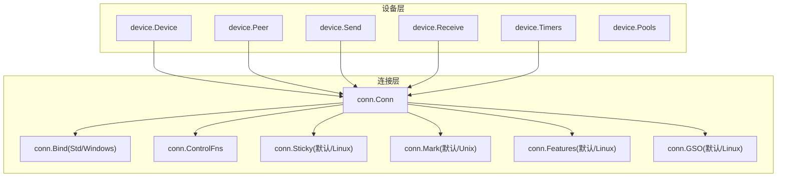
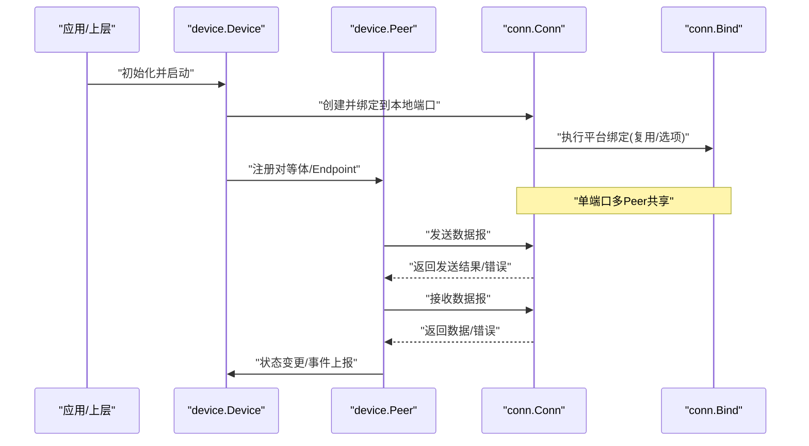
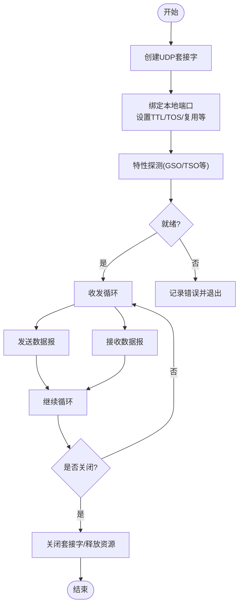
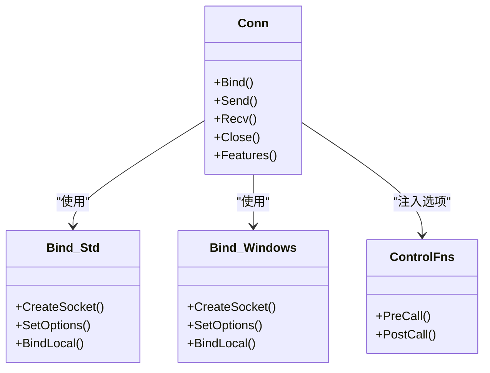
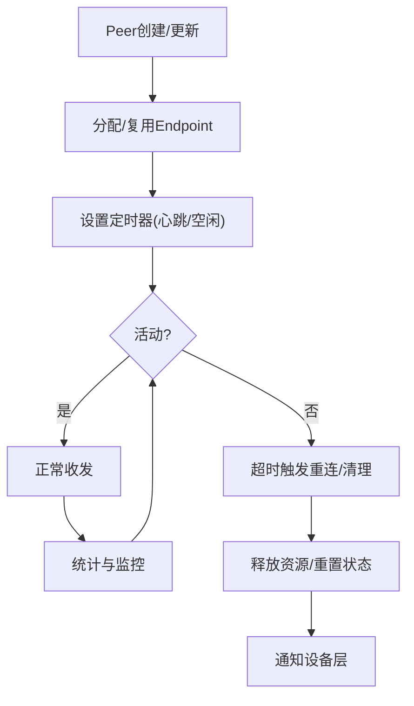
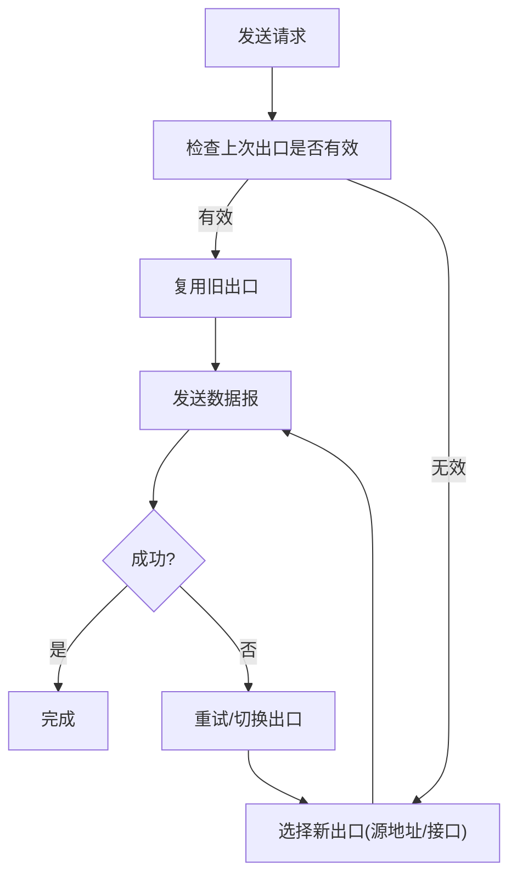
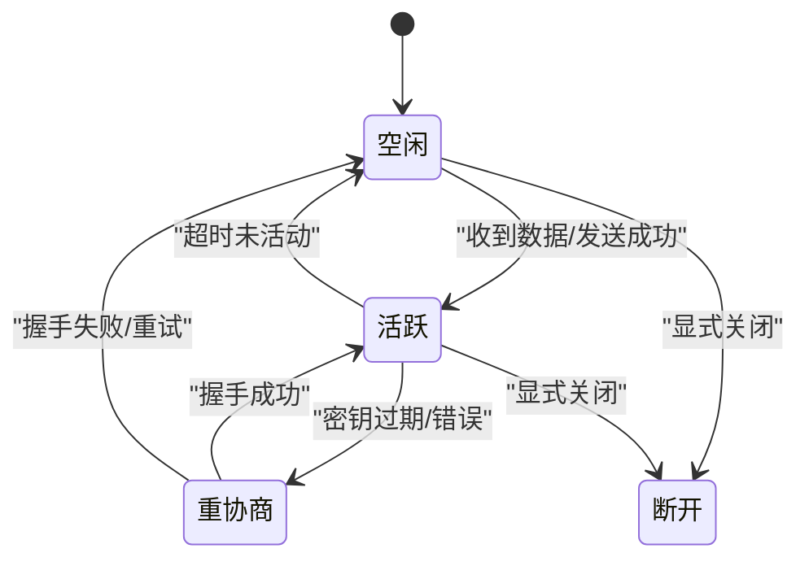
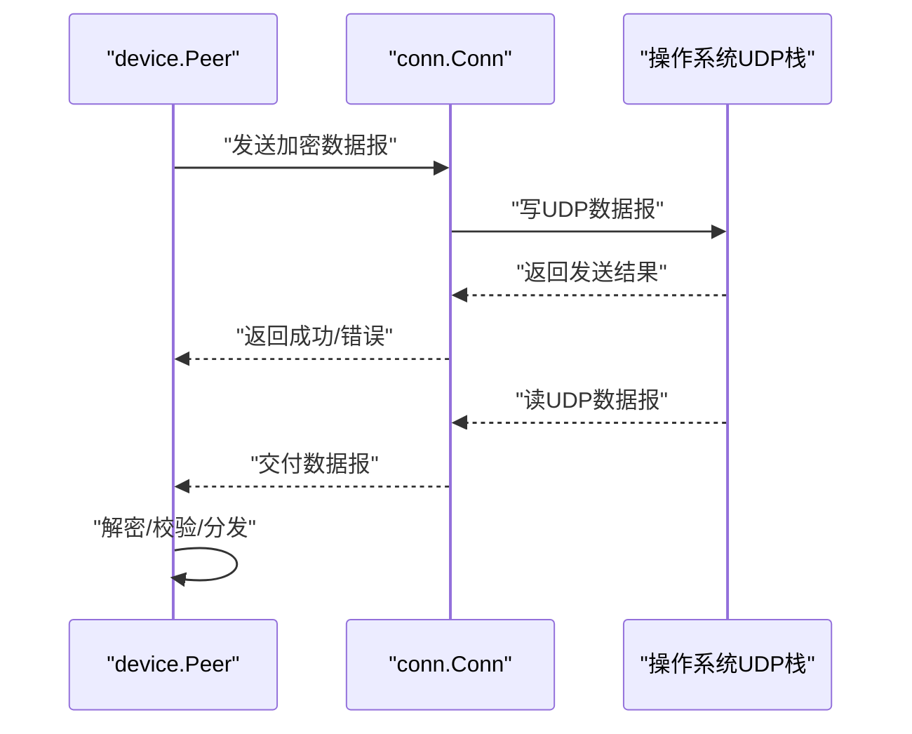
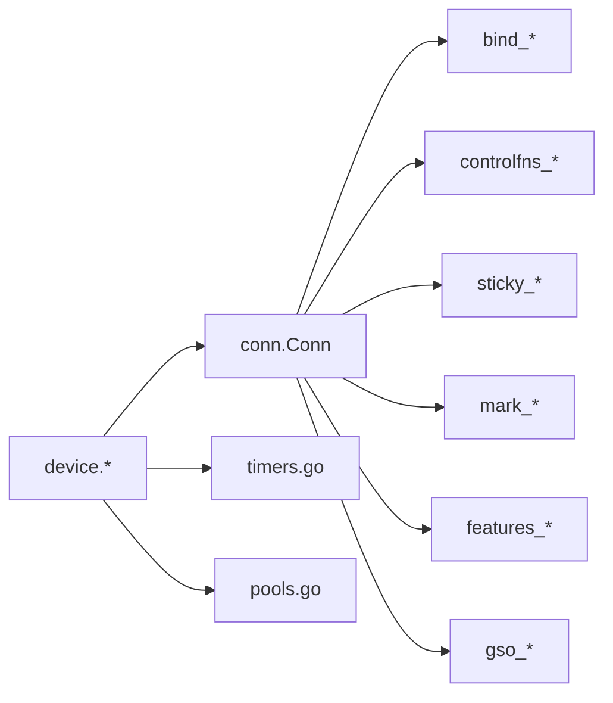

# 连接管理

<cite>
**本文引用的文件**
- [conn.go](file://conn/conn.go)
- [bind_std.go](file://conn/bind_std.go)
- [bind_windows.go](file://conn/bind_windows.go)
- [default.go](file://conn/default.go)
- [controlfns_unix.go](file://conn/controlfns_unix.go)
- [controlfns_linux.go](file://conn/controlfns_linux.go)
- [controlfns_windows.go](file://conn/controlfns_windows.go)
- [sticky_default.go](file://conn/sticky_default.go)
- [sticky_linux.go](file://conn/sticky_linux.go)
- [mark_unix.go](file://conn/mark_unix.go)
- [mark_default.go](file://conn/mark_default.go)
- [features_default.go](file://conn/features_default.go)
- [features_linux.go](file://conn/features_linux.go)
- [gso_default.go](file://conn/gso_default.go)
- [gso_linux.go](file://conn/gso_linux.go)
- [device.go](file://device/device.go)
- [peer.go](file://device/peer.go)
- [send.go](file://device/send.go)
- [receive.go](file://device/receive.go)
- [timers.go](file://device/timers.go)
- [pools.go](file://device/pools.go)
</cite>

## 目录
1. [简介](#简介)
2. [项目结构](#项目结构)
3. [核心组件](#核心组件)
4. [架构总览](#架构总览)
5. [详细组件分析](#详细组件分析)
6. [依赖关系分析](#依赖关系分析)
7. [性能考量](#性能考量)
8. [故障排查指南](#故障排查指南)
9. [结论](#结论)
10. [附录](#附录)

## 简介
本文件聚焦于 wireguard-go 的连接管理，围绕 UDP 连接的建立、维护与销毁展开，重点说明：
- 绑定到本地地址与端口的实现细节（跨平台差异）
- 连接池管理策略（复用、超时、资源清理）
- 多网卡环境下的连接选择算法与负载均衡
- 连接状态管理与故障恢复流程
- 连接监控指标与性能调优建议
- 最佳实践与常见问题解决方案

## 项目结构
连接管理主要分布在 conn 与 device 两个子模块中：
- conn：封装底层网络套接字操作，提供统一的 UDP 绑定、收发、特性探测、标记、粘滞路由等能力。
- device：在协议层组织对等体（Peer）、定时器、发送/接收队列、连接生命周期管理等。

图表来源
- [device.go:1-200](file://device/device.go#L1-L200)
- [conn.go:1-200](file://conn/conn.go#L1-L200)
- [bind_std.go:1-200](file://conn/bind_std.go#L1-L200)
- [bind_windows.go:1-200](file://conn/bind_windows.go#L1-L200)

章节来源
- [conn.go:1-200](file://conn/conn.go#L1-L200)
- [device.go:1-200](file://device/device.go#L1-L200)

## 核心组件
- 连接抽象（conn.Conn）：统一封装 UDP 套接字的创建、绑定、发送、接收、关闭与特性查询。
- 绑定器（Bind）：按平台实现具体绑定逻辑（标准库/Windows），支持端口复用、多播、TTL/TOS 等选项设置。
- 控制函数（ControlFns）：在系统调用前后注入自定义行为（如 setsockopt）。
- 粘滞路由（Sticky）：在多网卡环境下保持会话的粘滞性（基于源地址/接口）。
- 标记（Mark）：为数据包设置标记位，用于路由或防火墙策略。
- 特性探测（Features）：探测内核/驱动能力（如 GSO、TSO、UDP GRO 等）。
- GSO 支持：按需启用分段卸载以提升吞吐。

章节来源
- [conn.go:1-200](file://conn/conn.go#L1-L200)
- [bind_std.go:1-200](file://conn/bind_std.go#L1-L200)
- [bind_windows.go:1-200](file://conn/bind_windows.go#L1-L200)
- [controlfns_unix.go:1-200](file://conn/controlfns_unix.go#L1-L200)
- [controlfns_linux.go:1-200](file://conn/controlfns_linux.go#L1-L200)
- [controlfns_windows.go:1-200](file://conn/controlfns_windows.go#L1-L200)
- [sticky_default.go:1-200](file://conn/sticky_default.go#L1-L200)
- [sticky_linux.go:1-200](file://conn/sticky_linux.go#L1-L200)
- [mark_unix.go:1-200](file://conn/mark_unix.go#L1-L200)
- [mark_default.go:1-200](file://conn/mark_default.go#L1-L200)
- [features_default.go:1-200](file://conn/features_default.go#L1-L200)
- [features_linux.go:1-200](file://conn/features_linux.go#L1-L200)
- [gso_default.go:1-200](file://conn/gso_default.go#L1-L200)
- [gso_linux.go:1-200](file://conn/gso_linux.go#L1-L200)

## 架构总览
WireGuard 使用“单监听端口 + 多 Peer”的模型：一个 Conn 绑定到一个 UDP 端口，所有 Peer 共享该端口进行收发；每个 Peer 维护自己的 Endpoint、计时器与状态机。连接的生命周期由设备层驱动，连接层负责 I/O 与系统特性。

图表来源
- [device.go:1-200](file://device/device.go#L1-L200)
- [conn.go:1-200](file://conn/conn.go#L1-L200)
- [bind_std.go:1-200](file://conn/bind_std.go#L1-L200)
- [bind_windows.go:1-200](file://conn/bind_windows.go#L1-L200)

## 详细组件分析

### UDP 连接的建立、维护与销毁
- 建立
  - 设备层在启动时创建并绑定一个 UDP 套接字到指定本地端口，供所有 Peer 共享。
  - 绑定阶段通过 ControlFns 注入系统级选项（如 TTL、TOS、端口复用等），并按平台差异处理。
  - 特性探测决定后续优化路径（如 GSO、TSO）。
- 维护
  - 发送：Peer 将加密后的数据报交给 Conn 发送；Conn 根据目标 Endpoint 选择出口（可结合 Sticky 策略）。
  - 接收：Conn 从绑定端口读取数据报，交由设备层解析源地址并分发给对应 Peer。
  - 粘滞路由：在多网卡环境中，优先复用已有出口，避免频繁切换导致的路由抖动。
- 销毁
  - 设备关闭时释放 Conn，关闭底层套接字，停止相关协程与定时器。
  - Peer 移除时清理其计时器、队列与缓存。

图表来源
- [conn.go:1-200](file://conn/conn.go#L1-L200)
- [bind_std.go:1-200](file://conn/bind_std.go#L1-L200)
- [bind_windows.go:1-200](file://conn/bind_windows.go#L1-L200)
- [features_default.go:1-200](file://conn/features_default.go#L1-L200)
- [gso_default.go:1-200](file://conn/gso_default.go#L1-L200)

章节来源
- [conn.go:1-200](file://conn/conn.go#L1-L200)
- [bind_std.go:1-200](file://conn/bind_std.go#L1-L200)
- [bind_windows.go:1-200](file://conn/bind_windows.go#L1-L200)
- [features_default.go:1-200](file://conn/features_default.go#L1-L200)
- [gso_default.go:1-200](file://conn/gso_default.go#L1-L200)

### 绑定到本地地址和端口的实现细节
- 标准库绑定（bind_std）
  - 使用标准库创建 UDP 连接，支持绑定到特定本地 IP:Port。
  - 通过 ControlFns 注入 setsockopt 参数（如 SO_REUSEPORT、IP_TTL、IP_TOS）。
  - 处理多播、广播、环回等场景。
- Windows 绑定（bind_windows）
  - 针对 Windows 平台的 socket API 进行适配，处理端口复用、TTL/TOS、缓冲区大小等。
  - 兼容 Windows 特有的错误码与行为。
- 控制函数（ControlFns）
  - 在系统调用前后钩入，便于统一设置套接字选项或统计计数。
  - 不同平台提供差异化实现（Linux/Unix/Windows）。

图表来源
- [conn.go:1-200](file://conn/conn.go#L1-L200)
- [bind_std.go:1-200](file://conn/bind_std.go#L1-L200)
- [bind_windows.go:1-200](file://conn/bind_windows.go#L1-L200)
- [controlfns_unix.go:1-200](file://conn/controlfns_unix.go#L1-L200)
- [controlfns_linux.go:1-200](file://conn/controlfns_linux.go#L1-L200)
- [controlfns_windows.go:1-200](file://conn/controlfns_windows.go#L1-L200)

章节来源
- [bind_std.go:1-200](file://conn/bind_std.go#L1-L200)
- [bind_windows.go:1-200](file://conn/bind_windows.go#L1-L200)
- [controlfns_unix.go:1-200](file://conn/controlfns_unix.go#L1-L200)
- [controlfns_linux:1-200](file://conn/controlfns_linux.go#L1-L200)
- [controlfns_windows.go:1-200](file://conn/controlfns_windows.go#L1-L200)

### 连接池管理策略（复用、超时、资源清理）
- 连接复用
  - 采用“单监听端口 + 多 Peer”的模式，所有 Peer 共享同一底层 UDP 套接字，避免重复绑定端口带来的资源浪费。
  - 通过 Endpoint 区分不同远端，结合粘滞路由减少不必要的出口切换。
- 超时处理
  - 每个 Peer 维护心跳与空闲超时计时器，长时间无活动则触发重协商或清理。
  - 发送失败或接收异常时，依据重试策略与退避机制恢复。
- 资源清理
  - 设备关闭时统一释放 Conn、关闭套接字、停止协程与定时器。
  - Peer 移除时清理队列、缓存与关联资源，防止泄漏。

图表来源
- [device.go:1-200](file://device/device.go#L1-L200)
- [peer.go:1-200](file://device/peer.go#L1-L200)
- [timers.go:1-200](file://device/timers.go#L1-L200)
- [pools.go:1-200](file://device/pools.go#L1-L200)

章节来源
- [device.go:1-200](file://device/device.go#L1-L200)
- [peer.go:1-200](file://device/peer.go#L1-L200)
- [timers.go:1-200](file://device/timers.go#L1-L200)
- [pools.go:1-200](file://device/pools.go#L1-L200)

### 多网卡环境下的连接选择算法与负载均衡
- 粘滞路由（Sticky）
  - 优先复用上一次成功发送的出口（基于源地址/接口），降低路由切换导致的丢包与延迟波动。
  - 当检测到链路变化或失败时，动态切换到新的可用出口。
- 负载均衡
  - 当前实现以稳定性优先，不主动做轮询式负载分担；可通过外部策略（如多实例或多进程）实现横向扩展。
  - 结合 Mark 与路由表策略，可将不同流量导向不同出口。

图表来源
- [sticky_default.go:1-200](file://conn/sticky_default.go#L1-L200)
- [sticky_linux.go:1-200](file://conn/sticky_linux.go#L1-L200)
- [mark_unix.go:1-200](file://conn/mark_unix.go#L1-L200)
- [mark_default.go:1-200](file://conn/mark_default.go#L1-L200)

章节来源
- [sticky_default.go:1-200](file://conn/sticky_default.go#L1-L200)
- [sticky_linux.go:1-200](file://conn/sticky_linux.go#L1-L200)
- [mark_unix.go:1-200](file://conn/mark_unix.go#L1-L200)
- [mark_default.go:1-200](file://conn/mark_default.go#L1-L200)

### 连接状态管理与故障恢复流程
- 状态管理
  - Peer 维护连接状态（空闲、活跃、重协商、断开等），由定时器与事件驱动转换。
  - 设备层聚合各 Peer 状态，对外暴露健康信息与统计。
- 故障恢复
  - 发送失败：记录错误、触发重试与退避，必要时切换出口或重新握手。
  - 接收异常：丢弃损坏报文，记录统计，继续监听。
  - 超时：触发重协商或清理，等待新密钥材料或重建通道。

图表来源
- [device.go:1-200](file://device/device.go#L1-L200)
- [peer.go:1-200](file://device/peer.go#L1-L200)
- [timers.go:1-200](file://device/timers.go#L1-L200)

章节来源
- [device.go:1-200](file://device/device.go#L1-L200)
- [peer.go:1-200](file://device/peer.go#L1-L200)
- [timers.go:1-200](file://device/timers.go#L1-L200)

### 发送与接收流程（与连接管理的交互）
- 发送
  - Peer 组装加密数据报，调用 Conn 发送；若失败则进入重试/切换逻辑。
- 接收
  - Conn 从绑定端口读取数据报，设备层解析源地址并分发至对应 Peer；校验失败则丢弃并统计。

图表来源
- [send.go:1-200](file://device/send.go#L1-L200)
- [receive.go:1-200](file://device/receive.go#L1-L200)
- [conn.go:1-200](file://conn/conn.go#L1-L200)

章节来源
- [send.go:1-200](file://device/send.go#L1-L200)
- [receive.go:1-200](file://device/receive.go#L1-L200)
- [conn.go:1-200](file://conn/conn.go#L1-L200)

## 依赖关系分析
- 设备层依赖连接层提供的统一 I/O 抽象，屏蔽平台差异。
- 连接层依赖平台绑定实现与控制函数，注入系统选项与特性探测。
- 粘滞路由与标记功能增强多网卡与策略路由能力。
- 定时器与队列支撑连接状态机与背压控制。

图表来源
- [device.go:1-200](file://device/device.go#L1-L200)
- [conn.go:1-200](file://conn/conn.go#L1-L200)
- [bind_std.go:1-200](file://conn/bind_std.go#L1-L200)
- [bind_windows.go:1-200](file://conn/bind_windows.go#L1-L200)
- [controlfns_unix.go:1-200](file://conn/controlfns_unix.go#L1-L200)
- [sticky_default.go:1-200](file://conn/sticky_default.go#L1-L200)
- [mark_unix.go:1-200](file://conn/mark_unix.go#L1-L200)
- [features_default.go:1-200](file://conn/features_default.go#L1-L200)
- [gso_default.go:1-200](file://conn/gso_default.go#L1-L200)

章节来源
- [device.go:1-200](file://device/device.go#L1-L200)
- [conn.go:1-200](file://conn/conn.go#L1-L200)

## 性能考量
- 启用 GSO/TSO：在支持的内核/驱动上开启分段卸载，提升吞吐与降低 CPU 占用。
- 合理设置缓冲区：根据带宽与延迟调整发送/接收缓冲区大小，避免拥塞或丢包。
- 粘滞路由：减少路由切换带来的抖动，提高稳定性。
- 定时器调优：平衡心跳频率与资源消耗，避免频繁重协商。
- 监控指标：关注发送/接收速率、错误率、重传次数、超时次数、队列长度、内存占用等。

[本节为通用指导，不直接分析具体文件]

## 故障排查指南
- 无法绑定端口
  - 检查端口占用与权限；确认平台复用的正确配置。
- 发送失败/高丢包
  - 查看错误类型与重试策略；检查 MTU、GSO/TSO 兼容性；评估网络质量。
- 频繁切换出口
  - 调整粘滞策略阈值；检查路由与 ARP 表；确认多网卡配置。
- 内存/CPU 占用过高
  - 检查队列长度与定时器频率；评估 GSO/TSO 是否启用；限制并发 Peer 数量。
- 日志与统计
  - 收集连接层与设备层的关键指标；定位异常时间点与上下文。

章节来源
- [conn.go:1-200](file://conn/conn.go#L1-L200)
- [device.go:1-200](file://device/device.go#L1-L200)
- [send.go:1-200](file://device/send.go#L1-L200)
- [receive.go:1-200](file://device/receive.go#L1-L200)
- [timers.go:1-200](file://device/timers.go#L1-L200)

## 结论
wireguard-go 的连接管理以“单端口多 Peer”为核心，通过统一的连接抽象与平台适配，实现了高效的 UDP 通信。粘滞路由与特性探测提升了多网卡环境与高性能场景的稳定性与吞吐。通过合理的定时器、队列与资源管理策略，系统在复杂网络条件下仍能保持稳定运行。建议在生产环境中结合监控指标与平台特性持续调优。

[本节为总结，不直接分析具体文件]

## 附录
- 最佳实践
  - 明确 MTU 与分片策略，避免过度分片。
  - 启用 GSO/TSO 以获得更好性能（需验证平台支持）。
  - 合理设置心跳与空闲超时，平衡实时性与资源消耗。
  - 在多网卡环境中利用粘滞路由与标记策略稳定出口。
- 常见问题
  - 端口冲突：确保唯一绑定或使用端口复用。
  - 路由环路：检查路由表与策略路由配置。
  - 防火墙拦截：放行 UDP 端口与必要协议。
  - 性能瓶颈：关注队列长度、CPU 与内存使用，适时扩容或限流。

[本节为补充信息，不直接分析具体文件]