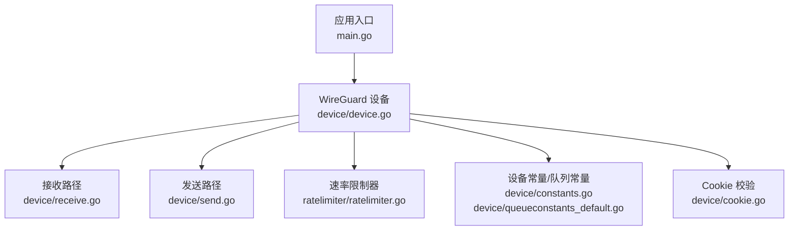
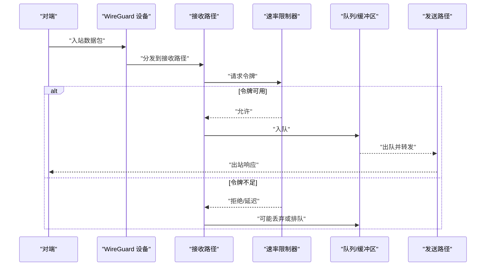
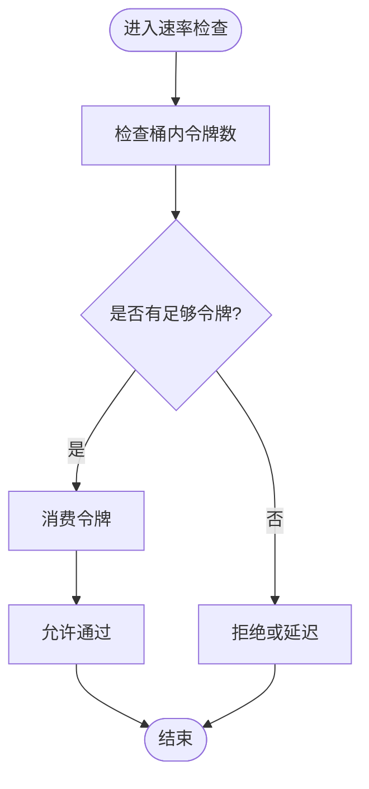
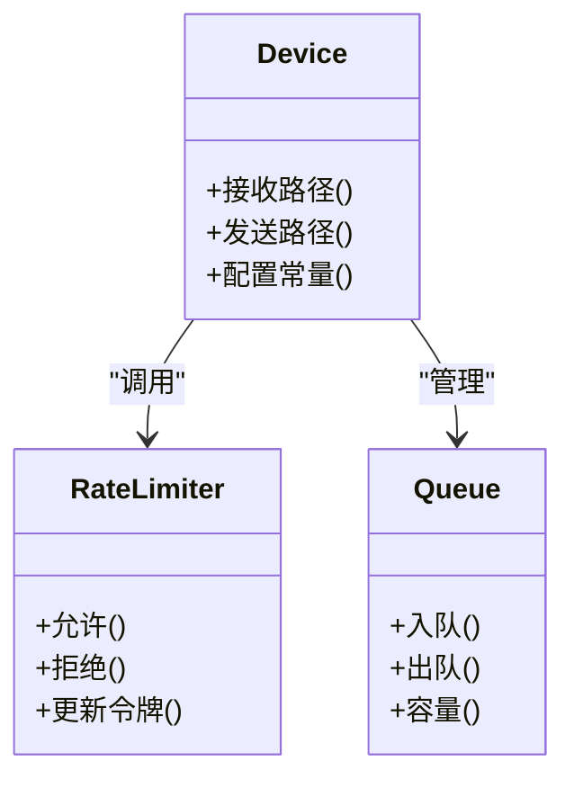
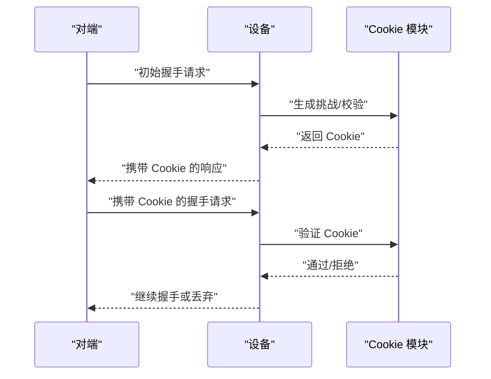
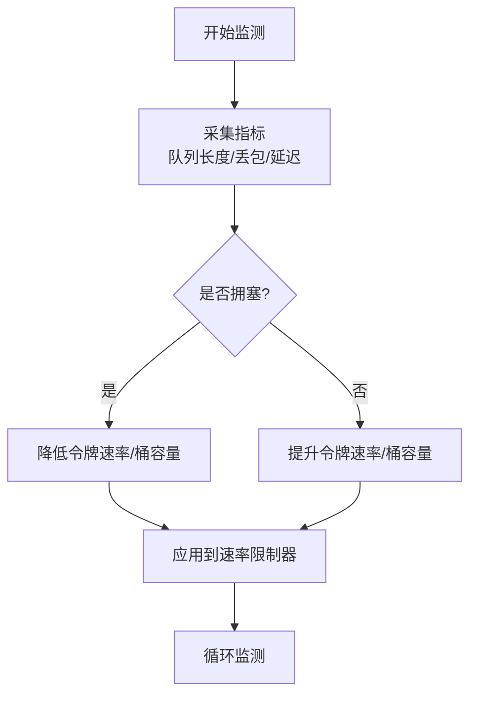
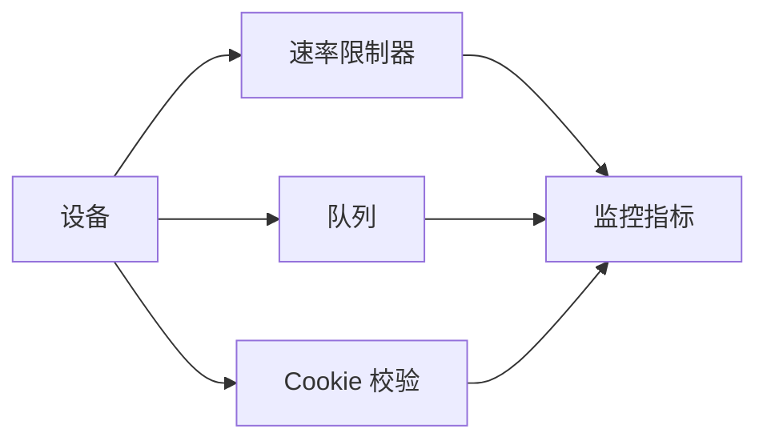

# 速率限制

<cite>
**本文引用的文件**
- [ratelimiter.go](file://ratelimiter/ratelimiter.go)
- [ratelimiter_test.go](file://ratelimiter/ratelimiter_test.go)
- [device.go](file://device/device.go)
- [receive.go](file://device/receive.go)
- [send.go](file://device/send.go)
- [constants.go](file://device/constants.go)
- [queueconstants_default.go](file://device/queueconstants_default.go)
- [cookie.go](file://device/cookie.go)
- [main.go](file://main.go)
</cite>

## 目录
1. [简介](#简介)
2. [项目结构](#项目结构)
3. [核心组件](#核心组件)
4. [架构总览](#架构总览)
5. [详细组件分析](#详细组件分析)
6. [依赖关系分析](#依赖关系分析)
7. [性能考量](#性能考量)
8. [故障排查指南](#故障排查指南)
9. [结论](#结论)
10. [附录](#附录)

## 简介
本文件聚焦于 wireguard-go 中的“速率限制”能力，围绕令牌桶算法的实现原理、配置参数、突发处理与公平性保证展开，并结合 WireGuard 设备层对网络流量的控制点，说明如何防护常见攻击（如 SYN Flood、UDP Flood）以及如何进行动态速率调整。文档还涵盖监控统计、告警机制、不同场景的配置建议与最佳实践，以及效果测试与验证方法。

## 项目结构
仓库中与速率限制直接相关的代码位于 ratelimiter 包，并在 device 层被集成到收发流程中；同时，设备常量与队列常量提供默认阈值与容量，cookie 机制用于缓解握手风暴等攻击。

图表来源
- [main.go:1-200](file://main.go#L1-L200)
- [device.go:1-200](file://device/device.go#L1-L200)
- [receive.go:1-200](file://device/receive.go#L1-L200)
- [send.go:1-200](file://device/send.go#L1-L200)
- [ratelimiter.go:1-200](file://ratelimiter/ratelimiter.go#L1-L200)
- [constants.go:1-200](file://device/constants.go#L1-L200)
- [queueconstants_default.go:1-200](file://device/queueconstants_default.go#L1-L200)
- [cookie.go:1-200](file://device/cookie.go#L1-L200)

章节来源
- [main.go:1-200](file://main.go#L1-L200)
- [device.go:1-200](file://device/device.go#L1-L200)
- [ratelimiter.go:1-200](file://ratelimiter/ratelimiter.go#L1-L200)

## 核心组件
- 令牌桶实现：基于时间驱动的令牌生成与消费模型，支持固定速率与突发容量，提供原子化的允许/拒绝判定接口。
- 设备层集成：在接收与发送路径中对数据包进行限速判断，结合队列容量与丢弃策略，避免拥塞扩散。
- Cookie 校验：在握手阶段引入随机挑战，降低资源消耗型攻击（如 SYN Flood、UDP Flood）的影响。
- 常量与队列：通过设备常量与队列常量定义默认速率、缓冲大小与丢弃阈值，支撑稳定运行。

章节来源
- [ratelimiter.go:1-200](file://ratelimiter/ratelimiter.go#L1-L200)
- [device.go:1-200](file://device/device.go#L1-L200)
- [constants.go:1-200](file://device/constants.go#L1-L200)
- [queueconstants_default.go:1-200](file://device/queueconstants_default.go#L1-L200)
- [cookie.go:1-200](file://device/cookie.go#L1-L200)

## 架构总览
下图展示了速率限制在 WireGuard 设备中的位置与数据流：入站流量经接收路径进入，出站流量经发送路径发出，两者均受令牌桶与队列容量约束；握手阶段由 Cookie 校验保护。

图表来源
- [receive.go:1-200](file://device/receive.go#L1-L200)
- [send.go:1-200](file://device/send.go#L1-L200)
- [ratelimiter.go:1-200](file://ratelimiter/ratelimiter.go#L1-L200)

## 详细组件分析

### 令牌桶算法与实现要点
- 基本原理：以固定速率向桶中添加令牌，每个数据包消费一个或多个令牌；当桶为空时，新请求将被拒绝或延迟，从而实现平滑的速率控制。
- 关键特性：
  - 速率控制：通过单位时间内生成的令牌数限制长期平均吞吐。
  - 突发处理：桶容量允许短时突发超过平均速率，但受限于最大令牌数。
  - 公平性：按请求粒度分配令牌，避免单一流独占带宽。
- 复杂度：单次判定的时间与空间开销为常数级，适合高吞吐场景。

图表来源
- [ratelimiter.go:1-200](file://ratelimiter/ratelimiter.go#L1-L200)

章节来源
- [ratelimiter.go:1-200](file://ratelimiter/ratelimiter.go#L1-L200)

### 设备层集成与流量控制
- 接收路径：对入站数据包进行速率检查，结合队列容量决定是否入队或丢弃，防止内存耗尽。
- 发送路径：对出站数据包进行速率检查，避免发送侧拥塞导致丢包放大。
- 队列与常量：使用设备常量与队列常量定义默认阈值，确保在不同平台上的稳定行为。

图表来源
- [device.go:1-200](file://device/device.go#L1-L200)
- [ratelimiter.go:1-200](file://ratelimiter/ratelimiter.go#L1-L200)
- [constants.go:1-200](file://device/constants.go#L1-L200)
- [queueconstants_default.go:1-200](file://device/queueconstants_default.go#L1-L200)

章节来源
- [device.go:1-200](file://device/device.go#L1-L200)
- [receive.go:1-200](file://device/receive.go#L1-L200)
- [send.go:1-200](file://device/send.go#L1-L200)
- [constants.go:1-200](file://device/constants.go#L1-L200)
- [queueconstants_default.go:1-200](file://device/queueconstants_default.go#L1-L200)

### Cookie 校验与握手保护
- 目的：在握手阶段引入随机挑战，增加伪造成本，缓解 SYN Flood、UDP Flood 等资源消耗型攻击。
- 机制：对首次握手请求计算并返回 Cookie，后续请求需携带有效 Cookie 方可继续处理。
- 效果：显著降低恶意洪泛对 CPU/内存的占用，提高系统鲁棒性。

图表来源
- [cookie.go:1-200](file://device/cookie.go#L1-L200)

章节来源
- [cookie.go:1-200](file://device/cookie.go#L1-L200)

### 动态速率调整机制
- 触发条件：根据网络状况（丢包率、RTT）与负载情况（队列长度、CPU 使用率）动态调整令牌生成速率与桶容量。
- 调整策略：
  - 拥塞检测：队列持续满载或丢包上升时降低速率。
  - 恢复策略：拥塞解除后逐步提升速率，避免震荡。
  - 自适应窗口：根据历史吞吐与延迟反馈调整突发上限。
- 目标：在高负载下保持稳定性，在空闲时充分利用带宽。

[此图为概念性流程图，不直接映射具体源码文件]

### 监控与统计、告警
- 指标采集：记录允许/拒绝计数、队列长度、丢包率、平均延迟、峰值吞吐等。
- 可视化与导出：将指标暴露给监控系统（如 Prometheus），便于绘制趋势图与容量规划。
- 告警规则：
  - 拒绝率突增：可能遭遇攻击或拥塞。
  - 队列持续满载：需要扩容或限流。
  - 延迟飙升：链路质量下降或资源争用。
- 联动处置：触发自动降速、切换备用链路或通知运维。

[本节为通用指导，不直接引用具体源码文件]

### 针对不同攻击类型的防护策略
- SYN Flood：
  - 启用 Cookie 校验，增加伪造握手成本。
  - 限制每秒握手尝试次数，超出则延迟或丢弃。
  - 结合队列容量限制，防止内存耗尽。
- UDP Flood：
  - 在接收路径进行速率限制，限制单位时间内的数据包数量。
  - 对异常源地址进行临时封禁或降权。
  - 监控丢包与队列深度，及时告警。
- 其他 DDoS：
  - 多维度限流：按源 IP、端口、协议组合限制。
  - 弹性扩容：在云环境中自动扩展资源，配合限流保持稳定。

[本节为通用指导，不直接引用具体源码文件]

### 配置建议与最佳实践
- 基础配置：
  - 设置合理的令牌速率与桶容量，匹配业务带宽与突发需求。
  - 合理设置队列容量，避免过大导致延迟，过小影响吞吐。
- 动态调优：
  - 开启自适应调整，依据监控指标自动优化。
  - 定期回顾指标，校准阈值。
- 安全加固：
  - 启用 Cookie 校验，限制握手频率。
  - 对可疑源实施临时限制或黑名单。
- 可观测性：
  - 暴露关键指标，建立告警规则。
  - 记录限流决策日志，便于审计与回溯。

[本节为通用指导，不直接引用具体源码文件]

### 效果测试与验证方法
- 基准测试：
  - 使用压测工具模拟正常与突发流量，观察吞吐与延迟变化。
  - 对比开启/关闭限速的效果，验证是否符合预期。
- 攻击模拟：
  - 模拟 SYN Flood、UDP Flood，验证 Cookie 校验与限速的有效性。
  - 检查队列深度、丢包率与 CPU 使用率是否可控。
- 回归验证：
  - 在变更配置后重复测试，确保稳定性。
  - 结合监控面板确认无异常波动。

[本节为通用指导，不直接引用具体源码文件]

## 依赖关系分析
- 组件耦合：
  - 设备层依赖速率限制器进行流量控制，依赖队列管理缓冲与丢弃。
  - Cookie 模块与设备握手流程紧密耦合，提供握手保护。
- 外部依赖：
  - 操作系统网络栈与驱动，影响队列与丢包行为。
  - 监控与告警系统，用于指标采集与处置。
- 潜在风险：
  - 过度限流可能导致业务抖动，需平衡吞吐与稳定性。
  - 队列过大引发延迟，需结合 RTT 与丢包调整。

图表来源
- [device.go:1-200](file://device/device.go#L1-L200)
- [ratelimiter.go:1-200](file://ratelimiter/ratelimiter.go#L1-L200)
- [queueconstants_default.go:1-200](file://device/queueconstants_default.go#L1-L200)
- [cookie.go:1-200](file://device/cookie.go#L1-L200)

章节来源
- [device.go:1-200](file://device/device.go#L1-L200)
- [ratelimiter.go:1-200](file://ratelimiter/ratelimiter.go#L1-L200)
- [queueconstants_default.go:1-200](file://device/queueconstants_default.go#L1-L200)
- [cookie.go:1-200](file://device/cookie.go#L1-L200)

## 性能考量
- 时间复杂度：令牌桶判定为 O(1)，适合高并发场景。
- 空间复杂度：队列容量决定内存占用，需根据业务峰值与延迟要求设定。
- 吞吐与延迟权衡：增大桶容量可提升突发吞吐，但可能增加延迟；需结合监控调优。
- CPU 使用：高频限流与队列操作会增加 CPU 开销，应评估系统资源。

[本节为通用指导，不直接引用具体源码文件]

## 故障排查指南
- 常见问题：
  - 吞吐骤降：检查令牌速率与桶容量是否过低，队列是否持续满载。
  - 延迟升高：检查队列长度与丢包率，必要时降低速率或扩容。
  - 握手失败：检查 Cookie 校验逻辑与握手频率限制。
- 定位步骤：
  - 查看监控指标：拒绝率、队列深度、丢包率、延迟。
  - 核对配置：速率、容量、队列阈值是否合理。
  - 复现实验：使用压测工具验证配置效果。
- 处置建议：
  - 动态调整速率与容量，恢复服务。
  - 针对攻击源实施临时限制或封禁。
  - 升级或扩容资源，提升承载能力。

[本节为通用指导，不直接引用具体源码文件]

## 结论
wireguard-go 的速率限制通过令牌桶算法在设备层实现对入站与出站流量的精细控制，结合 Cookie 校验与队列管理，有效缓解多种 DDoS 攻击。通过动态调整与完善的监控告警，可在不同网络与负载条件下保持稳定性与可用性。建议在生产环境中结合业务特征进行阈值调优，并持续跟踪指标以优化体验。

## 附录
- 术语解释：
  - 令牌桶：一种流量整形算法，通过令牌控制速率与突发。
  - 队列容量：缓冲区大小，影响吞吐与延迟。
  - Cookie 校验：握手阶段的随机挑战机制，用于防抖与防攻击。
- 参考文件：
  - 速率限制器实现与测试：[ratelimiter.go](file://ratelimiter/ratelimiter.go), [ratelimiter_test.go](file://ratelimiter/ratelimiter_test.go)
  - 设备层集成与常量：[device.go](file://device/device.go), [constants.go](file://device/constants.go), [queueconstants_default.go](file://device/queueconstants_default.go)
  - 握手保护：[cookie.go](file://device/cookie.go)
  - 应用入口：[main.go](file://main.go)