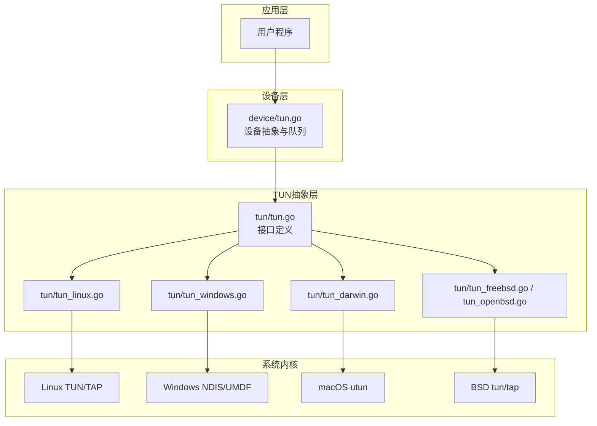
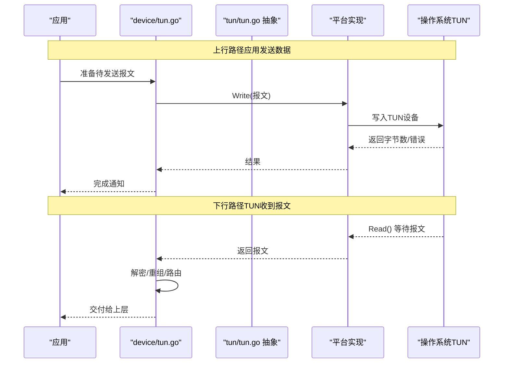
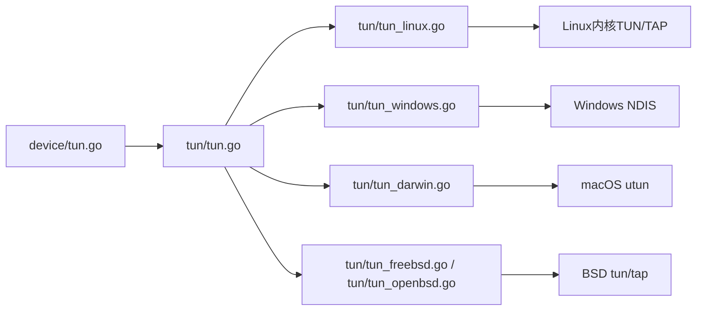

# TUN接口设计

<cite>
**本文引用的文件**
- [tun/tun.go](file://tun/tun.go)
- [tun/tun_linux.go](file://tun/tun_linux.go)
- [tun/tun_windows.go](file://tun/tun_windows.go)
- [tun/tun_darwin.go](file://tun/tun_darwin.go)
- [tun/tun_freebsd.go](file://tun/tun_freebsd.go)
- [tun/tun_openbsd.go](file://tun/tun_openbsd.go)
- [device/tun.go](file://device/tun.go)
- [tun/errors.go](file://tun/errors.go)
- [tun/operateonfd.go](file://tun/operateonfd.go)
- [tun/offload_linux.go](file://tun/offload_linux.go)
- [tun/netstack/tun.go](file://tun/netstack/tun.go)
</cite>

## 目录
1. [简介](#简介)
2. [项目结构](#项目结构)
3. [核心组件](#核心组件)
4. [架构总览](#架构总览)
5. [详细组件分析](#详细组件分析)
6. [依赖关系分析](#依赖关系分析)
7. [性能考虑](#性能考虑)
8. [故障排查指南](#故障排查指南)
9. [结论](#结论)
10. [附录](#附录)

## 简介
本文件面向TUN/TAP设备的抽象接口设计与实现，聚焦于数据包读写、设备配置与状态管理。文档基于wireguard-go代码库中的tun与device层实现，解释跨平台差异、错误处理机制、文件描述符操作以及最佳实践与性能优化建议，并通过图示展示关键调用流程与数据流。

## 项目结构
TUN相关代码主要分布在以下模块：
- tun: 提供跨平台的TUN/TAP抽象接口与各平台的具体实现（Linux、Windows、macOS、BSD等），包含错误定义、FD操作封装、内核卸载特性支持等。
- device: 在更高层将TUN设备接入WireGuard协议栈，负责收发队列、封包编解码、与网络栈的对接。
- tun/netstack: 提供与Go netstack集成的示例性TUN桥接实现，便于理解上层如何消费TUN数据。

图表来源
- [tun/tun.go](file://tun/tun.go)
- [tun/tun_linux.go](file://tun/tun_linux.go)
- [tun/tun_windows.go](file://tun/tun_windows.go)
- [tun/tun_darwin.go](file://tun/tun_darwin.go)
- [tun/tun_freebsd.go](file://tun/tun_freebsd.go)
- [tun/tun_openbsd.go](file://tun/tun_openbsd.go)
- [device/tun.go](file://device/tun.go)

章节来源
- [tun/tun.go](file://tun/tun.go)
- [device/tun.go](file://device/tun.go)

## 核心组件
- 接口定义（tun/tun.go）
  - 统一抽象出TUN/TAP设备的读写、控制与生命周期管理方法，屏蔽平台差异。
  - 典型能力包括：读取入站数据包、写入出站数据包、获取/设置MTU、查询设备名、关闭设备等。
- 平台实现（tun/*_platform.go）
  - Linux: 通过TUN/TAP字符设备或netlink进行配置；支持GSO/GRO等卸载能力。
  - Windows: 使用NDIS驱动与用户态通道交互；提供事件驱动的读写模型。
  - macOS/BSD: 使用utun/tun设备节点与ioctl进行配置。
- 设备集成（device/tun.go）
  - 将TUN设备纳入WireGuard的数据面：接收来自TUN的上行报文，发送加密后的下行报文到TUN。
  - 维护收发队列、超时与重试、内存池复用等。
- 错误与工具（tun/errors.go, tun/operateonfd.go）
  - 标准化错误类型与平台错误映射。
  - 封装对文件描述符的非阻塞I/O、取消与超时控制。

章节来源
- [tun/tun.go](file://tun/tun.go)
- [tun/tun_linux.go](file://tun/tun_linux.go)
- [tun/tun_windows.go](file://tun/tun_windows.go)
- [tun/tun_darwin.go](file://tun/tun_darwin.go)
- [tun/tun_freebsd.go](file://tun/tun_freebsd.go)
- [tun/tun_openbsd.go](file://tun/tun_openbsd.go)
- [device/tun.go](file://device/tun.go)
- [tun/errors.go](file://tun/errors.go)
- [tun/operateonfd.go](file://tun/operateonfd.go)

## 架构总览
下图展示了从应用层到内核TUN设备的完整数据路径，包括上行（应用→WireGuard→TUN）与下行（TUN→WireGuard→应用）。

图表来源
- [device/tun.go](file://device/tun.go)
- [tun/tun.go](file://tun/tun.go)
- [tun/tun_linux.go](file://tun/tun_linux.go)
- [tun/tun_windows.go](file://tun/tun_windows.go)

## 详细组件分析

### 接口定义与数据结构（tun/tun.go）
- 目标
  - 定义统一的TUN/TAP设备抽象，使上层无需关心平台差异即可进行数据包读写与设备管理。
- 关键能力
  - 读取：从TUN设备读取入站数据包。
  - 写入：向TUN设备写入出站数据包。
  - 配置：获取/设置MTU、查询设备名称等。
  - 生命周期：打开、关闭、资源释放。
- 设计要点
  - 以最小接口覆盖常见操作，避免过度抽象导致性能损耗。
  - 错误语义清晰，区分“无数据”、“中断”、“权限不足”等场景。
  - 为后续扩展保留扩展点（如可选的IOCTL能力）。

章节来源
- [tun/tun.go](file://tun/tun.go)

### Linux平台实现（tun/tun_linux.go）
- 设备打开与配置
  - 通过TUN/TAP字符设备或netlink创建并配置虚拟网卡，设置MTU、标志位等。
- 读写模型
  - 非阻塞I/O结合epoll/kqueue等事件循环，减少忙轮询。
  - 支持批量读写以降低系统调用开销。
- 内核卸载
  - 利用GSO/GRO等特性提升吞吐，减少CPU占用。
- 错误处理
  - 将内核错误映射为标准错误类型，便于上层统一处理。

章节来源
- [tun/tun_linux.go](file://tun/tun_linux.go)
- [tun/offload_linux.go](file://tun/offload_linux.go)

### Windows平台实现（tun/tun_windows.go）
- 设备打开与配置
  - 通过NDIS驱动与用户态通道建立连接，配置虚拟网卡属性。
- 读写模型
  - 事件驱动模型，配合异步I/O与缓冲区池，降低拷贝成本。
- 错误处理
  - 将Windows错误码转换为标准错误类型，并提供诊断信息。

章节来源
- [tun/tun_windows.go](file://tun/tun_windows.go)

### macOS与BSD平台实现（tun/tun_darwin.go, tun/tun_freebsd.go, tun/tun_openbsd.go）
- 设备打开与配置
  - 使用utun/tun设备节点与ioctl进行配置，设置MTU与标志位。
- 读写模型
  - 非阻塞I/O与事件循环结合，确保高并发下的稳定性。
- 错误处理
  - 将平台错误映射为标准错误类型，保持行为一致。

章节来源
- [tun/tun_darwin.go](file://tun/tun_darwin.go)
- [tun/tun_freebsd.go](file://tun/tun_freebsd.go)
- [tun/tun_openbsd.go](file://tun/tun_openbsd.go)

### 设备集成（device/tun.go）
- 职责
  - 将TUN设备接入WireGuard协议栈，负责上行报文的加密与下发，下行报文的解密与上送。
- 队列与缓冲
  - 使用环形队列与对象池管理报文，减少分配与拷贝。
- 超时与重试
  - 对读/写操作设置超时与重试策略，增强鲁棒性。
- 与网络栈交互
  - 与Go netstack或其他网络栈协作，完成IP层以上的路由与转发。

章节来源
- [device/tun.go](file://device/tun.go)

### 错误处理与工具（tun/errors.go, tun/operateonfd.go）
- 错误类型
  - 定义统一的错误枚举与消息，便于日志记录与调试。
- FD操作
  - 封装非阻塞I/O、取消与超时控制，屏蔽平台差异。
- 最佳实践
  - 在错误分支中及时释放资源，避免泄漏。
  - 区分可恢复与不可恢复错误，指导上层重试或退出。

章节来源
- [tun/errors.go](file://tun/errors.go)
- [tun/operateonfd.go](file://tun/operateonfd.go)

### 与netstack的桥接示例（tun/netstack/tun.go）
- 作用
  - 演示如何将TUN设备与Go netstack集成，提供HTTP客户端/服务器、Ping等示例。
- 数据流
  - 从TUN读取IP报文，交给netstack处理；将netstack生成的报文写回TUN。
- 适用场景
  - 快速验证网络栈功能，或作为自定义网络栈的参考实现。

章节来源
- [tun/netstack/tun.go](file://tun/netstack/tun.go)

## 依赖关系分析
- 耦合度
  - device层依赖tun抽象层，tun抽象层依赖具体平台实现，形成清晰的层次化依赖。
- 外部依赖
  - 各平台通过系统调用访问内核TUN/TAP设备；Linux可能依赖netlink与io_uring/epoll；Windows依赖NDIS驱动。
- 潜在风险
  - 平台特定实现的变更可能影响上层行为，需通过测试矩阵覆盖多平台。

图表来源
- [device/tun.go](file://device/tun.go)
- [tun/tun.go](file://tun/tun.go)
- [tun/tun_linux.go](file://tun/tun_linux.go)
- [tun/tun_windows.go](file://tun/tun_windows.go)
- [tun/tun_darwin.go](file://tun/tun_darwin.go)
- [tun/tun_freebsd.go](file://tun/tun_freebsd.go)
- [tun/tun_openbsd.go](file://tun/tun_openbsd.go)

章节来源
- [device/tun.go](file://device/tun.go)
- [tun/tun.go](file://tun/tun.go)

## 性能考虑
- I/O模型
  - 采用非阻塞I/O与事件驱动，避免阻塞线程；在高并发下显著提升吞吐。
- 批处理与零拷贝
  - 尽可能批量读写，减少系统调用次数；利用内核卸载（如GSO/GRO）降低CPU负载。
- 内存管理
  - 使用对象池与预分配缓冲区，减少GC压力与内存碎片。
- 超时与重试
  - 合理设置超时阈值与重试策略，平衡延迟与可靠性。
- 平台差异
  - 针对不同平台选择最优路径（如Linux的io_uring/epoll，Windows的事件驱动）。

[本节为通用性能建议，不直接分析具体文件]

## 故障排查指南
- 常见问题
  - 权限不足：检查进程是否具有创建/访问TUN设备的权限。
  - 设备不存在：确认TUN设备已正确创建且名称匹配。
  - 读写失败：检查非阻塞I/O的错误码，区分EAGAIN/EINTR等。
  - MTU不匹配：调整MTU以避免分片导致的性能下降。
- 定位步骤
  - 启用详细日志，记录错误码与堆栈。
  - 使用平台工具（如ipconfig/ifconfig、ethtool）检查设备状态。
  - 通过抓包工具验证报文是否到达TUN设备。
- 恢复策略
  - 自动重试与退避；必要时重启TUN设备或重置网络栈。

章节来源
- [tun/errors.go](file://tun/errors.go)
- [tun/operateonfd.go](file://tun/operateonfd.go)

## 结论
TUN接口通过抽象层屏蔽了平台差异，提供了统一的读写、配置与生命周期管理能力。结合device层的队列与协议处理，实现了高效稳定的网络数据通路。遵循本文的最佳实践与性能建议，可在多平台上获得一致的体验与优异的性能表现。

[本节为总结性内容，不直接分析具体文件]

## 附录
- 使用示例（概念性流程）
  - 打开TUN设备：根据平台创建并配置虚拟网卡，设置MTU与标志位。
  - 启动读写循环：非阻塞读取入站报文，处理后写入出站报文。
  - 错误处理：捕获并分类错误，执行重试或清理。
  - 资源释放：关闭设备并释放缓冲区与队列。
- 参考路径
  - 接口定义与平台实现：见tun目录下对应文件。
  - 设备集成：见device/tun.go。
  - netstack桥接：见tun/netstack/tun.go。

[本节为补充说明，不直接分析具体文件]