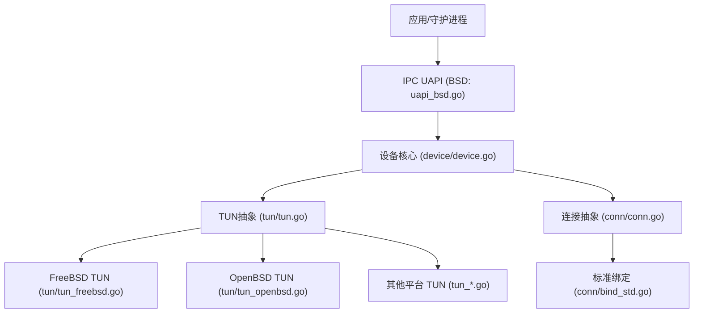
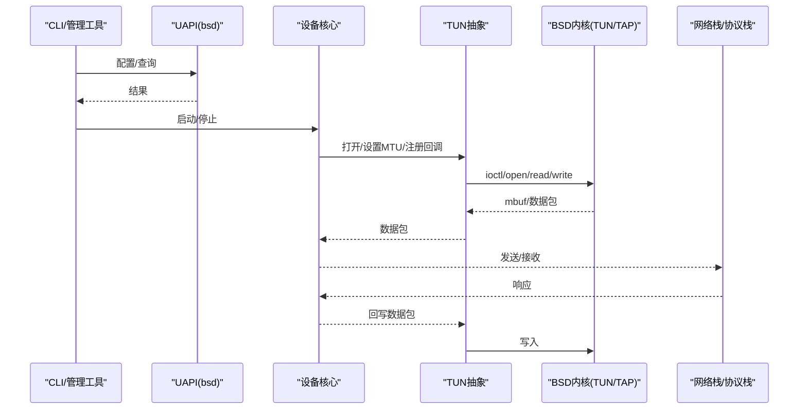
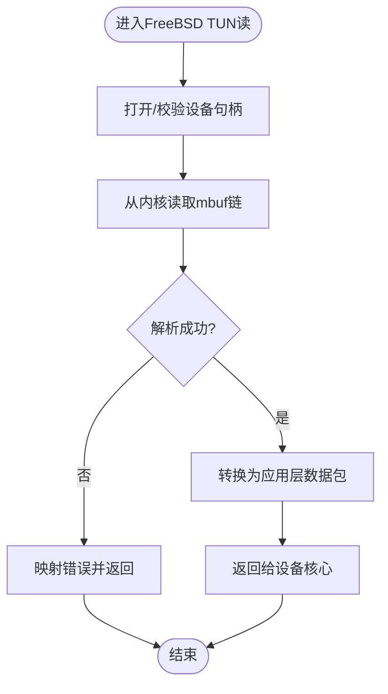
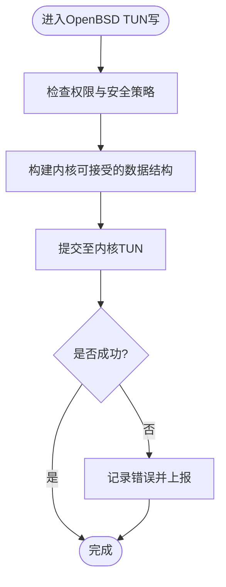
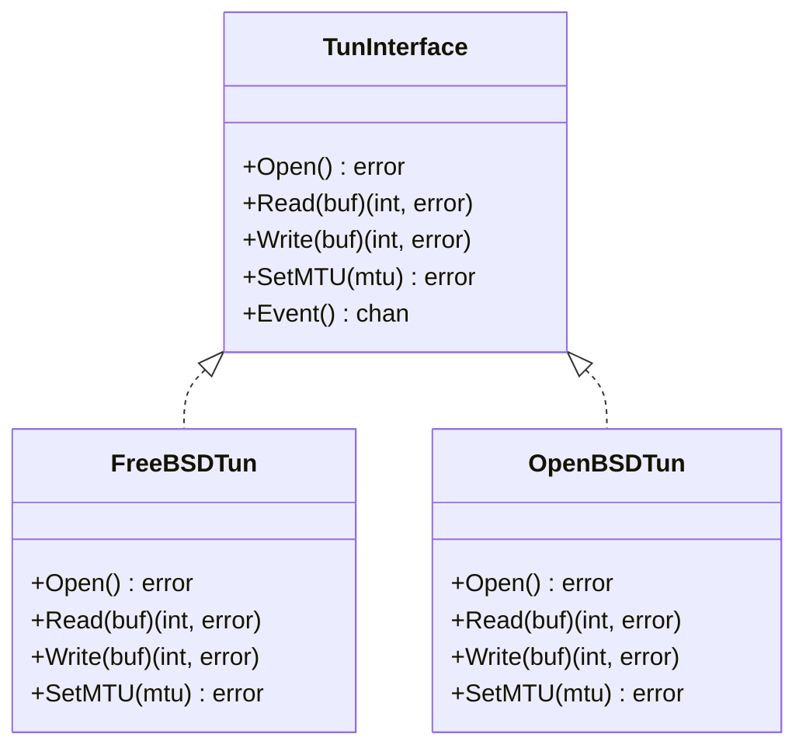
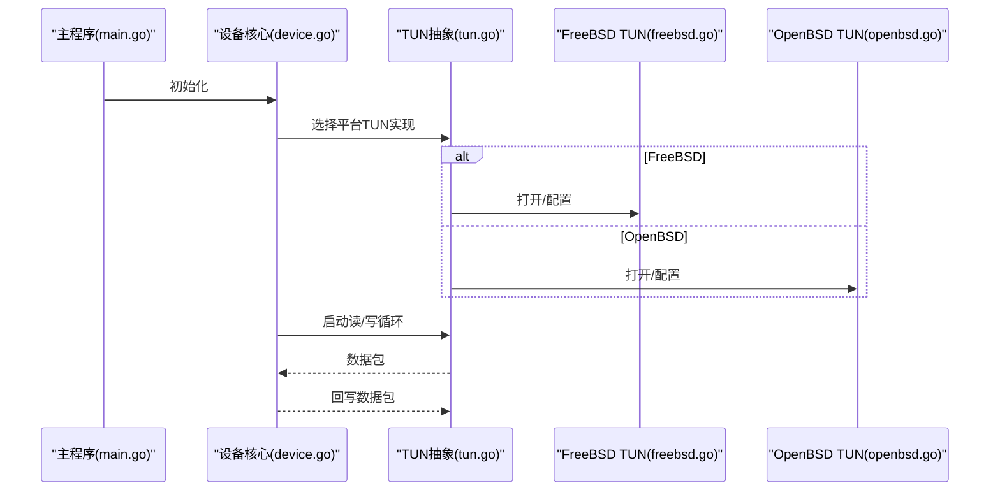
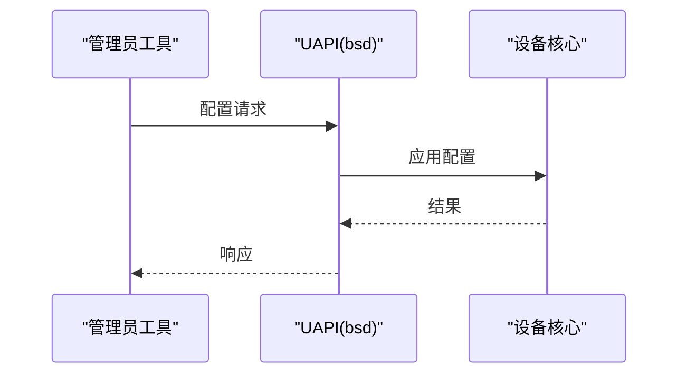
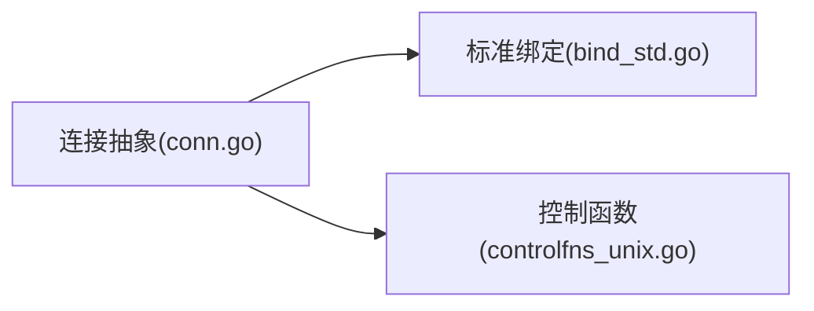
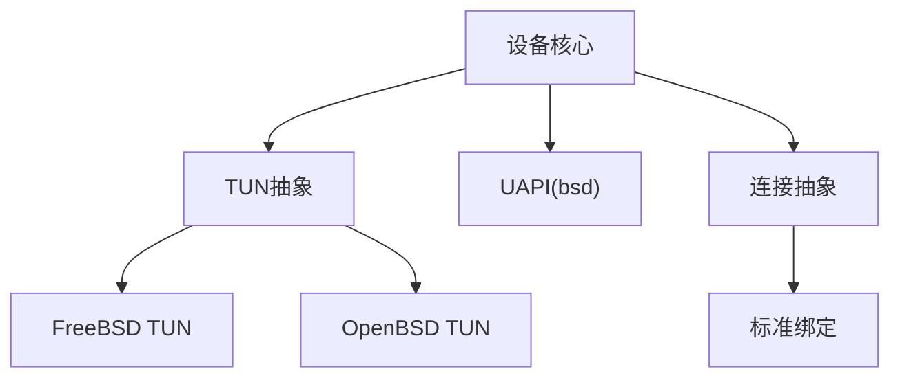

# BSD家族平台实现

<cite>
**本文引用的文件**
- [tun_freebsd.go](file://tun/tun_freebsd.go)
- [tun_openbsd.go](file://tun/tun_openbsd.go)
- [tun_darwin.go](file://tun/tun_darwin.go)
- [tun_linux.go](file://tun/tun_linux.go)
- [tun_windows.go](file://tun/tun_windows.go)
- [tun.go](file://tun/tun.go)
- [errors.go](file://tun/errors.go)
- [operateonfd.go](file://tun/operateonfd.go)
- [device.go](file://device/device.go)
- [uapi_bsd.go](file://ipc/uapi_bsd.go)
- [uapi_unix.go](file://ipc/uapi_unix.go)
- [conn.go](file://conn/conn.go)
- [bind_std.go](file://conn/bind_std.go)
- [controlfns_unix.go](file://conn/controlfns_unix.go)
- [main.go](file://main.go)
</cite>

## 目录
1. [简介](#简介)
2. [项目结构](#项目结构)
3. [核心组件](#核心组件)
4. [架构总览](#架构总览)
5. [详细组件分析](#详细组件分析)
6. [依赖关系分析](#依赖关系分析)
7. [性能考量](#性能考量)
8. [故障排查指南](#故障排查指南)
9. [结论](#结论)
10. [附录](#附录)

## 简介
本文件面向BSD家族平台（FreeBSD、OpenBSD等）的TUN设备实现，系统性说明WireGuard-Go在BSD内核上的TUN/TAP接口使用方式、与内核mbuf机制的交互路径、各BSD发行版的差异点（如FreeBSD的Jail容器化与OpenBSD的安全增强），以及BSD平台的网络栈集成、系统调用、信号处理与进程间通信方式。同时提供编译配置、端口管理、包管理器集成建议，以及网络监控与调试方法，帮助读者快速理解并高效运维基于BSD的WireGuard部署。

## 项目结构
本项目采用按功能分层与平台分发的组织方式：
- tun层：封装各平台TUN/TAP设备抽象，包含BSD、Linux、Windows等平台特定实现。
- device层：WireGuard设备核心逻辑（加密、对端管理、收发队列等）。
- ipc层：UAPI与用户态控制面，BSD平台通过Unix域套接字暴露接口。
- conn层：通用连接抽象与平台绑定策略。
- 入口：main.go负责启动流程与平台初始化。

图表来源
- [uapi_bsd.go:1-200](file://ipc/uapi_bsd.go#L1-L200)
- [device.go:1-200](file://device/device.go#L1-L200)
- [tun.go:1-200](file://tun/tun.go#L1-L200)
- [tun_freebsd.go:1-200](file://tun/tun_freebsd.go#L1-L200)
- [tun_openbsd.go:1-200](file://tun/tun_openbsd.go#L1-L200)

章节来源
- [tun.go:1-200](file://tun/tun.go#L1-L200)
- [device.go:1-200](file://device/device.go#L1-L200)
- [uapi_bsd.go:1-200](file://ipc/uapi_bsd.go#L1-L200)
- [conn.go:1-200](file://conn/conn.go#L1-L200)

## 核心组件
- TUN抽象接口：定义统一的读写、MTU、事件通知等能力，屏蔽平台差异。
- BSD TUN实现：分别针对FreeBSD与OpenBSD的内核接口进行适配，包括设备打开、I/O、错误处理。
- 设备核心：负责密钥协商、数据包封装/解封装、路由与队列管理。
- IPC UAPI：BSD平台通过Unix域套接字暴露配置与状态查询接口。
- 连接抽象：统一UDP/原始套接字访问，便于在不同平台上复用。

章节来源
- [tun.go:1-200](file://tun/tun.go#L1-L200)
- [tun_freebsd.go:1-200](file://tun/tun_freebsd.go#L1-L200)
- [tun_openbsd.go:1-200](file://tun/tun_openbsd.go#L1-L200)
- [device.go:1-200](file://device/device.go#L1-L200)
- [uapi_bsd.go:1-200](file://ipc/uapi_bsd.go#L1-L200)
- [conn.go:1-200](file://conn/conn.go#L1-L200)

## 架构总览
下图展示BSD平台从用户态到内核TUN设备的整体数据流与控制流：

图表来源
- [uapi_bsd.go:1-200](file://ipc/uapi_bsd.go#L1-L200)
- [device.go:1-200](file://device/device.go#L1-L200)
- [tun.go:1-200](file://tun/tun.go#L1-L200)
- [tun_freebsd.go:1-200](file://tun/tun_freebsd.go#L1-L200)
- [tun_openbsd.go:1-200](file://tun/tun_openbsd.go#L1-L200)

## 详细组件分析

### FreeBSD TUN实现
- 设备打开与权限：通过BSD系统调用打开TUN设备节点，需具备相应权限；在Free Jail环境中受限于Jail隔离策略，可能需要调整jail参数或权限模型。
- I/O与缓冲：读取内核下发的mbuf链，转换为应用层可读的数据包；写入时将应用层数据组装为内核期望格式并提交。
- 事件与错误：处理设备就绪、关闭、错误码映射到上层错误类型。

图表来源
- [tun_freebsd.go:1-200](file://tun/tun_freebsd.go#L1-L200)
- [errors.go:1-200](file://tun/errors.go#L1-L200)

章节来源
- [tun_freebsd.go:1-200](file://tun/tun_freebsd.go#L1-L200)
- [errors.go:1-200](file://tun/errors.go#L1-L200)

### OpenBSD TUN实现
- 安全增强：OpenBSD在TUN/TAP上启用更严格的默认策略（如net.inet.ip.forwarding、ipfilter规则、pledge/unveil限制），需在启动前正确配置。
- 资源限制：关注ulimit、rctl等资源限制，避免在高负载下被系统回收。
- 兼容性：遵循BSD通用TUN接口，但需注意内核版本差异带来的行为变化。

图表来源
- [tun_openbsd.go:1-200](file://tun/tun_openbsd.go#L1-L200)
- [errors.go:1-200](file://tun/errors.go#L1-L200)

章节来源
- [tun_openbsd.go:1-200](file://tun/tun_openbsd.go#L1-L200)
- [errors.go:1-200](file://tun/errors.go#L1-L200)

### TUN抽象与跨平台一致性
- 统一接口：所有平台实现均遵循相同的读写、MTU设置、事件回调接口，便于设备核心以一致方式操作。
- 错误映射：将平台特定的错误码映射为统一错误类型，简化上层处理。
- 文件描述符操作：利用operateonfd等工具函数进行非阻塞I/O、超时控制等。

图表来源
- [tun.go:1-200](file://tun/tun.go#L1-L200)
- [tun_freebsd.go:1-200](file://tun/tun_freebsd.go#L1-L200)
- [tun_openbsd.go:1-200](file://tun/tun_openbsd.go#L1-L200)
- [operateonfd.go:1-200](file://tun/operateonfd.go#L1-L200)

章节来源
- [tun.go:1-200](file://tun/tun.go#L1-L200)
- [operateonfd.go:1-200](file://tun/operateonfd.go#L1-L200)

### 设备核心与BSD集成
- 生命周期：启动时创建TUN设备、配置MTU、启动收发协程；停止时清理资源。
- 收发流程：接收侧从TUN读取数据包，解密后转发；发送侧将出站流量封装后写入TUN。
- 与IPC协作：通过UAPI暴露配置与状态查询，支持动态更新对端与密钥。

图表来源
- [main.go:1-200](file://main.go#L1-L200)
- [device.go:1-200](file://device/device.go#L1-L200)
- [tun.go:1-200](file://tun/tun.go#L1-L200)
- [tun_freebsd.go:1-200](file://tun/tun_freebsd.go#L1-L200)
- [tun_openbsd.go:1-200](file://tun/tun_openbsd.go#L1-L200)

章节来源
- [main.go:1-200](file://main.go#L1-L200)
- [device.go:1-200](file://device/device.go#L1-L200)

### BSD平台IPC与系统调用
- UAPI：BSD平台通过Unix域套接字暴露配置接口，支持热更新与状态查询。
- 系统调用：主要涉及socket、ioctl、read/write、select/poll等；不同BSD在细节上有差异，由平台特定代码处理。
- 信号处理：捕获SIGTERM/SIGINT优雅退出，确保资源释放。

图表来源
- [uapi_bsd.go:1-200](file://ipc/uapi_bsd.go#L1-L200)
- [uapi_unix.go:1-200](file://ipc/uapi_unix.go#L1-L200)
- [device.go:1-200](file://device/device.go#L1-L200)

章节来源
- [uapi_bsd.go:1-200](file://ipc/uapi_bsd.go#L1-L200)
- [uapi_unix.go:1-200](file://ipc/uapi_unix.go#L1-L200)

### 连接抽象与绑定
- 连接抽象：统一UDP/原始套接字访问，屏蔽平台差异。
- 标准绑定：在BSD上使用标准网络栈进行UDP通信，必要时结合系统特性优化。

图表来源
- [conn.go:1-200](file://conn/conn.go#L1-L200)
- [bind_std.go:1-200](file://conn/bind_std.go#L1-L200)
- [controlfns_unix.go:1-200](file://conn/controlfns_unix.go#L1-L200)

章节来源
- [conn.go:1-200](file://conn/conn.go#L1-L200)
- [bind_std.go:1-200](file://conn/bind_std.go#L1-L200)
- [controlfns_unix.go:1-200](file://conn/controlfns_unix.go#L1-L200)

## 依赖关系分析
- 模块耦合：设备核心依赖TUN抽象与IPC UAPI；TUN抽象依赖平台特定实现；连接抽象独立于TUN但与服务端通信紧密相关。
- 外部依赖：BSD内核TUN/TAP驱动、网络栈、系统调用库。
- 潜在循环：无直接循环依赖；通过接口解耦。

图表来源
- [device.go:1-200](file://device/device.go#L1-L200)
- [tun.go:1-200](file://tun/tun.go#L1-L200)
- [tun_freebsd.go:1-200](file://tun/tun_freebsd.go#L1-L200)
- [tun_openbsd.go:1-200](file://tun/tun_openbsd.go#L1-L200)
- [uapi_bsd.go:1-200](file://ipc/uapi_bsd.go#L1-L200)
- [conn.go:1-200](file://conn/conn.go#L1-L200)
- [bind_std.go:1-200](file://conn/bind_std.go#L1-L200)

章节来源
- [device.go:1-200](file://device/device.go#L1-L200)
- [tun.go:1-200](file://tun/tun.go#L1-L200)
- [uapi_bsd.go:1-200](file://ipc/uapi_bsd.go#L1-L200)
- [conn.go:1-200](file://conn/conn.go#L1-L200)

## 性能考量
- 零拷贝与缓冲：尽量复用缓冲区，减少内存分配；合理设置MTU以减少分包。
- I/O多路复用：使用非阻塞I/O与事件驱动，降低上下文切换开销。
- 内核交互：批量写入与读取，减少系统调用次数；注意内核mbuf链长度与内存压力。
- 并发模型：设备收发协程分离，避免锁竞争；合理设置队列长度。

[本节为通用性能指导，不直接分析具体文件]

## 故障排查指南
- 权限问题：确认运行用户对TUN设备有读写权限；在Free Jail中检查jail参数与权限模型。
- 内核策略：OpenBSD需检查安全策略（如ipfilter、pledge/unveil）是否阻止了必要操作。
- 错误映射：查看错误类型与平台错误码映射，定位具体失败阶段（打开、读写、配置）。
- 日志与监控：启用详细日志，结合系统工具（如dmesg、netstat、iftop）观察TUN接口状态与流量。

章节来源
- [errors.go:1-200](file://tun/errors.go#L1-L200)
- [tun_freebsd.go:1-200](file://tun/tun_freebsd.go#L1-L200)
- [tun_openbsd.go:1-200](file://tun/tun_openbsd.go#L1-L200)

## 结论
WireGuard-Go在BSD家族平台通过统一的TUN抽象与平台特定实现，有效屏蔽了FreeBSD与OpenBSD的差异，提供了稳定可靠的虚拟网卡接入。结合BSD内核的TUN/TAP接口与mbuf机制，实现了高效的网络数据传输。通过UAPI与系统调用的合理封装，用户在Free Jail与OpenBSD安全增强环境下也能便捷地部署与管理。建议在部署时关注权限、内核策略与资源限制，并结合监控与调试工具保障稳定性与性能。

[本节为总结性内容，不直接分析具体文件]

## 附录
- 编译配置：根据目标BSD版本选择合适的构建标签与交叉编译选项；确保C工具链与头文件可用。
- 端口管理：在BSD防火墙中放行WireGuard使用的UDP端口；结合ipfw/ipf规则进行细粒度控制。
- 包管理器集成：在FreeBSD使用pkg安装依赖；在OpenBSD使用pkg_add或ports构建自定义包。
- 监控与调试：使用系统命令（如ifconfig、netstat、tcpdump）与内核日志（dmesg）进行问题定位。

[本节为通用指导，不直接分析具体文件]