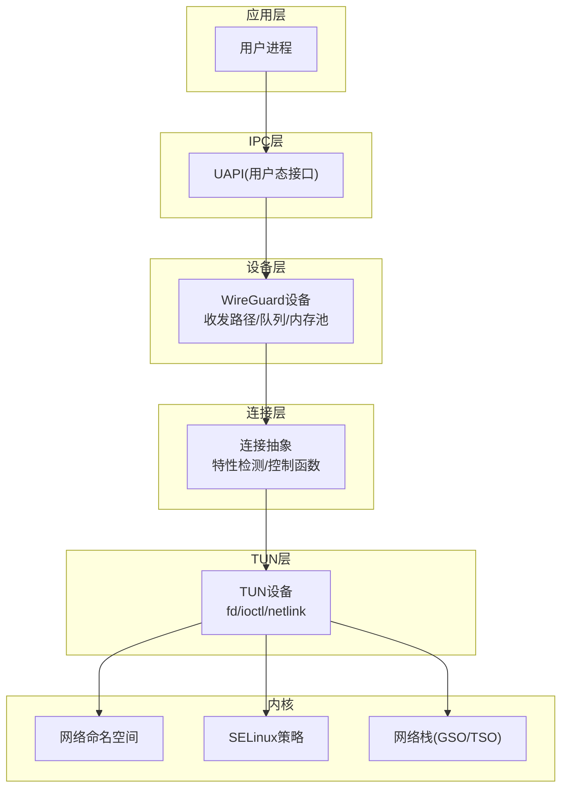
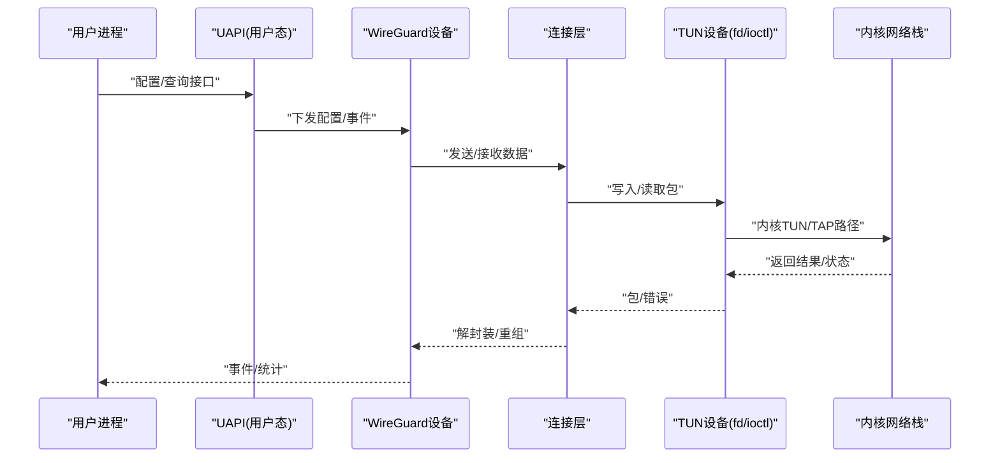
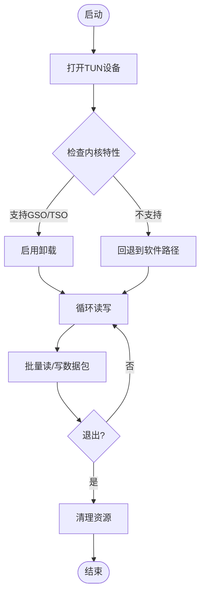
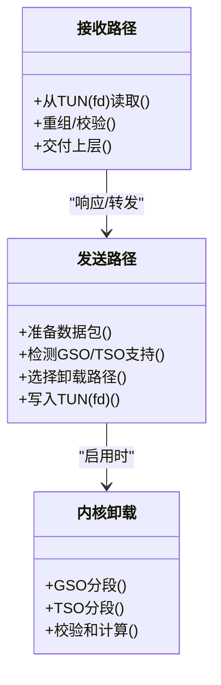
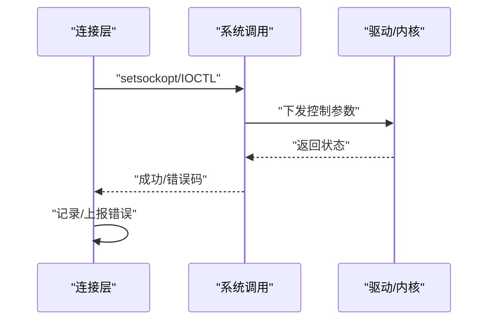
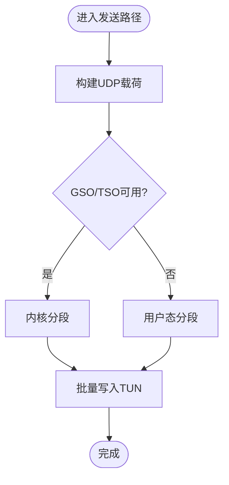
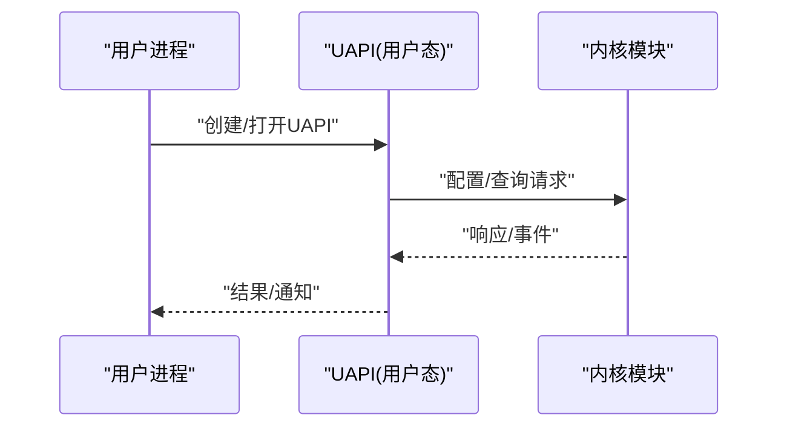

# Linux平台实现

<cite>
**本文引用的文件**
- [tun_linux.go](file://tun/tun_linux.go)
- [offload_linux.go](file://tun/offload_linux.go)
- [tun.go](file://tun/tun.go)
- [gso_linux.go](file://conn/gso_linux.go)
- [features_linux.go](file://conn/features_linux.go)
- [controlfns_linux.go](file://conn/controlfns_linux.go)
- [uapi_linux.go](file://ipc/uapi_linux.go)
- [device.go](file://device/device.go)
- [send.go](file://device/send.go)
- [receive.go](file://device/receive.go)
- [pools.go](file://device/pools.go)
- [queueconstants_default.go](file://device/queueconstants_default.go)
- [errors_linux.go](file://conn/errors_linux.go)
</cite>

## 目录
1. [简介](#简介)
2. [项目结构](#项目结构)
3. [核心组件](#核心组件)
4. [架构总览](#架构总览)
5. [详细组件分析](#详细组件分析)
6. [依赖关系分析](#依赖关系分析)
7. [性能考虑](#性能考虑)
8. [故障诊断指南](#故障诊断指南)
9. [结论](#结论)
10. [附录](#附录)

## 简介
本文件聚焦于Linux平台的TUN设备实现，系统性说明内核TUN/TAP设备的API使用（文件描述符操作、ioctl调用与netlink通信）、Linux特有的网络栈优化（GSO/TSO与零拷贝）、权限模型与SELinux支持、网络命名空间隔离、内核版本兼容性与sysfs接口依赖，以及性能调优参数、内存池配置与批量I/O处理，并给出故障诊断工具与调试方法。文档面向希望深入理解或二次开发基于wireguard-go的Linux TUN实现的工程师与运维人员。

## 项目结构
本项目在Linux平台上将TUN相关能力分层组织：
- tun层：封装TUN设备打开、读写、特性探测与卸载（GSO/TSO）等底层能力
- conn层：提供套接字控制函数、特性检测（如GSO支持）、错误定义与平台差异处理
- device层：WireGuard设备状态机、收发路径、队列常量与内存池管理
- ipc层：Linux UAPI接口实现，负责用户态与内核模块交互
- 其他：测试、示例与跨平台适配

图表来源
- [tun_linux.go:1-200](file://tun/tun_linux.go#L1-L200)
- [features_linux.go:1-200](file://conn/features_linux.go#L1-L200)
- [device.go:1-200](file://device/device.go#L1-L200)
- [uapi_linux.go:1-200](file://ipc/uapi_linux.go#L1-L200)

章节来源
- [tun_linux.go:1-200](file://tun/tun_linux.go#L1-L200)
- [features_linux.go:1-200](file://conn/features_linux.go#L1-L200)
- [device.go:1-200](file://device/device.go#L1-L200)
- [uapi_linux.go:1-200](file://ipc/uapi_linux.go#L1-L200)

## 核心组件
- TUN设备抽象与生命周期管理：负责打开/关闭TUN设备、设置MTU、获取/设置接口属性、读写数据包
- 特性探测与启用：检测并启用GSO/TSO等卸载能力，提升吞吐与降低CPU占用
- 连接控制函数：通过setsockopt/IOCTL对socket进行标记、绑定、路由策略等控制
- 设备收发路径：按队列与内存池组织数据，批量I/O减少系统调用开销
- UAPI接口：提供用户态与内核模块交互的通道，用于配置与查询

章节来源
- [tun_linux.go:1-200](file://tun/tun_linux.go#L1-L200)
- [offload_linux.go:1-200](file://tun/offload_linux.go#L1-L200)
- [gso_linux.go:1-200](file://conn/gso_linux.go#L1-L200)
- [features_linux.go:1-200](file://conn/features_linux.go#L1-L200)
- [controlfns_linux.go:1-200](file://conn/controlfns_linux.go#L1-L200)
- [device.go:1-200](file://device/device.go#L1-L200)
- [send.go:1-200](file://device/send.go#L1-L200)
- [receive.go:1-200](file://device/receive.go#L1-L200)
- [pools.go:1-200](file://device/pools.go#L1-L200)
- [uapi_linux.go:1-200](file://ipc/uapi_linux.go#L1-L200)

## 架构总览
下图展示从用户态到内核网络栈的关键调用链与数据流，涵盖UAPI配置、设备收发、TUN fd读写与内核卸载路径。

图表来源
- [uapi_linux.go:1-200](file://ipc/uapi_linux.go#L1-L200)
- [device.go:1-200](file://device/device.go#L1-L200)
- [tun_linux.go:1-200](file://tun/tun_linux.go#L1-L200)

## 详细组件分析

### TUN设备抽象与生命周期（Linux）
- 打开/关闭：通过系统调用打开TUN设备，分配并维护文件描述符；关闭时释放资源
- MTU与属性：设置接口MTU、标志位；必要时通过ioctl调整队列大小或特性
- 读写路径：以批量化方式读写数据包，结合内存池减少分配与拷贝
- 特性探测：检测内核是否支持GSO/TSO，并在可用时启用以提升性能

图表来源
- [tun_linux.go:1-200](file://tun/tun_linux.go#L1-L200)
- [offload_linux.go:1-200](file://tun/offload_linux.go#L1-L200)

章节来源
- [tun_linux.go:1-200](file://tun/tun_linux.go#L1-L200)
- [offload_linux.go:1-200](file://tun/offload_linux.go#L1-L200)

### GSO/TSO与零拷贝机制
- GSO（通用分段卸载）：在发送路径将大包下推到内核进行分段，减少用户态分片成本
- TSO（TCP分段卸载）：针对TCP报文，由内核完成分段，进一步降低CPU占用
- 零拷贝：尽量通过mmap/splice或直接fd传递避免多余拷贝；在TUN路径中尽可能复用缓冲区

图表来源
- [gso_linux.go:1-200](file://conn/gso_linux.go#L1-L200)
- [features_linux.go:1-200](file://conn/features_linux.go#L1-L200)
- [offload_linux.go:1-200](file://tun/offload_linux.go#L1-L200)

章节来源
- [gso_linux.go:1-200](file://conn/gso_linux.go#L1-L200)
- [features_linux.go:1-200](file://conn/features_linux.go#L1-L200)
- [offload_linux.go:1-200](file://tun/offload_linux.go#L1-L200)

### 连接控制与特性检测（Linux）
- setsockopt/IOCTL：用于设置socket标记、绑定网卡、开启/关闭特定功能
- 特性检测：探测内核与驱动支持的GSO/TSO能力，动态切换路径
- 错误处理：统一错误类型与日志，便于定位问题

图表来源
- [controlfns_linux.go:1-200](file://conn/controlfns_linux.go#L1-L200)
- [features_linux.go:1-200](file://conn/features_linux.go#L1-L200)
- [errors_linux.go:1-200](file://conn/errors_linux.go#L1-L200)

章节来源
- [controlfns_linux.go:1-200](file://conn/controlfns_linux.go#L1-L200)
- [features_linux.go:1-200](file://conn/features_linux.go#L1-L200)
- [errors_linux.go:1-200](file://conn/errors_linux.go#L1-L200)

### 设备收发路径与批量I/O
- 发送路径：组装UDP载荷，选择最优路径（GSO/TSO或软件），批量写入TUN
- 接收路径：从TUN读取原始IP包，解封装后交给设备状态机处理
- 队列与内存池：预分配缓冲，减少GC压力与分配延迟；按队列并发处理

图表来源
- [send.go:1-200](file://device/send.go#L1-L200)
- [receive.go:1-200](file://device/receive.go#L1-L200)
- [pools.go:1-200](file://device/pools.go#L1-L200)

章节来源
- [send.go:1-200](file://device/send.go#L1-L200)
- [receive.go:1-200](file://device/receive.go#L1-L200)
- [pools.go:1-200](file://device/pools.go#L1-L200)
- [queueconstants_default.go:1-200](file://device/queueconstants_default.go#L1-L200)

### UAPI接口（Linux）
- 作用：用户态与内核模块之间的配置与查询通道
- 典型流程：建立连接、发送配置命令、接收事件与统计信息
- 安全：结合权限模型与SELinux策略限制访问

图表来源
- [uapi_linux.go:1-200](file://ipc/uapi_linux.go#L1-L200)

章节来源
- [uapi_linux.go:1-200](file://ipc/uapi_linux.go#L1-L200)

## 依赖关系分析
- 组件耦合：
  - 设备层依赖连接层进行套接字控制与特性检测
  - 连接层依赖TUN层进行fd读写与ioctl调用
  - UAPI层与设备层交互，负责配置下发与事件上报
- 外部依赖：
  - 内核网络栈（GSO/TSO能力）
  - 系统调用（open/read/write/ioctl/setsockopt）
  - netlink（可选，用于路由/地址管理等）
- 潜在循环依赖：通过分层与接口隔离避免

图表来源
- [uapi_linux.go:1-200](file://ipc/uapi_linux.go#L1-L200)
- [device.go:1-200](file://device/device.go#L1-L200)
- [tun_linux.go:1-200](file://tun/tun_linux.go#L1-L200)

章节来源
- [uapi_linux.go:1-200](file://ipc/uapi_linux.go#L1-L200)
- [device.go:1-200](file://device/device.go#L1-L200)
- [tun_linux.go:1-200](file://tun/tun_linux.go#L1-L200)

## 性能考虑
- 启用GSO/TSO：在支持的内核与驱动上优先使用卸载路径，显著降低CPU占用
- 批量I/O：合并多次读写，减少系统调用次数
- 内存池：预分配固定大小缓冲，降低分配与GC压力
- 队列深度：根据负载调整队列长度，平衡延迟与吞吐
- 零拷贝：尽量复用缓冲区，避免不必要的数据拷贝
- 监控指标：关注丢包率、重传率、CPU使用率、延迟分布

[本节为通用指导，不直接分析具体文件]

## 故障诊断指南
- 常见问题
  - 权限不足：确保进程具备CAP_NET_ADMIN或相应SELinux策略允许
  - 命名空间隔离：确认TUN设备位于正确的网络命名空间
  - 内核特性缺失：检测GSO/TSO支持，必要时回退到软件路径
  - 队列溢出：增大队列深度或优化批量I/O
- 诊断工具与方法
  - 查看内核日志与dmesg输出，定位TUN/驱动错误
  - 使用strace跟踪系统调用，分析fd与ioctl行为
  - 使用ethtool/iperf评估网络栈卸载效果与吞吐
  - 使用tc/iptables进行流量整形与规则验证
- 错误分类与定位
  - 参考错误定义与日志，区分网络、权限、内核能力等问题

章节来源
- [errors_linux.go:1-200](file://conn/errors_linux.go#L1-L200)

## 结论
本实现通过分层设计将TUN设备抽象、连接控制、设备收发与UAPI解耦，充分利用Linux内核的GSO/TSO卸载能力与批量I/O机制，达到高吞吐与低CPU占用的目标。配合合理的内存池与队列配置，可在不同负载场景下保持稳定性能。同时，完善的错误处理与诊断手段有助于快速定位与解决问题。

## 附录
- 内核版本兼容性
  - 建议在内核较新版本上使用以获得更好的GSO/TSO支持与稳定性
  - 若内核不支持某些特性，应自动回退到软件路径
- sysfs接口依赖
  - 可通过sysfs查询设备能力与状态（例如队列大小、卸载能力）
- 权限模型与SELinux
  - 需要CAP_NET_ADMIN或等效权限
  - SELinux策略需允许TUN设备访问与网络操作
- 网络命名空间
  - 确保TUN设备与应用处于同一命名空间或使用nsenter等方式切换
- 性能调优参数
  - 队列深度、批量大小、内存池尺寸、GSO/TSO开关
- 调试方法
  - 启用详细日志、使用perf/火焰图分析热点、结合网络抓包验证

[本节为通用指导，不直接分析具体文件]