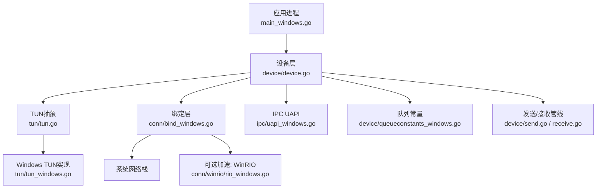
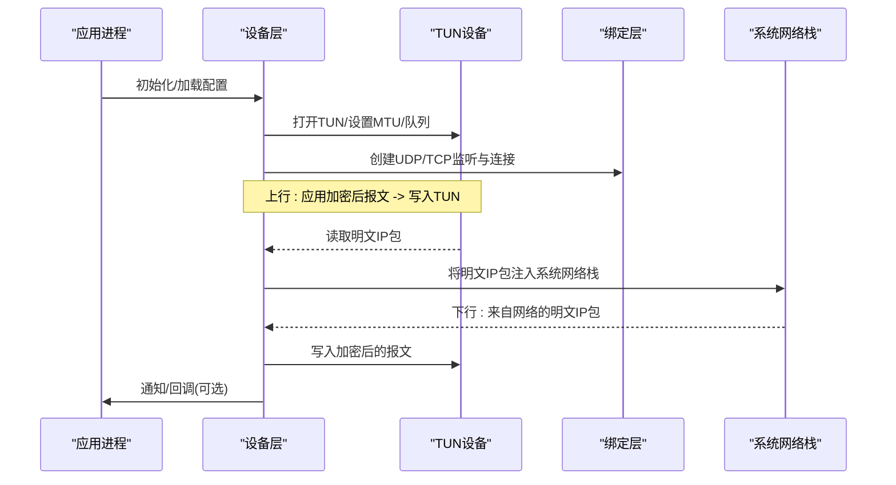
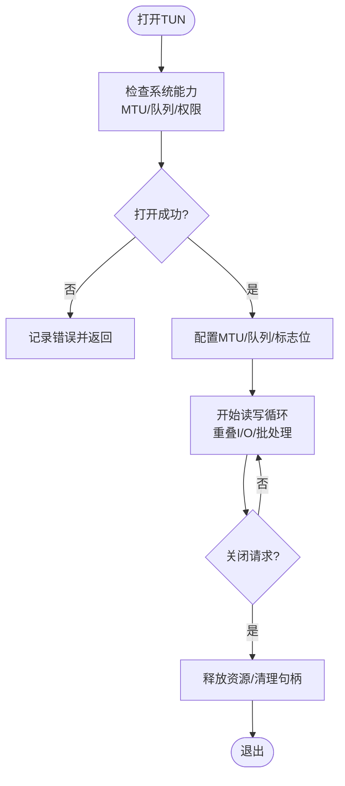
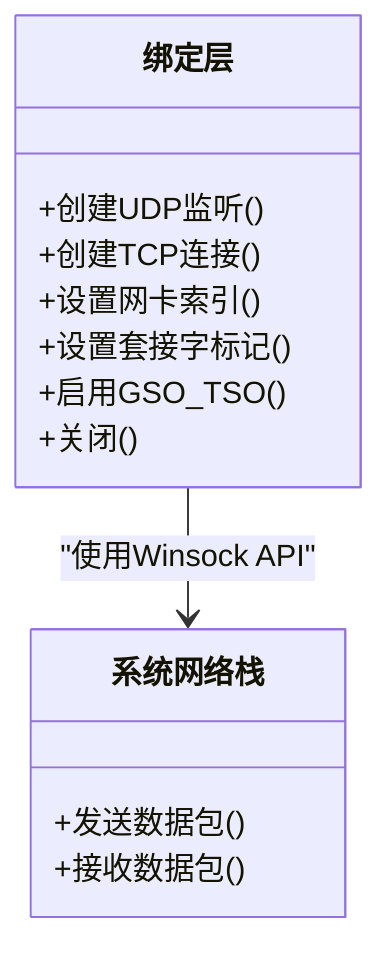
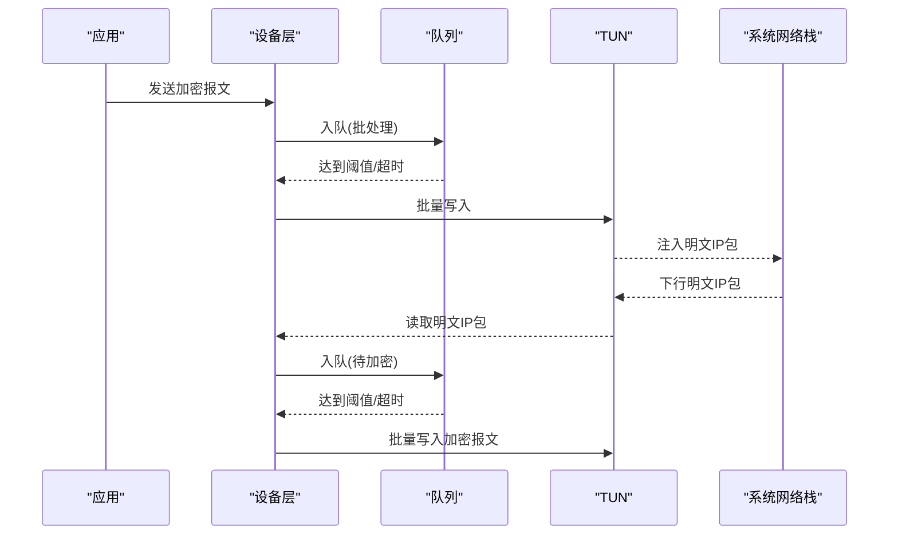
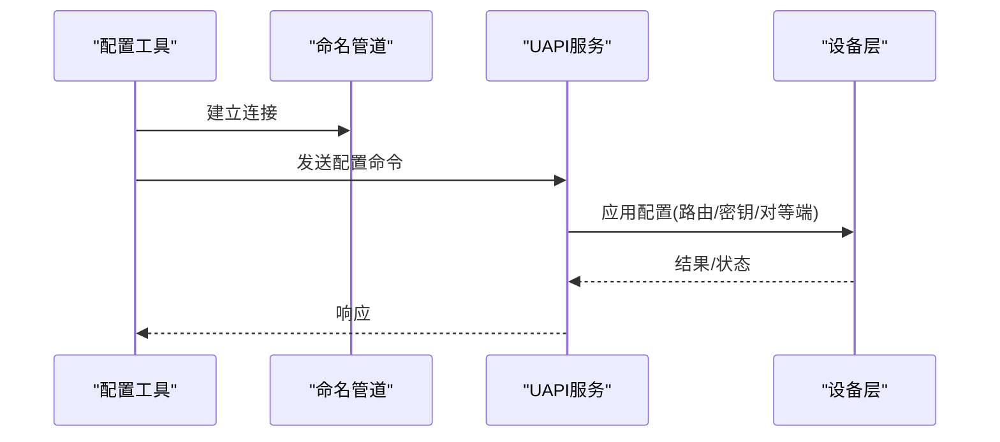
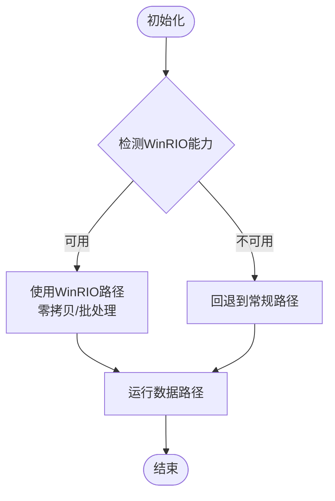
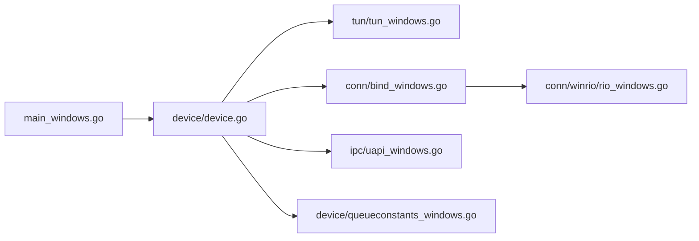

# Windows平台实现

<cite>
**本文引用的文件**
- [main_windows.go](file://main_windows.go)
- [tun_windows.go](file://tun/tun_windows.go)
- [tun.go](file://tun/tun.go)
- [bind_windows.go](file://conn/bind_windows.go)
- [controlfns_windows.go](file://conn/controlfns_windows.go)
- [uapi_windows.go](file://ipc/uapi_windows.go)
- [queueconstants_windows.go](file://device/queueconstants_windows.go)
- [device.go](file://device/device.go)
- [send.go](file://device/send.go)
- [receive.go](file://device/receive.go)
- [winrio_rio_windows.go](file://conn/winrio/rio_windows.go)
</cite>

## 目录
1. [简介](#简介)
2. [项目结构](#项目结构)
3. [核心组件](#核心组件)
4. [架构总览](#架构总览)
5. [详细组件分析](#详细组件分析)
6. [依赖关系分析](#依赖关系分析)
7. [性能考虑](#性能考虑)
8. [故障排查指南](#故障排查指南)
9. [结论](#结论)
10. [附录](#附录)

## 简介
本文件面向在Windows平台上实现与部署WireGuard的工程师，聚焦于TUN设备、网络栈集成、服务化部署、权限与安全模型以及性能优化。需要特别说明的是：当前仓库中的Windows实现通过系统提供的TUN接口进行数据面收发，并未直接实现TDI或WFP驱动；如需TDI/WFP级别的深度集成，需另行开发内核态驱动并与NDIS框架对接。本文同时给出Windows特有的服务管理、UAC提权、驱动签名要求、事件日志与性能计数器使用建议，并结合代码中的IOCP异步I/O、内存映射与批处理机制提供优化指引。

## 项目结构
Windows相关的关键路径与职责如下：
- 入口与服务管理：主程序入口负责初始化并启动Windows服务生命周期控制。
- TUN设备抽象：跨平台TUN接口定义与Windows具体实现，封装读写、MTU、队列等能力。
- 绑定层：Windows下的UDP/TCP绑定、套接字选项、网卡选择与标记。
- IPC接口：Windows命名管道实现的UAPI，用于用户态配置与控制。
- 设备与队列：队列常量、发送/接收流水线、设备状态机。
- 可选加速：WinRIO（如可用）用于零拷贝/批量I/O。

图表来源
- [main_windows.go](file://main_windows.go)
- [device.go](file://device/device.go)
- [tun.go](file://tun/tun.go)
- [tun_windows.go](file://tun/tun_windows.go)
- [bind_windows.go](file://conn/bind_windows.go)
- [uapi_windows.go](file://ipc/uapi_windows.go)
- [queueconstants_windows.go](file://device/queueconstants_windows.go)
- [send.go](file://device/send.go)
- [receive.go](file://device/receive.go)
- [winrio_rio_windows.go](file://conn/winrio/rio_windows.go)

章节来源
- [main_windows.go](file://main_windows.go)
- [tun.go](file://tun/tun.go)
- [tun_windows.go](file://tun/tun_windows.go)
- [bind_windows.go](file://conn/bind_windows.go)
- [uapi_windows.go](file://ipc/uapi_windows.go)
- [queueconstants_windows.go](file://device/queueconstants_windows.go)
- [device.go](file://device/device.go)
- [send.go](file://device/send.go)
- [receive.go](file://device/receive.go)
- [winrio_rio_windows.go](file://conn/winrio/rio_windows.go)

## 核心组件
- 入口与服务管理：负责以Windows服务模式运行、安装/卸载服务、自动启动策略、事件日志注册与调试输出。
- TUN设备：封装Windows TUN设备的打开、关闭、读写、MTU设置、队列大小与错误处理。
- 绑定层：封装Windows UDP/TCP绑定、网卡选择、套接字标记、GSO/TSO等特性探测与启用。
- 设备与队列：维护对等端、密钥、定时器、发送/接收队列、统计信息，协调TUN与协议栈的数据流。
- IPC接口：通过命名管道暴露UAPI，供外部工具配置路由、密钥、对等端等。
- 可选加速：当系统支持时，利用WinRIO提升批量I/O吞吐与降低CPU占用。

章节来源
- [main_windows.go](file://main_windows.go)
- [tun_windows.go](file://tun/tun_windows.go)
- [bind_windows.go](file://conn/bind_windows.go)
- [uapi_windows.go](file://ipc/uapi_windows.go)
- [queueconstants_windows.go](file://device/queueconstants_windows.go)
- [device.go](file://device/device.go)
- [send.go](file://device/send.go)
- [receive.go](file://device/receive.go)

## 架构总览
下图展示了从应用到系统网络栈的整体数据路径，包括TUN设备、设备层、绑定层与可选加速模块的交互。

图表来源
- [device.go](file://device/device.go)
- [tun_windows.go](file://tun/tun_windows.go)
- [bind_windows.go](file://conn/bind_windows.go)

## 详细组件分析

### Windows TUN设备实现
- 目标：提供稳定的TUN设备抽象，屏蔽Windows底层差异，向上层暴露统一的读写接口。
- 关键点：
  - 设备打开与关闭：确保资源释放与错误回滚。
  - MTU与队列：根据系统能力与业务需求调整，避免丢包与拥塞。
  - 读写路径：尽量采用重叠I/O与批处理，减少系统调用次数。
  - 错误处理：区分网络错误、权限错误与设备异常，便于上层恢复。

图表来源
- [tun_windows.go](file://tun/tun_windows.go)
- [tun.go](file://tun/tun.go)

章节来源
- [tun_windows.go](file://tun/tun_windows.go)
- [tun.go](file://tun/tun.go)

### 绑定层与网络栈集成
- 目标：在Windows上高效地绑定UDP/TCP套接字，支持网卡选择、套接字标记与特性开关。
- 关键点：
  - 绑定与监听：创建并配置UDP/TCP套接字，绑定到指定网卡或任意地址。
  - 套接字选项：启用Nagle、TCP_NODELAY、GSO/TSO（若可用），调整缓冲区大小。
  - 网卡选择：通过接口索引或名称选择出站网卡，满足多网卡场景。
  - 错误与重试：对网络不可达、端口占用等错误进行分类与重试策略。

图表来源
- [bind_windows.go](file://conn/bind_windows.go)

章节来源
- [bind_windows.go](file://conn/bind_windows.go)

### 设备层与队列管理
- 目标：管理WireGuard设备状态、对等端、密钥、定时器与发送/接收队列，协调TUN与网络栈的数据流。
- 关键点：
  - 队列常量：根据Windows平台特性调整队列长度与批大小，平衡延迟与吞吐。
  - 发送路径：将加密后的报文打包为批次，通过TUN写入，减少系统调用。
  - 接收路径：从TUN读取明文IP包，交由系统网络栈处理，必要时做分片重组。
  - 统计与监控：维护计数与指标，便于性能分析与问题定位。

图表来源
- [device.go](file://device/device.go)
- [send.go](file://device/send.go)
- [receive.go](file://device/receive.go)
- [queueconstants_windows.go](file://device/queueconstants_windows.go)

章节来源
- [device.go](file://device/device.go)
- [send.go](file://device/send.go)
- [receive.go](file://device/receive.go)
- [queueconstants_windows.go](file://device/queueconstants_windows.go)

### IPC接口（UAPI）
- 目标：通过Windows命名管道暴露UAPI，允许外部工具动态配置路由、密钥、对等端等。
- 关键点：
  - 命名管道：创建服务端/客户端通道，保证并发与可靠性。
  - 协议设计：定义命令/响应格式，支持热更新与查询。
  - 安全控制：限制访问者身份，结合ACL与权限模型。

图表来源
- [uapi_windows.go](file://ipc/uapi_windows.go)

章节来源
- [uapi_windows.go](file://ipc/uapi_windows.go)

### 可选加速：WinRIO
- 目标：在支持的硬件/驱动环境下，使用WinRIO实现零拷贝与批量I/O，降低CPU占用并提升吞吐。
- 关键点：
  - 能力检测：运行时检测是否可用，不可用时回退到常规路径。
  - 批处理：聚合多个I/O操作，减少上下文切换。
  - 内存映射：尽可能复用缓冲区，避免频繁分配与拷贝。

图表来源
- [winrio_rio_windows.go](file://conn/winrio/rio_windows.go)

章节来源
- [winrio_rio_windows.go](file://conn/winrio/rio_windows.go)

## 依赖关系分析
- 组件耦合：
  - 设备层依赖TUN与绑定层，解耦了协议逻辑与底层网络细节。
  - TUN实现依赖Windows系统API，需关注版本兼容性与权限。
  - 绑定层依赖Winsock与网卡驱动，需处理多网卡与特性差异。
  - IPC与设备层松耦合，通过命令/响应模式通信。
- 外部依赖：
  - Windows系统服务框架、事件日志、性能计数器。
  - 可选的WinRIO驱动/库。

图表来源
- [main_windows.go](file://main_windows.go)
- [device.go](file://device/device.go)
- [tun_windows.go](file://tun/tun_windows.go)
- [bind_windows.go](file://conn/bind_windows.go)
- [uapi_windows.go](file://ipc/uapi_windows.go)
- [queueconstants_windows.go](file://device/queueconstants_windows.go)
- [winrio_rio_windows.go](file://conn/winrio/rio_windows.go)

章节来源
- [main_windows.go](file://main_windows.go)
- [device.go](file://device/device.go)
- [tun_windows.go](file://tun/tun_windows.go)
- [bind_windows.go](file://conn/bind_windows.go)
- [uapi_windows.go](file://ipc/uapi_windows.go)
- [queueconstants_windows.go](file://device/queueconstants_windows.go)
- [winrio_rio_windows.go](file://conn/winrio/rio_windows.go)

## 性能考虑
- IOCP异步I/O：
  - 使用重叠I/O与完成端口模型，提高并发处理能力。
  - 合理设置工作线程数与队列长度，避免忙轮询。
- 内存映射与缓冲池：
  - 复用缓冲区，减少分配与拷贝开销。
  - 对齐与分页友好布局，提升DMA效率。
- 批处理机制：
  - 合并小报文，减少系统调用次数。
  - 基于阈值或超时的批量提交，平衡延迟与吞吐。
- 网卡与驱动特性：
  - 启用GSO/TSO（若可用），减轻CPU负担。
  - 选择合适的网卡与队列，避免瓶颈。
- 监控与调优：
  - 使用性能计数器跟踪发送/接收速率、延迟、丢包率。
  - 结合事件日志定位异常与瓶颈。

[本节为通用性能指导，不直接分析具体文件]

## 故障排查指南
- 权限与UAC：
  - 确保以管理员权限运行，以便访问TUN设备与修改网络设置。
  - 使用UAC提权或安装为系统服务，避免交互式权限问题。
- 驱动签名与兼容性：
  - 若引入自定义驱动（如TDI/WFP），需符合Windows驱动签名要求。
  - 验证驱动与系统版本的兼容性，避免蓝屏或功能失效。
- 事件日志：
  - 注册并写入Windows事件日志，记录关键错误与诊断信息。
  - 使用事件查看器过滤与分析日志。
- 性能计数器：
  - 注册自定义计数器，监控吞吐、延迟、队列长度等指标。
  - 结合PerfMon或PowerShell进行分析。
- 常见错误：
  - 无法打开TUN：检查权限、驱动状态与设备占用。
  - 绑定失败：检查端口占用、防火墙规则与网卡可用性。
  - 高CPU或低吞吐：检查批处理参数、队列长度与WinRIO可用性。

章节来源
- [main_windows.go](file://main_windows.go)
- [tun_windows.go](file://tun/tun_windows.go)
- [bind_windows.go](file://conn/bind_windows.go)
- [uapi_windows.go](file://ipc/uapi_windows.go)

## 结论
本仓库在Windows平台上通过TUN设备与系统网络栈实现了WireGuard的数据面收发，未直接实现TDI/WFP驱动。对于需要TDI/WFP深度集成的场景，应另行开发内核态驱动并与NDIS框架对接。本文提供了服务化部署、权限与安全模型、性能优化与故障排查的系统性指导，帮助在Windows环境中稳定高效地运行WireGuard。

[本节为总结性内容，不直接分析具体文件]

## 附录
- 术语说明：
  - TUN：虚拟网络设备，工作在三层，提供IP包注入与读取。
  - TDI：传输驱动接口，位于NDIS之下，提供传输层驱动能力。
  - WFP：Windows筛选平台，提供内核态流量过滤与重定向能力。
  - NDIS：网络驱动程序接口规范，定义网卡驱动与系统交互标准。
  - IOCP：输入输出完成端口，Windows下的高性能异步I/O模型。
- 参考路径：
  - 入口与服务：[main_windows.go](file://main_windows.go)
  - TUN设备：[tun_windows.go](file://tun/tun_windows.go)、[tun.go](file://tun/tun.go)
  - 绑定层：[bind_windows.go](file://conn/bind_windows.go)
  - IPC接口：[uapi_windows.go](file://ipc/uapi_windows.go)
  - 队列与设备：[queueconstants_windows.go](file://device/queueconstants_windows.go)、[device.go](file://device/device.go)
  - 发送/接收：[send.go](file://device/send.go)、[receive.go](file://device/receive.go)
  - 可选加速：[winrio_rio_windows.go](file://conn/winrio/rio_windows.go)

[本节为附录内容，不直接分析具体文件]