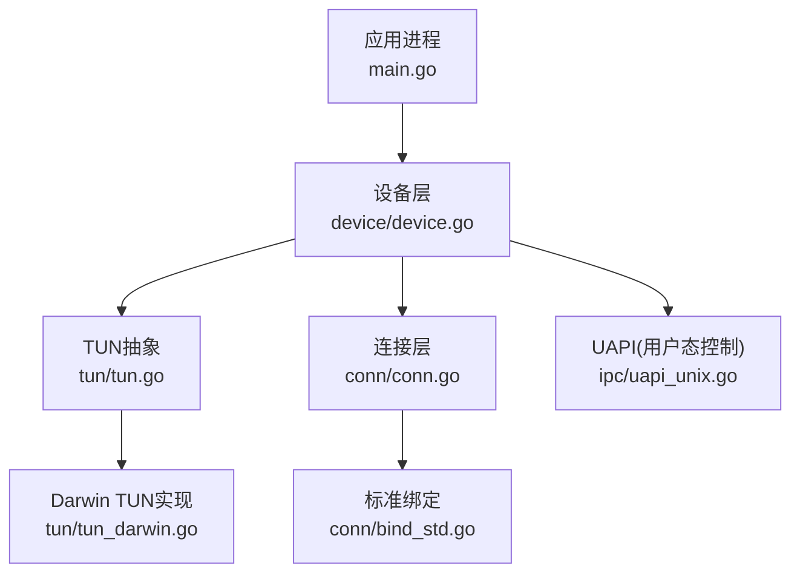
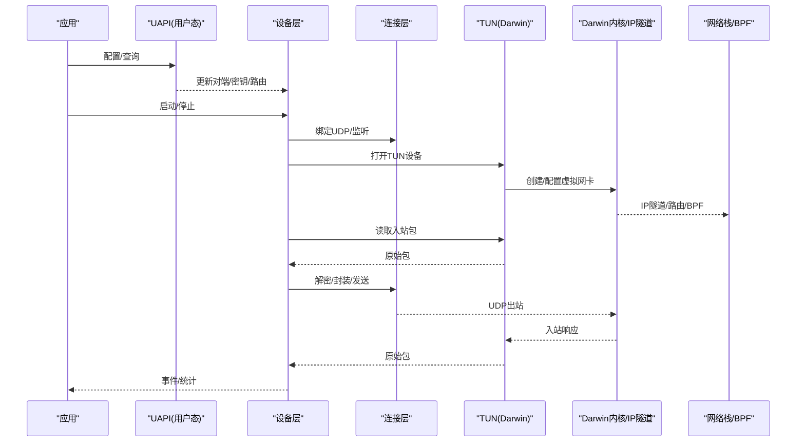
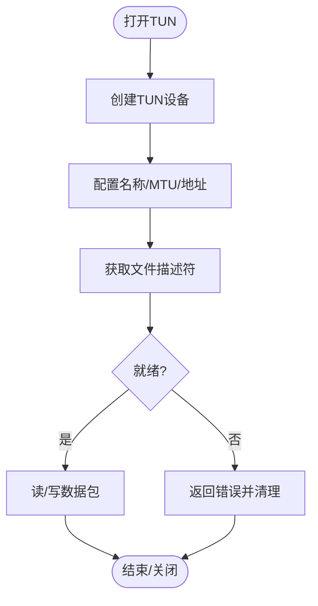
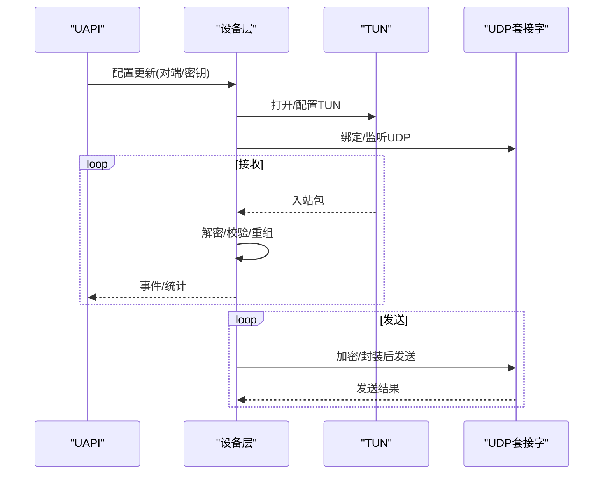
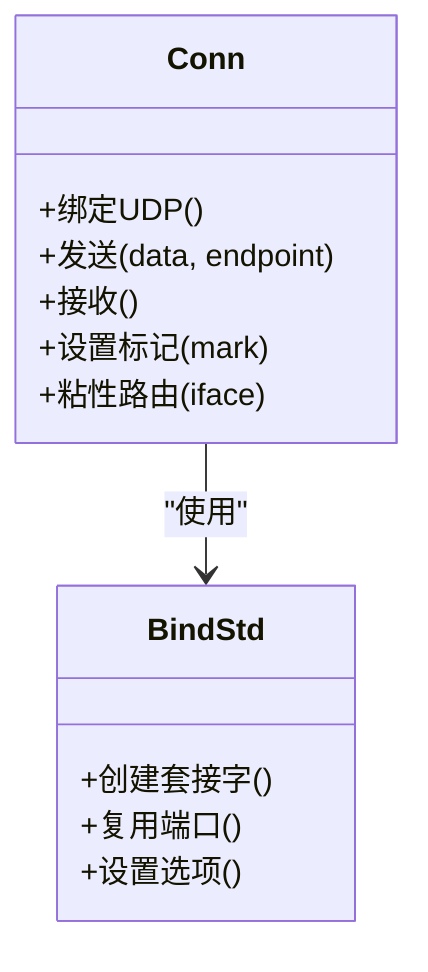
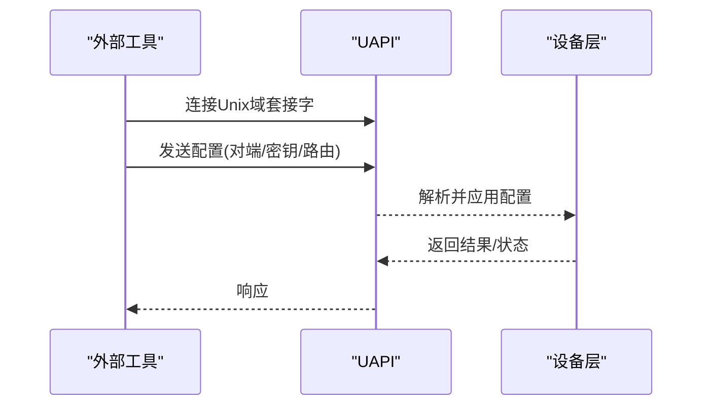
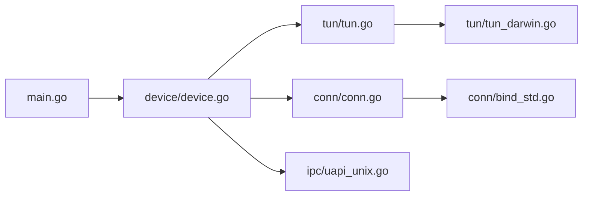

# macOS平台实现

<cite>
**本文引用的文件**
- [tun_darwin.go](file://tun/tun_darwin.go)
- [tun.go](file://tun/tun.go)
- [conn.go](file://conn/conn.go)
- [bind_std.go](file://conn/bind_std.go)
- [device.go](file://device/device.go)
- [uapi_unix.go](file://ipc/uapi_unix.go)
- [main.go](file://main.go)
- [README.md](file://README.md)
</cite>

## 目录
1. [简介](#简介)
2. [项目结构](#项目结构)
3. [核心组件](#核心组件)
4. [架构总览](#架构总览)
5. [详细组件分析](#详细组件分析)
6. [依赖关系分析](#依赖关系分析)
7. [性能考量](#性能考量)
8. [故障排查指南](#故障排查指南)
9. [结论](#结论)
10. [附录](#附录)

## 简介
本文件聚焦于在macOS平台上基于WireGuard Go实现的TUN设备与网络栈集成，重点说明：
- macOS内核扩展（Kernel Extension）与系统扩展（System Extension）的开发与使用要点
- Darwin内核网络栈特性与BPF的使用方式
- macOS沙盒机制、权限模型与App Store分发限制对网络扩展的影响
- iOS与macOS的差异（含Metal框架集成与移动端优化）
- macOS特有的网络监控工具、网络扩展API与系统偏好设置集成
- 沙盒环境下的网络访问配置与调试技巧

## 项目结构
该仓库采用按功能分层与平台分文件的组织方式。与macOS TUN相关的关键路径包括：
- tun/tun_darwin.go：Darwin平台的TUN接口实现
- tun/tun.go：跨平台TUN抽象与通用逻辑
- conn/*：连接层抽象与平台绑定（标准套接字、标记、粘性路由等）
- device/*：WireGuard设备状态机、收发流程、密钥协商等核心逻辑
- ipc/*：用户态控制接口（UAPI），Unix域套接字实现
- main.go：应用入口，负责初始化并启动设备与监听

图表来源
- [main.go:1-200](file://main.go#L1-L200)
- [device/device.go:1-300](file://device/device.go#L1-L300)
- [tun/tun.go:1-200](file://tun/tun.go#L1-L200)
- [tun/tun_darwin.go:1-200](file://tun/tun_darwin.go#L1-L200)
- [conn/conn.go:1-200](file://conn/conn.go#L1-L200)
- [conn/bind_std.go:1-200](file://conn/bind_std.go#L1-L200)
- [ipc/uapi_unix.go:1-200](file://ipc/uapi_unix.go#L1-L200)

章节来源
- [main.go:1-200](file://main.go#L1-L200)
- [README.md:1-200](file://README.md#L1-L200)

## 核心组件
- TUN抽象与Darwin实现
  - 提供统一的读写接口，屏蔽底层差异；Darwin实现通过系统调用创建/操作TUN设备，配合IP隧道进行数据包转发。
- 设备层（Device）
  - 管理对等端、密钥对、队列、定时器、发送/接收流水线，协调TUN与UDP套接字的I/O。
- 连接层（Conn）
  - 封装UDP套接字、端口复用、SO_MARK/防火墙标记、粘性路由等能力，适配不同平台。
- UAPI（用户态控制接口）
  - 通过Unix域套接字暴露配置与查询接口，供外部工具或守护进程动态更新设备状态。

章节来源
- [tun/tun.go:1-200](file://tun/tun.go#L1-L200)
- [tun/tun_darwin.go:1-200](file://tun/tun_darwin.go#L1-L200)
- [device/device.go:1-300](file://device/device.go#L1-L300)
- [conn/conn.go:1-200](file://conn/conn.go#L1-L200)
- [ipc/uapi_unix.go:1-200](file://ipc/uapi_unix.go#L1-L200)

## 架构总览
下图展示从应用到内核的完整数据流与控制流：应用通过UAPI配置设备，设备层驱动TUN与UDP I/O，Darwin内核处理IP隧道与路由，必要时结合BPF进行包过滤与统计。

图表来源
- [device/device.go:1-300](file://device/device.go#L1-L300)
- [tun/tun_darwin.go:1-200](file://tun/tun_darwin.go#L1-L200)
- [conn/conn.go:1-200](file://conn/conn.go#L1-L200)
- [ipc/uapi_unix.go:1-200](file://ipc/uapi_unix.go#L1-L200)

## 详细组件分析

### TUN设备（Darwin）
- 职责
  - 打开/关闭TUN设备，配置名称、MTU、IPv4/IPv6地址与路由。
  - 提供阻塞式读写，将内核IP包与用户态WireGuard协议栈对接。
- 关键行为
  - 通过系统调用创建TUN设备并获取文件描述符。
  - 与内核IP隧道协作，完成二层/三层包的注入与提取。
  - 错误处理涵盖权限不足、设备占用、参数非法等场景。
- 与上层交互
  - 被设备层以统一接口调用，屏蔽平台差异。

图表来源
- [tun/tun_darwin.go:1-200](file://tun/tun_darwin.go#L1-L200)
- [tun/tun.go:1-200](file://tun/tun.go#L1-L200)

章节来源
- [tun/tun_darwin.go:1-200](file://tun/tun_darwin.go#L1-L200)
- [tun/tun.go:1-200](file://tun/tun.go#L1-L200)

### 设备层（Device）
- 职责
  - 维护对等端列表、密钥对、队列与定时器。
  - 协调TUN与UDP的收发，执行噪声协议握手、加密/解密、重传与乱序重组。
- 关键流程
  - 启动时绑定UDP端口、打开TUN、注册回调。
  - 接收路径：TUN入站 -> 解封装/校验 -> 投递给目标对端。
  - 发送路径：对端数据 -> 加密/封装 -> UDP出站。
- 与UAPI交互
  - 通过Unix域套接字接收配置变更（如添加/删除对端、更新公钥）。

图表来源
- [device/device.go:1-300](file://device/device.go#L1-L300)
- [tun/tun_darwin.go:1-200](file://tun/tun_darwin.go#L1-L200)
- [ipc/uapi_unix.go:1-200](file://ipc/uapi_unix.go#L1-L200)

章节来源
- [device/device.go:1-300](file://device/device.go#L1-L300)
- [ipc/uapi_unix.go:1-200](file://ipc/uapi_unix.go#L1-L200)

### 连接层（Conn）与标准绑定
- 职责
  - 封装UDP套接字，提供端口复用、防火墙标记、粘性路由等能力。
  - 在不同平台间保持一致的API。
- 标准绑定（bind_std）
  - 使用标准库套接字实现基础收发，适用于大多数桌面场景。
  - 可结合系统级策略（如路由表、DNS）工作。

图表来源
- [conn/conn.go:1-200](file://conn/conn.go#L1-L200)
- [conn/bind_std.go:1-200](file://conn/bind_std.go#L1-L200)

章节来源
- [conn/conn.go:1-200](file://conn/conn.go#L1-L200)
- [conn/bind_std.go:1-200](file://conn/bind_std.go#L1-L200)

### UAPI（用户态控制接口）
- 职责
  - 通过Unix域套接字暴露配置与查询接口，支持热更新对端、密钥、路由等。
- 典型用法
  - 外部工具或守护进程连接UAPI，发送配置指令，设备层解析并应用。

图表来源
- [ipc/uapi_unix.go:1-200](file://ipc/uapi_unix.go#L1-L200)
- [device/device.go:1-300](file://device/device.go#L1-L300)

章节来源
- [ipc/uapi_unix.go:1-200](file://ipc/uapi_unix.go#L1-L200)

## 依赖关系分析
- 模块耦合
  - 设备层强依赖TUN与Conn，二者通过统一接口解耦平台差异。
  - UAPI与设备层通过消息协议耦合，便于外部控制。
- 外部依赖
  - Darwin内核提供的TUN/IP隧道能力。
  - 标准库UDP套接字与系统调用。
- 潜在循环依赖
  - 当前分层清晰，未见明显循环依赖。

图表来源
- [main.go:1-200](file://main.go#L1-L200)
- [device/device.go:1-300](file://device/device.go#L1-L300)
- [tun/tun.go:1-200](file://tun/tun.go#L1-L200)
- [tun/tun_darwin.go:1-200](file://tun/tun_darwin.go#L1-L200)
- [conn/conn.go:1-200](file://conn/conn.go#L1-L200)
- [conn/bind_std.go:1-200](file://conn/bind_std.go#L1-L200)
- [ipc/uapi_unix.go:1-200](file://ipc/uapi_unix.go#L1-L200)

章节来源
- [main.go:1-200](file://main.go#L1-L200)
- [device/device.go:1-300](file://device/device.go#L1-L300)

## 性能考量
- 零拷贝与缓冲池
  - 尽量复用缓冲区，减少分配与拷贝开销。
- 并发与I/O多路复用
  - 合理设置goroutine数量，避免过多上下文切换。
- 内核路径优化
  - 利用TUN批量读写、调整MTU、启用GRO/LRO（若可用）。
- 网络栈与BPF
  - 在Darwin内核中合理使用BPF进行包过滤与统计，降低用户态负担。
- 端口复用与NAT穿透
  - 启用端口复用以减少资源占用，提升高并发场景吞吐。

[本节为通用指导，不直接分析具体文件]

## 故障排查指南
- 常见错误
  - 权限不足：无法创建TUN设备或绑定特权端口。
  - 设备占用：TUN设备已被其他进程占用。
  - 配置错误：对端公钥、IP地址、路由不合法。
- 诊断步骤
  - 检查UAPI连接与配置下发是否成功。
  - 查看设备日志与统计信息，确认收发路径是否正常。
  - 使用系统工具验证TUN设备状态、路由表与DNS解析。
- 沙盒与权限
  - 确保应用具备必要的网络扩展权限与Entitlements。
  - 在受限环境中，优先使用非特权端口与用户态代理。

章节来源
- [tun/tun_darwin.go:1-200](file://tun/tun_darwin.go#L1-L200)
- [device/device.go:1-300](file://device/device.go#L1-L300)
- [ipc/uapi_unix.go:1-200](file://ipc/uapi_unix.go#L1-L200)

## 结论
本仓库在macOS上通过TUN抽象与Darwin内核IP隧道实现了高效的WireGuard传输路径。设备层、连接层与UAPI的分层设计使平台差异得到良好隔离，便于扩展与维护。结合Darwin内核的BPF能力与系统级网络策略，可在保证安全的前提下获得良好的性能与可控性。对于企业级部署与App Store分发，需特别注意沙盒与权限模型的限制，并通过合适的扩展形态（系统扩展或网络扩展）满足需求。

[本节为总结，不直接分析具体文件]

## 附录

### macOS内核扩展（KEXT）与系统扩展（System Extension）
- 开发要点
  - KEXT：深入内核空间，具备更高权限但生命周期与稳定性要求严格，逐步被替代。
  - System Extension：运行于用户态，受沙盒约束，适合现代macOS生态，支持网络扩展类型。
- 使用建议
  - 优先选择系统扩展（Network Extension）以实现TUN/TAP、流量拦截与策略控制。
  - 合理划分用户态与内核态职责，最小化内核代码面以降低风险。

[本节为概念性内容，不直接分析具体文件]

### Darwin内核网络栈与BPF
- 特性
  - 基于BSD网络栈，支持IP隧道、VLAN、QoS与多种协议族。
  - BPF可用于包过滤、统计与采样，降低用户态压力。
- 实践
  - 在TUN路径中结合BPF进行快速过滤与计数。
  - 注意BPF程序大小与复杂度限制，避免影响系统性能。

[本节为概念性内容，不直接分析具体文件]

### 沙盒机制、权限模型与App Store分发限制
- 沙盒
  - 应用默认受限，需声明Entitlements与Capabilities以访问网络扩展或系统资源。
- 权限
  - 网络扩展通常由系统服务承载，应用通过桥接或UAPI与其通信。
- App Store
  - 需遵循审核规则，避免使用未公开API或越权行为；优先采用官方支持的扩展类型。

[本节为概念性内容，不直接分析具体文件]

### iOS与macOS差异（含Metal与移动端优化）
- 差异
  - iOS更严格的沙盒与后台限制；macOS允许更多系统级能力。
  - Metal在iOS/macOS均支持，但移动端需更注重功耗与内存。
- 优化
  - 移动端减少大对象分配，使用对象池与零拷贝。
  - 合理设置超时与重试，适应弱网环境。

[本节为概念性内容，不直接分析具体文件]

### macOS特有网络监控工具与系统偏好设置集成
- 工具
  - netstat、nettop、tcpdump、dtrace等用于抓包与性能分析。
  - 系统日志与Unified Logging用于问题定位。
- 偏好设置
  - 可通过系统扩展与系统服务交互，提供用户可见的配置界面。

[本节为概念性内容，不直接分析具体文件]

### 沙盒环境下的网络访问配置与调试技巧
- 配置
  - 正确声明Entitlements（如网络访问、网络扩展通信）。
  - 使用非特权端口与本地代理规避限制。
- 调试
  - 启用详细日志，结合UAPI输出定位问题。
  - 使用系统工具验证路由、DNS与防火墙规则。

[本节为概念性内容，不直接分析具体文件]