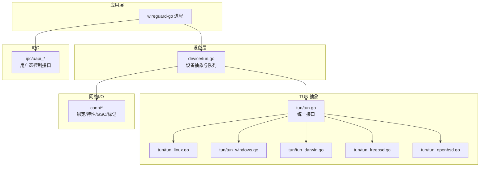
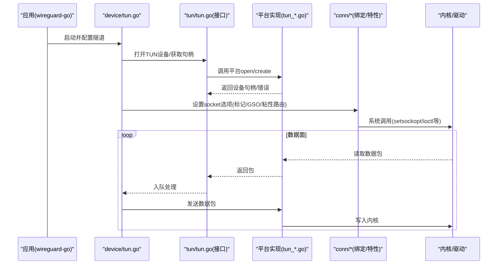
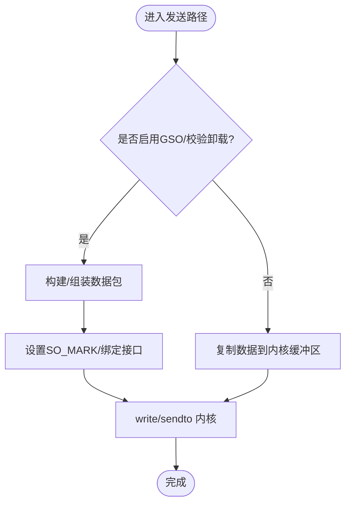
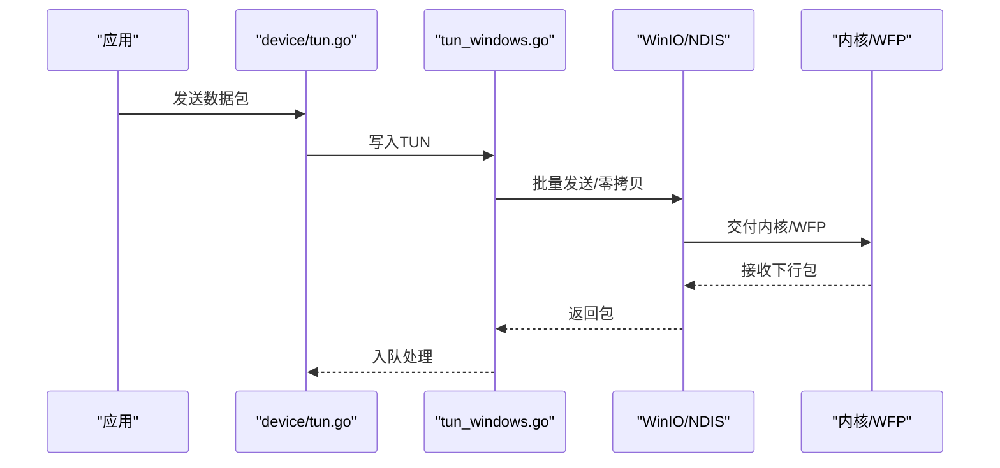
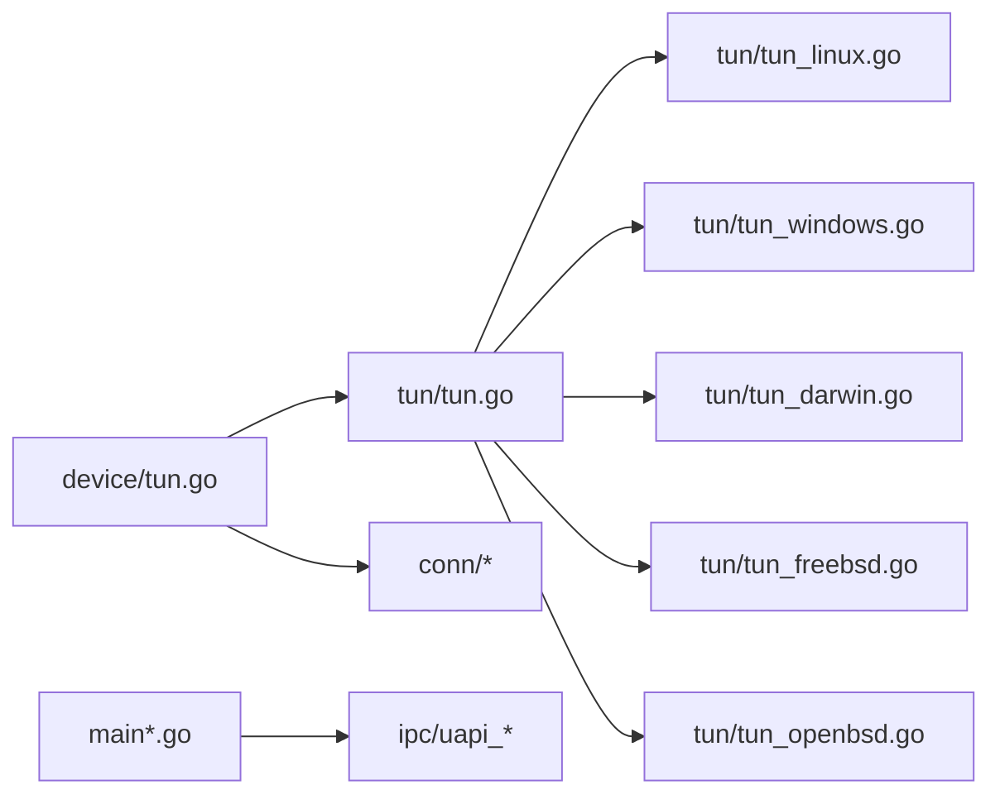

# 平台特定实现

<cite>
**本文引用的文件**
- [tun_linux.go](file://tun/tun_linux.go)
- [tun_windows.go](file://tun/tun_windows.go)
- [tun_darwin.go](file://tun/tun_darwin.go)
- [tun_freebsd.go](file://tun/tun_freebsd.go)
- [tun_openbsd.go](file://tun/tun_openbsd.go)
- [tun.go](file://tun/tun.go)
- [offload_linux.go](file://tun/offload_linux.go)
- [bind_std.go](file://conn/bind_std.go)
- [bind_windows.go](file://conn/bind_windows.go)
- [controlfns_linux.go](file://conn/controlfns_linux.go)
- [controlfns_unix.go](file://conn/controlfns_unix.go)
- [controlfns_windows.go](file://conn/controlfns_windows.go)
- [features_linux.go](file://conn/features_linux.go)
- [gso_linux.go](file://conn/gso_linux.go)
- [mark_unix.go](file://conn/mark_unix.go)
- [sticky_linux.go](file://conn/sticky_linux.go)
- [device_tun.go](file://device/tun.go)
- [uapi_linux.go](file://ipc/uapi_linux.go)
- [uapi_wasm.go](file://ipc/uapi_wasm.go)
- [main.go](file://main.go)
- [main_windows.go](file://main_windows.go)
</cite>

## 目录
1. [简介](#简介)
2. [项目结构](#项目结构)
3. [核心组件](#核心组件)
4. [架构总览](#架构总览)
5. [详细组件分析](#详细组件分析)
6. [依赖关系分析](#依赖关系分析)
7. [性能考虑](#性能考虑)
8. [故障排查指南](#故障排查指南)
9. [结论](#结论)
10. [附录：移植指南与注意事项](#附录：移植指南与注意事项)

## 简介
本文件聚焦于 wireguard-go 在不同操作系统上的 TUN 设备平台特定实现，系统梳理 Linux、Windows、macOS、FreeBSD、OpenBSD 的内核 API 差异、适配策略、驱动加载/设备创建与配置流程、权限要求与系统调用、以及各平台的优化技术与已知限制。同时提供面向新平台移植的开发指南，帮助读者快速理解并扩展支持。

## 项目结构
TUN 相关代码主要分布在以下模块：
- tun/: 各平台 TUN 设备抽象与具体实现（Linux、Windows、Darwin、FreeBSD、OpenBSD）
- conn/: 网络套接字绑定、特性探测、GSO/Checksum Offload、标记、粘滞路由等跨平台能力
- device/: 上层协议栈对 TUN 的调用入口与队列常量等
- ipc/: 用户态控制接口（UAPI），不同平台通过不同机制暴露给管理端
- main*.go: 平台启动入口，负责初始化与选择后端

图表来源
- [tun.go:1-200](file://tun/tun.go#L1-L200)
- [tun_linux.go:1-200](file://tun/tun_linux.go#L1-L200)
- [tun_windows.go:1-200](file://tun/tun_windows.go#L1-L200)
- [tun_darwin.go:1-200](file://tun/tun_darwin.go#L1-L200)
- [tun_freebsd.go:1-200](file://tun/tun_freebsd.go#L1-L200)
- [tun_openbsd.go:1-200](file://tun/tun_openbsd.go#L1-L200)
- [device_tun.go:1-200](file://device/tun.go#L1-L200)
- [bind_std.go:1-200](file://conn/bind_std.go#L1-L200)
- [bind_windows.go:1-200](file://conn/bind_windows.go#L1-L200)
- [uapi_linux.go:1-200](file://ipc/uapi_linux.go#L1-L200)
- [uapi_wasm.go:1-200](file://ipc/uapi_wasm.go#L1-L200)

章节来源
- [tun.go:1-200](file://tun/tun.go#L1-L200)
- [device_tun.go:1-200](file://device/tun.go#L1-L200)
- [bind_std.go:1-200](file://conn/bind_std.go#L1-L200)
- [bind_windows.go:1-200](file://conn/bind_windows.go#L1-L200)
- [uapi_linux.go:1-200](file://ipc/uapi_linux.go#L1-L200)
- [uapi_wasm.go:1-200](file://ipc/uapi_wasm.go#L1-L200)

## 核心组件
- 统一 TUN 接口：在 tun/tun.go 中定义跨平台一致的读写、MTU、名称、关闭等接口，屏蔽底层差异。
- 平台实现：
  - Linux：使用 netlink + /dev/net/tun 或内核 TUN 驱动；支持 GSO、Checksum Offload、SO_MARK、粘滞路由等。
  - Windows：使用 NDIS/TAP 或 WFP 相关接口；通过 WinIO 进行零拷贝/批量 I/O；支持自定义队列与缓冲池。
  - macOS：使用 utun 设备；受限于内核提供的能力集，通常不支持某些 offload 特性。
  - FreeBSD/OpenBSD：使用 bpf/tun 子系统；部分特性可用但行为与 Linux 存在差异。
- 网络绑定与特性：conn/* 提供跨平台 socket 绑定、IP 标记、GSO、粘性路由等能力封装。
- 设备层：device/tun.go 将 TUN 读/写事件接入协议栈，管理收发队列与定时器。
- IPC：ipc/uapi_* 提供用户态配置接口（如 wg-quick/wg 命令）与守护进程的通信通道。

章节来源
- [tun.go:1-200](file://tun/tun.go#L1-L200)
- [tun_linux.go:1-200](file://tun/tun_linux.go#L1-L200)
- [tun_windows.go:1-200](file://tun/tun_windows.go#L1-L200)
- [tun_darwin.go:1-200](file://tun/tun_darwin.go#L1-L200)
- [tun_freebsd.go:1-200](file://tun/tun_freebsd.go#L1-L200)
- [tun_openbsd.go:1-200](file://tun/tun_openbsd.go#L1-L200)
- [device_tun.go:1-200](file://device/tun.go#L1-L200)
- [bind_std.go:1-200](file://conn/bind_std.go#L1-L200)
- [bind_windows.go:1-200](file://conn/bind_windows.go#L1-L200)

## 架构总览
下图展示从应用到内核的调用路径与各平台差异点：

图表来源
- [device_tun.go:1-200](file://device/tun.go#L1-L200)
- [tun.go:1-200](file://tun/tun.go#L1-L200)
- [tun_linux.go:1-200](file://tun/tun_linux.go#L1-L200)
- [tun_windows.go:1-200](file://tun/tun_windows.go#L1-L200)
- [tun_darwin.go:1-200](file://tun/tun_darwin.go#L1-L200)
- [tun_freebsd.go:1-200](file://tun/tun_freebsd.go#L1-L200)
- [tun_openbsd.go:1-200](file://tun/tun_openbsd.go#L1-L200)
- [bind_std.go:1-200](file://conn/bind_std.go#L1-L200)
- [bind_windows.go:1-200](file://conn/bind_windows.go#L1-L200)

## 详细组件分析

### Linux 平台实现
- 设备创建与加载
  - 通过 /dev/net/tun 或内核 TUN 驱动创建虚拟网卡；可指定 MTU、标志位等。
  - 使用 netlink 进行 IP 地址、路由、策略路由等配置。
- 内核 API 与特性
  - 支持 GSO、Checksum Offload、TSO、SO_MARK、SO_BINDTODEVICE、UDP GRO 等。
  - 可通过 setsockopt 设置标记、绑定接口、开启/关闭 offload。
- 权限与系统调用
  - 需要 CAP_NET_ADMIN 或 root；访问 /dev/net/tun 需相应权限。
  - 常用系统调用：ioctl(TUNSETIFF)、setsockopt、netlink 请求。
- 优化与调优
  - 启用 GSO/Checksum Offload 提升吞吐；调整队列大小与缓冲区；合理设置 MTU 避免分片。
  - 使用 SO_MARK 配合 iptables/nftables 做策略路由与 QoS。
- 已知限制
  - 某些旧内核版本可能缺少部分 offload 特性；容器环境需确保具备必要 Capabilities。

章节来源
- [tun_linux.go:1-200](file://tun/tun_linux.go#L1-L200)
- [offload_linux.go:1-200](file://tun/offload_linux.go#L1-L200)
- [bind_std.go:1-200](file://conn/bind_std.go#L1-L200)
- [controlfns_linux.go:1-200](file://conn/controlfns_linux.go#L1-L200)
- [features_linux.go:1-200](file://conn/features_linux.go#L1-L200)
- [gso_linux.go:1-200](file://conn/gso_linux.go#L1-L200)
- [mark_unix.go:1-200](file://conn/mark_unix.go#L1-L200)
- [sticky_linux.go:1-200](file://conn/sticky_linux.go#L1-L200)

#### Linux 数据路径流程图

图表来源
- [gso_linux.go:1-200](file://conn/gso_linux.go#L1-L200)
- [mark_unix.go:1-200](file://conn/mark_unix.go#L1-L200)
- [bind_std.go:1-200](file://conn/bind_std.go#L1-L200)

### Windows 平台实现
- 设备创建与加载
  - 使用 NDIS/TAP 或 WFP 相关接口创建虚拟网卡；通过 WinIO 进行高效 I/O。
  - 可通过注册表或服务管理驱动生命周期。
- 内核 API 与特性
  - 支持零拷贝/批量 I/O；队列与缓冲池优化；部分 offload 由驱动/内核处理。
  - 使用 Winsock 扩展与 WFP 进行流量过滤与重定向。
- 权限与系统调用
  - 需要管理员权限；访问 TAP 设备需相应驱动安装与权限。
  - 常用系统调用：DeviceIoControl、WSAStartup、WSASend/WSARecv 等。
- 优化与调优
  - 调整队列长度、缓冲区大小；启用批处理以减少上下文切换；合理设置 MTU。
  - 利用 WinRIO 或类似技术减少拷贝开销。
- 已知限制
  - 不同驱动版本行为差异；某些 offload 特性不可用或需驱动支持。

章节来源
- [tun_windows.go:1-200](file://tun/tun_windows.go#L1-L200)
- [bind_windows.go:1-200](file://conn/bind_windows.go#L1-L200)
- [controlfns_windows.go:1-200](file://conn/controlfns_windows.go#L1-L200)

#### Windows 数据路径序列图

图表来源
- [tun_windows.go:1-200](file://tun/tun_windows.go#L1-L200)
- [bind_windows.go:1-200](file://conn/bind_windows.go#L1-L200)

### macOS (Darwin) 平台实现
- 设备创建与加载
  - 使用 utun 虚拟接口；通过 ioctl 或系统 API 创建与管理。
- 内核 API 与特性
  - 能力受限，通常不支持 GSO/Checksum Offload；以通用 UDP over IPv4/IPv6 为主。
- 权限与系统调用
  - 需要 root 或相应权限创建 utun；使用 setsockopt、ioctl 配置。
- 优化与调优
  - 调整 MTU、缓冲区；避免不必要的分片；合理使用多路复用。
- 已知限制
  - 某些 offload 特性不可用；UTUN 行为与 Linux 存在差异。

章节来源
- [tun_darwin.go:1-200](file://tun/tun_darwin.go#L1-L200)
- [bind_std.go:1-200](file://conn/bind_std.go#L1-L200)

### FreeBSD/OpenBSD 平台实现
- 设备创建与加载
  - 使用 bpf/tun 子系统；通过 ioctl 创建与配置。
- 内核 API 与特性
  - 部分 offload 可用但行为与 Linux 不同；注意 BPF 过滤规则。
- 权限与系统调用
  - 需要 root 或相应权限；使用 ioctl、setsockopt。
- 优化与调优
  - 调整队列与缓冲区；谨慎使用 BPF 过滤；合理设置 MTU。
- 已知限制
  - 某些特性未实现或行为不一致；需针对 BSD 内核版本测试。

章节来源
- [tun_freebsd.go:1-200](file://tun/tun_freebsd.go#L1-L200)
- [tun_openbsd.go:1-200](file://tun/tun_openbsd.go#L1-L200)
- [bind_std.go:1-200](file://conn/bind_std.go#L1-L200)

## 依赖关系分析
- 设备层依赖 TUN 抽象接口，根据编译目标链接对应平台实现。
- 网络绑定层依赖 conn/* 提供的特性探测与系统调用封装。
- IPC 层通过 uapi_* 暴露配置接口，不同平台采用不同传输（如 Unix Domain Socket、命名管道）。

图表来源
- [device_tun.go:1-200](file://device/tun.go#L1-L200)
- [tun.go:1-200](file://tun/tun.go#L1-L200)
- [tun_linux.go:1-200](file://tun/tun_linux.go#L1-L200)
- [tun_windows.go:1-200](file://tun/tun_windows.go#L1-L200)
- [tun_darwin.go:1-200](file://tun/tun_darwin.go#L1-L200)
- [tun_freebsd.go:1-200](file://tun/tun_freebsd.go#L1-L200)
- [tun_openbsd.go:1-200](file://tun/tun_openbsd.go#L1-L200)
- [bind_std.go:1-200](file://conn/bind_std.go#L1-L200)
- [bind_windows.go:1-200](file://conn/bind_windows.go#L1-L200)
- [uapi_linux.go:1-200](file://ipc/uapi_linux.go#L1-L200)
- [uapi_wasm.go:1-200](file://ipc/uapi_wasm.go#L1-L200)
- [main.go:1-200](file://main.go#L1-L200)
- [main_windows.go:1-200](file://main_windows.go#L1-L200)

章节来源
- [device_tun.go:1-200](file://device/tun.go#L1-L200)
- [tun.go:1-200](file://tun/tun.go#L1-L200)
- [bind_std.go:1-200](file://conn/bind_std.go#L1-L200)
- [bind_windows.go:1-200](file://conn/bind_windows.go#L1-L200)
- [uapi_linux.go:1-200](file://ipc/uapi_linux.go#L1-L200)
- [uapi_wasm.go:1-200](file://ipc/uapi_wasm.go#L1-L200)
- [main.go:1-200](file://main.go#L1-L200)
- [main_windows.go:1-200](file://main_windows.go#L1-L200)

## 性能考虑
- Linux
  - 启用 GSO/Checksum Offload 以降低 CPU 占用；调整队列与缓冲区大小；使用 SO_MARK 结合策略路由优化转发。
  - 监控内核统计与 eBPF 工具定位瓶颈。
- Windows
  - 使用批量 I/O 与零拷贝技术；调整队列长度；避免频繁上下文切换。
  - 关注驱动版本与 WFP 规则对性能的影响。
- macOS/FreeBSD/OpenBSD
  - 由于 offload 能力有限，重点在于 MTU 与缓冲区调优；避免过度分片；合理使用多路复用。
- 通用建议
  - 合理设置 MTU；监控丢包与延迟；根据负载动态调整队列与缓冲；使用性能剖析工具定位热点。

[本节为通用指导，不直接分析具体文件]

## 故障排查指南
- 权限问题
  - Linux：确认具备 CAP_NET_ADMIN 或 root；检查 /dev/net/tun 权限。
  - Windows：以管理员运行；确认 TAP 驱动已正确安装。
  - macOS/FreeBSD/OpenBSD：确认具有创建 utun/bpf 的权限。
- 设备创建失败
  - 检查内核模块/驱动是否加载；查看系统日志；验证参数（MTU、标志位）。
- 性能异常
  - 检查 offload 是否启用；调整队列与缓冲区；监控内核统计。
- IPC 配置失败
  - 确认 uapi 监听端口/套接字可用；检查防火墙与 SELinux/AppArmor 策略。

章节来源
- [tun_linux.go:1-200](file://tun/tun_linux.go#L1-L200)
- [tun_windows.go:1-200](file://tun/tun_windows.go#L1-L200)
- [tun_darwin.go:1-200](file://tun/tun_darwin.go#L1-L200)
- [tun_freebsd.go:1-200](file://tun/tun_freebsd.go#L1-L200)
- [tun_openbsd.go:1-200](file://tun/tun_openbsd.go#L1-L200)
- [uapi_linux.go:1-200](file://ipc/uapi_linux.go#L1-L200)
- [uapi_wasm.go:1-200](file://ipc/uapi_wasm.go#L1-L200)

## 结论
wireguard-go 通过统一的 TUN 接口屏蔽了各平台差异，并在 conn/* 中提供了丰富的网络特性封装。Linux 平台具备最完善的 offload 支持与优化空间；Windows 平台强调零拷贝与批量 I/O；macOS/FreeBSD/OpenBSD 则需在能力受限环境下进行针对性调优。理解各平台内核 API 与权限模型是稳定运行的关键。

[本节为总结性内容，不直接分析具体文件]

## 附录：移植指南与注意事项
- 新增平台步骤
  - 实现 tun/<platform>.go：提供 open/create、read/write、close、MTU 等方法。
  - 实现 conn/<platform>.go：提供绑定、特性探测、系统调用封装。
  - 实现 ipc/uapi_<platform>.go：提供用户态控制接口。
  - 更新 main*.go：选择正确的后端与初始化流程。
- 关键注意事项
  - 明确权限模型与最小权限原则；避免过度授权。
  - 充分测试 offload 能力与边界条件；记录已知限制。
  - 提供清晰的错误码与日志，便于定位问题。
  - 针对不同内核/驱动版本进行兼容性验证。
- 调试与验证
  - 使用抓包与内核统计工具验证数据路径；对比预期行为。
  - 编写单元测试与集成测试覆盖关键路径。

[本节为通用指导，不直接分析具体文件]