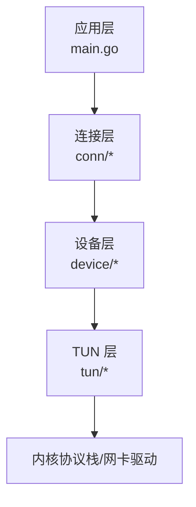
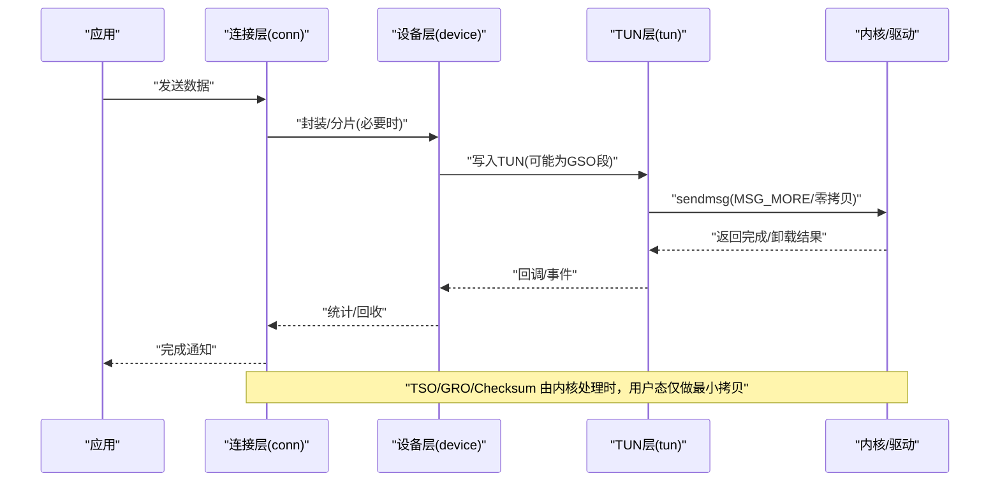
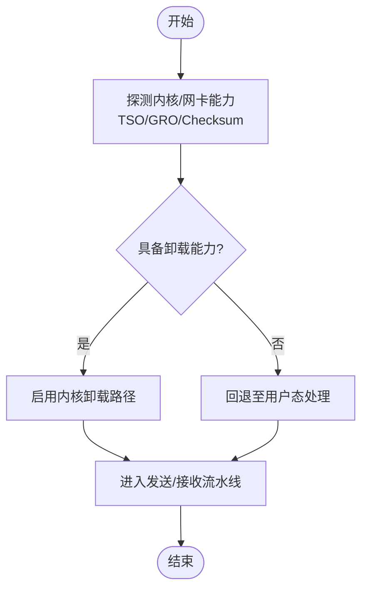
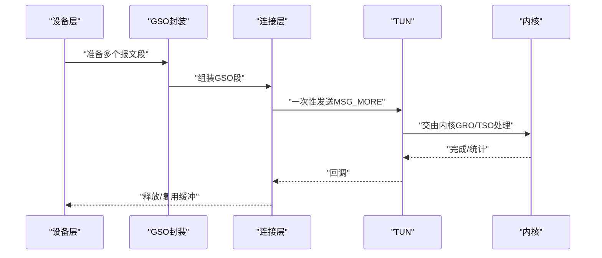
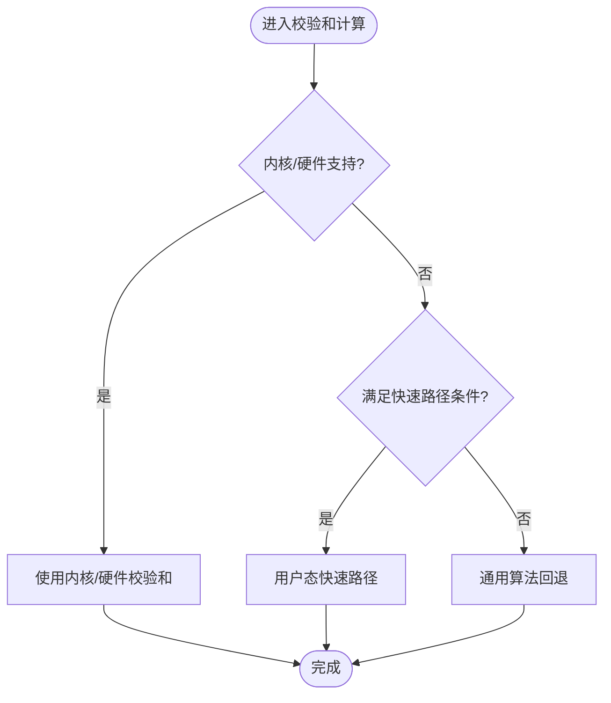
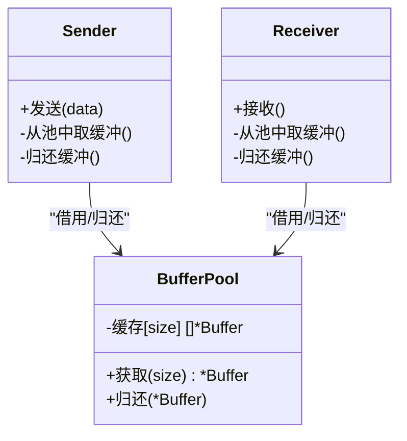
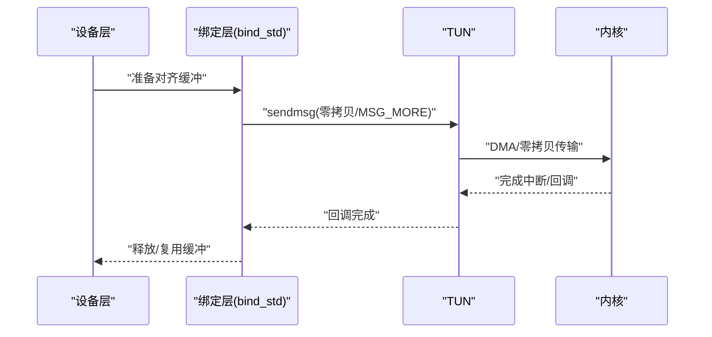
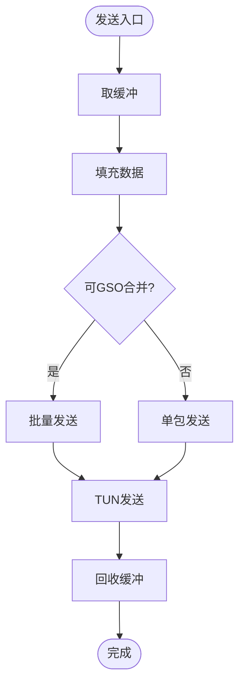

# 性能优化

<cite>
**本文引用的文件**
- [conn/features_linux.go](file://conn/features_linux.go)
- [conn/gso_linux.go](file://conn/gso_linux.go)
- [conn/bind_std.go](file://conn/bind_std.go)
- [device/pools.go](file://device/pools.go)
- [device/receive.go](file://device/receive.go)
- [device/send.go](file://device/send.go)
- [tun/offload_linux.go](file://tun/offload_linux.go)
- [tun/checksum.go](file://tun/checksum.go)
- [tun/tun_linux.go](file://tun/tun_linux.go)
- [main.go](file://main.go)
</cite>

## 目录
1. [简介](#简介)
2. [项目结构](#项目结构)
3. [核心组件](#核心组件)
4. [架构总览](#架构总览)
5. [详细组件分析](#详细组件分析)
6. [依赖关系分析](#依赖关系分析)
7. [性能考量](#性能考量)
8. [故障排查指南](#故障排查指南)
9. [结论](#结论)
10. [附录](#附录)

## 简介
本文件聚焦于 wireguard-go 在 Linux 平台上的高性能路径，围绕内核卸载、内存与缓冲复用、校验和计算优化、数据包对齐、零拷贝策略以及监控与基准测试方法展开。文档同时给出不同工作负载下的优化策略选择建议与调优实践，帮助读者在真实场景中最大化吞吐并降低 CPU 占用。

## 项目结构
与性能相关的关键模块分布如下：
- conn: 网络套接字绑定与特性探测（TSO/GRO/Checksum），GSO 封装，控制函数等
- device: 设备状态机、收发管线、内存池与队列常量
- tun: TUN 驱动交互、Linux 平台卸载能力检测、校验和辅助
- main: 程序入口与初始化流程

图表来源
- [main.go:1-200](file://main.go#L1-L200)
- [conn/features_linux.go:1-200](file://conn/features_linux.go#L1-L200)
- [device/receive.go:1-200](file://device/receive.go#L1-L200)
- [device/send.go:1-200](file://device/send.go#L1-L200)
- [tun/offload_linux.go:1-200](file://tun/offload_linux.go#L1-L200)

章节来源
- [main.go:1-200](file://main.go#L1-L200)

## 核心组件
- 内核卸载能力探测与启用：通过 conn/features_linux.go 探测 TSO/GRO/Checksum 支持，并在发送/接收路径中按需开启或回退
- GSO/GRO 封装：conn/gso_linux.go 提供通用分段/聚合接口，配合内核实现减少系统调用与拷贝
- 内存池与缓冲区复用：device/pools.go 管理发送/接收缓冲区池，降低分配开销与碎片化
- 校验和计算优化：tun/checksum.go 提供快速路径与回退逻辑，结合内核卸载减少 CPU 计算
- 数据包对齐与零拷贝：tun/tun_linux.go 与 conn/bind_std.go 协同，尽量保持对齐并避免多余拷贝
- 收发管线：device/receive.go 与 device/send.go 串联上述能力，形成端到端高性能路径

章节来源
- [conn/features_linux.go:1-200](file://conn/features_linux.go#L1-L200)
- [conn/gso_linux.go:1-200](file://conn/gso_linux.go#L1-L200)
- [device/pools.go:1-200](file://device/pools.go#L1-L200)
- [tun/checksum.go:1-200](file://tun/checksum.go#L1-L200)
- [tun/tun_linux.go:1-200](file://tun/tun_linux.go#L1-L200)
- [conn/bind_std.go:1-200](file://conn/bind_std.go#L1-L200)
- [device/receive.go:1-200](file://device/receive.go#L1-L200)
- [device/send.go:1-200](file://device/send.go#L1-L200)

## 架构总览
下图展示了从应用到内核的完整数据流，突出卸载与零拷贝关键点：

图表来源
- [conn/features_linux.go:1-200](file://conn/features_linux.go#L1-L200)
- [conn/gso_linux.go:1-200](file://conn/gso_linux.go#L1-L200)
- [device/send.go:1-200](file://device/send.go#L1-L200)
- [tun/offload_linux.go:1-200](file://tun/offload_linux.go#L1-L200)
- [tun/tun_linux.go:1-200](file://tun/tun_linux.go#L1-L200)

## 详细组件分析

### 内核卸载能力探测与启用（TSO/GRO/Checksum）
- 功能要点
  - 探测网卡/内核是否支持 TCP 分段卸载(TSO)、通用接收聚合(GRO)、硬件校验和(CSUM)
  - 根据能力动态调整发送/接收路径：优先走内核卸载，失败则回退到用户态处理
- 关键实现位置
  - 能力探测与开关：conn/features_linux.go
  - 发送路径使用：device/send.go
  - 接收路径使用：device/receive.go
  - TUN 卸载能力：tun/offload_linux.go

图表来源
- [conn/features_linux.go:1-200](file://conn/features_linux.go#L1-L200)
- [tun/offload_linux.go:1-200](file://tun/offload_linux.go#L1-L200)
- [device/send.go:1-200](file://device/send.go#L1-L200)
- [device/receive.go:1-200](file://device/receive.go#L1-L200)

章节来源
- [conn/features_linux.go:1-200](file://conn/features_linux.go#L1-L200)
- [tun/offload_linux.go:1-200](file://tun/offload_linux.go#L1-L200)
- [device/send.go:1-200](file://device/send.go#L1-L200)
- [device/receive.go:1-200](file://device/receive.go#L1-L200)

### GSO/GRO 封装与批量 I/O
- 功能要点
  - 将多个小报文合并为更大的 GSO 段进行发送，减少系统调用次数与上下文切换
  - 接收侧利用 GRO 将多段报文聚合后交给上层，降低处理开销
- 关键实现位置
  - GSO 封装接口：conn/gso_linux.go
  - 发送/接收管线集成：device/send.go、device/receive.go

图表来源
- [conn/gso_linux.go:1-200](file://conn/gso_linux.go#L1-L200)
- [device/send.go:1-200](file://device/send.go#L1-L200)
- [device/receive.go:1-200](file://device/receive.go#L1-L200)

章节来源
- [conn/gso_linux.go:1-200](file://conn/gso_linux.go#L1-L200)
- [device/send.go:1-200](file://device/send.go#L1-L200)
- [device/receive.go:1-200](file://device/receive.go#L1-L200)

### 校验和计算优化
- 功能要点
  - 优先使用内核/硬件校验和；不可用时回退到用户态快速路径
  - 针对常见头部长度与对齐情况优化计算循环
- 关键实现位置
  - 校验和辅助：tun/checksum.go
  - 发送/接收路径中的条件分支：device/send.go、device/receive.go

图表来源
- [tun/checksum.go:1-200](file://tun/checksum.go#L1-L200)
- [device/send.go:1-200](file://device/send.go#L1-L200)
- [device/receive.go:1-200](file://device/receive.go#L1-L200)

章节来源
- [tun/checksum.go:1-200](file://tun/checksum.go#L1-L200)
- [device/send.go:1-200](file://device/send.go#L1-L200)
- [device/receive.go:1-200](file://device/receive.go#L1-L200)

### 内存池管理与缓冲区复用
- 功能要点
  - 集中管理发送/接收缓冲区池，减少频繁分配/释放带来的抖动
  - 按大小分类复用，适配不同报文尺寸，降低碎片化
- 关键实现位置
  - 内存池与常量：device/pools.go
  - 发送/接收路径中的获取/归还：device/send.go、device/receive.go

图表来源
- [device/pools.go:1-200](file://device/pools.go#L1-L200)
- [device/send.go:1-200](file://device/send.go#L1-L200)
- [device/receive.go:1-200](file://device/receive.go#L1-L200)

章节来源
- [device/pools.go:1-200](file://device/pools.go#L1-L200)
- [device/send.go:1-200](file://device/send.go#L1-L200)
- [device/receive.go:1-200](file://device/receive.go#L1-L200)

### 数据包对齐与零拷贝
- 功能要点
  - 尽量保证数据起始地址对齐，提升 DMA 与内核拷贝效率
  - 使用 sendmsg/recvmsg 与 MSG_ZEROCOPY 等标志，减少用户态与内核态之间的数据复制
- 关键实现位置
  - TUN 零拷贝与对齐：tun/tun_linux.go
  - 标准绑定层的发送/接收封装：conn/bind_std.go

图表来源
- [tun/tun_linux.go:1-200](file://tun/tun_linux.go#L1-L200)
- [conn/bind_std.go:1-200](file://conn/bind_std.go#L1-L200)

章节来源
- [tun/tun_linux.go:1-200](file://tun/tun_linux.go#L1-L200)
- [conn/bind_std.go:1-200](file://conn/bind_std.go#L1-L200)

### 发送与接收流水线
- 发送路径
  - 从内存池取缓冲 -> 填充数据 -> 尝试 GSO 合并 -> 调用 TUN 发送（零拷贝/MSG_MORE）-> 统计与回收
- 接收路径
  - 从 TUN 读取 -> 若启用 GRO 则聚合 -> 校验和验证（内核/用户态）-> 交付上层 -> 归还缓冲

图表来源
- [device/send.go:1-200](file://device/send.go#L1-L200)
- [device/pools.go:1-200](file://device/pools.go#L1-L200)
- [conn/gso_linux.go:1-200](file://conn/gso_linux.go#L1-L200)
- [tun/tun_linux.go:1-200](file://tun/tun_linux.go#L1-L200)

章节来源
- [device/send.go:1-200](file://device/send.go#L1-L200)
- [device/receive.go:1-200](file://device/receive.go#L1-L200)
- [device/pools.go:1-200](file://device/pools.go#L1-L200)
- [conn/gso_linux.go:1-200](file://conn/gso_linux.go#L1-L200)
- [tun/tun_linux.go:1-200](file://tun/tun_linux.go#L1-L200)

## 依赖关系分析
- 模块耦合
  - device 依赖 conn 的能力探测与 GSO 封装
  - conn 依赖 tun 的卸载能力与零拷贝接口
  - tun 依赖内核/驱动提供的卸载与 DMA 能力
- 外部依赖
  - 操作系统内核版本与网卡驱动对 TSO/GRO/Checksum/Zerocopy 的支持程度
  - 系统参数（如 net.core.*、dev.*）影响聚合与队列行为

图表来源
- [device/send.go:1-200](file://device/send.go#L1-L200)
- [device/receive.go:1-200](file://device/receive.go#L1-L200)
- [conn/features_linux.go:1-200](file://conn/features_linux.go#L1-L200)
- [conn/gso_linux.go:1-200](file://conn/gso_linux.go#L1-L200)
- [tun/offload_linux.go:1-200](file://tun/offload_linux.go#L1-L200)

章节来源
- [device/send.go:1-200](file://device/send.go#L1-L200)
- [device/receive.go:1-200](file://device/receive.go#L1-L200)
- [conn/features_linux.go:1-200](file://conn/features_linux.go#L1-L200)
- [conn/gso_linux.go:1-200](file://conn/gso_linux.go#L1-L200)
- [tun/offload_linux.go:1-200](file://tun/offload_linux.go#L1-L200)

## 性能考量
- 卸载优先级
  - 优先启用 TSO/GRO/Checksum，减少 CPU 与拷贝
  - 当能力不足时自动回退，确保稳定性
- 内存与缓冲
  - 合理设置池大小与分级，匹配典型报文长度分布
  - 避免过大缓冲导致内存浪费，过小导致频繁分配
- 对齐与零拷贝
  - 尽量对齐数据边界，利用内核 DMA 优势
  - 使用零拷贝标志减少复制，但需关注错误恢复与重传成本
- 批量化
  - 通过 GSO 合并与 MSG_MORE 减少系统调用
  - 在高吞吐场景下显著提升吞吐并降低延迟抖动
- 监控指标
  - 发送/接收速率、丢包率、重传率
  - 系统调用次数、CPU 利用率、内存分配频率
  - 卸载命中率（TSO/GRO/Checksum）
- 基准测试方法
  - 使用标准工具（如 iperf3）在不同 MTU/窗口/并发下进行对比
  - 分别测量启用/禁用卸载时的吞吐与 CPU 占用
  - 记录不同报文大小分布下的性能差异

[本节为通用指导，不直接分析具体文件]

## 故障排查指南
- 常见问题定位
  - 卸载未生效：检查 conn/features_linux.go 能力探测与 tun/offload_linux.go 的返回值
  - 高 CPU：确认是否回退到用户态校验和或未能合并 GSO
  - 内存抖动：观察 device/pools.go 的分配/归还频率与池大小配置
- 诊断步骤
  - 逐步关闭卸载能力，观察性能变化以定位瓶颈
  - 增加日志输出，跟踪发送/接收路径的关键分支
  - 使用系统工具（perf、bpftrace）分析内核路径热点

章节来源
- [conn/features_linux.go:1-200](file://conn/features_linux.go#L1-L200)
- [tun/offload_linux.go:1-200](file://tun/offload_linux.go#L1-L200)
- [device/pools.go:1-200](file://device/pools.go#L1-L200)
- [device/send.go:1-200](file://device/send.go#L1-L200)
- [device/receive.go:1-200](file://device/receive.go#L1-L200)

## 结论
通过在内核卸载、GSO/GRO、校验和优化、内存池与零拷贝等方面的协同设计，wireguard-go 在 Linux 平台上实现了高效的数据面路径。实际部署中应根据工作负载特征选择合适的优化组合，并通过监控与基准测试持续验证效果。

[本节为总结性内容，不直接分析具体文件]

## 附录
- 工作负载策略建议
  - 小包高频：优先启用 GSO/GRO，增大批量化，关注 CPU 与队列深度
  - 大流高吞吐：启用 TSO/Checksum，使用零拷贝，合理设置窗口与 MTU
  - 混合负载：动态切换策略，基于监控指标自适应调整
- 配置与最佳实践
  - 定期评估内核/驱动能力，及时升级以获得更好的卸载支持
  - 结合业务峰值与资源限制，调优内存池与队列参数
  - 建立回归测试，确保变更不影响性能与稳定性

[本节为补充信息，不直接分析具体文件]