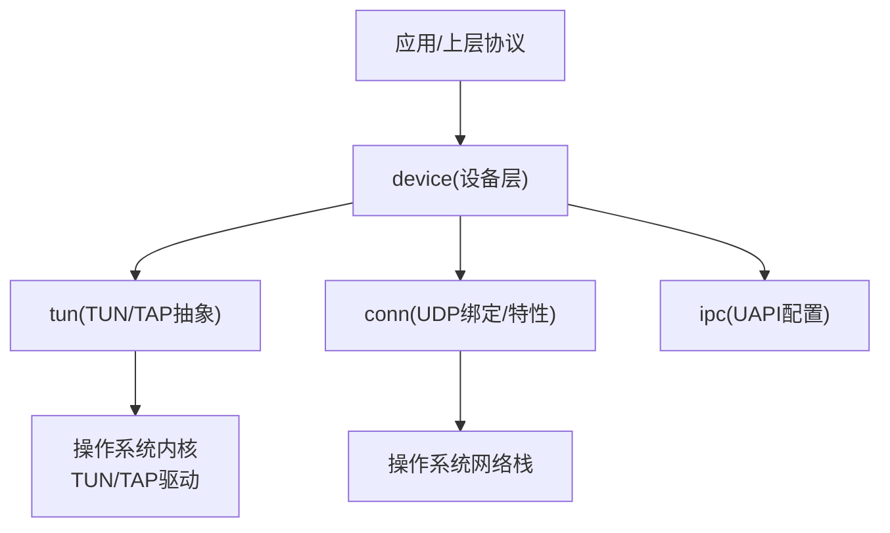
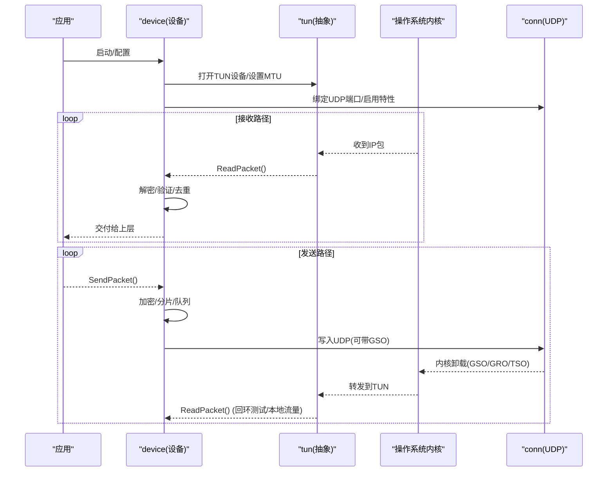
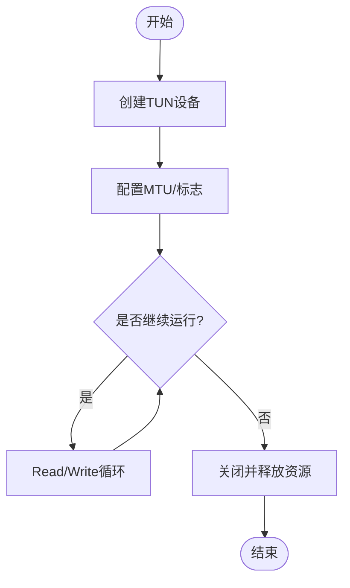
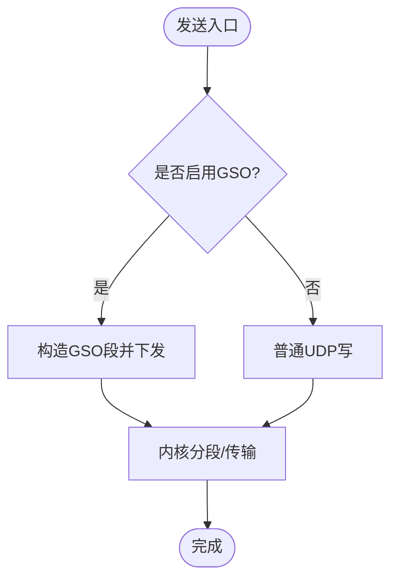
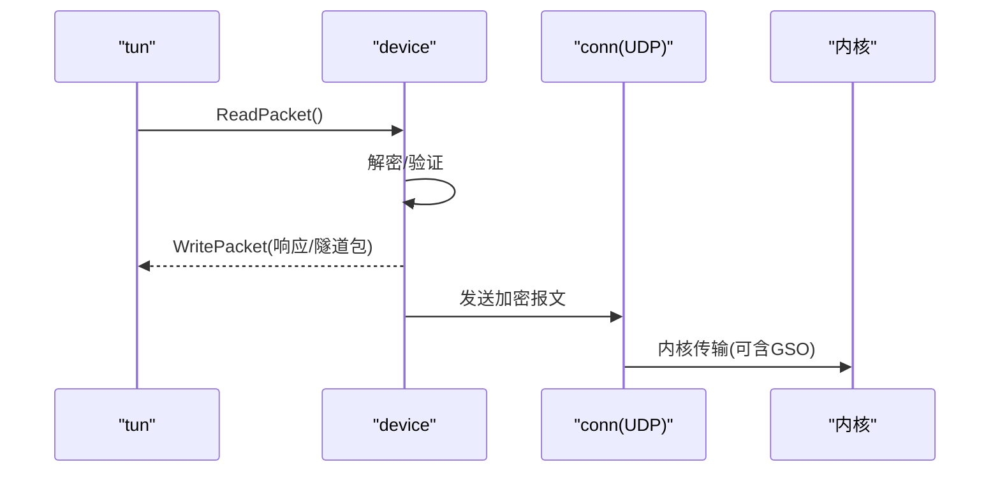
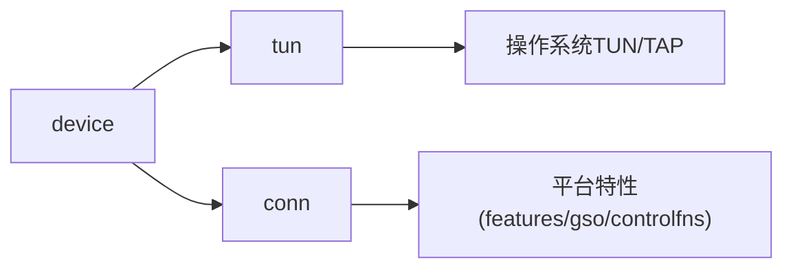

# 设备抽象层

<cite>
**本文引用的文件**
- [tun/tun.go](file://tun/tun.go)
- [tun/tun_linux.go](file://tun/tun_linux.go)
- [tun/tun_windows.go](file://tun/tun_windows.go)
- [tun/tun_darwin.go](file://tun/tun_darwin.go)
- [tun/tun_freebsd.go](file://tun/tun_freebsd.go)
- [tun/tun_openbsd.go](file://tun/tun_openbsd.go)
- [tun/offload_linux.go](file://tun/offload_linux.go)
- [device/device.go](file://device/device.go)
- [device/tun.go](file://device/tun.go)
- [device/send.go](file://device/send.go)
- [device/receive.go](file://device/receive.go)
- [conn/conn.go](file://conn/conn.go)
- [conn/bind_std.go](file://conn/bind_std.go)
- [conn/features_linux.go](file://conn/features_linux.go)
- [conn/gso_linux.go](file://conn/gso_linux.go)
- [conn/controlfns_linux.go](file://conn/controlfns_linux.go)
- [ipc/uapi_linux.go](file://ipc/uapi_linux.go)
- [main.go](file://main.go)
</cite>

## 目录
1. [简介](#简介)
2. [项目结构](#项目结构)
3. [核心组件](#核心组件)
4. [架构总览](#架构总览)
5. [详细组件分析](#详细组件分析)
6. [依赖关系分析](#依赖关系分析)
7. [性能考量](#性能考量)
8. [故障排查指南](#故障排查指南)
9. [结论](#结论)
10. [附录](#附录)

## 简介
本文件面向“设备抽象层”，聚焦TUN/TAP设备的跨平台抽象设计、生命周期与资源管理、内核卸载优化、驱动加载与配置，以及新平台适配与性能调优。目标是帮助开发者理解wireguard-go如何在不同操作系统上统一暴露虚拟网络接口能力，并通过内核特性（如GSO/GRO/TSO）提升数据包处理性能。

## 项目结构
设备抽象层主要位于以下模块：
- tun：跨平台TUN/TAP设备抽象与实现（Linux、Windows、macOS、FreeBSD、OpenBSD）
- device：WireGuard设备状态机、收发管线、与TUN的集成
- conn：网络套接字绑定与平台特性（如GSO、标记、粘性路由等）
- ipc：UAPI接口（用于动态配置）
- main：入口与初始化流程

图表来源
- [device/device.go:1-200](file://device/device.go#L1-L200)
- [tun/tun.go:1-200](file://tun/tun.go#L1-L200)
- [conn/conn.go:1-200](file://conn/conn.go#L1-L200)

章节来源
- [main.go:1-200](file://main.go#L1-L200)
- [device/device.go:1-200](file://device/device.go#L1-L200)
- [tun/tun.go:1-200](file://tun/tun.go#L1-L200)
- [conn/conn.go:1-200](file://conn/conn.go#L1-L200)

## 核心组件
- TUN/TAP抽象接口：定义统一的读写、MTU查询、关闭等能力，屏蔽平台差异。
- 平台实现：
  - Linux：基于netlink与系统调用创建TUN设备，支持GSO/GRO/TSO等卸载能力。
  - Windows：通过NPI/NDIS或WFP相关机制暴露虚拟适配器，封装为统一接口。
  - macOS/FreeBSD/OpenBSD：使用各自系统的TUN/TAP接口，提供一致行为。
- 设备层集成：device将TUN作为数据面通道，结合加密/解密、队列、定时器完成完整收发流程。
- 连接与特性：conn负责UDP绑定与平台特性探测（如GSO），在发送路径中尽可能利用内核卸载。
- UAPI：通过IPC接口动态配置设备、对端、密钥等。

章节来源
- [tun/tun.go:1-200](file://tun/tun.go#L1-L200)
- [tun/tun_linux.go:1-200](file://tun/tun_linux.go#L1-L200)
- [tun/tun_windows.go:1-200](file://tun/tun_windows.go#L1-L200)
- [tun/tun_darwin.go:1-200](file://tun/tun_darwin.go#L1-L200)
- [tun/tun_freebsd.go:1-200](file://tun/tun_freebsd.go#L1-L200)
- [tun/tun_openbsd.go:1-200](file://tun/tun_openbsd.go#L1-L200)
- [device/device.go:1-200](file://device/device.go#L1-L200)
- [conn/conn.go:1-200](file://conn/conn.go#L1-L200)

## 架构总览
下图展示从应用到内核的数据流与关键组件交互：

图表来源
- [device/device.go:1-200](file://device/device.go#L1-L200)
- [device/send.go:1-200](file://device/send.go#L1-L200)
- [device/receive.go:1-200](file://device/receive.go#L1-L200)
- [tun/tun.go:1-200](file://tun/tun.go#L1-L200)
- [conn/conn.go:1-200](file://conn/conn.go#L1-L200)

## 详细组件分析

### TUN/TAP抽象与生命周期
- 抽象目标：统一Read/Write/Close/MTU等接口，屏蔽平台差异。
- 生命周期：
  - 创建：根据平台选择具体实现（Linux TUN、Windows NDIS/WFP、BSD TUN）。
  - 配置：设置MTU、标志位、命名策略（可选）。
  - 运行：持续Read/Write循环，配合设备层的收发队列。
  - 关闭：释放文件描述符/句柄、清理队列、通知设备层。
- 错误处理：捕获并上报底层错误（权限不足、设备不存在、系统限制等）。

图表来源
- [tun/tun.go:1-200](file://tun/tun.go#L1-L200)
- [tun/tun_linux.go:1-200](file://tun/tun_linux.go#L1-L200)
- [tun/tun_windows.go:1-200](file://tun/tun_windows.go#L1-L200)
- [tun/tun_darwin.go:1-200](file://tun/tun_darwin.go#L1-L200)

章节来源
- [tun/tun.go:1-200](file://tun/tun.go#L1-L200)
- [tun/tun_linux.go:1-200](file://tun/tun_linux.go#L1-L200)
- [tun/tun_windows.go:1-200](file://tun/tun_windows.go#L1-L200)
- [tun/tun_darwin.go:1-200](file://tun/tun_darwin.go#L1-L200)

### 平台特定实现与差异
- Linux
  - 使用系统TUN接口与netlink进行设备管理与特性探测。
  - 支持GSO/GRO/TSO卸载，显著降低CPU占用。
  - 可通过控制函数设置socket选项（如标记、粘性路由）。
- Windows
  - 通过NDIS/NPI或WFP暴露虚拟适配器，封装为统一接口。
  - 关注内存对齐、批处理I/O与零拷贝优化。
- macOS/FreeBSD/OpenBSD
  - 使用各自TUN/TAP接口，遵循通用语义。
  - 针对各系统特性做最小化适配。

章节来源
- [tun/tun_linux.go:1-200](file://tun/tun_linux.go#L1-L200)
- [tun/tun_windows.go:1-200](file://tun/tun_windows.go#L1-L200)
- [tun/tun_darwin.go:1-200](file://tun/tun_darwin.go#L1-L200)
- [tun/tun_freebsd.go:1-200](file://tun/tun_freebsd.go#L1-L200)
- [tun/tun_openbsd.go:1-200](file://tun/tun_openbsd.go#L1-L200)

### 内核卸载与性能优化
- GSO（Generic Segmentation Offload）
  - 在发送路径将大包交给内核分段，减少用户态分片开销。
  - 通过conn层检测并启用，结合UDP封装。
- GRO（Generic Receive Offload）
  - 在接收路径合并小包，减少中断与上下文切换。
- TSO（TCP Segmentation Offload）
  - 若涉及TCP透传场景，由内核完成分段。
- 其他优化
  - 批量I/O、内存池复用、避免不必要的拷贝。
  - 平台特定的socket选项（如Linux上的标记、粘滞路由）。

图表来源
- [conn/gso_linux.go:1-200](file://conn/gso_linux.go#L1-L200)
- [conn/features_linux.go:1-200](file://conn/features_linux.go#L1-L200)
- [device/send.go:1-200](file://device/send.go#L1-L200)

章节来源
- [conn/gso_linux.go:1-200](file://conn/gso_linux.go#L1-L200)
- [conn/features_linux.go:1-200](file://conn/features_linux.go#L1-L200)
- [device/send.go:1-200](file://device/send.go#L1-L200)

### 设备驱动的加载与配置
- 驱动加载
  - Linux：通常由内核自动加载TUN模块；必要时通过modprobe加载。
  - Windows：安装虚拟适配器驱动，系统自动注册。
  - BSD/macOS：TUN/TAP通常为内核扩展或内置模块。
- 配置方法
  - 通过UAPI（ipc/uapi_*）动态添加对端、密钥、路由等。
  - 通过系统工具（如ip命令）调整TUN设备参数（MTU、地址、路由）。
  - 通过conn控制函数设置socket选项（如Linux上的标记、粘滞路由）。

章节来源
- [ipc/uapi_linux.go:1-200](file://ipc/uapi_linux.go#L1-L200)
- [conn/controlfns_linux.go:1-200](file://conn/controlfns_linux.go#L1-L200)

### 设备层与TUN的集成
- device层负责：
  - 打开TUN设备并设置MTU。
  - 启动收发协程，ReadPacket/WritePacket与加密/解密流水线对接。
  - 管理队列、定时器、对端状态。
- 典型流程：
  - 接收：TUN读取IP包 -> device解密 -> 校验 -> 投递给上层。
  - 发送：上层请求 -> device加密 -> 队列 -> UDP发送（可能走GSO）。

图表来源
- [device/device.go:1-200](file://device/device.go#L1-L200)
- [device/receive.go:1-200](file://device/receive.go#L1-L200)
- [device/send.go:1-200](file://device/send.go#L1-L200)
- [tun/tun.go:1-200](file://tun/tun.go#L1-L200)

章节来源
- [device/device.go:1-200](file://device/device.go#L1-L200)
- [device/receive.go:1-200](file://device/receive.go#L1-L200)
- [device/send.go:1-200](file://device/send.go#L1-L200)
- [tun/tun.go:1-200](file://tun/tun.go#L1-L200)

### 新平台适配开发指南
- 步骤
  - 在tun目录下新增平台文件（如tun_<os>.go），实现统一接口。
  - 在conn目录下补充平台特性（如GSO、标记、粘性路由）。
  - 在device中确保对新平台的TUN行为兼容。
  - 编写单元测试与基准测试，覆盖关键路径。
- 注意事项
  - 保持接口稳定，避免破坏现有调用方。
  - 明确平台限制（如MTU上限、权限要求）。
  - 提供清晰的错误类型与日志信息。

章节来源
- [tun/tun.go:1-200](file://tun/tun.go#L1-L200)
- [conn/conn.go:1-200](file://conn/conn.go#L1-L200)

## 依赖关系分析
- device依赖tun与conn：
  - device通过tun访问虚拟网卡，通过conn进行UDP通信。
- 平台特性集中在conn与tun的平台文件中：
  - Linux：features_linux.go、gso_linux.go、controlfns_linux.go、offload_linux.go。
  - Windows/Darwin/BSD：对应平台文件提供差异化实现。

图表来源
- [device/device.go:1-200](file://device/device.go#L1-L200)
- [tun/tun.go:1-200](file://tun/tun.go#L1-L200)
- [conn/conn.go:1-200](file://conn/conn.go#L1-L200)
- [conn/features_linux.go:1-200](file://conn/features_linux.go#L1-L200)
- [conn/gso_linux.go:1-200](file://conn/gso_linux.go#L1-L200)
- [conn/controlfns_linux.go:1-200](file://conn/controlfns_linux.go#L1-L200)

章节来源
- [device/device.go:1-200](file://device/device.go#L1-L200)
- [conn/features_linux.go:1-200](file://conn/features_linux.go#L1-L200)
- [conn/gso_linux.go:1-200](file://conn/gso_linux.go#L1-L200)
- [conn/controlfns_linux.go:1-200](file://conn/controlfns_linux.go#L1-L200)

## 性能考量
- 启用内核卸载
  - Linux：优先启用GSO/GRO/TSO，减少用户态分片与拷贝。
  - Windows：利用NDIS批处理与零拷贝路径。
- 队列与缓冲
  - 合理设置队列长度与缓冲区大小，避免拥塞与丢包。
- I/O模式
  - 使用非阻塞I/O与批量读写，降低系统调用次数。
- 监控指标
  - 收发包速率、延迟、丢包率、CPU占用、内存使用。
  - 平台特定计数器（如内核卸载统计）。

[本节为通用指导，不直接分析具体文件]

## 故障排查指南
- 常见问题
  - 权限不足：检查TUN设备权限或管理员权限。
  - 驱动未加载：确认内核模块或虚拟适配器已正确安装。
  - MTU不匹配：调整TUN MTU与应用层MTU一致。
  - 卸载失败：检查内核版本与特性支持。
- 定位方法
  - 查看日志与错误码。
  - 使用系统工具（如ip、netstat、perf）观察网络栈状态。
  - 在关键路径增加调试输出（谨慎生产环境）。

章节来源
- [tun/errors.go:1-200](file://tun/errors.go#L1-L200)
- [conn/errors_default.go:1-200](file://conn/errors_default.go#L1-L200)
- [conn/errors_linux.go:1-200](file://conn/errors_linux.go#L1-L200)

## 结论
设备抽象层通过统一的TUN/TAP接口屏蔽了多平台差异，并在Linux等平台充分利用内核卸载能力，显著提升性能。device层将TUN与UDP收发、加密解密、队列与定时器有机结合，形成完整的VPN数据面。通过UAPI可实现动态配置，满足灵活部署需求。新平台适配需遵循接口契约，完善特性探测与错误处理，并提供充分的测试覆盖。

[本节为总结性内容，不直接分析具体文件]

## 附录
- 快速上手
  - 启动主程序，加载TUN设备，配置对端与密钥。
  - 通过UAPI动态调整配置。
- 参考文件
  - 入口与初始化：[main.go:1-200](file://main.go#L1-L200)
  - 设备核心：[device/device.go:1-200](file://device/device.go#L1-L200)
  - TUN抽象与平台实现：[tun/tun.go:1-200](file://tun/tun.go#L1-L200)、[tun/tun_linux.go:1-200](file://tun/tun_linux.go#L1-L200)、[tun/tun_windows.go:1-200](file://tun/tun_windows.go#L1-L200)、[tun/tun_darwin.go:1-200](file://tun/tun_darwin.go#L1-L200)
  - 内核卸载与特性：[conn/gso_linux.go:1-200](file://conn/gso_linux.go#L1-L200)、[conn/features_linux.go:1-200](file://conn/features_linux.go#L1-L200)、[conn/controlfns_linux.go:1-200](file://conn/controlfns_linux.go#L1-L200)
  - UAPI配置：[ipc/uapi_linux.go:1-200](file://ipc/uapi_linux.go#L1-L200)