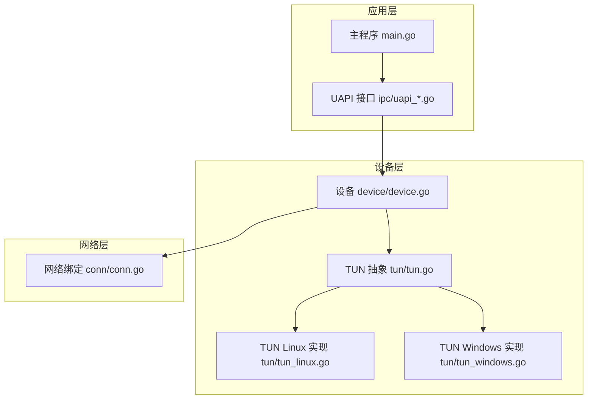
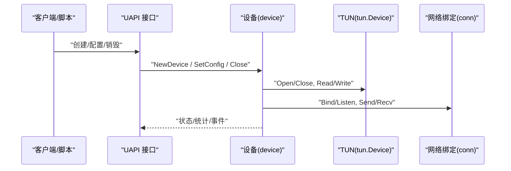
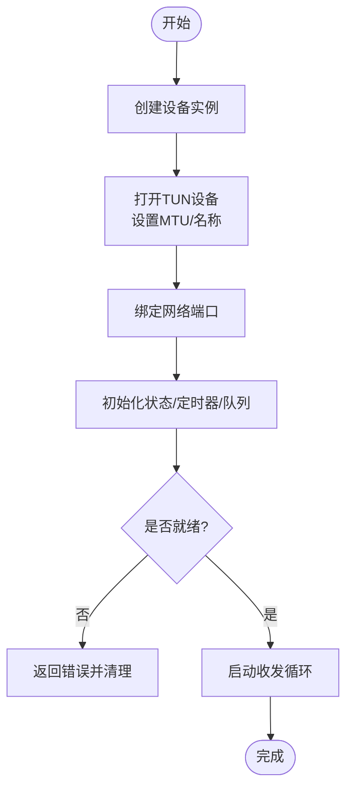
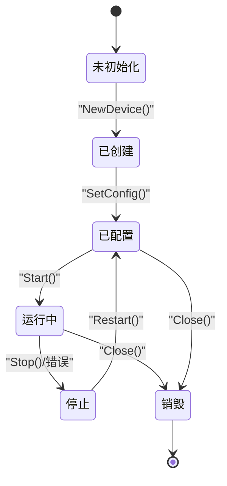
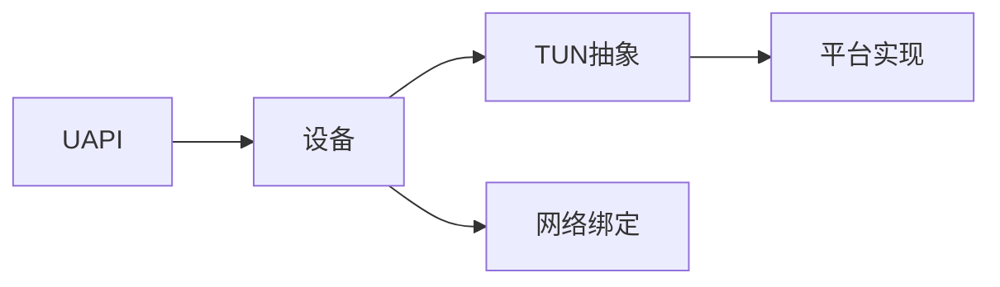

# 设备生命周期管理

<cite>
**本文引用的文件**
- [device/device.go](file://device/device.go)
- [device/tun.go](file://device/tun.go)
- [tun/tun.go](file://tun/tun.go)
- [tun/tun_linux.go](file://tun/tun_linux.go)
- [tun/tun_windows.go](file://tun/tun_windows.go)
- [conn/conn.go](file://conn/conn.go)
- [ipc/uapi_unix.go](file://ipc/uapi_unix.go)
- [ipc/uapi_windows.go](file://ipc/uapi_windows.go)
- [main.go](file://main.go)
</cite>

## 目录
1. [简介](#简介)
2. [项目结构](#项目结构)
3. [核心组件](#核心组件)
4. [架构总览](#架构总览)
5. [详细组件分析](#详细组件分析)
6. [依赖关系分析](#依赖关系分析)
7. [性能考虑](#性能考虑)
8. [故障排查指南](#故障排查指南)
9. [结论](#结论)
10. [附录](#附录)

## 简介
本文件聚焦于TUN设备的生命周期管理，覆盖创建、初始化、配置与销毁全过程；阐述设备状态转换与管理机制；总结资源分配与释放的最佳实践；说明故障恢复与热插拔支持；给出设备监控与健康检查的实现思路；解释并发访问控制与同步机制；并提供API使用示例与错误处理模式。内容基于wireguard-go代码库中的设备层（device）、TUN抽象层（tun）以及平台相关实现进行系统化梳理。

## 项目结构
围绕设备生命周期，关键路径如下：
- 设备核心：device/device.go 负责设备对象、状态机、定时器、队列与收发流程协调。
- TUN抽象与平台实现：tun/tun.go 定义接口；tun/tun_linux.go、tun/tun_windows.go 提供具体实现。
- 网络绑定：conn/conn.go 提供套接字/UDP绑定能力，供设备发送/接收数据。
- UAPI接口：ipc/uapi_*.go 暴露配置与查询接口，驱动设备生命周期操作。
- 入口程序：main.go 启动并编排各子系统。

图表来源
- [main.go:1-200](file://main.go#L1-L200)
- [ipc/uapi_unix.go:1-300](file://ipc/uapi_unix.go#L1-L300)
- [ipc/uapi_windows.go:1-300](file://ipc/uapi_windows.go#L1-L300)
- [device/device.go:1-400](file://device/device.go#L1-L400)
- [tun/tun.go:1-200](file://tun/tun.go#L1-L200)
- [tun/tun_linux.go:1-200](file://tun/tun_linux.go#L1-L200)
- [tun/tun_windows.go:1-200](file://tun/tun_windows.go#L1-L200)
- [conn/conn.go:1-200](file://conn/conn.go#L1-L200)

章节来源
- [main.go:1-200](file://main.go#L1-L200)
- [device/device.go:1-400](file://device/device.go#L1-L400)
- [tun/tun.go:1-200](file://tun/tun.go#L1-L200)
- [conn/conn.go:1-200](file://conn/conn.go#L1-L200)
- [ipc/uapi_unix.go:1-300](file://ipc/uapi_unix.go#L1-L300)
- [ipc/uapi_windows.go:1-300](file://ipc/uapi_windows.go#L1-L300)

## 核心组件
- 设备对象（device.Device）：封装对等体、密钥对、队列、定时器、状态机与收发管线，是生命周期管理的核心。
- TUN接口（tun.Device）：抽象系统TUN设备读写，屏蔽平台差异。
- 网络绑定（conn.Bind）：提供UDP套接字绑定、GSO/标记等特性，用于数据包收发。
- UAPI（ipc）：通过Unix域套接字或命名管道暴露配置与查询命令，驱动设备创建、配置与销毁。

章节来源
- [device/device.go:1-400](file://device/device.go#L1-L400)
- [tun/tun.go:1-200](file://tun/tun.go#L1-L200)
- [conn/conn.go:1-200](file://conn/conn.go#L1-L200)
- [ipc/uapi_unix.go:1-300](file://ipc/uapi_unix.go#L1-L300)
- [ipc/uapi_windows.go:1-300](file://ipc/uapi_windows.go#L1-L300)

## 架构总览
设备生命周期由UAPI驱动，经由设备层协调TUN与网络绑定完成数据面建立。整体调用链如下：

图表来源
- [ipc/uapi_unix.go:1-300](file://ipc/uapi_unix.go#L1-L300)
- [ipc/uapi_windows.go:1-300](file://ipc/uapi_windows.go#L1-L300)
- [device/device.go:1-400](file://device/device.go#L1-L400)
- [tun/tun.go:1-200](file://tun/tun.go#L1-L200)
- [conn/conn.go:1-200](file://conn/conn.go#L1-L200)

## 详细组件分析

### TUN设备创建与初始化
- 创建流程
  - UAPI接收到创建请求后，构造设备实例并初始化内部队列、定时器、对等体表等。
  - 设备打开TUN设备句柄，设置MTU、名称等参数，并启动读循环以接收来自内核的数据包。
  - 同时绑定网络端口，启动写循环将加密后的数据包发送至远端。
- 初始化要点
  - 校验并加载配置（对等体、公钥、允许IP、监听端口等）。
  - 初始化密钥派生与会话状态，准备安全通道。
  - 注册健康检查与超时定时器，保障连接活性。

图表来源
- [device/device.go:1-400](file://device/device.go#L1-L400)
- [tun/tun.go:1-200](file://tun/tun.go#L1-L200)
- [tun/tun_linux.go:1-200](file://tun/tun_linux.go#L1-L200)
- [tun/tun_windows.go:1-200](file://tun/tun_windows.go#L1-L200)
- [conn/conn.go:1-200](file://conn/conn.go#L1-L200)

章节来源
- [device/device.go:1-400](file://device/device.go#L1-L400)
- [tun/tun.go:1-200](file://tun/tun.go#L1-L200)
- [tun/tun_linux.go:1-200](file://tun/tun_linux.go#L1-L200)
- [tun/tun_windows.go:1-200](file://tun/tun_windows.go#L1-L200)
- [conn/conn.go:1-200](file://conn/conn.go#L1-L200)

### 设备配置与状态管理
- 配置项
  - 对等体信息（公钥、预共享密钥、允许IP列表、持久保持心跳间隔等）。
  - 监听地址与端口、NAT类型、路由策略等。
- 状态机
  - 典型状态包括：未初始化、已创建、已配置、运行中、停止、销毁。
  - 状态转换受UAPI命令与内部事件（如定时器触发、对等体超时）驱动。
- 并发控制
  - 使用互斥锁保护设备状态与关键数据结构。
  - 读写分离：读循环与写循环分别独立运行，通过无锁队列或带缓冲通道交换数据。

图表来源
- [device/device.go:1-400](file://device/device.go#L1-L400)

章节来源
- [device/device.go:1-400](file://device/device.go#L1-L400)

### 资源分配与释放最佳实践
- 分配
  - 为每个对等体分配独立的会话与队列，避免竞争。
  - 使用对象池复用缓冲区，减少GC压力。
  - 在绑定网络端口时启用必要的内核特性（如GSO、标记），提升吞吐。
- 释放
  - 关闭TUN句柄前确保所有读写循环退出，避免悬空引用。
  - 释放对等体资源（密钥、定时器、队列）后再关闭设备。
  - 捕获并记录资源泄漏告警，便于定位问题。

章节来源
- [device/device.go:1-400](file://device/device.go#L1-L400)
- [tun/tun.go:1-200](file://tun/tun.go#L1-L200)
- [conn/conn.go:1-200](file://conn/conn.go#L1-L200)

### 故障恢复与热插拔支持
- 故障恢复
  - 检测TUN设备不可用或网络异常时，自动重试或切换备用路径。
  - 对等体超时重连：基于心跳与保活定时器，重建会话。
- 热插拔
  - 监听系统事件（如udev/netlink），动态添加/移除TUN设备。
  - 重新配置路由与接口属性，保证服务不中断。

章节来源
- [device/device.go:1-400](file://device/device.go#L1-L400)
- [tun/tun_linux.go:1-200](file://tun/tun_linux.go#L1-L200)
- [tun/tun_windows.go:1-200](file://tun/tun_windows.go#L1-L200)

### 设备监控与健康检查
- 指标采集
  - 统计收发包数、丢包率、延迟、带宽占用等。
  - 暴露对等体状态、密钥轮换次数、队列长度等。
- 健康检查
  - 周期性ping/探测对端可达性。
  - 基于阈值触发告警或自动修复动作（如重启连接）。

章节来源
- [device/device.go:1-400](file://device/device.go#L1-L400)

### 并发访问控制与同步机制
- 互斥与条件变量
  - 保护设备状态变更与关键数据结构更新。
  - 使用条件变量通知等待的协程（如队列满/空）。
- 无锁队列与环形缓冲
  - 在高吞吐场景下降低锁粒度，提高并发性能。
- 取消与优雅退出
  - 使用上下文取消信号，确保所有goroutine可被及时终止。

章节来源
- [device/device.go:1-400](file://device/device.go#L1-L400)

### API使用示例与错误处理模式
- 典型流程
  - 创建设备：调用UAPI创建接口，传入必要参数。
  - 配置对等体：设置公钥、允许IP、心跳间隔等。
  - 启动服务：绑定端口，启动收发循环。
  - 查询状态：获取对等体状态、统计信息。
  - 关闭设备：停止循环，释放资源。
- 错误处理
  - 区分可恢复与不可恢复错误，采取重试或降级策略。
  - 记录详细上下文（对等体ID、错误码、堆栈），便于排障。

章节来源
- [ipc/uapi_unix.go:1-300](file://ipc/uapi_unix.go#L1-L300)
- [ipc/uapi_windows.go:1-300](file://ipc/uapi_windows.go#L1-L300)
- [device/device.go:1-400](file://device/device.go#L1-L400)

## 依赖关系分析
设备层依赖TUN抽象与网络绑定，UAPI作为外部接口驱动设备行为。依赖方向清晰，耦合度低。

图表来源
- [device/device.go:1-400](file://device/device.go#L1-L400)
- [tun/tun.go:1-200](file://tun/tun.go#L1-L200)
- [conn/conn.go:1-200](file://conn/conn.go#L1-L200)
- [ipc/uapi_unix.go:1-300](file://ipc/uapi_unix.go#L1-L300)
- [ipc/uapi_windows.go:1-300](file://ipc/uapi_windows.go#L1-L300)

章节来源
- [device/device.go:1-400](file://device/device.go#L1-L400)
- [tun/tun.go:1-200](file://tun/tun.go#L1-L200)
- [conn/conn.go:1-200](file://conn/conn.go#L1-L200)
- [ipc/uapi_unix.go:1-300](file://ipc/uapi_unix.go#L1-L300)
- [ipc/uapi_windows.go:1-300](file://ipc/uapi_windows.go#L1-L300)

## 性能考虑
- 使用零拷贝或最小拷贝路径，减少内存复制开销。
- 合理设置队列大小与缓冲区，避免拥塞与抖动。
- 利用内核特性（如GSO、TSO）提升吞吐。
- 监控CPU与内存使用，识别热点并进行优化。

[本节为通用指导，无需特定文件来源]

## 故障排查指南
- 常见问题
  - TUN设备无法打开：检查权限与内核模块加载。
  - 对等体无法建立：核对公钥、允许IP与防火墙规则。
  - 高丢包或延迟：检查队列长度与系统限制。
- 诊断步骤
  - 查看日志与指标，定位异常点。
  - 使用抓包工具验证数据流。
  - 逐步禁用功能（如GSO）隔离问题。

章节来源
- [device/device.go:1-400](file://device/device.go#L1-L400)
- [tun/tun.go:1-200](file://tun/tun.go#L1-L200)
- [conn/conn.go:1-200](file://conn/conn.go#L1-L200)

## 结论
通过对TUN设备生命周期的系统性梳理，明确了创建、初始化、配置与销毁的关键步骤，以及状态机、资源管理、并发控制与故障恢复的最佳实践。结合UAPI接口与平台实现，可在不同操作系统上稳定运行，并通过监控与健康检查保障服务质量。

[本节为总结，无需特定文件来源]

## 附录
- 术语
  - TUN：虚拟网络设备，用于用户态与内核态之间的数据包转发。
  - UAPI：用户态API，用于配置与查询设备状态。
  - 对等体：VPN连接的远端节点。
- 参考
  - 设备层源码：device/device.go
  - TUN抽象与实现：tun/tun.go、tun/tun_linux.go、tun/tun_windows.go
  - 网络绑定：conn/conn.go
  - UAPI接口：ipc/uapi_unix.go、ipc/uapi_windows.go
  - 入口程序：main.go

[本节为补充信息，无需特定文件来源]