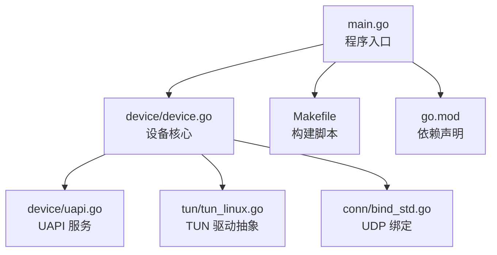
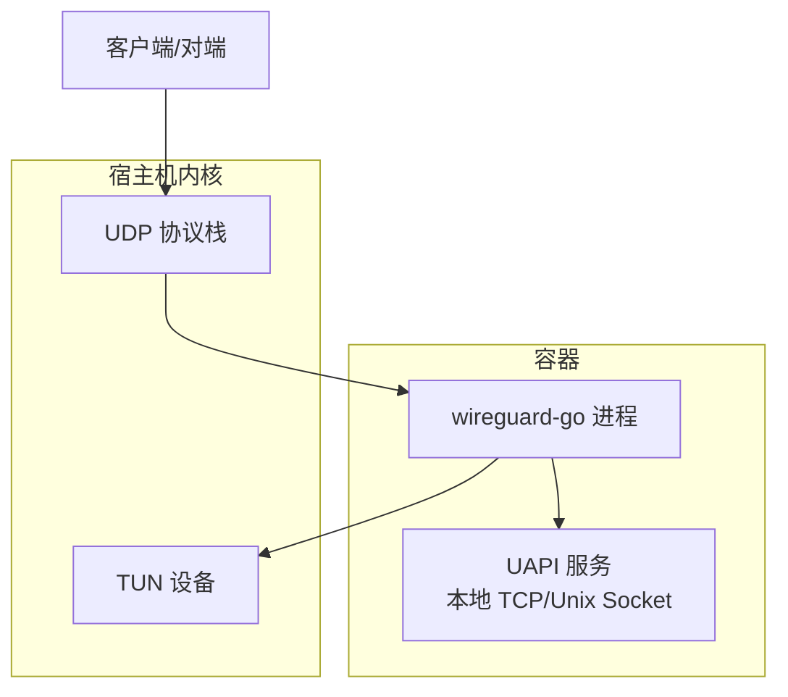
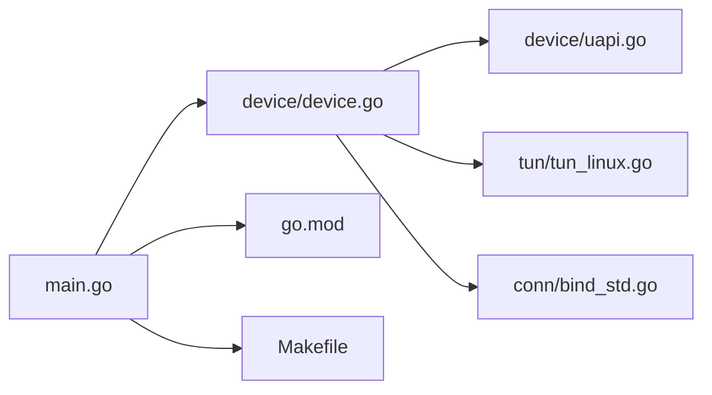

# 容器化部署

<cite>
**本文引用的文件**
- [main.go](file://main.go)
- [Makefile](file://Makefile)
- [README.md](file://README.md)
- [readme_cn.md](file://readme_cn.md)
- [go.mod](file://go.mod)
- [device/device.go](file://device/device.go)
- [device/uapi.go](file://device/uapi.go)
- [tun/tun_linux.go](file://tun/tun_linux.go)
- [conn/bind_std.go](file://conn/bind_std.go)
</cite>

## 目录
1. [简介](#简介)
2. [项目结构](#项目结构)
3. [核心组件](#核心组件)
4. [架构总览](#架构总览)
5. [详细组件分析](#详细组件分析)
6. [依赖分析](#依赖分析)
7. [性能考虑](#性能考虑)
8. [故障排查指南](#故障排查指南)
9. [结论](#结论)
10. [附录](#附录)

## 简介
本文件面向将 wireguard-go 以容器方式部署的生产与测试环境，提供从镜像构建、优化到编排、网络、持久化、监控与健康检查、安全最佳实践的一体化指南。内容基于仓库中的 Go 源码、构建脚本与平台相关实现进行说明，并结合通用容器化实践给出可操作的配置建议。

## 项目结构
仓库采用按功能域划分的模块化结构：
- main.go：程序入口，负责初始化设备、加载配置并启动服务（如 UAPI）。
- device/*：WireGuard 设备核心逻辑，包括对等体管理、加密/解密、队列、定时器、UAPI 接口等。
- tun/*：TUN/TAP 抽象与平台实现，Linux 下通过 netlink/netdev 与内核交互。
- conn/*：网络绑定与套接字封装，跨平台 UDP 绑定与特性开关。
- ipc/*：命名管道与 UAPI 的 IPC 实现。
- Makefile：构建目标与交叉编译支持。
- go.mod/go.sum：Go 模块依赖声明。
- README.md/readme_cn.md：项目说明与中文文档。

图表来源
- [main.go:1-200](file://main.go#L1-L200)
- [device/device.go:1-200](file://device/device.go#L1-L200)
- [device/uapi.go:1-200](file://device/uapi.go#L1-L200)
- [tun/tun_linux.go:1-200](file://tun/tun_linux.go#L1-L200)
- [conn/bind_std.go:1-200](file://conn/bind_std.go#L1-L200)
- [Makefile:1-200](file://Makefile#L1-L200)
- [go.mod:1-200](file://go.mod#L1-L200)

章节来源
- [main.go:1-200](file://main.go#L1-L200)
- [Makefile:1-200](file://Makefile#L1-L200)
- [README.md:1-200](file://README.md#L1-L200)
- [readme_cn.md:1-200](file://readme_cn.md#L1-L200)
- [go.mod:1-200](file://go.mod#L1-L200)

## 核心组件
- 程序入口与生命周期
  - 入口负责解析参数、初始化设备、加载密钥与对等体配置、启动 UAPI 监听，并在退出时清理资源。
- 设备核心
  - 维护对等体表、会话状态、队列与定时器；处理收发路径、Cookie 校验、重放保护等。
- TUN 抽象
  - Linux 下通过系统调用与内核 TUN 设备交互，承载隧道数据包转发。
- 网络绑定
  - 标准 UDP 绑定实现，支持多网卡绑定、SO_MARK 标记等能力（取决于平台）。
- UAPI 接口
  - 提供配置与状态查询的本地 API，便于外部工具或编排系统动态管理。

章节来源
- [main.go:1-200](file://main.go#L1-L200)
- [device/device.go:1-200](file://device/device.go#L1-L200)
- [device/uapi.go:1-200](file://device/uapi.go#L1-L200)
- [tun/tun_linux.go:1-200](file://tun/tun_linux.go#L1-L200)
- [conn/bind_std.go:1-200](file://conn/bind_std.go#L1-L200)

## 架构总览
下图展示容器内进程与宿主内核子系统之间的交互关系，以及对外暴露的网络端口。

图表来源
- [device/device.go:1-200](file://device/device.go#L1-L200)
- [device/uapi.go:1-200](file://device/uapi.go#L1-L200)
- [tun/tun_linux.go:1-200](file://tun/tun_linux.go#L1-L200)
- [conn/bind_std.go:1-200](file://conn/bind_std.go#L1-L200)

## 详细组件分析

### Docker 镜像构建与优化
- 基础镜像选择
  - 使用精简的基础镜像（如 Alpine）以减少攻击面与镜像体积。
  - 若需 glibc 兼容或特定库，可选择 distroless 或自定义 minimal 镜像。
- 多阶段构建
  - 第一阶段：安装 Go 工具链，拉取依赖，执行静态编译。
  - 第二阶段：仅拷贝二进制与必要运行时文件，避免携带构建缓存。
- 构建优化要点
  - 启用 CGO 关闭以获得纯 Go 静态二进制（若不需要系统调用扩展）。
  - 使用 -ldflags 去除调试信息、压缩符号表。
  - 合理分层：先复制 go.mod/go.sum，再复制源码，最后编译，提升缓存命中。
- 运行用户与权限
  - 以非 root 用户运行，最小权限原则；必要时通过 Capabilities 授予最低权限。
- 健康检查
  - 在镜像中集成轻量探针，例如通过 UAPI 查询状态或探测 UDP 端口可达性。

章节来源
- [Makefile:1-200](file://Makefile#L1-L200)
- [go.mod:1-200](file://go.mod#L1-L200)
- [main.go:1-200](file://main.go#L1-L200)

### Docker Compose 配置示例
- 服务定义
  - 定义 wireguard 服务，挂载配置文件与密钥目录，设置环境变量。
- 网络与端口
  - 暴露 UDP 端口用于 WireGuard 通信；如需 UAPI 管理，暴露本地管理端口或 Unix Socket。
- 卷挂载
  - 将配置目录、密钥、日志目录以只读或读写方式挂载，确保数据持久化与隔离。
- 资源限制
  - 设置 CPU 与内存上限，防止资源争用。
- 重启策略
  - 配置自动重启策略与最大重试次数，提高可用性。

章节来源
- [device/uapi.go:1-200](file://device/uapi.go#L1-L200)
- [conn/bind_std.go:1-200](file://conn/bind_std.go#L1-L200)

### 容器网络配置与端口映射
- 网络模式
  - host 模式：直接复用宿主机网络栈，延迟更低，适合高性能场景。
  - bridge 模式：默认隔离，需显式映射 UDP 端口。
- 端口映射
  - 将容器的 UDP 端口映射到宿主机指定端口，供对端连接。
- 防火墙与安全组
  - 确保云厂商或本地防火墙放行对应 UDP 端口。
- 多网卡绑定
  - 根据平台能力，可通过 SO_MARK 或绑定特定网卡实现流量分流与策略路由。

章节来源
- [conn/bind_std.go:1-200](file://conn/bind_std.go#L1-L200)
- [device/device.go:1-200](file://device/device.go#L1-L200)

### 数据持久化与卷挂载
- 配置与密钥
  - 将配置文件与私钥以只读卷挂载，避免容器内修改导致不一致。
- 日志输出
  - 将日志写入挂载目录，便于集中收集与分析。
- 备份与迁移
  - 定期备份配置与密钥；迁移时保持权限一致。

章节来源
- [device/device.go:1-200](file://device/device.go#L1-L200)
- [main.go:1-200](file://main.go#L1-L200)

### 容器编排（Kubernetes）部署配置
- Deployment
  - 定义副本数、镜像、命令与参数、环境变量、资源限制与探针。
- Service
  - 暴露 UDP 端口（NodePort/LoadBalancer），或仅 ClusterIP 配合 Ingress/网关。
- ConfigMap/Secret
  - 将配置与密钥放入 ConfigMap/Secret，通过卷或环境变量注入。
- Pod 安全
  - 使用非 root 用户、只读根文件系统、最小权限 Capabilities。
- 滚动更新与回滚
  - 配置滚动更新策略与历史保留，保障平滑升级。

章节来源
- [device/uapi.go:1-200](file://device/uapi.go#L1-L200)
- [main.go:1-200](file://main.go#L1-L200)

### 容器监控与健康检查
- 健康检查
  - 通过 UAPI 查询设备状态或发送探测包验证连通性。
- 指标采集
  - 导出关键指标（连接数、吞吐、错误计数）至监控系统。
- 日志规范
  - 结构化日志，包含时间戳、级别、上下文标识，便于检索。

章节来源
- [device/uapi.go:1-200](file://device/uapi.go#L1-L200)
- [device/device.go:1-200](file://device/device.go#L1-L200)

### 容器安全最佳实践
- 最小镜像
  - 仅包含运行所需二进制与库，移除多余工具与调试信息。
- 非 root 运行
  - 使用专用用户与组，限制 Capabilities。
- 只读文件系统
  - 除必要写目录外，根文件系统设为只读。
- 密钥管理
  - 使用 Secret 管理密钥，避免硬编码；定期轮换。
- 网络安全
  - 最小化暴露端口，使用网络策略限制入出站流量。
- 扫描与加固
  - 镜像漏洞扫描、基线合规检查、定期更新基础镜像。

章节来源
- [main.go:1-200](file://main.go#L1-L200)
- [device/device.go:1-200](file://device/device.go#L1-L200)

## 依赖分析
- 模块依赖
  - 通过 go.mod 声明第三方依赖，建议使用固定版本与校验和，确保可重现构建。
- 平台依赖
  - Linux 下依赖 TUN 设备与内核特性；其他平台需相应适配。
- 构建依赖
  - Makefile 提供构建目标，支持交叉编译与发布流程。

图表来源
- [main.go:1-200](file://main.go#L1-L200)
- [device/device.go:1-200](file://device/device.go#L1-L200)
- [device/uapi.go:1-200](file://device/uapi.go#L1-L200)
- [tun/tun_linux.go:1-200](file://tun/tun_linux.go#L1-L200)
- [conn/bind_std.go:1-200](file://conn/bind_std.go#L1-L200)
- [go.mod:1-200](file://go.mod#L1-L200)
- [Makefile:1-200](file://Makefile#L1-L200)

章节来源
- [go.mod:1-200](file://go.mod#L1-L200)
- [Makefile:1-200](file://Makefile#L1-L200)

## 性能考虑
- 网络路径优化
  - 使用 host 网络模式减少网络栈开销；合理设置 MTU 与缓冲区大小。
- 并发与队列
  - 调整队列长度与并发度，匹配硬件与负载特征。
- 内存与 CPU
  - 限制资源上限，避免抖动；监控 GC 与锁竞争。
- I/O 与日志
  - 异步落盘，批量写入；控制日志级别与采样率。

[本节为通用指导，不直接分析具体文件]

## 故障排查指南
- 常见问题
  - 端口不可达：检查防火墙、Service/Ingress 配置与端口映射。
  - 无法创建 TUN：确认内核模块已加载且具备相应权限。
  - 配置加载失败：核对密钥格式、权限与挂载路径。
- 诊断步骤
  - 查看容器日志与系统日志；通过 UAPI 查询设备状态。
  - 抓包分析握手与数据流，定位丢包与重传。
- 恢复策略
  - 回滚到稳定版本；重建 TUN 设备；重置对等体连接。

章节来源
- [device/uapi.go:1-200](file://device/uapi.go#L1-L200)
- [tun/tun_linux.go:1-200](file://tun/tun_linux.go#L1-L200)
- [device/device.go:1-200](file://device/device.go#L1-L200)

## 结论
通过将 wireguard-go 容器化，可实现高可用、易运维的 VPN 服务。结合镜像优化、合理的网络与持久化配置、编排与监控体系，以及严格的安全实践，能够在生产环境中稳定运行。建议在灰度发布前完成充分测试与压测，持续监控关键指标并及时迭代。

[本节为总结，不直接分析具体文件]

## 附录
- 参考文档
  - README.md/readme_cn.md：项目背景与使用说明。
  - Makefile：构建目标与发布流程。
  - go.mod：依赖管理与版本锁定。

章节来源
- [README.md:1-200](file://README.md#L1-L200)
- [readme_cn.md:1-200](file://readme_cn.md#L1-L200)
- [Makefile:1-200](file://Makefile#L1-L200)
- [go.mod:1-200](file://go.mod#L1-L200)