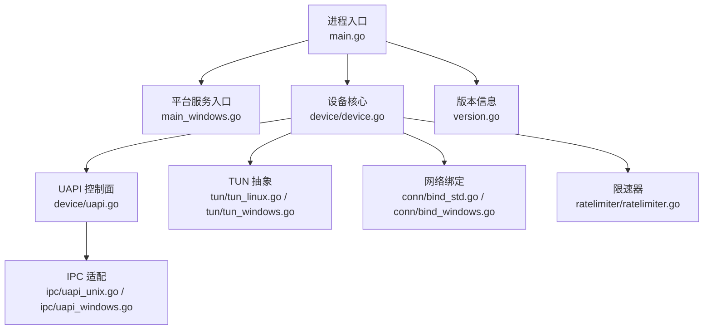
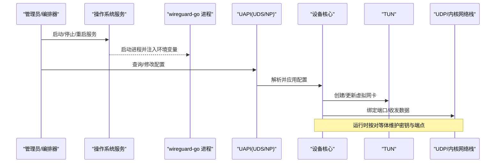
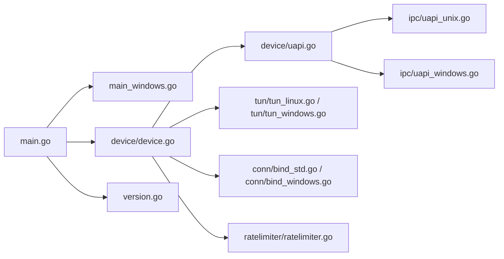

# 服务管理

<cite>
**本文档引用的文件**
- [main.go](file://main.go)
- [main_windows.go](file://main_windows.go)
- [device/device.go](file://device/device.go)
- [device/uapi.go](file://device/uapi.go)
- [ipc/uapi_unix.go](file://ipc/uapi_unix.go)
- [ipc/uapi_windows.go](file://ipc/uapi_windows.go)
- [tun/tun_linux.go](file://tun/tun_linux.go)
- [tun/tun_windows.go](file://tun/tun_windows.go)
- [conn/bind_std.go](file://conn/bind_std.go)
- [conn/bind_windows.go](file://conn/bind_windows.go)
- [ratelimiter/ratelimiter.go](file://ratelimiter/ratelimiter.go)
- [version.go](file://version.go)
</cite>

## 目录
1. [简介](#简介)
2. [项目结构](#项目结构)
3. [核心组件](#核心组件)
4. [架构总览](#架构总览)
5. [详细组件分析](#详细组件分析)
6. [依赖关系分析](#依赖关系分析)
7. [性能考虑](#性能考虑)
8. [故障排查指南](#故障排查指南)
9. [结论](#结论)
10. [附录](#附录)

## 简介
本文件面向运维与平台工程团队，提供 wireguard-go 的服务化部署与管理指南。内容涵盖：
- 系统服务配置（systemd、Windows Service）
- 服务生命周期管理命令
- 日志配置与轮转
- 自动重启与故障恢复
- 性能监控与资源使用跟踪
- 配置热重载
- 服务间通信与依赖管理

说明：wireguard-go 本身是用户态内核接口实现，通常以守护进程形式运行并通过 UAPI 暴露控制面。服务化由上层容器/进程管理器或操作系统服务机制承载。

## 项目结构
从服务视角看，关键模块包括：
- 入口与平台适配：主程序入口与 Windows 服务入口
- 设备与协议栈：WireGuard 设备、加密握手、收发管线
- IPC/UAPI：Unix Domain Socket / Windows Named Pipe 暴露管理接口
- TUN/TAP：跨平台虚拟网卡抽象
- 绑定层：网络套接字绑定（UDP）
- 限速器：丢包/限速策略
- 版本信息：用于标识与兼容性

图示来源
- [main.go:1-200](file://main.go#L1-L200)
- [main_windows.go:1-200](file://main_windows.go#L1-L200)
- [device/device.go:1-200](file://device/device.go#L1-L200)
- [device/uapi.go:1-200](file://device/uapi.go#L1-L200)
- [ipc/uapi_unix.go:1-200](file://ipc/uapi_unix.go#L1-L200)
- [ipc/uapi_windows.go:1-200](file://ipc/uapi_windows.go#L1-L200)
- [tun/tun_linux.go:1-200](file://tun/tun_linux.go#L1-L200)
- [tun/tun_windows.go:1-200](file://tun/tun_windows.go#L1-L200)
- [conn/bind_std.go:1-200](file://conn/bind_std.go#L1-L200)
- [conn/bind_windows.go:1-200](file://conn/bind_windows.go#L1-L200)
- [ratelimiter/ratelimiter.go:1-200](file://ratelimiter/ratelimiter.go#L1-L200)
- [version.go:1-200](file://version.go#L1-L200)

章节来源
- [main.go:1-200](file://main.go#L1-L200)
- [main_windows.go:1-200](file://main_windows.go#L1-L200)
- [device/device.go:1-200](file://device/device.go#L1-L200)
- [device/uapi.go:1-200](file://device/uapi.go#L1-L200)
- [ipc/uapi_unix.go:1-200](file://ipc/uapi_unix.go#L1-L200)
- [ipc/uapi_windows.go:1-200](file://ipc/uapi_windows.go#L1-L200)
- [tun/tun_linux.go:1-200](file://tun/tun_linux.go#L1-L200)
- [tun/tun_windows.go:1-200](file://tun/tun_windows.go#L1-L200)
- [conn/bind_std.go:1-200](file://conn/bind_std.go#L1-L200)
- [conn/bind_windows.go:1-200](file://conn/bind_windows.go#L1-L200)
- [ratelimiter/ratelimiter.go:1-200](file://ratelimiter/ratelimiter.go#L1-L200)
- [version.go:1-200](file://version.go#L1-L200)

## 核心组件
- 进程入口与平台服务
  - main.go：通用入口，负责初始化、加载配置、启动设备与监听 UAPI。
  - main_windows.go：Windows 服务注册/启动逻辑，将进程作为 Windows Service 运行。
- 设备核心
  - device/device.go：WireGuard 设备状态机、对等体管理、定时器、队列与收发流程。
- 控制面（UAPI）
  - device/uapi.go：实现 UAPI 协议，提供查询/设置配置的能力。
  - ipc/uapi_unix.go、ipc/uapi_windows.go：分别通过 Unix Domain Socket 与 Windows Named Pipe 暴露 UAPI。
- 网络与 I/O
  - conn/bind_std.go、conn/bind_windows.go：UDP 套接字绑定与特性开关。
  - tun/tun_linux.go、tun/tun_windows.go：TUN 设备创建、读写与平台差异处理。
- 辅助能力
  - ratelimiter/ratelimiter.go：速率限制，保护带宽与 CPU。
  - version.go：版本信息，便于诊断与升级。

章节来源
- [main.go:1-200](file://main.go#L1-L200)
- [main_windows.go:1-200](file://main_windows.go#L1-L200)
- [device/device.go:1-200](file://device/device.go#L1-L200)
- [device/uapi.go:1-200](file://device/uapi.go#L1-L200)
- [ipc/uapi_unix.go:1-200](file://ipc/uapi_unix.go#L1-L200)
- [ipc/uapi_windows.go:1-200](file://ipc/uapi_windows.go#L1-L200)
- [conn/bind_std.go:1-200](file://conn/bind_std.go#L1-L200)
- [conn/bind_windows.go:1-200](file://conn/bind_windows.go#L1-L200)
- [tun/tun_linux.go:1-200](file://tun/tun_linux.go#L1-L200)
- [tun/tun_windows.go:1-200](file://tun/tun_windows.go#L1-L200)
- [ratelimiter/ratelimiter.go:1-200](file://ratelimiter/ratelimiter.go#L1-L200)
- [version.go:1-200](file://version.go#L1-L200)

## 架构总览
下图展示服务在系统中的位置与交互：外部进程通过 UAPI 与设备交互；设备通过 TUN 与内核网络栈对接；UDP 流量经绑定层收发；Windows 下可通过命名管道访问 UAPI。

图示来源
- [main.go:1-200](file://main.go#L1-L200)
- [main_windows.go:1-200](file://main_windows.go#L1-L200)
- [device/device.go:1-200](file://device/device.go#L1-L200)
- [device/uapi.go:1-200](file://device/uapi.go#L1-L200)
- [ipc/uapi_unix.go:1-200](file://ipc/uapi_unix.go#L1-L200)
- [ipc/uapi_windows.go:1-200](file://ipc/uapi_windows.go#L1-L200)
- [tun/tun_linux.go:1-200](file://tun/tun_linux.go#L1-L200)
- [tun/tun_windows.go:1-200](file://tun/tun_windows.go#L1-L200)
- [conn/bind_std.go:1-200](file://conn/bind_std.go#L1-L200)
- [conn/bind_windows.go:1-200](file://conn/bind_windows.go#L1-L200)

## 详细组件分析

### 系统服务配置（systemd）
- 目标
  - 将 wireguard-go 作为 systemd 服务运行，具备开机自启、崩溃重启、日志收集、资源限制等能力。
- 建议要点
  - 使用独立用户运行，最小权限原则。
  - 通过 EnvironmentFile 或 ExecStart 参数传入配置路径与环境变量。
  - 配置 Restart=on-failure 与 RestartSec，实现自动重启与退避。
  - 使用 LimitNOFILE、LimitCORE、MemoryMax/CPUQuota 等资源限制。
  - 启用 journal 日志，配合 logrotate 或 journald 保留策略。
- 典型命令
  - 启动/停止/重启/查看状态：systemctl start|stop|restart|status <service>
  - 查看实时日志：journalctl -u <service> -f
  - 重载配置后重启：systemctl reload-or-restart <service>（若支持 SIGHUP 热重载）

章节来源
- [main.go:1-200](file://main.go#L1-L200)
- [device/uapi.go:1-200](file://device/uapi.go#L1-L200)
- [ipc/uapi_unix.go:1-200](file://ipc/uapi_unix.go#L1-L200)

### 系统服务配置（Windows Service）
- 目标
  - 将 wireguard-go 注册为 Windows 服务，具备自启动、崩溃恢复、事件日志集成。
- 建议要点
  - 使用 main_windows.go 提供的服务入口进行注册/启动。
  - 通过服务属性设置“失败时重启”策略与重试间隔。
  - 使用 Windows 事件日志或第三方日志库输出结构化日志。
  - 通过组策略或服务账户限制权限。
- 典型命令
  - 安装/卸载服务：sc create|delete <ServiceName>
  - 启动/停止/重启：net start|stop|pause|continue <ServiceName>
  - 查看状态：sc query <ServiceName>
  - 查看事件日志：wevtutil qe Application /q:"*[System[Provider='ServiceName']]"

章节来源
- [main_windows.go:1-200](file://main_windows.go#L1-L200)
- [ipc/uapi_windows.go:1-200](file://ipc/uapi_windows.go#L1-L200)

### 服务生命周期管理命令
- 通用
  - 启动：systemctl start 或 net start
  - 停止：systemctl stop 或 net stop
  - 重启：systemctl restart 或 net pause/continue
  - 状态：systemctl status 或 sc query
- 配置变更
  - 热重载：向进程发送 SIGHUP（Linux/macOS），或在 Windows 上触发服务重载（若实现）。
  - 冷重启：修改配置后执行 restart。
- 调试
  - 前台运行：以非服务模式启动，便于交互式调试。
  - 增加日志级别：通过环境变量或命令行参数调整。

章节来源
- [main.go:1-200](file://main.go#L1-L200)
- [main_windows.go:1-200](file://main_windows.go#L1-L200)

### 日志配置与轮转
- Linux（systemd）
  - 日志由 journald 采集，默认持久化至 /var/log/journal。
  - 可配置保留策略：Storage=auto|persistent|volatile，RateLimitInterval/RateLimitBurst。
  - 结合 logrotate 或 journald 的 MaxSize/MaxRetentionSec 做轮转。
- Windows
  - 使用 Windows 事件日志或应用内日志文件。
  - 建议按大小/时间轮转，避免磁盘占满。
- 建议
  - 输出结构化 JSON 日志，包含时间戳、级别、请求 ID、对等体 IP、方向（收/发）、长度等。
  - 敏感字段脱敏（如密钥、令牌）。
  - 集中收集到 ELK/Loki 等日志平台。

章节来源
- [device/device.go:1-200](file://device/device.go#L1-L200)
- [device/uapi.go:1-200](file://device/uapi.go#L1-L200)

### 自动重启与故障恢复
- 机制
  - systemd：Restart=on-failure|always，RestartSec=指数退避。
  - Windows：服务“失败”选项卡中设置“第一次/第二次/后续失败”时的重启动作与延迟。
- 健康检查
  - 通过 UAPI 定期探测（例如查询对等体列表或统计），失败则判定不健康。
  - 编排器根据健康检查结果决定重启或隔离。
- 优雅关闭
  - 收到 SIGTERM/SIGINT 后，先停止接收新连接，再完成队列刷新与资源释放。

章节来源
- [main.go:1-200](file://main.go#L1-L200)
- [device/device.go:1-200](file://device/device.go#L1-L200)

### 性能监控与资源使用跟踪
- 指标建议
  - 进程级：CPU、内存、文件描述符、goroutine 数、GC 次数/耗时。
  - 网络级：收/发包率、字节数、丢包率、重传、握手失败次数。
  - 设备级：对等体数量、活跃会话、队列深度、定时器计数。
- 采集方式
  - Prometheus + node_exporter 或 cAdvisor（容器环境）。
  - pprof 暴露 HTTP 接口用于采样分析（生产谨慎开启）。
  - 自定义 UAPI 扩展统计项（如需）。
- 告警
  - 基于阈值（CPU>80%、内存>80%、丢包>1%、握手失败突增）触发告警。

章节来源
- [device/device.go:1-200](file://device/device.go#L1-L200)
- [device/uapi.go:1-200](file://device/uapi.go#L1-L200)
- [conn/bind_std.go:1-200](file://conn/bind_std.go#L1-L200)
- [conn/bind_windows.go:1-200](file://conn/bind_windows.go#L1-L200)

### 配置热重载
- 原理
  - 监听信号（如 SIGHUP）或通过 UAPI 动态下发配置变更。
  - 设备核心增量应用变更，保持现有会话不断开。
- 实践
  - 在 systemd 中使用 ExecReload 指向脚本调用 UAPI 下发新配置。
  - 在 Windows 上通过命名管道调用 UAPI 更新配置。
  - 变更前进行校验，失败回滚。
- 注意事项
  - 避免频繁重载导致抖动。
  - 对关键参数（如监听端口）变更需评估影响。

章节来源
- [device/uapi.go:1-200](file://device/uapi.go#L1-L200)
- [ipc/uapi_unix.go:1-200](file://ipc/uapi_unix.go#L1-L200)
- [ipc/uapi_windows.go:1-200](file://ipc/uapi_windows.go#L1-L200)

### 服务间通信与依赖管理
- 通信
  - UAPI 作为标准控制面，供配置管理工具、编排器、监控探针调用。
  - 在 Linux 使用 Unix Domain Socket，在 Windows 使用 Named Pipe。
- 依赖
  - TUN 设备：需要内核模块或驱动可用。
  - UDP 端口：确保未被占用且防火墙放行。
  - 权限：读取/写入 TUN、绑定特权端口可能需要 root/Administrator。
- 编排
  - 使用容器编排（Docker/K8s）或系统服务管理器保证依赖就绪后再启动。

章节来源
- [ipc/uapi_unix.go:1-200](file://ipc/uapi_unix.go#L1-L200)
- [ipc/uapi_windows.go:1-200](file://ipc/uapi_windows.go#L1-L200)
- [tun/tun_linux.go:1-200](file://tun/tun_linux.go#L1-L200)
- [tun/tun_windows.go:1-200](file://tun/tun_windows.go#L1-L200)
- [conn/bind_std.go:1-200](file://conn/bind_std.go#L1-L200)
- [conn/bind_windows.go:1-200](file://conn/bind_windows.go#L1-L200)

## 依赖关系分析

图示来源
- [main.go:1-200](file://main.go#L1-L200)
- [main_windows.go:1-200](file://main_windows.go#L1-L200)
- [device/device.go:1-200](file://device/device.go#L1-L200)
- [device/uapi.go:1-200](file://device/uapi.go#L1-L200)
- [ipc/uapi_unix.go:1-200](file://ipc/uapi_unix.go#L1-L200)
- [ipc/uapi_windows.go:1-200](file://ipc/uapi_windows.go#L1-L200)
- [tun/tun_linux.go:1-200](file://tun/tun_linux.go#L1-L200)
- [tun/tun_windows.go:1-200](file://tun/tun_windows.go#L1-L200)
- [conn/bind_std.go:1-200](file://conn/bind_std.go#L1-L200)
- [conn/bind_windows.go:1-200](file://conn/bind_windows.go#L1-L200)
- [ratelimiter/ratelimiter.go:1-200](file://ratelimiter/ratelimiter.go#L1-L200)
- [version.go:1-200](file://version.go#L1-L200)

章节来源
- [main.go:1-200](file://main.go#L1-L200)
- [device/device.go:1-200](file://device/device.go#L1-L200)
- [device/uapi.go:1-200](file://device/uapi.go#L1-L200)
- [ipc/uapi_unix.go:1-200](file://ipc/uapi_unix.go#L1-L200)
- [ipc/uapi_windows.go:1-200](file://ipc/uapi_windows.go#L1-L200)
- [tun/tun_linux.go:1-200](file://tun/tun_linux.go#L1-L200)
- [tun/tun_windows.go:1-200](file://tun/tun_windows.go#L1-L200)
- [conn/bind_std.go:1-200](file://conn/bind_std.go#L1-L200)
- [conn/bind_windows.go:1-200](file://conn/bind_windows.go#L1-L200)
- [ratelimiter/ratelimiter.go:1-200](file://ratelimiter/ratelimiter.go#L1-L200)
- [version.go:1-200](file://version.go#L1-L200)

## 性能考虑
- 并发与队列
  - 合理设置队列长度与线程池大小，避免拥塞与抖动。
- 内存与 GC
  - 监控 goroutine 与堆增长，必要时调优 GC 参数。
- 网络栈
  - 使用零拷贝/批量 I/O（平台相关优化），减少上下文切换。
- 限速与背压
  - 启用限速器防止突发流量打满 CPU/带宽。
- 观测性
  - 接入指标与链路追踪，定位瓶颈。

[本节为通用指导，无需特定文件引用]

## 故障排查指南
- 无法启动
  - 检查 TUN 设备是否可用、权限是否正确。
  - 检查端口占用与防火墙规则。
  - 查看系统日志（journald/Windows 事件日志）。
- 无法建立隧道
  - 核对对等体配置（公钥、端点、允许 IP）。
  - 检查 NAT/防火墙穿透与 MTU。
- 性能下降
  - 观察 CPU/内存/丢包/握手失败指标。
  - 检查限速器与队列深度。
- 配置未生效
  - 确认热重载是否成功，必要时冷重启。
  - 验证 UAPI 返回结果与设备状态。

章节来源
- [device/device.go:1-200](file://device/device.go#L1-L200)
- [device/uapi.go:1-200](file://device/uapi.go#L1-L200)
- [tun/tun_linux.go:1-200](file://tun/tun_linux.go#L1-L200)
- [tun/tun_windows.go:1-200](file://tun/tun_windows.go#L1-L200)
- [conn/bind_std.go:1-200](file://conn/bind_std.go#L1-L200)
- [conn/bind_windows.go:1-200](file://conn/bind_windows.go#L1-L200)

## 结论
通过将 wireguard-go 以服务形态部署，并结合系统服务管理器与 UAPI，可实现稳定可靠、可观测、易运维的 VPN 服务。建议在生产环境落实：
- 明确的生命周期管理与自动重启策略
- 完善的日志与指标采集
- 严格的权限与资源限制
- 规范化的配置热重载流程
- 持续的性能基准与健康检查

[本节为总结，无需特定文件引用]

## 附录

### 常用命令速查
- systemd
  - systemctl start|stop|restart|status|reload <service>
  - journalctl -u <service> -f
- Windows
  - sc create|delete|query <ServiceName>
  - net start|stop|pause|continue <ServiceName>
  - wevtutil qe Application /q:"*[System[Provider='ServiceName']]"

章节来源
- [main.go:1-200](file://main.go#L1-L200)
- [main_windows.go:1-200](file://main_windows.go#L1-L200)