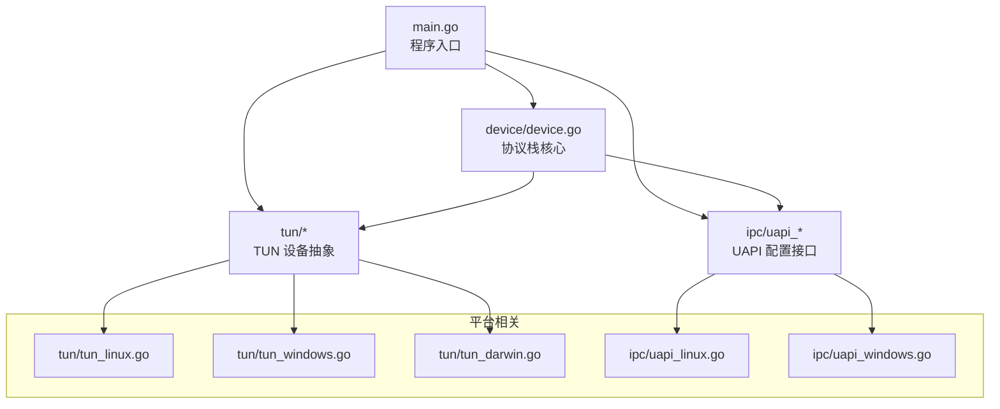
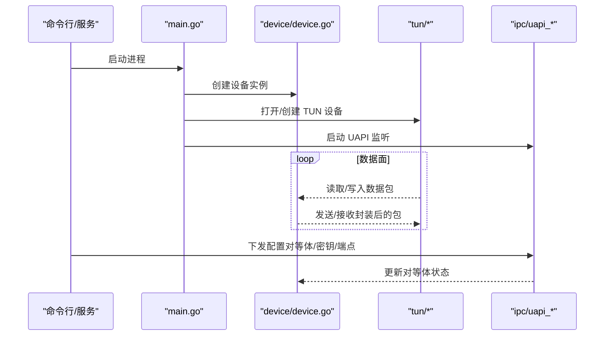
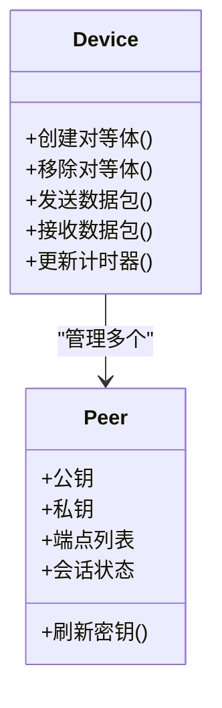
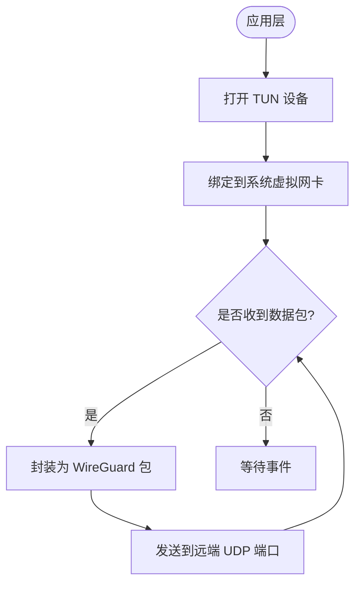
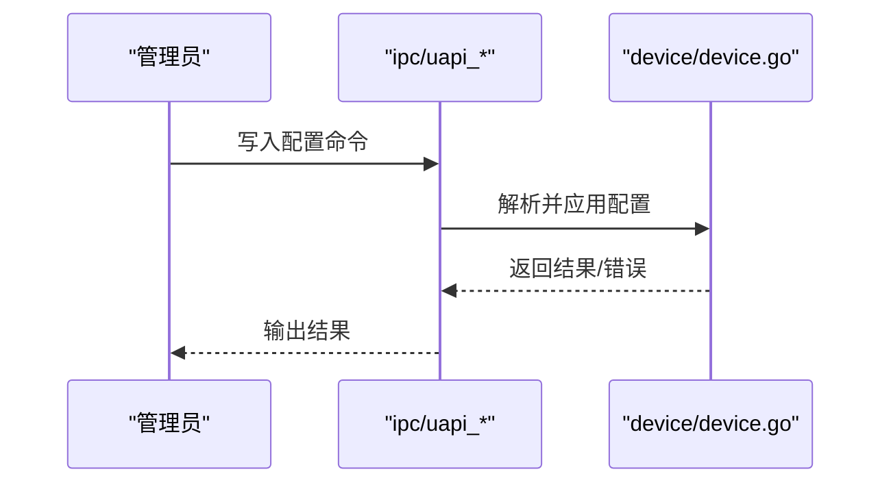
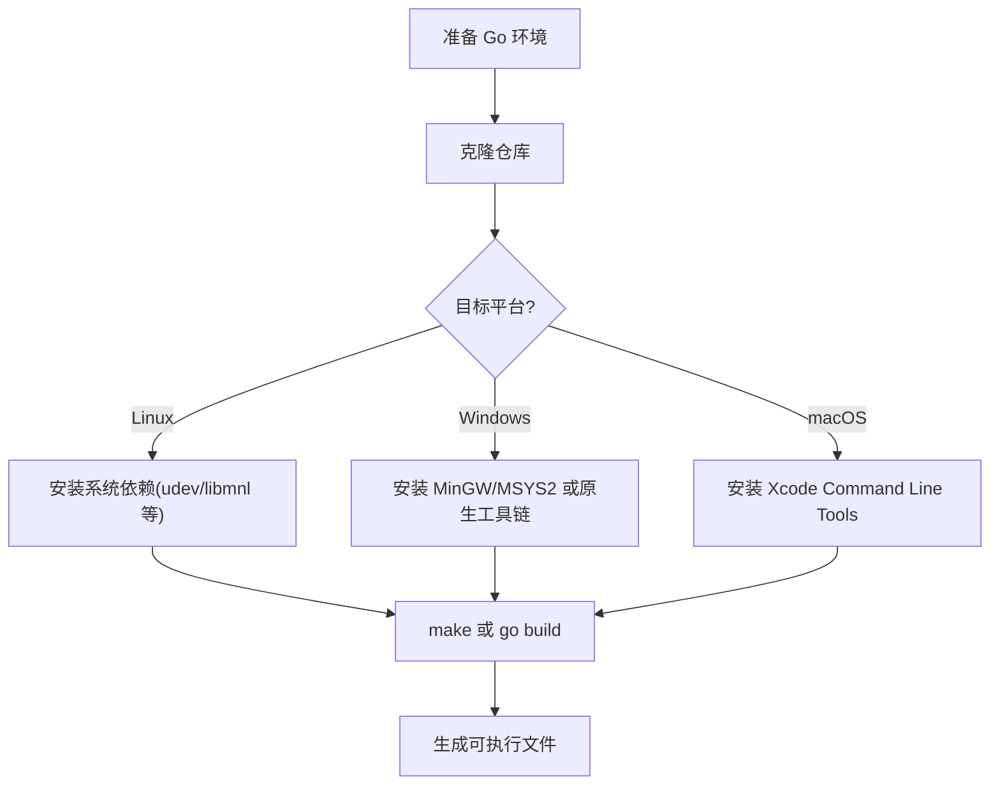

# 本地部署

<cite>
**本文引用的文件**
- [README.md](file://README.md)
- [readme_cn.md](file://readme_cn.md)
- [Makefile](file://Makefile)
- [go.mod](file://go.mod)
- [main.go](file://main.go)
- [main_windows.go](file://main_windows.go)
- [version.go](file://version.go)
- [device/device.go](file://device/device.go)
- [device/uapi.go](file://device/uapi.go)
- [tun/tun_linux.go](file://tun/tun_linux.go)
- [tun/tun_windows.go](file://tun/tun_windows.go)
- [tun/tun_darwin.go](file://tun/tun_darwin.go)
- [ipc/uapi_linux.go](file://ipc/uapi_linux.go)
- [ipc/uapi_windows.go](file://ipc/uapi_windows.go)
</cite>

## 目录
1. [简介](#简介)
2. [项目结构](#项目结构)
3. [核心组件](#核心组件)
4. [架构总览](#架构总览)
5. [详细组件分析](#详细组件分析)
6. [依赖与构建配置](#依赖与构建配置)
7. [各平台部署步骤](#各平台部署步骤)
8. [配置文件结构与参数](#配置文件结构与参数)
9. [启动脚本与服务配置](#启动脚本与服务配置)
10. [性能与调优建议](#性能与调优建议)
11. [故障排除指南](#故障排除指南)
12. [结论](#结论)

## 简介
本指南面向需要在本地编译并部署 WireGuard-Go 的工程师与运维人员，覆盖 Windows、Linux、macOS 三平台的依赖安装、构建配置与环境设置；说明配置文件的结构与关键参数；提供基础启动脚本与服务化方案；并给出常见问题的排查思路。文档内容基于仓库中的源码与构建脚本进行整理，确保与实际实现一致。

## 项目结构
WireGuard-Go 采用按功能域划分的模块化结构：
- device: 协议栈核心（对等体管理、加密握手、收发队列、计时器等）
- tun: 跨平台 TUN 设备抽象（Linux/Windows/macOS 各有实现）
- ipc: UAPI 接口实现（用于动态配置对等体）
- conn: 网络绑定与特性控制（不同平台差异较大）
- 根目录 main.go/main_windows.go: 程序入口与平台初始化
- Makefile/go.mod: 构建与依赖声明

图表来源
- [main.go:1-200](file://main.go#L1-L200)
- [device/device.go:1-200](file://device/device.go#L1-L200)
- [tun/tun_linux.go:1-200](file://tun/tun_linux.go#L1-L200)
- [tun/tun_windows.go:1-200](file://tun/tun_windows.go#L1-L200)
- [tun/tun_darwin.go:1-200](file://tun/tun_darwin.go#L1-L200)
- [ipc/uapi_linux.go:1-200](file://ipc/uapi_linux.go#L1-L200)
- [ipc/uapi_windows.go:1-200](file://ipc/uapi_windows.go#L1-L200)

章节来源
- [README.md:1-200](file://README.md#L1-L200)
- [readme_cn.md:1-200](file://readme_cn.md#L1-L200)

## 核心组件
- 设备与对等体管理：负责密钥派生、会话建立、数据包封装/解封装、计时器与状态维护。
- TUN 设备：在系统内核中创建虚拟网卡，将隧道流量注入/捕获。
- UAPI：通过标准输入输出或命名管道暴露配置接口，支持运行时添加/删除对等体、修改密钥与端点等。
- 网络绑定：根据平台选择最优的 UDP 套接字绑定策略与特性开关（如 GSO）。

章节来源
- [device/device.go:1-300](file://device/device.go#L1-L300)
- [device/uapi.go:1-200](file://device/uapi.go#L1-L200)
- [tun/tun_linux.go:1-200](file://tun/tun_linux.go#L1-L200)
- [tun/tun_windows.go:1-200](file://tun/tun_windows.go#L1-L200)
- [tun/tun_darwin.go:1-200](file://tun/tun_darwin.go#L1-L200)
- [ipc/uapi_linux.go:1-200](file://ipc/uapi_linux.go#L1-L200)
- [ipc/uapi_windows.go:1-200](file://ipc/uapi_windows.go#L1-L200)

## 架构总览
WireGuard-Go 的运行流程大致如下：
- 程序启动后初始化设备实例与日志
- 创建 TUN 设备并绑定到系统虚拟网卡
- 监听 UDP 端口，处理入站/出站数据包
- 通过 UAPI 接收配置变更（对等体、密钥、端点等）
- 使用内核或用户态逻辑完成加解密与转发

图表来源
- [main.go:1-200](file://main.go#L1-L200)
- [device/device.go:1-200](file://device/device.go#L1-L200)
- [tun/tun_linux.go:1-200](file://tun/tun_linux.go#L1-L200)
- [tun/tun_windows.go:1-200](file://tun/tun_windows.go#L1-L200)
- [ipc/uapi_linux.go:1-200](file://ipc/uapi_linux.go#L1-L200)
- [ipc/uapi_windows.go:1-200](file://ipc/uapi_windows.go#L1-L200)

## 详细组件分析

### 设备与对等体（device）
- 职责：维护对等体表、密钥对、计时器、收发队列、Cookie 防放大攻击等。
- 关键点：
  - 对等体生命周期：新增、活跃、超时清理
  - 握手流程：噪声协议握手、密钥派生、重传与超时
  - 收发路径：分片重组、序列号去重、重放保护
- 复杂度：对等体查找通常基于 IP 前缀树，时间复杂度近似 O(log N)；队列操作为常数级。

图表来源
- [device/device.go:1-300](file://device/device.go#L1-L300)
- [device/uapi.go:1-200](file://device/uapi.go#L1-L200)

章节来源
- [device/device.go:1-300](file://device/device.go#L1-L300)
- [device/uapi.go:1-200](file://device/uapi.go#L1-L200)

### TUN 设备（tun）
- Linux：通过 netlink/netdev 创建 veth/tun，支持 GSO/TSO 等卸载特性。
- Windows：通过 Wintun 驱动或内置 TUN 接口。
- macOS：通过 utun 设备。

图表来源
- [tun/tun_linux.go:1-200](file://tun/tun_linux.go#L1-L200)
- [tun/tun_windows.go:1-200](file://tun/tun_windows.go#L1-L200)
- [tun/tun_darwin.go:1-200](file://tun/tun_darwin.go#L1-L200)

章节来源
- [tun/tun_linux.go:1-200](file://tun/tun_linux.go#L1-L200)
- [tun/tun_windows.go:1-200](file://tun/tun_windows.go#L1-L200)
- [tun/tun_darwin.go:1-200](file://tun/tun_darwin.go#L1-L200)

### UAPI 接口（ipc）
- Linux：通过字符设备 /dev/wgctl 或标准输入输出。
- Windows：通过命名管道。
- 能力：列出对等体、添加/删除对等体、设置公钥/私钥/端点、允许 IP 等。

图表来源
- [ipc/uapi_linux.go:1-200](file://ipc/uapi_linux.go#L1-L200)
- [ipc/uapi_windows.go:1-200](file://ipc/uapi_windows.go#L1-L200)
- [device/uapi.go:1-200](file://device/uapi.go#L1-L200)

章节来源
- [ipc/uapi_linux.go:1-200](file://ipc/uapi_linux.go#L1-L200)
- [ipc/uapi_windows.go:1-200](file://ipc/uapi_windows.go#L1-L200)
- [device/uapi.go:1-200](file://device/uapi.go#L1-L200)

## 依赖与构建配置
- Go 工具链：需要 Go 1.x 环境（具体版本以 go.mod 为准）。
- 平台依赖：
  - Linux：可能需要 root 权限创建 TUN 设备；可选启用 GSO/TSO。
  - Windows：需要管理员权限；依赖 Wintun 或系统 TUN。
  - macOS：需要管理员权限；使用 utun。
- 构建目标：可通过 Makefile 指定 GOOS/GOARCH 交叉编译。

图表来源
- [Makefile:1-200](file://Makefile#L1-L200)
- [go.mod:1-200](file://go.mod#L1-L200)

章节来源
- [Makefile:1-200](file://Makefile#L1-L200)
- [go.mod:1-200](file://go.mod#L1-L200)

## 各平台部署步骤

### Linux
- 依赖：
  - 安装 Go 工具链（参考 go.mod 版本要求）
  - 如需内核卸载特性，确保内核支持 GSO/TSO
  - 具备 root 权限以创建 TUN 设备
- 构建：
  - 使用 make 或 go build 直接编译
  - 可设置 CGO_ENABLED=0 禁用 CGO（若不需要特定系统库）
- 运行：
  - 以 root 启动，或通过 sudo 运行
  - 通过 UAPI 下发配置（见“配置文件结构与参数”）

章节来源
- [tun/tun_linux.go:1-200](file://tun/tun_linux.go#L1-L200)
- [ipc/uapi_linux.go:1-200](file://ipc/uapi_linux.go#L1-L200)
- [Makefile:1-200](file://Makefile#L1-L200)

### Windows
- 依赖：
  - 安装 Go 工具链
  - 安装 Wintun 驱动或使用系统 TUN
  - 管理员权限
- 构建：
  - 使用 make 或 go build 在 CMD/PowerShell 中编译
- 运行：
  - 以管理员身份运行
  - 通过命名管道访问 UAPI

章节来源
- [tun/tun_windows.go:1-200](file://tun/tun_windows.go#L1-L200)
- [ipc/uapi_windows.go:1-200](file://ipc/uapi_windows.go#L1-L200)
- [main_windows.go:1-200](file://main_windows.go#L1-L200)

### macOS
- 依赖：
  - 安装 Go 工具链与 Xcode Command Line Tools
  - 管理员权限
- 构建：
  - 使用 make 或 go build
- 运行：
  - 以管理员身份运行
  - 通过 UAPI 下发配置

章节来源
- [tun/tun_darwin.go:1-200](file://tun/tun_darwin.go#L1-L200)
- [Makefile:1-200](file://Makefile#L1-L200)

## 配置文件结构与参数
WireGuard-Go 通过 UAPI 接受配置，典型字段包括：
- 接口
  - private_key：接口私钥（Base64）
  - listen_port：监听端口
  - fw_mark：防火墙标记（可选）
- 对等体
  - public_key：对等体公钥
  - preshared_key：预共享密钥（可选）
  - endpoint：远端地址（IP:Port）
  - allowed_ips：允许的源/目的 IP 段（CIDR）
  - persistent_keepalive：保活间隔（秒）
  - remove：删除对等体（布尔）

注意：
- 配置通过 UAPI 写入，不同平台实现略有差异（Linux 字符设备/STDIN，Windows 命名管道）。
- 建议在服务启动后先创建接口，再逐个添加对等体。

章节来源
- [device/uapi.go:1-200](file://device/uapi.go#L1-L200)
- [ipc/uapi_linux.go:1-200](file://ipc/uapi_linux.go#L1-L200)
- [ipc/uapi_windows.go:1-200](file://ipc/uapi_windows.go#L1-L200)

## 启动脚本与服务配置

### Linux 示例（systemd）
- 创建服务单元文件，指定可执行文件路径、工作目录、环境变量（如 WG_TUN_NAME_IF）
- 设置开机自启与日志输出
- 使用 wg-quick 风格或自定义脚本通过 UAPI 下发配置

章节来源
- [Makefile:1-200](file://Makefile#L1-L200)
- [ipc/uapi_linux.go:1-200](file://ipc/uapi_linux.go#L1-L200)

### Windows 示例（服务）
- 使用 nssm 或 sc.exe 注册为服务
- 以管理员权限运行
- 通过命名管道调用 UAPI 下发配置

章节来源
- [main_windows.go:1-200](file://main_windows.go#L1-L200)
- [ipc/uapi_windows.go:1-200](file://ipc/uapi_windows.go#L1-L200)

### macOS 示例（launchd）
- 编写 plist 描述服务，设置启动参数与日志
- 以管理员权限加载服务
- 通过 UAPI 下发配置

章节来源
- [tun/tun_darwin.go:1-200](file://tun/tun_darwin.go#L1-L200)

## 性能与调优建议
- 启用内核卸载：在 Linux 上确保 GSO/TSO 可用，减少 CPU 占用。
- 调整队列长度：根据吞吐需求调整收发队列大小（由设备内部常量控制）。
- Keepalive：合理设置 persistent_keepalive，避免 NAT 超时。
- 多核并行：Go 运行时自动利用多核，无需额外配置。
- 日志级别：生产环境降低日志级别以减少 I/O 开销。

章节来源
- [device/device.go:1-300](file://device/device.go#L1-L300)
- [tun/tun_linux.go:1-200](file://tun/tun_linux.go#L1-L200)

## 故障排除指南
- 无法创建 TUN 设备
  - 检查权限（Linux/macOS 需 root，Windows 需管理员）
  - 确认内核模块/驱动已加载（Linux 的 tun 模块，Windows 的 Wintun）
  - 查看系统日志与 dmesg（Linux）或事件查看器（Windows）
- UAPI 连接失败
  - Linux：检查 /dev/wgctl 是否存在且权限正确
  - Windows：检查命名管道是否被占用或权限不足
- 无法通信
  - 检查防火墙规则与端口映射
  - 确认两端公钥/私钥匹配，allowed_ips 配置正确
  - 验证 endpoint 可达性与 NAT 行为
- 性能问题
  - 关闭不必要的日志
  - 启用内核卸载（Linux）
  - 调整 MTU 与队列长度

章节来源
- [tun/tun_linux.go:1-200](file://tun/tun_linux.go#L1-L200)
- [tun/tun_windows.go:1-200](file://tun/tun_windows.go#L1-L200)
- [ipc/uapi_linux.go:1-200](file://ipc/uapi_linux.go#L1-L200)
- [ipc/uapi_windows.go:1-200](file://ipc/uapi_windows.go#L1-L200)

## 结论
WireGuard-Go 提供了跨平台的轻量级 VPN 实现。通过合理的依赖安装、构建配置与服务化部署，可在 Linux、Windows、macOS 上快速搭建稳定的隧道。结合 UAPI 的动态配置能力，可实现灵活的运行时管理。遇到问题时，优先检查权限、驱动/内核支持、防火墙与对等体配置。