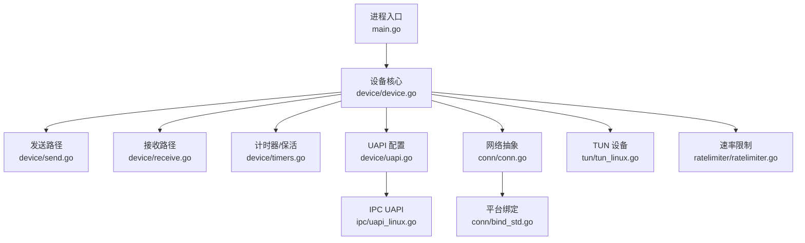
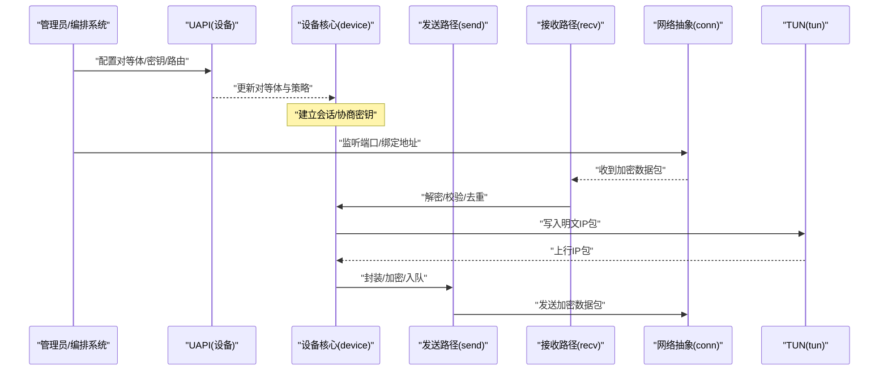
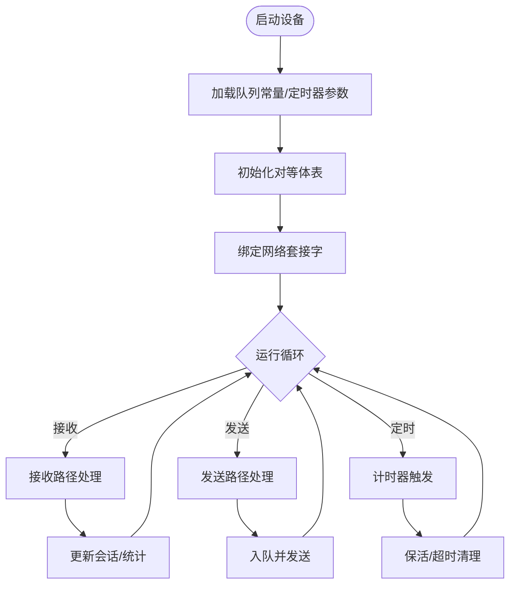
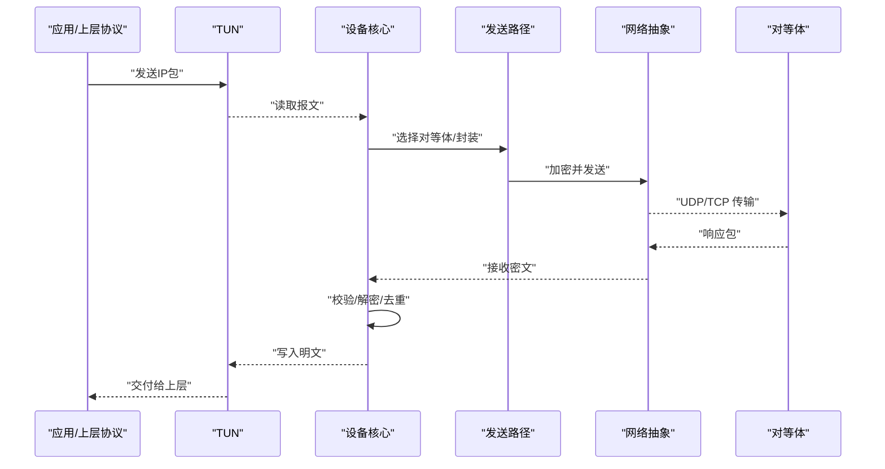
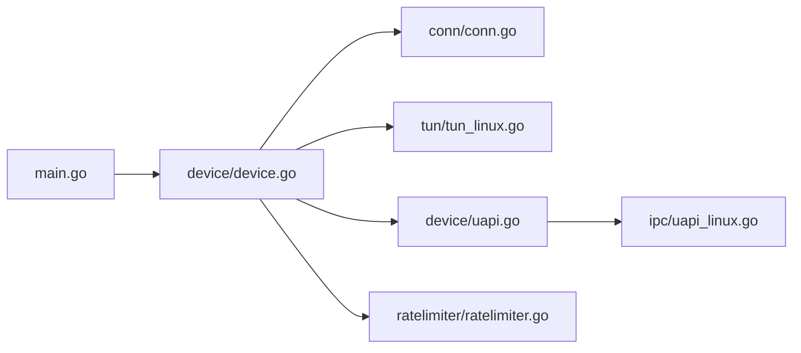

# 生产环境最佳实践

<cite>
**本文引用的文件**
- [main.go](file://main.go)
- [README.md](file://README.md)
- [readme_cn.md](file://readme_cn.md)
- [Makefile](file://Makefile)
- [go.mod](file://go.mod)
- [device/device.go](file://device/device.go)
- [device/constants.go](file://device/constants.go)
- [device/queueconstants_default.go](file://device/queueconstants_default.go)
- [device/send.go](file://device/send.go)
- [device/receive.go](file://device/receive.go)
- [device/timers.go](file://device/timers.go)
- [device/uapi.go](file://device/uapi.go)
- [conn/conn.go](file://conn/conn.go)
- [conn/bind_std.go](file://conn/bind_std.go)
- [conn/features_linux.go](file://conn/features_linux.go)
- [tun/tun_linux.go](file://tun/tun_linux.go)
- [ipc/uapi_linux.go](file://ipc/uapi_linux.go)
- [ratelimiter/ratelimiter.go](file://ratelimiter/ratelimiter.go)
</cite>

## 目录
1. [简介](#简介)
2. [项目结构](#项目结构)
3. [核心组件](#核心组件)
4. [架构总览](#架构总览)
5. [详细组件分析](#详细组件分析)
6. [依赖关系分析](#依赖关系分析)
7. [性能考虑](#性能考虑)
8. [故障排查指南](#故障排查指南)
9. [结论](#结论)
10. [附录](#附录)

## 简介
本文件面向在生产环境中部署 wireguard-go 的运维与平台团队，提供系统要求、安全加固、负载均衡与高可用、监控告警与日志收集、性能调优与资源优化、备份与灾难恢复、合规与审计、容量规划与扩展策略等全链路最佳实践。内容基于仓库中的代码结构与实现细节进行归纳，确保建议可落地且与实现一致。

## 项目结构
wireguard-go 采用按功能域划分的模块化结构：
- device：协议栈核心（对等体管理、密钥协商、收发队列、计时器、UAPI）
- conn：网络套接字抽象与平台绑定（UDP/TCP、GSO、标记、粘性路由等）
- tun：TUN/TAP 设备抽象与平台实现
- ipc：UAPI 接口实现（Linux 命名管道/Unix socket 等）
- ratelimiter：速率限制模块
- 根目录：入口 main、构建脚本 Makefile、版本与说明文档

图表来源
- [main.go:1-200](file://main.go#L1-L200)
- [device/device.go:1-200](file://device/device.go#L1-L200)
- [device/send.go:1-200](file://device/send.go#L1-L200)
- [device/receive.go:1-200](file://device/receive.go#L1-L200)
- [device/timers.go:1-200](file://device/timers.go#L1-L200)
- [device/uapi.go:1-200](file://device/uapi.go#L1-L200)
- [conn/conn.go:1-200](file://conn/conn.go#L1-L200)
- [conn/bind_std.go:1-200](file://conn/bind_std.go#L1-L200)
- [tun/tun_linux.go:1-200](file://tun/tun_linux.go#L1-L200)
- [ipc/uapi_linux.go:1-200](file://ipc/uapi_linux.go#L1-L200)
- [ratelimiter/ratelimiter.go:1-200](file://ratelimiter/ratelimiter.go#L1-L200)

章节来源
- [main.go:1-200](file://main.go#L1-L200)
- [device/device.go:1-200](file://device/device.go#L1-L200)
- [conn/conn.go:1-200](file://conn/conn.go#L1-L200)
- [tun/tun_linux.go:1-200](file://tun/tun_linux.go#L1-L200)
- [ipc/uapi_linux.go:1-200](file://ipc/uapi_linux.go#L1-L200)

## 核心组件
- 设备核心（device）：维护对等体表、会话状态、加密/解密流水线、队列与定时器、UAPI 配置通道。关键常量与队列参数影响吞吐与延迟。
- 网络抽象（conn）：封装 UDP/TCP 套接字、GSO、socket mark、sticky routing 等特性，屏蔽平台差异。
- TUN 设备（tun）：将内核隧道设备映射为 Go 可读写的字节流，承载 IP 包转发。
- IPC/UAPI（ipc/device.uapi）：提供运行时配置与查询能力（如添加/删除对等体、查看统计）。
- 速率限制（ratelimiter）：用于控制突发流量或缓解攻击。

章节来源
- [device/constants.go:1-200](file://device/constants.go#L1-L200)
- [device/queueconstants_default.go:1-200](file://device/queueconstants_default.go#L1-L200)
- [device/device.go:1-200](file://device/device.go#L1-L200)
- [conn/features_linux.go:1-200](file://conn/features_linux.go#L1-L200)
- [tun/tun_linux.go:1-200](file://tun/tun_linux.go#L1-L200)
- [ipc/uapi_linux.go:1-200](file://ipc/uapi_linux.go#L1-L200)
- [ratelimiter/ratelimiter.go:1-200](file://ratelimiter/ratelimiter.go#L1-L200)

## 架构总览
wireguard-go 以“设备”为中心，向上通过 UAPI 暴露配置接口，向下通过 conn 与 tun 访问网络栈与内核隧道。发送路径负责封装、加密与入队；接收路径负责解封装、解密与出队；计时器负责心跳、重传与超时。

图表来源
- [device/uapi.go:1-200](file://device/uapi.go#L1-L200)
- [device/device.go:1-200](file://device/device.go#L1-L200)
- [device/send.go:1-200](file://device/send.go#L1-L200)
- [device/receive.go:1-200](file://device/receive.go#L1-L200)
- [conn/conn.go:1-200](file://conn/conn.go#L1-L200)
- [tun/tun_linux.go:1-200](file://tun/tun_linux.go#L1-L200)

## 详细组件分析

### 设备核心与队列常量
- 作用：维护对等体、会话、队列长度、定时器周期等关键运行参数。
- 生产要点：
  - 根据并发连接数与带宽调整队列常量，避免丢包与内存膨胀。
  - 结合系统内核参数（如 net.core.rmem/wmem、net.ipv4.tcp_*）做端到端调优。
  - 使用 UAPI 动态观察对等体状态与统计指标，辅助容量规划。

图表来源
- [device/device.go:1-200](file://device/device.go#L1-L200)
- [device/queueconstants_default.go:1-200](file://device/queueconstants_default.go#L1-L200)
- [device/timers.go:1-200](file://device/timers.go#L1-L200)

章节来源
- [device/constants.go:1-200](file://device/constants.go#L1-L200)
- [device/queueconstants_default.go:1-200](file://device/queueconstants_default.go#L1-L200)
- [device/device.go:1-200](file://device/device.go#L1-L200)
- [device/timers.go:1-200](file://device/timers.go#L1-L200)

### 发送与接收路径
- 发送路径：从 TUN 读取明文 IP，选择对等体，执行噪声协议封装、加密、分片/重组、入队与发送。
- 接收路径：从 conn 读取密文包，校验序列号与重放保护，解密后写入 TUN。
- 生产要点：
  - 关注队列深度与背压，防止内存占用过高。
  - 合理设置 MTU/MSS，避免过度分片导致丢包。
  - 启用 GSO/GRO（若内核支持）以降低 CPU 开销。

图表来源
- [device/send.go:1-200](file://device/send.go#L1-L200)
- [device/receive.go:1-200](file://device/receive.go#L1-L200)
- [conn/conn.go:1-200](file://conn/conn.go#L1-L200)
- [tun/tun_linux.go:1-200](file://tun/tun_linux.go#L1-L200)

章节来源
- [device/send.go:1-200](file://device/send.go#L1-L200)
- [device/receive.go:1-200](file://device/receive.go#L1-L200)
- [conn/conn.go:1-200](file://conn/conn.go#L1-L200)
- [tun/tun_linux.go:1-200](file://tun/tun_linux.go#L1-L200)

### 网络抽象与平台特性
- 作用：统一 UDP/TCP 套接字操作，提供 GSO、socket mark、粘性路由等能力。
- 生产要点：
  - 在 Linux 上开启 GSO/GRO 以提升吞吐。
  - 使用 socket mark 配合路由策略实现多租户/多实例隔离。
  - 针对云厂商网络栈调整缓冲区大小与拥塞控制算法。

章节来源
- [conn/features_linux.go:1-200](file://conn/features_linux.go#L1-L200)
- [conn/bind_std.go:1-200](file://conn/bind_std.go#L1-L200)
- [conn/conn.go:1-200](file://conn/conn.go#L1-L200)

### UAPI 与 IPC
- 作用：提供运行时配置与查询接口（添加/删除对等体、查看统计），便于自动化编排。
- 生产要点：
  - 仅允许受控进程访问 UAPI（文件系统权限/命名空间隔离）。
  - 记录所有配置变更到审计日志。
  - 结合健康检查与自动回滚机制。

章节来源
- [device/uapi.go:1-200](file://device/uapi.go#L1-L200)
- [ipc/uapi_linux.go:1-200](file://ipc/uapi_linux.go#L1-L200)

### 速率限制
- 作用：限制单对等体或全局速率，缓解滥用与突发流量。
- 生产要点：
  - 根据业务 SLA 设定阈值，结合告警与限流策略。
  - 与 WAF/网关联动，形成多层防护。

章节来源
- [ratelimiter/ratelimiter.go:1-200](file://ratelimiter/ratelimiter.go#L1-L200)

## 依赖关系分析
- 入口 main 负责初始化设备、绑定网络、启动事件循环。
- 设备核心依赖 conn 与 tun 完成数据面转发。
- UAPI 通过 ipc 层与设备交互，供外部编排系统调用。
- 速率限制作为横切能力被设备核心调用。

图表来源
- [main.go:1-200](file://main.go#L1-L200)
- [device/device.go:1-200](file://device/device.go#L1-L200)
- [conn/conn.go:1-200](file://conn/conn.go#L1-L200)
- [tun/tun_linux.go:1-200](file://tun/tun_linux.go#L1-L200)
- [device/uapi.go:1-200](file://device/uapi.go#L1-L200)
- [ipc/uapi_linux.go:1-200](file://ipc/uapi_linux.go#L1-L200)
- [ratelimiter/ratelimiter.go:1-200](file://ratelimiter/ratelimiter.go#L1-L200)

章节来源
- [main.go:1-200](file://main.go#L1-L200)
- [device/device.go:1-200](file://device/device.go#L1-L200)

## 性能考虑
- 队列与内存
  - 依据并发对等体数量与带宽，调整设备队列常量与系统缓冲区，避免丢包与 OOM。
  - 监控内存增长趋势，设置上限与回收策略。
- 网络栈
  - 在 Linux 上启用 GSO/GRO，降低 CPU 占用。
  - 调整 net.core.* 与 net.ipv4.* 相关参数，匹配链路 MTU 与拥塞窗口。
- 调度与并发
  - 合理设置 goroutine 池与工作线程数，避免上下文切换过多。
  - 使用 CPU 亲和与 NUMA 感知放置提升缓存命中率。
- 分片与 MTU
  - 根据链路 MTU 设置合适的隧道 MTU，减少分片与重传。
- 观测与基准
  - 建立端到端吞吐/时延基线，持续回归测试。

[本节为通用性能指导，不直接分析具体文件]

## 故障排查指南
- 常见问题定位
  - 无法建立对等体：检查 UAPI 配置、密钥、端口可达性与防火墙规则。
  - 吞吐低：确认是否启用 GSO/GRO、MTU 是否合适、队列是否饱和。
  - 频繁断连：核对计时器与保活间隔、网络抖动与 NAT 超时。
- 日志与指标
  - 采集设备日志与应用日志，集中到日志平台。
  - 暴露关键指标（连接数、吞吐、丢包、错误码）至监控系统。
- 快速恢复
  - 通过 UAPI 动态修复配置，必要时重启服务。
  - 保留最近稳定配置快照，支持一键回滚。

章节来源
- [device/uapi.go:1-200](file://device/uapi.go#L1-L200)
- [device/timers.go:1-200](file://device/timers.go#L1-L200)
- [conn/conn.go:1-200](file://conn/conn.go#L1-L200)

## 结论
基于 wireguard-go 的模块化设计与平台抽象，生产部署应围绕“安全加固、高可用、可观测性、性能调优、容量规划与合规审计”展开。通过合理的队列与网络栈参数、严格的 UAPI 访问控制、完善的监控告警与日志体系，以及常态化的演练与回滚机制，可在大规模生产环境中稳定运行。

[本节为总结性内容，不直接分析具体文件]

## 附录

### 系统要求与安全加固
- 操作系统与内核
  - 推荐 Linux 发行版，内核版本需支持 TUN、GSO/GRO、命名空间与 cgroups。
  - Windows/macOS 可使用对应平台实现，但生产首选 Linux。
- 安全加固
  - 最小权限原则：以非 root 用户运行，仅授予必要文件与网络权限。
  - 网络隔离：使用命名空间/容器隔离，限制出站与入站端口。
  - 密钥管理：使用密钥管理服务（KMS）注入，避免硬编码。
  - 访问控制：UAPI 仅对可信进程开放，结合文件系统权限与 SELinux/AppArmor。
  - 传输安全：仅允许必要的 UDP 端口，配合防火墙与入侵检测。

章节来源
- [tun/tun_linux.go:1-200](file://tun/tun_linux.go#L1-L200)
- [device/uapi.go:1-200](file://device/uapi.go#L1-L200)
- [conn/bind_std.go:1-200](file://conn/bind_std.go#L1-L200)

### 负载均衡与高可用
- 负载均衡
  - 多实例横向扩展：按地域/租户/对等体分组部署，前端代理分发。
  - 会话无状态：对等体密钥与路由由 UAPI 动态下发，便于滚动升级。
- 高可用
  - 多副本与健康检查：主备或主动-主动模式，失败自动切换。
  - 优雅退出：停止接收新连接，等待队列清空后再退出。
  - 配置一致性：通过配置中心同步，保证多实例一致。

[本节为通用架构建议，不直接分析具体文件]

### 监控告警与日志收集
- 指标
  - 连接数、吞吐、丢包率、重传率、队列深度、内存/CPU 使用。
  - 对等体状态（在线/离线）、握手失败次数、重放攻击拦截计数。
- 日志
  - 结构化日志（JSON），包含时间戳、级别、对等体标识、错误码。
  - 集中存储与检索（ELK/Loki），设置保留策略与脱敏。
- 告警
  - 阈值告警（CPU/内存/丢包/握手失败）与异常模式告警（DDoS/重放）。
  - 告警分级与通知渠道（短信/邮件/IM），闭环处理。

[本节为通用运维建议，不直接分析具体文件]

### 性能调优与资源优化
- 内核参数
  - 调整 net.core.rmem/wmem、net.ipv4.tcp_* 系列参数，匹配带宽时延积。
  - 启用 GSO/GRO、关闭不必要的协议栈功能。
- 应用参数
  - 调整设备队列常量与定时器周期，平衡延迟与吞吐。
  - 合理设置 MTU，避免过度分片。
- 资源隔离
  - 使用 cgroups 限制 CPU/内存，避免相互干扰。
  - 使用 CPU 亲和与 NUMA 优化。

章节来源
- [device/queueconstants_default.go:1-200](file://device/queueconstants_default.go#L1-L200)
- [device/timers.go:1-200](file://device/timers.go#L1-L200)
- [conn/features_linux.go:1-200](file://conn/features_linux.go#L1-L200)

### 备份与灾难恢复
- 配置备份
  - 定期导出对等体与路由配置（通过 UAPI 或配置中心）。
  - 密钥与证书纳入密钥管理系统，定期轮换。
- 数据恢复
  - 定义 RTO/RPO 目标，准备冷/热备方案。
  - 演练恢复流程，验证可用性。
- 容灾
  - 多地域部署，跨区域复制配置与密钥。
  - 故障切换自动化，减少人工干预。

[本节为通用灾备建议，不直接分析具体文件]

### 合规性与审计
- 合规
  - 遵循数据安全与隐私法规，最小化数据采集。
  - 加密传输与存储，访问留痕。
- 审计
  - 记录 UAPI 配置变更、对等体增删、错误与告警。
  - 审计日志不可篡改，集中保存与定期审查。

[本节为通用合规建议，不直接分析具体文件]

### 容量规划与扩展策略
- 容量规划
  - 基于峰值并发与带宽需求，评估 CPU/内存/网络 IO。
  - 建立容量模型，预测增长趋势。
- 扩展策略
  - 水平扩展：按对等体规模增加实例。
  - 垂直扩展：提升单机资源，注意瓶颈转移。
  - 弹性伸缩：基于指标自动扩缩容。

[本节为通用容量建议，不直接分析具体文件]

### 构建与发布
- 构建
  - 使用 Makefile 进行编译与打包，固定依赖版本。
  - 启用安全扫描与漏洞检测。
- 发布
  - 镜像签名与完整性校验。
  - 灰度发布与回滚策略。

章节来源
- [Makefile:1-200](file://Makefile#L1-L200)
- [go.mod:1-200](file://go.mod#L1-L200)