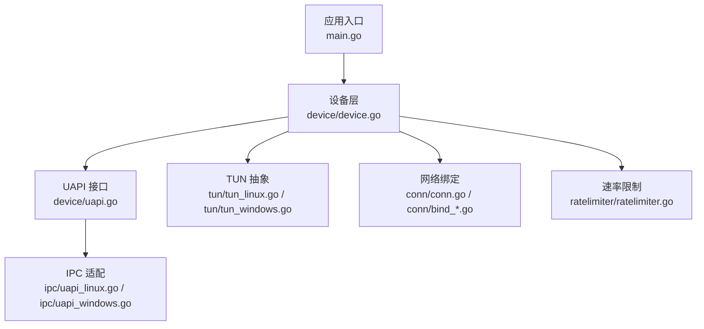
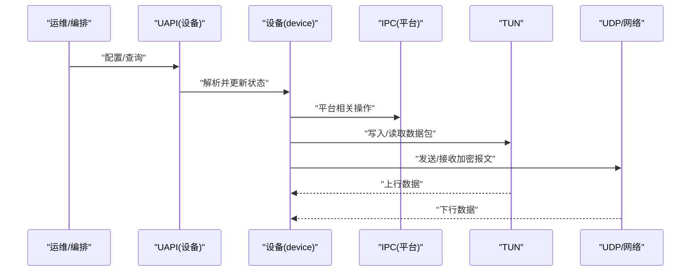
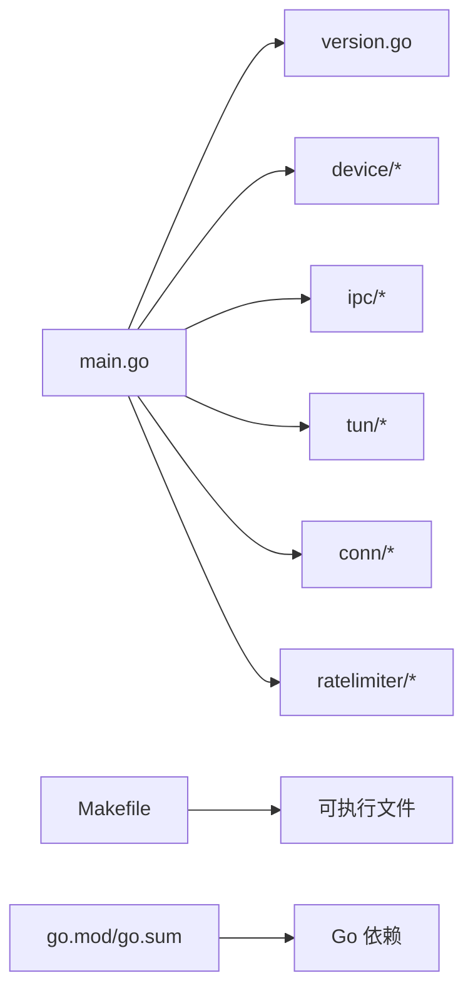

# 部署指南

<cite>
**本文引用的文件**
- [main.go](file://main.go)
- [main_windows.go](file://main_windows.go)
- [version.go](file://version.go)
- [Makefile](file://Makefile)
- [README.md](file://README.md)
- [readme_cn.md](file://readme_cn.md)
- [go.mod](file://go.mod)
- [device/device.go](file://device/device.go)
- [device/uapi.go](file://device/uapi.go)
- [ipc/uapi_linux.go](file://ipc/uapi_linux.go)
- [ipc/uapi_windows.go](file://ipc/uapi_windows.go)
- [tun/tun_linux.go](file://tun/tun_linux.go)
- [tun/tun_windows.go](file://tun/tun_windows.go)
- [conn/conn.go](file://conn/conn.go)
- [conn/bind_std.go](file://conn/bind_std.go)
- [conn/bind_windows.go](file://conn/bind_windows.go)
- [ratelimiter/ratelimiter.go](file://ratelimiter/ratelimiter.go)
</cite>

## 目录
1. [简介](#简介)
2. [项目结构](#项目结构)
3. [核心组件](#核心组件)
4. [架构总览](#架构总览)
5. [详细组件分析](#详细组件分析)
6. [依赖分析](#依赖分析)
7. [性能考虑](#性能考虑)
8. [故障排查指南](#故障排查指南)
9. [结论](#结论)
10. [附录](#附录)

## 简介
本指南面向生产环境，提供 wireguard-go 的容器化与云原生部署方案、服务配置与管理、负载均衡与高可用、监控与日志、故障与灾难恢复、安全加固与合规性要求等最佳实践。文档基于仓库中的源码结构与实现进行说明，确保部署步骤可落地、可验证、可运维。

## 项目结构
wireguard-go 采用按功能域划分的模块化结构：
- device：设备状态机、密钥协商、收发队列、定时器、UAPI 接口等核心逻辑
- ipc：平台相关的 UAPI 通信（Linux/Windows）
- tun：TUN/TAP 设备抽象与平台实现
- conn：网络套接字绑定与平台特性封装
- ratelimiter：速率限制
- 顶层入口：main.go（通用）、main_windows.go（Windows 特定）

图表来源
- [main.go:1-200](file://main.go#L1-L200)
- [device/device.go:1-200](file://device/device.go#L1-L200)
- [device/uapi.go:1-200](file://device/uapi.go#L1-L200)
- [ipc/uapi_linux.go:1-200](file://ipc/uapi_linux.go#L1-L200)
- [ipc/uapi_windows.go:1-200](file://ipc/uapi_windows.go#L1-L200)
- [tun/tun_linux.go:1-200](file://tun/tun_linux.go#L1-L200)
- [tun/tun_windows.go:1-200](file://tun/tun_windows.go#L1-L200)
- [conn/conn.go:1-200](file://conn/conn.go#L1-L200)
- [conn/bind_std.go:1-200](file://conn/bind_std.go#L1-L200)
- [conn/bind_windows.go:1-200](file://conn/bind_windows.go#L1-L200)
- [ratelimiter/ratelimiter.go:1-200](file://ratelimiter/ratelimiter.go#L1-L200)

章节来源
- [main.go:1-200](file://main.go#L1-L200)
- [main_windows.go:1-200](file://main_windows.go#L1-L200)
- [version.go:1-200](file://version.go#L1-L200)
- [Makefile:1-200](file://Makefile#L1-L200)
- [README.md:1-200](file://README.md#L1-L200)
- [readme_cn.md:1-200](file://readme_cn.md#L1-L200)

## 核心组件
- 设备与协议栈（device）：负责 WireGuard 协议处理、对端管理、密钥派生、发送/接收流水线、定时器与状态维护。
- UAPI（device/uapi.go + ipc/*）：提供进程内或跨进程的配置与状态查询接口，用于动态配置和对端管理。
- TUN 抽象（tun/*）：屏蔽操作系统差异，统一读写虚拟网卡数据面。
- 网络绑定（conn/*）：封装 UDP 套接字绑定、多路复用、平台特性（如 GSO、标记）。
- 速率限制（ratelimiter）：防止滥用与资源耗尽。

章节来源
- [device/device.go:1-200](file://device/device.go#L1-L200)
- [device/uapi.go:1-200](file://device/uapi.go#L1-L200)
- [ipc/uapi_linux.go:1-200](file://ipc/uapi_linux.go#L1-L200)
- [ipc/uapi_windows.go:1-200](file://ipc/uapi_windows.go#L1-L200)
- [tun/tun_linux.go:1-200](file://tun/tun_linux.go#L1-L200)
- [tun/tun_windows.go:1-200](file://tun/tun_windows.go#L1-L200)
- [conn/conn.go:1-200](file://conn/conn.go#L1-L200)
- [conn/bind_std.go:1-200](file://conn/bind_std.go#L1-L200)
- [conn/bind_windows.go:1-200](file://conn/bind_windows.go#L1-L200)
- [ratelimiter/ratelimiter.go:1-200](file://ratelimiter/ratelimiter.go#L1-L200)

## 架构总览
wireguard-go 在运行时由“控制平面”和“数据平面”组成：
- 控制平面：通过 UAPI 暴露配置与状态能力，供外部工具或编排系统调用。
- 数据平面：基于 TUN 与 UDP 套接字，完成加密隧道数据转发。

图表来源
- [device/uapi.go:1-200](file://device/uapi.go#L1-L200)
- [ipc/uapi_linux.go:1-200](file://ipc/uapi_linux.go#L1-L200)
- [ipc/uapi_windows.go:1-200](file://ipc/uapi_windows.go#L1-L200)
- [tun/tun_linux.go:1-200](file://tun/tun_linux.go#L1-L200)
- [tun/tun_windows.go:1-200](file://tun/tun_windows.go#L1-L200)
- [conn/conn.go:1-200](file://conn/conn.go#L1-L200)

## 详细组件分析

### 设备与协议栈（device）
- 职责：对端管理、密钥交换、发送/接收队列、定时器、状态持久化（通过 UAPI）。
- 关键点：并发安全、内存池、队列长度与超时策略影响吞吐与时延。
- 建议：在生产中根据流量模型调优队列与定时器参数；结合速率限制避免拥塞。

章节来源
- [device/device.go:1-200](file://device/device.go#L1-L200)

### UAPI 与控制平面（device/uapi.go + ipc/*）
- 职责：提供配置与状态查询接口，支持动态添加/删除对端、查看统计信息。
- 平台差异：Linux/Windows 使用不同 IPC 机制。
- 建议：将 UAPI 暴露给编排系统（如 Kubernetes ConfigMap/Secret 控制器），实现声明式配置。

章节来源
- [device/uapi.go:1-200](file://device/uapi.go#L1-L200)
- [ipc/uapi_linux.go:1-200](file://ipc/uapi_linux.go#L1-L200)
- [ipc/uapi_windows.go:1-200](file://ipc/uapi_windows.go#L1-L200)

### TUN 抽象（tun/*）
- 职责：屏蔽 Linux/Windows 等平台差异，统一读写虚拟网卡。
- 建议：为高性能场景启用内核卸载（如适用），并确保权限最小化。

章节来源
- [tun/tun_linux.go:1-200](file://tun/tun_linux.go#L1-L200)
- [tun/tun_windows.go:1-200](file://tun/tun_windows.go#L1-L200)

### 网络绑定与特性（conn/*）
- 职责：UDP 套接字绑定、多路复用、平台特性（如 GSO、标记）。
- 建议：根据网络栈与 NIC 能力选择合适绑定方式，开启 GSO 提升吞吐。

章节来源
- [conn/conn.go:1-200](file://conn/conn.go#L1-L200)
- [conn/bind_std.go:1-200](file://conn/bind_std.go#L1-L200)
- [conn/bind_windows.go:1-200](file://conn/bind_windows.go#L1-L200)

### 速率限制（ratelimiter）
- 职责：限制连接/请求速率，防止滥用。
- 建议：结合业务峰值设置阈值，避免误伤正常流量。

章节来源
- [ratelimiter/ratelimiter.go:1-200](file://ratelimiter/ratelimiter.go#L1-L200)

## 依赖分析
- 构建与版本：通过 Makefile 组织构建流程；version.go 提供版本信息；go.mod/go.sum 锁定依赖。
- 入口：main.go 负责初始化与启动；main_windows.go 处理 Windows 特定逻辑。

图表来源
- [main.go:1-200](file://main.go#L1-L200)
- [version.go:1-200](file://version.go#L1-L200)
- [Makefile:1-200](file://Makefile#L1-L200)
- [go.mod:1-200](file://go.mod#L1-L200)

章节来源
- [main.go:1-200](file://main.go#L1-L200)
- [main_windows.go:1-200](file://main_windows.go#L1-L200)
- [version.go:1-200](file://version.go#L1-L200)
- [Makefile:1-200](file://Makefile#L1-L200)
- [go.mod:1-200](file://go.mod#L1-L200)

## 性能考虑
- 队列与定时器：依据流量模型调整发送/接收队列长度与重传定时器，平衡时延与吞吐。
- 网络栈优化：在支持的平台启用 GSO、零拷贝路径；合理设置缓冲区大小。
- 速率限制：针对突发流量设置上限，避免拥塞扩散。
- CPU 亲和与 NUMA：在高核数机器上绑定工作线程到指定 CPU，减少缓存抖动。
- 观测指标：关注丢包率、重传次数、CPU 使用率、内存占用、延迟分布。

[本节为通用性能指导，不直接分析具体文件]

## 故障排查指南
- 启动失败：检查二进制权限、TUN 设备创建权限、端口占用情况。
- 无法建立隧道：核对对端公钥、私钥、允许 IP、监听地址与端口；确认防火墙与安全组放行。
- 性能异常：检查队列溢出、定时器超时、速率限制触发；观察内核卸载是否生效。
- 日志定位：结合 UAPI 查询当前配置与统计；收集关键时间段的日志与指标。

章节来源
- [device/uapi.go:1-200](file://device/uapi.go#L1-L200)
- [ipc/uapi_linux.go:1-200](file://ipc/uapi_linux.go#L1-L200)
- [ipc/uapi_windows.go:1-200](file://ipc/uapi_windows.go#L1-L200)

## 结论
本指南从架构、组件、构建与运行角度给出生产部署的最佳实践。建议在容器与云原生环境中以声明式配置驱动 UAPI，配合健康检查、滚动升级与灰度发布，实现高可用与可观测的生产级部署。

[本节为总结性内容，不直接分析具体文件]

## 附录

### 构建与打包
- 本地构建：使用 Makefile 目标编译；通过 version.go 获取版本信息。
- 产物校验：校验二进制签名与依赖完整性。

章节来源
- [Makefile:1-200](file://Makefile#L1-L200)
- [version.go:1-200](file://version.go#L1-L200)

### 容器化部署
- 镜像基础：选择精简且稳定的基础镜像，仅包含必要运行时。
- 权限最小化：非 root 运行，仅授予 TUN 与网络所需能力。
- 配置注入：通过环境变量或挂载卷注入配置；使用 Secret 管理密钥。
- 健康检查：暴露 UAPI 或 HTTP 探针，返回就绪/存活状态。
- 资源限制：设置 CPU/内存限制，避免资源争用。
- 日志输出：标准输出 JSON 结构化日志，便于采集。

[本节为概念性指导，不直接分析具体文件]

### 服务配置与管理
- 配置来源：使用 UAPI 动态配置对端、密钥、允许 IP 等。
- 配置版本化：所有变更纳入版本控制，回滚策略明确。
- 生命周期：优雅关闭，确保正在进行的会话安全终止。

章节来源
- [device/uapi.go:1-200](file://device/uapi.go#L1-L200)

### 负载均衡与高可用
- 多实例部署：同一网段多实例共享 VIP，客户端自动切换。
- 会话保持：按需启用会话表同步或无状态设计。
- 故障转移：健康检查失败自动摘除；快速重连与重试策略。
- 区域冗余：跨可用区部署，降低单点风险。

[本节为概念性指导，不直接分析具体文件]

### 监控与日志
- 指标：QPS、延迟、丢包、重传、CPU/内存、队列深度。
- 日志：结构化输出，包含时间戳、级别、模块、上下文。
- 采集：集中式日志与指标平台；告警规则覆盖关键阈值。
- 可视化：仪表盘展示关键指标趋势与拓扑关系。

[本节为概念性指导，不直接分析具体文件]

### 故障恢复与灾难恢复
- 备份：定期备份配置与密钥（加密存储）。
- 演练：定期演练故障切换与数据恢复流程。
- 回滚：一键回滚至稳定版本；保留历史镜像与配置。
- 应急：预设应急预案与联系人清单。

[本节为概念性指导，不直接分析具体文件]

### 安全加固与合规
- 最小权限：容器与服务仅授予必要权限。
- 传输安全：强制使用 WireGuard 加密；禁用明文通道。
- 访问控制：UAPI 仅限受控网络访问；强认证与审计。
- 密钥管理：使用密钥管理服务；轮换策略自动化。
- 合规：满足数据安全与隐私保护要求；留存审计日志。

[本节为概念性指导，不直接分析具体文件]

### 云原生部署指引
- 编排：使用 Deployment/DaemonSet 管理实例；Service 暴露访问。
- 配置：ConfigMap/Secret 注入；Init Container 准备环境。
- 弹性：HPA 基于 CPU/自定义指标扩缩容。
- 可观测：Sidecar 或 DaemonSet 采集日志与指标。
- 安全：NetworkPolicy 限制入出站；Pod 安全策略。

[本节为概念性指导，不直接分析具体文件]

### 参考与说明
- README 与中文说明：了解项目背景与基本用法。
- 平台差异：Linux/Windows 在 IPC 与 TUN 上的行为差异需特别注意。

章节来源
- [README.md:1-200](file://README.md#L1-L200)
- [readme_cn.md:1-200](file://readme_cn.md#L1-L200)