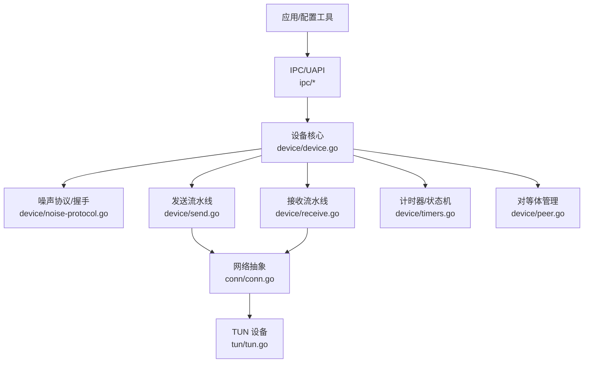
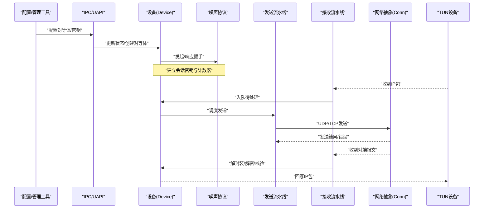
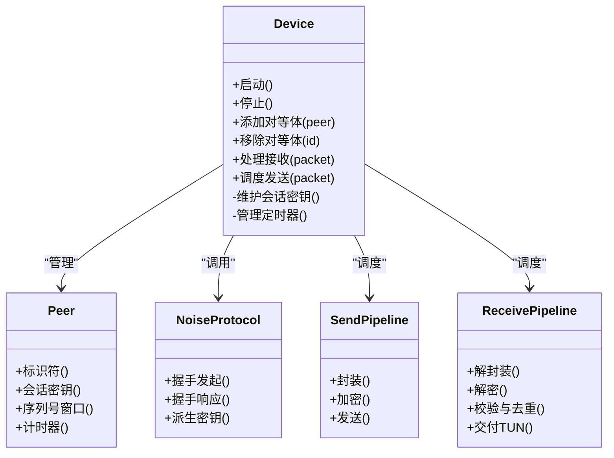
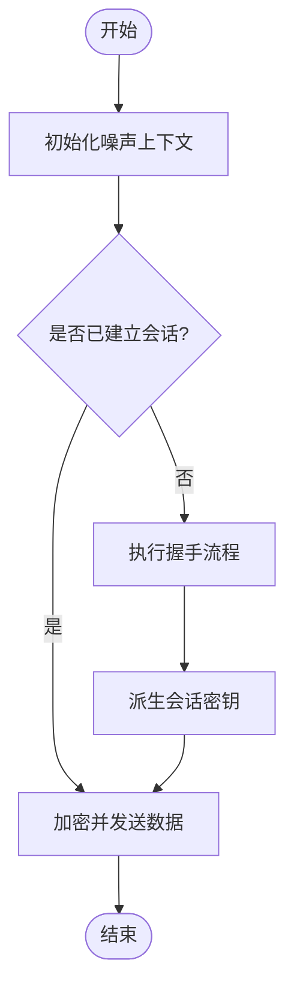
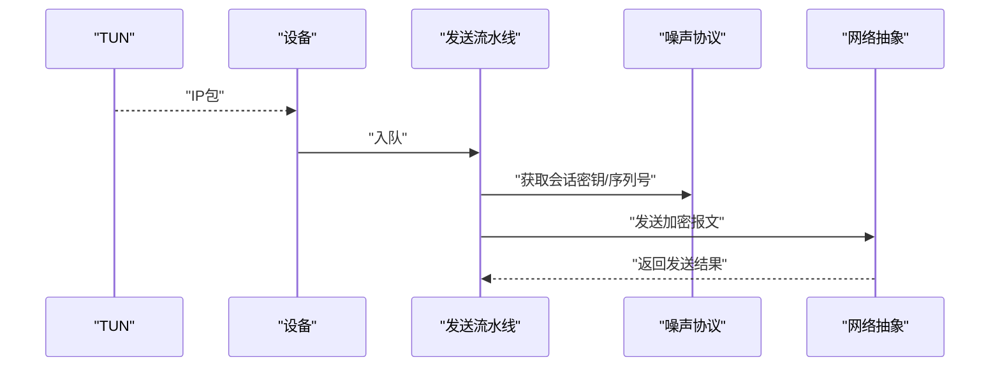
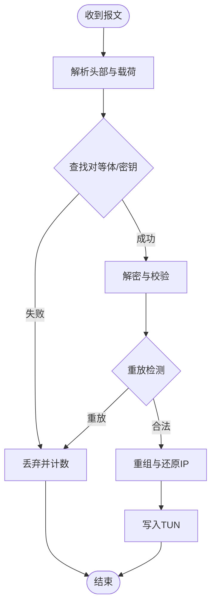
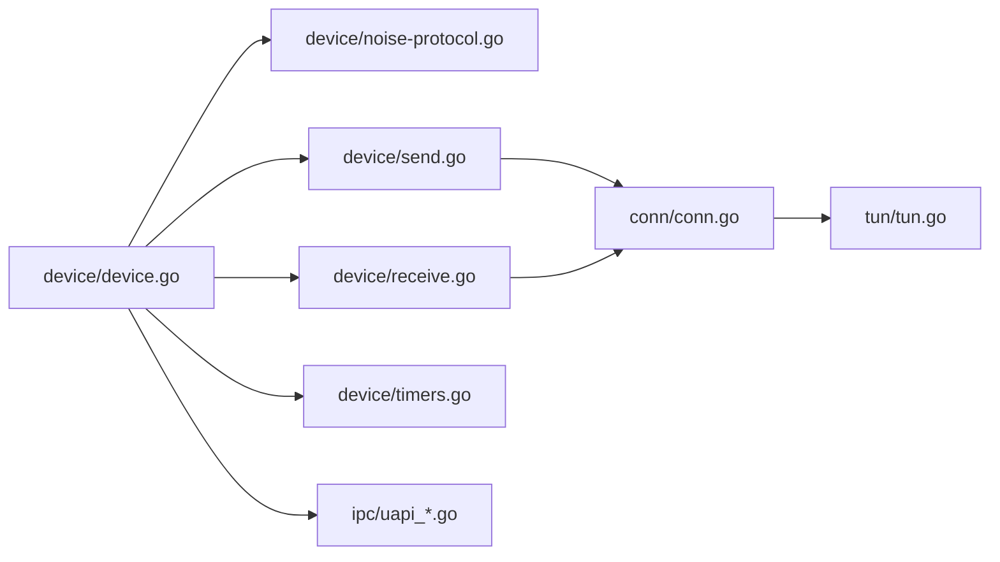

# 项目概述

<cite>
**本文引用的文件**
- [main.go](file://main.go)
- [version.go](file://version.go)
- [README.md](file://README.md)
- [readme_cn.md](file://readme_cn.md)
- [device/device.go](file://device/device.go)
- [device/noise-protocol.go](file://device/noise-protocol.go)
- [device/peer.go](file://device/peer.go)
- [device/send.go](file://device/send.go)
- [device/receive.go](file://device/receive.go)
- [device/timers.go](file://device/timers.go)
- [device/uapi.go](file://device/uapi.go)
- [conn/conn.go](file://conn/conn.go)
- [tun/tun.go](file://tun/tun.go)
- [ipc/uapi_linux.go](file://ipc/uapi_linux.go)
- [ipc/uapi_windows.go](file://ipc/uapi_windows.go)
- [ratelimiter/ratelimiter.go](file://ratelimiter/ratelimiter.go)
- [replay/replay.go](file://replay/replay.go)
- [tai64n/tai64n.go](file://tai64n/tai64n.go)
- [go.mod](file://go.mod)
</cite>

## 目录
1. [简介](#简介)
2. [项目结构](#项目结构)
3. [核心组件](#核心组件)
4. [架构总览](#架构总览)
5. [详细组件分析](#详细组件分析)
6. [依赖关系分析](#依赖关系分析)
7. [性能考量](#性能考量)
8. [故障排查指南](#故障排查指南)
9. [结论](#结论)
10. [附录](#附录)

## 简介
WireGuard-Go 是 WireGuard 协议的 Go 语言实现，目标是提供现代、安全、高性能的虚拟专用网络（VPN）解决方案。其技术特点包括：
- 基于 Noise 协议框架的端到端加密与密钥协商
- 极简内核态设计思想在用户态的高效实现
- 面向云原生与移动场景的高性能数据面路径
- 跨平台兼容（Linux、Windows、macOS、BSD 等）

适用场景涵盖企业 VPN、个人隐私保护、云原生网络互联、容器与微服务间安全通信等。

**章节来源**
- [README.md:1-200](file://README.md#L1-L200)
- [readme_cn.md:1-200](file://readme_cn.md#L1-L200)

## 项目结构
仓库采用按功能域划分的模块化组织方式，主要目录职责如下：
- device：协议栈核心，包含对等体管理、噪声握手、发送/接收流水线、计时器、UAPI 接口等
- conn：网络套接字抽象层，屏蔽不同平台的 UDP/TCP 绑定与特性差异
- tun：TUN/TAP 设备抽象，封装各平台内核隧道接口
- ipc：进程间通信与 UAPI 适配（Linux netlink、Windows Named Pipe 等）
- ratelimiter：速率限制模块，用于防重放与资源保护
- replay：重放检测与窗口管理
- tai64n：高精度时间戳格式，用于会话与日志时间
- main/main_windows：入口与平台初始化

**图表来源**
- [device/device.go:1-200](file://device/device.go#L1-L200)
- [device/noise-protocol.go:1-200](file://device/noise-protocol.go#L1-L200)
- [device/send.go:1-200](file://device/send.go#L1-L200)
- [device/receive.go:1-200](file://device/receive.go#L1-L200)
- [device/timers.go:1-200](file://device/timers.go#L1-L200)
- [device/peer.go:1-200](file://device/peer.go#L1-L200)
- [conn/conn.go:1-200](file://conn/conn.go#L1-L200)
- [tun/tun.go:1-200](file://tun/tun.go#L1-L200)

**章节来源**
- [main.go:1-200](file://main.go#L1-L200)
- [version.go:1-100](file://version.go#L1-L100)

## 核心组件
- 设备核心（Device）：维护全局状态、对等体集合、密钥材料、队列与定时器，协调收发流程与握手生命周期
- 噪声协议（Noise）：实现端到端密钥协商、消息认证与加密，确保前向保密与抗重放
- 发送流水线（Send）：将上层 IP 包封装为 WireGuard 报文，进行分片、加密与发送
- 接收流水线（Receive）：解封装、解密、校验、去重与重排，还原为 IP 包交给 TUN
- 对等体（Peer）：表示远端节点，持有会话密钥、序列号、计时器等
- 网络抽象（Conn）：统一 UDP/TCP 绑定、GSO/标记/粘性路由等平台特性
- TUN 抽象（TUN）：跨平台隧道读写，屏蔽内核差异
- IPC/UAPI：通过系统接口暴露配置与管理能力（如添加/删除对等体、查看统计）
- 辅助模块：速率限制、重放检测、高精度时间戳

**章节来源**
- [device/device.go:1-300](file://device/device.go#L1-L300)
- [device/noise-protocol.go:1-300](file://device/noise-protocol.go#L1-L300)
- [device/send.go:1-300](file://device/send.go#L1-L300)
- [device/receive.go:1-300](file://device/receive.go#L1-L300)
- [device/peer.go:1-300](file://device/peer.go#L1-L300)
- [conn/conn.go:1-300](file://conn/conn.go#L1-L300)
- [tun/tun.go:1-300](file://tun/tun.go#L1-L300)
- [ipc/uapi_linux.go:1-200](file://ipc/uapi_linux.go#L1-L200)
- [ipc/uapi_windows.go:1-200](file://ipc/uapi_windows.go#L1-L200)
- [ratelimiter/ratelimiter.go:1-200](file://ratelimiter/ratelimiter.go#L1-L200)
- [replay/replay.go:1-200](file://replay/replay.go#L1-L200)
- [tai64n/tai64n.go:1-200](file://tai64n/tai64n.go#L1-L200)

## 架构总览
WireGuard-Go 的整体架构围绕“设备”这一中心展开，向上通过 UAPI 接受配置，向下经 TUN 接入系统网络栈；数据面在 send/receive 流水线中完成封包/解包与加解密；控制面由 timers 驱动状态迁移与超时处理；网络层通过 conn 抽象屏蔽平台差异。

**图表来源**
- [device/device.go:1-300](file://device/device.go#L1-L300)
- [device/noise-protocol.go:1-300](file://device/noise-protocol.go#L1-L300)
- [device/send.go:1-300](file://device/send.go#L1-L300)
- [device/receive.go:1-300](file://device/receive.go#L1-L300)
- [conn/conn.go:1-300](file://conn/conn.go#L1-L300)
- [tun/tun.go:1-300](file://tun/tun.go#L1-L300)
- [ipc/uapi_linux.go:1-200](file://ipc/uapi_linux.go#L1-L200)
- [ipc/uapi_windows.go:1-200](file://ipc/uapi_windows.go#L1-L200)

## 详细组件分析

### 设备核心（Device）
- 职责：维护对等体表、会话密钥、队列、定时器；协调握手、收发、状态迁移
- 关键交互：与噪声协议协作完成密钥交换；调度 send/receive 流水线；通过 UAPI 暴露配置接口
- 复杂度与优化：使用高效数据结构管理允许列表与索引表；批量处理减少锁竞争；定时器精确控制心跳与超时

**图表来源**
- [device/device.go:1-300](file://device/device.go#L1-L300)
- [device/peer.go:1-300](file://device/peer.go#L1-L300)
- [device/noise-protocol.go:1-300](file://device/noise-protocol.go#L1-L300)
- [device/send.go:1-300](file://device/send.go#L1-L300)
- [device/receive.go:1-300](file://device/receive.go#L1-L300)

**章节来源**
- [device/device.go:1-300](file://device/device.go#L1-L300)
- [device/peer.go:1-300](file://device/peer.go#L1-L300)

### 噪声协议（Noise）
- 目标：实现端到端加密与密钥协商，保证前向保密与抗重放
- 关键点：握手阶段生成会话密钥；后续数据包使用对称加密与 MAC；支持多种密码学套件
- 性能：最小化内存分配，重用缓冲区；避免不必要的拷贝

**图表来源**
- [device/noise-protocol.go:1-300](file://device/noise-protocol.go#L1-L300)

**章节来源**
- [device/noise-protocol.go:1-300](file://device/noise-protocol.go#L1-L300)

### 发送流水线（Send）
- 流程：从 TUN 读取 IP 包 -> 选择对等体与密钥 -> 封装为 WireGuard 报文 -> 加密与认证 -> 通过 Conn 发送
- 优化：批量打包、零拷贝策略、GSO/TSO 卸载（平台支持时）

**图表来源**
- [device/send.go:1-300](file://device/send.go#L1-L300)
- [device/noise-protocol.go:1-300](file://device/noise-protocol.go#L1-L300)
- [conn/conn.go:1-300](file://conn/conn.go#L1-L300)

**章节来源**
- [device/send.go:1-300](file://device/send.go#L1-L300)

### 接收流水线（Receive）
- 流程：从 Conn 接收报文 -> 解析头部 -> 查找对等体与密钥 -> 解密与校验 -> 去重与重排 -> 还原 IP 包写入 TUN
- 安全：严格校验长度与 MAC；使用重放窗口防止重放攻击

**图表来源**
- [device/receive.go:1-300](file://device/receive.go#L1-L300)
- [replay/replay.go:1-200](file://replay/replay.go#L1-L200)

**章节来源**
- [device/receive.go:1-300](file://device/receive.go#L1-L300)
- [replay/replay.go:1-200](file://replay/replay.go#L1-L200)

### 计时器与状态机（Timers）
- 作用：维护心跳、超时重试、会话刷新；驱动状态迁移（如空闲清理）
- 设计：高精度时间源（tai64n），避免时钟漂移影响；事件驱动减少忙轮询

**章节来源**
- [device/timers.go:1-200](file://device/timers.go#L1-L200)
- [tai64n/tai64n.go:1-200](file://tai64n/tai64n.go#L1-L200)

### UAPI 与 IPC
- Linux：通过 netlink 或字符设备接口暴露配置 API
- Windows：通过命名管道提供 UAPI
- 功能：添加/删除对等体、设置公钥/私钥、查看统计信息

**章节来源**
- [device/uapi.go:1-200](file://device/uapi.go#L1-L200)
- [ipc/uapi_linux.go:1-200](file://ipc/uapi_linux.go#L1-L200)
- [ipc/uapi_windows.go:1-200](file://ipc/uapi_windows.go#L1-L200)

### 网络抽象（Conn）与 TUN
- Conn：统一 UDP/TCP 绑定、端口复用、GSO/标记/粘性路由等特性
- TUN：跨平台隧道读写，屏蔽内核差异，提供一致的数据面接口

**章节来源**
- [conn/conn.go:1-300](file://conn/conn.go#L1-L300)
- [tun/tun.go:1-300](file://tun/tun.go#L1-L300)

## 依赖关系分析
- 模块内聚性高：device 作为核心聚合其他模块；conn/tun 提供稳定底层接口
- 外部依赖：Go 标准库与平台特定系统调用；无重型第三方库，保持轻量
- 耦合点：device 与 noise/send/receive/timers 紧密耦合；通过接口与队列降低直接依赖

**图表来源**
- [device/device.go:1-300](file://device/device.go#L1-L300)
- [device/noise-protocol.go:1-300](file://device/noise-protocol.go#L1-L300)
- [device/send.go:1-300](file://device/send.go#L1-L300)
- [device/receive.go:1-300](file://device/receive.go#L1-L300)
- [device/timers.go:1-300](file://device/timers.go#L1-L300)
- [conn/conn.go:1-300](file://conn/conn.go#L1-L300)
- [tun/tun.go:1-300](file://tun/tun.go#L1-L300)
- [ipc/uapi_linux.go:1-200](file://ipc/uapi_linux.go#L1-L200)
- [ipc/uapi_windows.go:1-200](file://ipc/uapi_windows.go#L1-L200)

**章节来源**
- [go.mod:1-200](file://go.mod#L1-L200)

## 性能考量
- 数据面路径优化：零拷贝、批量处理、GSO/TSO 卸载（平台支持）
- 内存管理：对象池与缓冲复用，减少 GC 压力
- 并发模型：通道与队列解耦收发，避免热点锁
- 计时精度：tai64n 高精度时间戳提升超时与心跳准确性
- 可观测性：统计与日志便于定位瓶颈

[本节为通用性能指导，不直接分析具体文件]

## 故障排查指南
- 握手失败：检查对等体公钥/私钥配置、NAT/防火墙规则、端口可达性
- 数据不通：确认 TUN 设备创建成功、路由与允许列表配置正确
- 性能问题：观察队列堆积、丢包率、CPU 占用；启用/禁用 GSO/TSO 对比
- 重放/丢包：检查时间同步与重放窗口；调整计时器参数
- 平台差异：Linux 与 Windows 的 UAPI 行为差异；权限与命名空间隔离

**章节来源**
- [device/device.go:1-300](file://device/device.go#L1-L300)
- [device/receive.go:1-300](file://device/receive.go#L1-L300)
- [device/send.go:1-300](file://device/send.go#L1-L300)
- [replay/replay.go:1-200](file://replay/replay.go#L1-L200)
- [ratelimiter/ratelimiter.go:1-200](file://ratelimiter/ratelimiter.go#L1-L200)

## 结论
WireGuard-Go 以简洁、安全、高性能为核心目标，通过噪声协议实现端到端加密，借助高效的收发流水线与平台抽象，在现代操作系统上提供稳定的 VPN 能力。其模块化设计与清晰的职责划分，使其适用于企业网络、个人隐私保护以及云原生环境中的安全通信需求。

[本节为总结性内容，不直接分析具体文件]

## 附录
- 安装要求与兼容性
  - 需要 Go 编译器与构建工具链
  - 支持 Linux、Windows、macOS、BSD 等主流平台
  - 依赖系统提供的 TUN 设备与网络栈
- 快速上手
  - 生成密钥对并配置对等体
  - 启动守护进程并通过 UAPI 管理
  - 验证连通性与性能指标

**章节来源**
- [README.md:1-200](file://README.md#L1-L200)
- [readme_cn.md:1-200](file://readme_cn.md#L1-L200)
- [go.mod:1-200](file://go.mod#L1-L200)